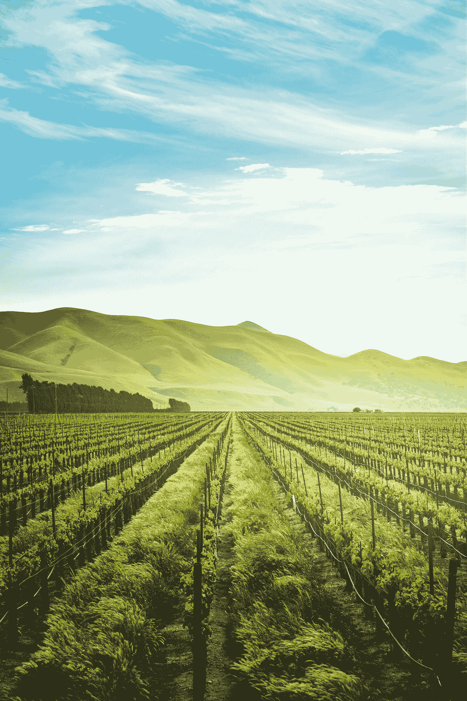

# 构建农业应用:类型、特点和技术堆栈

> 原文：<https://javascript.plainenglish.io/build-agriculture-app-types-features-and-tech-stack-2c175a137860?source=collection_archive---------8----------------------->

Photo by [Adele Payman](https://unsplash.com/@adele_payman?utm_source=medium&utm_medium=referral) on [Unsplash](https://unsplash.com?utm_source=medium&utm_medium=referral)

移动应用无处不在。他们已经成为我们生活中不可或缺的一部分，统治着他们生活的每一个领域。农业部门也不例外。

从一开始，农业就是人类文明的脊梁。这些年来，耕作方式有所改进。如今，各种技术被用来提高作物质量和更有效地管理农场。

[农业软件开发](https://www.resourcifi.com/industry/agriculture-software-development)呈上升趋势。现代农业学家和农民正在利用尖端技术来解决环境带来的令人讨厌的问题。[2026 年，智能农业预计将增长 70.4 亿美元。](https://www.prnewswire.com/news-releases/smart-farming-market-to-grow-by-usd-7-04-billion-by-2026--availability-of-low-cost-cloud-services-that-encourages-farmers-to-adopt-smart-farming-to-boost-market-growth---technavio-301680264.html)

如果您希望构建一个农业应用程序来解决这些问题并激励人们使用它，您不需要再深入研究了。在这里，我已经讨论了如何构建一个农业应用程序，它的类型、好处以及您需要的技术。

我们开始吧！

## 农业应用的类型

[农业应用潮流](https://www.resourcifi.com/blog/agriculture-software-development-trends?utm_source=InPlainEnglish&utm_medium=Offsite)；他们很受欢迎。在开发之前了解类型非常重要。有许多不同的农业应用。您可以根据自己的要求开发任何一种。

您甚至可以将所有必要的功能合并到一个应用程序中，或者将其开发为一个单独的应用程序。

## 农业预算和预测应用

这类应用旨在为用户提供详细且结构良好的财务规划。这些应用程序使农民、银行家和会计师能够实时合作，获取财务信息，预测收入和支出。

换句话说，预算和预测应用程序有助于规划财务、预测收入和支出，以及与银行家或任何您允许接触的人或与您的农业业务相关的人合作。

## Broadacre 农业应用程序

Broadacre 农业应用程序关注的是农作物。它们旨在提高作物产量并保持其质量。它有助于监控和优化作物、创建报告和管理整个运营，同时充当农民、农学家和合规官之间的无缝媒介。

## 精准农业应用

农业部门的精确度确实起着重要的作用。专注于使农业活动精确、确保盈利、效率和可持续性的应用程序属于这一类别。这类应用提供了活动视图和预测风险的能力。

## 农业库存应用

顾名思义，这些应用程序旨在简化操作和管理日常农业必需品。农业库存应用程序最大限度地减少错误，并保持一切正常。

## 农业社区应用

这类应用是基于社区的应用。农业社区应用程序允许农民与顾问联系，顾问远程为他们提供解决方案。来自多个公司和政府机构的各种支持者可以与农民联系，并帮助他们使用这些应用程序。

这个应用程序的最大优势之一是，没有人需要去任何地方——无论是农民还是顾问——来解决问题。

## 牲畜管理应用程序

管理牲畜是一项艰巨的任务；既费时又费力，尤其是当动物成千上万的时候。但是，同样重要的是，保持跟踪他们的日常护理。这就是为什么牲畜管理应用程序是必须的。这些应用程序简化了所有的日常活动/流程，并允许农民使用现代工具。

**专业提示:**你可以跟踪牛或鸟以及它们的医疗数据。牲畜管理应用程序可以做到这一切。

## 通用农业应用

这种应用程序旨在简化各种任务，如时间跟踪、监控基本工作、预测天气和天气的一般变化以及对田地的影响。

许多农民的工作仍然是手动的，根本无法使用这些应用程序实现自动化。

但是许多令人兴奋的任务，如监控、提醒、日志和其他各种事情都可以使用这些应用程序来简化。

## 农业应用的优势

还在困惑[开发定制农业 app](https://www.resourcifi.com/blog/app-development?utm_source=InPlainEnglish&utm_medium=Offsite) ？这里有一些关键的好处，可以帮助你下定决心。

## 储蓄

农业应用程序提供了企业运营的整体视图。此外，它提高了效率，增加了投资回报率，并激励用户使用它来简化他们的农业操作。

## 更好的跟踪和规划

当你有一个农业应用程序供你使用时，对农业活动的深刻见解不再是一件麻烦的事情。事实上，这些应用程序帮助农民对他们的牲畜和田地做出明智的决定。

它就像一个单一的屏幕，农民可以在其中查看时间表，决定在哪里，何时以及如何进行作物活动或根据数据采取措施。

## 更好的风险防范

我们都知道农业不是可以在家里进行的室内活动。农民不得不在田里工作。不利的天气条件、市场需求、疾病和对作物极为不利的环境等外部因素有助于农民及早发现。所以农民可以提前计划和准备这种悲剧。

提醒农民这一点可以帮助他们提前计划，并相应地优化他们的活动。因此，采取了必要的措施并防止了风险。

## 构建农业应用的技术栈

一般来说，开发定制农业应用有两种方式:雇佣[应用开发公司](https://medium.com/@scarlett8285/top-10-mobile-app-development-companies-in-2020-d9b4c20f419b)或创建一个内部开发团队，这是非常昂贵的。

一旦你决定了应用程序的想法，是时候使用尖端技术将这些想法转化为应用程序了。

让我告诉你，可以有多种技术来构建一个特定的农业应用程序，但这里我只提到其中的一些:

*   节点. js
*   反应
*   MongoDB
*   反应自然
*   以打字打的文件

## 结论

最好的农业应用程序是那些自动化活动、省去麻烦、有效管理作物、保持食品安全以及简化会计和灌溉的应用程序。在这里，我谈到了如何建立一个农业应用程序:类型，好处和技术栈，你应该知道在 2023 年。

农业移动应用开发中可能会有许多[阶段](https://www.resourcifi.com/resources/ebooks/9-stages-mobile-app-development?utm_source=InPlainEnglish&utm_medium=Offsite)。开发一个农业应用程序完全是为了使用最新的技术，并使其能够高效地做出数据驱动的决策。

祝你的农业应用程序开发好运！

*更多内容请看*[***plain English . io***](https://plainenglish.io/)*。报名参加我们的* [***免费周报***](http://newsletter.plainenglish.io/) *。关注我们关于*[***Twitter***](https://twitter.com/inPlainEngHQ)[***LinkedIn***](https://www.linkedin.com/company/inplainenglish/)*[***YouTube***](https://www.youtube.com/channel/UCtipWUghju290NWcn8jhyAw)*[***不和***](https://discord.gg/GtDtUAvyhW) *。对增长黑客感兴趣？检查* [***电路***](https://circuit.ooo/) *。***