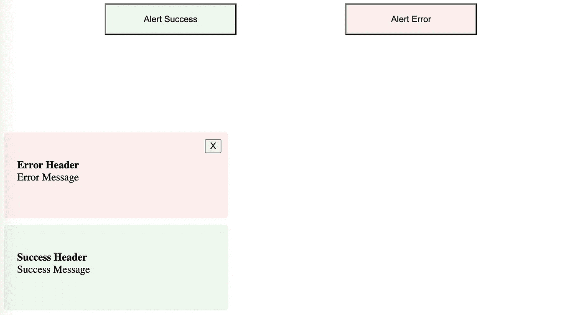
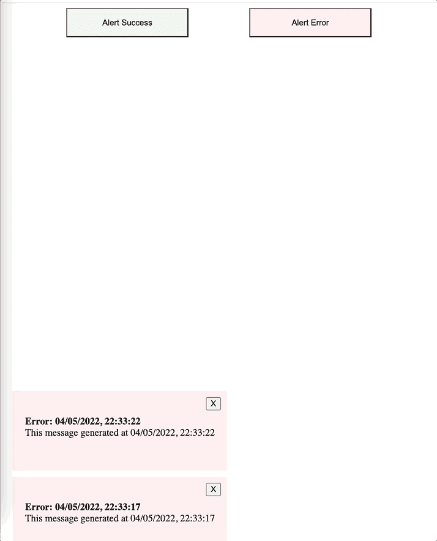

# 使用上下文和类型脚本在 React 中构建警报信使

> 原文：<https://javascript.plainenglish.io/build-an-alert-messenger-in-react-using-context-and-typescript-6a7c56b707d7?source=collection_archive---------2----------------------->

## 为 React 应用程序创建警报系统的分步指南。


[https://marvel.fandom.com/](https://marvel.fandom.com/)

一个好的前端应用需要一个更好的通知系统。您应该根据应用程序的要求和用户的 pov 创建并向用户显示警报。通常，您可以在每页上实现一条 toast 消息。在某些情况下，您可能希望在同一页面上同时显示多条消息。很有可能。警报的性质也可能因通知的类型而异。拥有良好的警报机制有助于改善 UX(用户体验)。

在本文中，我将一步一步地为您的 React 应用程序创建一个可靠的警报系统。我们将使用高级的 React.js 概念，比如上下文、redux 模式、状态管理等等。

## 先决条件:

1.  React 项目(React 17+)
2.  良好的反应知识
3.  打字稿的基础知识

在本文中，我将使用 TypeScript 编写代码。如果你喜欢简单的 JS，你可以去掉打字。

# 目录

1.  包括必要的依赖性
2.  设置基本提供商
3.  包括基础应用程序模板
4.  创建警报和警报包装组件
5.  包括状态缩减器
6.  添加和删除警报的逻辑的收尾工作
7.  结论
8.  奖励:拦截网络错误

# 1.包括必要的依赖性

React 包括创建一个**应用程序**所需的一切。另一方面，在 React 中与 **CSS** 合作有点困难。任何 CSS 库，比如**类名**，都可以使用。也可以使用**类装载机**，如 [sass-loader](https://webpack.js.org/loaders/sass-loader/) 。我将在本文中使用 [**样式化组件**](https://styled-components.com/) 。React 中处理 CSS 最好的库之一是样式组件。

```
yarn add styled-components @types/styled-components
```

# 2.设置基本提供商

在**样式组件**中，我们将使用基本主题。我们必须将我们的应用程序包装在主题提供者 T21 中来使用主题变量。让我们更改 **index.tsx** 并将基础应用程序包装在 **ThemeProvider** 中。

```
// index.tsx
import { StrictMode } from "react";
import ReactDOMClient from "react-dom/client";
import { createGlobalStyle, ThemeProvider } from "styled-components";
import App from "./App";
import { AlertContextProvider } from "./components/Alert/AlertContextProvider";
const Global = createGlobalStyle`
  p,
  h1,
  h2,
  h3,
  h4,
  h5,
  h6 {
    padding: 0;
    margin: 0%;
  }
`;
const rootElement = document.getElementById("root");
const root = ReactDOMClient.createRoot(rootElement as HTMLElement);
const theme = {
  colors: {
    message_error: "#fdeded",
    message_success: "#edf7ed",
  },
};
root.render(
  <StrictMode>
    <ThemeProvider theme={theme}>
      <AlertContextProvider>
        <Global />
        <App />
      </AlertContextProvider>
    </ThemeProvider>
  </StrictMode>
);
```

上面的代码很简单。然而，如你所见，我们将**应用**包含在 **AlertContextProvider** 中。这个 AlertContextProvider 将处理 Alter 消息及其逻辑。让我们从配置 **AlertContextProvider** 开始。

```
// src/components/Alert/AlertContextProvider.tsx
import { createContext, FC, ReactNode } from "react";
interface AlertContext {}
export const AlertMessengerContext = createContext<AlertContext>({} as AlertContext);
export const AlertContextProvider: FC<{
  children: ReactNode;
  noOfMessages?: number;
  autoHideTimeout?: number;
  autoHideError?: boolean;
}> = ({ children, noOfMessages = 5, autoHideTimeout = 3000, autoHideError = false }) => {
  return(
    <AlertMessengerContext.Provider value={{}}>
      {children}
    </AlertMessengerContext.Provider>
  );
};
```

# 3.包括基础应用程序模板

让我们添加一个基本的**模板**到 **App.tsx** 来测试应用程序。

```
// src/App.tsx
import { AppContainer, Button } from "./components/Alert/styled.components";
function App() {
  const onSuccess = () => {};
const onError = () => {};
return (
    <AppContainer>
      <Button onClick={onSuccess} variant="success">
        Alert Success
      </Button>
      <Button onClick={onError} variant="error">
        Alert Error
      </Button>
    </AppContainer>
  );
}
export default App;
```

在前面的代码中，我们从 **styled.components.** 中导入了 **AppContainer** 和**按钮**

```
// src/components/Alert/styled.components.tsx
import styled from "styled-components";
export const AppContainer = styled.div`
  display: flex;
  justify-content: space-evenly;
`;
export const Button = styled.button<{ variant: string }>`
  height: 48px;
  width: 200px;
  background-color: ${(p) => p.theme.colors[`message_${p.variant}`]};
`;
```


# 4.创建警报和警报包装组件

在进入逻辑显示-隐藏之前，让我们从一个简单的警报组件开始。警报组件的属性和变化会有所不同。消息可以像 Alter 组件中的 div 一样简单。但是，因为我们将有多个功能，如显示隐藏和可关闭。可以添加**类型**、**标题**、**消息**、**动作图标**和 **onAction** 等属性。

```
//src/components/Alert/index.tsx
import { MouseEvent, ReactNode } from "react";
import styled from "styled-components";
enum MessageType {
  SUCCESS = "success",
  ERROR = "error",
}
interface AlertProps {
  type?: MessageType;
  title: string;
  message?: string;
  gutterBottom?: boolean;
  gutterTop?: boolean;
  actionIcon?: ReactNode | boolean;
  onAction?: (e?: MouseEvent<HTMLButtonElement>) => void;
}
const noop = (_?: MouseEvent<HTMLButtonElement>) => {};
const AlertContainer = styled.div<Partial<AlertProps>>`
  padding: 10px 20px;
  background: ${(p) => p.theme.colors[`message_${p.type}`]};
  margin-top: ${(p) => p.gutterTop && "10px"};
  margin-bottom: ${(p) => p.gutterBottom && "10px"};
  min-width: 300px;
  height: 80px;
  border-radius: 4px;
  position: relative;
  padding-top: 40px;
`;
const ActionIconContainer = styled.div`
  position: absolute;
  right: 10px;
  top: 10px;
`;
const Alert = ({
  type = MessageType.SUCCESS,
  title,
  message,
  gutterBottom,
  gutterTop,
  actionIcon,
  onAction,
}: AlertProps) => {
  const ActionIcon =
    typeof actionIcon === "boolean" && actionIcon ? <button onClick={onAction ?? noop}>X</button> : actionIcon;
  return (
    <AlertContainer type={type} gutterBottom={gutterBottom} gutterTop={gutterTop}>
      {actionIcon && <ActionIconContainer>{ActionIcon}</ActionIconContainer>}
      <h4>{title}</h4>
      <p>{message}</p>
    </AlertContainer>
  );
};
export default Alert;
```

在前面的示例代码中， **actionIcon** 可以接受任何 react 元素；否则，在**布尔**属性的基础上，会添加一个关闭按钮。 **onAction** 功能可用于执行关闭按钮上的功能。
我们可以向 **AlertContextProvider** 添加虚拟消息来查看组件的实际可视化效果。

```
// src/components/Alert/AlertContextProvider.tsx
import { createContext, FC, ReactNode } from "react";
import styled from "styled-components";
import Alert from ".";
interface AlertContext {}
enum MessageType {
  SUCCESS = "success",
  ERROR = "error",
}
export const AlertMessengerContext = createContext<AlertContext>({} as AlertContext);
const messages = [
  {
    id: Date.now(),
    type: MessageType.ERROR,
    title: "Error Header",
    message: "Error Message",
  },
  {
    id: Date.now(),
    type: MessageType.SUCCESS,
    title: "Success Header",
    message: "Success Message",
  },
];
const AlertsContainer = styled.div`
  background: #fff;
  position: absolute;
  left: 0;
  bottom: 0;
  padding: 10px 20px;
  overflow-y: auto;
  max-height: calc(100vh - 100px);
`;
export const AlertContextProvider: FC<{
  children: ReactNode;
  noOfMessages?: number;
  autoHideTimeout?: number;
  autoHideError?: boolean;
}> = ({ children, noOfMessages = 5, autoHideTimeout = 3000, autoHideError = false }) => {
  return (
    <AlertMessengerContext.Provider value={{}}>
      {children}
      <AlertsContainer>
        {messages.map(({ type, title, message, id }) => (
          <Alert
            key={`alert__message__${id}`}
            type={type}
            title={title}
            message={message}
            gutterTop
            actionIcon={type === "error"}
            onAction={() => null}
          />
        ))}
      </AlertsContainer>
    </AlertMessengerContext.Provider>
  );
};
```

一旦您更新了 **AlertContextProvider** ，您可以看到下面的界面:



# 5.包括状态缩减器

既然 UI 已经准备好了，我们可以专注于多个警报的状态。为了简化状态管理，我们可以使用任何状态管理器。在这篇博客中，我将使用 [React Context](https://reactjs.org/docs/context.html) API。

```
interface Message {
  id: string;
  type: MessageType;
  title: string;
  message?: string;
}
enum AlertActionKind {
  ADD_SUCCESS = "ADD_SUCCESS",
  ADD_ERROR = "ADD_ERROR",
  REMOVE_MESSAGE = "REMOVE_MESSAGE",
}
interface AlertAction {
  type: AlertActionKind;
  payload?: any;
}
interface AlertState {
  messages: Message[];
  noOfMessages: number;
}
const AlertReducer = (state: AlertState, action: AlertAction) => {
  switch (action.type) {
    case AlertActionKind.ADD_SUCCESS:
      return {
        ...state,
        messages: [{ type: "success", ...action.payload }, ...state.messages].slice(0, state.noOfMessages),
      };
    case AlertActionKind.ADD_ERROR:
      return {
        ...state,
        messages: [{ type: "error", ...action.payload }, ...state.messages].slice(0, state.noOfMessages),
      };
    case AlertActionKind.REMOVE_MESSAGE:
      return { ...state, messages: state.messages.filter((message) => message.id !== action.payload.id) };
  }
};
```

在上面的例子中，我们定义了两个主要动作**添加成功**、**删除消息**和**添加错误**。

# 6.添加和删除警报的逻辑的收尾工作

既然我们已经完成了应用程序的所有先决条件。现在我们可以专注于添加和删除消息的逻辑。我们可以直接曝光 redux **dispatch** 。然而，我们可以通过遵循 **Kent C Dodds** 来自[how-to-use-react-context-effectively](https://kentcdodds.com/blog/how-to-use-react-context-effectively)的“良好实践”,在提供者内部包装一个函数。现在让我们更新 **AlertContextProvider** 。

```
// src/components/Alert/AlertContextProvider.tsx
export const AlertContextProvider: FC<{
  children: ReactNode;
  noOfMessages?: number;
  autoHideTimeout?: number;
  autoHideError?: boolean;
}> = ({ children, noOfMessages = 5, autoHideTimeout = 3000, autoHideError = false }) => {
  const [state, dispatch] = useReducer(AlertReducer, { messages: [], noOfMessages });
const addSuccessMessage = useCallback(
    (data: any) => {
      const id = Date.now();
      dispatch({ type: AlertActionKind.ADD_SUCCESS, payload: { id, ...data } });
      setTimeout(() => {
        dispatch({ type: AlertActionKind.REMOVE_MESSAGE, payload: { id } });
      }, autoHideTimeout);
    },
    [dispatch, autoHideTimeout]
  );
const addErrorMessage = useCallback(
    (data: any) => {
      const id = Date.now();
      dispatch({ type: AlertActionKind.ADD_ERROR, payload: { id, ...data } });
      if (autoHideError) {
        setTimeout(() => {
          dispatch({ type: AlertActionKind.REMOVE_MESSAGE, payload: { id } });
        }, autoHideTimeout);
      }
    },
    [dispatch, autoHideError, autoHideTimeout]
  );
const removeMessage = useCallback(
    (id: any) => {
      dispatch({ type: AlertActionKind.REMOVE_MESSAGE, payload: { id } });
    },
    [dispatch]
  );
  return (
    <AlertMessengerContext.Provider value={{ state, addSuccessMessage, addErrorMessage, removeMessage }}>
      {children}
      <AlertsContainer>
        {state.messages.map(({ type, title, message, id }) => (
          <Alert
            key={`alert__message__${id}`}
            type={type}
            title={title}
            message={message}
            gutterTop
            actionIcon={type === "error"}
            onAction={type === "error" ? () => removeMessage(id) : undefined}/>
        ))}
      </AlertsContainer>
    </AlertMessengerContext.Provider>
  );
};
```

**addSuccessMessage** 方法将消息添加到队列中，并启动一个定时器来移除它。 **addErrorMessage** 方法将一个错误消息插入到队列中，并根据 **autoHideTimeout** 清除它或使其保持可关闭状态。最后，在 **App.jsx 中，**更新逻辑使用 addSuccessMessage 和 addErrorMessage。

```
function App() {
  const { addSuccessMessage, addErrorMessage } = useContext(AlertMessengerContext);
const onSuccess = () => {
    const time = new Date().toLocaleString();
    addSuccessMessage({ title: `Success: ${time}`, message: `This message generated at ${time}` });
  };
const onError = () => {
    const time = new Date().toLocaleString();
    addErrorMessage({ title: `Error: ${time}`, message: `This message generated at ${time}` });
  };
return (
    <AppContainer>
      <Button onClick={onSuccess} variant="success">
        Alert Success
      </Button>
      <Button onClick={onError} variant="error">
        Alert Error
      </Button>
    </AppContainer>
  );
}
```

**结果如下:**



working demo

# 7.结论

React 有点啰嗦。然而，编写一个定制模块来处理应用程序通知是有意义的。它允许采用新的综合逻辑来提高应用程序的 UX。我只是试图为 Alert Messenger 组合基本的逻辑块。根据您的需求，您可以增强和改进您的应用程序。

**注意:**请记住，完整的源代码可以在下面的代码沙箱中找到。

react-alert-toast-message

# 8.奖励:拦截网络错误

很常见的情况是，您希望创建一个通用的 toast messenger 来显示页面中的错误。为此，您需要拦截网络响应。大多数网络库都提供发布-订阅拦截器方法。您可以使用这些方法并相应地显示错误。比如我要给 Axios 库写代码。这是最著名的图书馆之一。

*为了避免破坏功能，我会保留代码注释。您可以取消对代码的注释来查看实际的代码。*

```
// AlertContextProvider.tsx

export const AlertContextProvider: FC<{
  children: ReactNode;
  noOfMessages?: number;
  autoHideTimeout?: number;
  autoHideError?: boolean;
  // add prop to enable interceptor
  interceptNetwork?: boolean;
}> = ({
  children,
  noOfMessages = 5,
  autoHideTimeout = 3000,
  autoHideError = false,
  interceptNetwork = false // default can be null
}) => 

//add hooks to intercept network.

useEffect(() => {
    if (interceptNetwork) {
      /* Intercept code here
        axios.interceptors.response.use(
        function (response: any) {
          // If error 400 response show messages
          if (response.status === 400) {
            const time = new Date().toLocaleString();
            addErrorMessage({
              title: `Error: ${time}`,
              message: `This message generated at ${time}`
            });
          }
          return response;
        },
        function (error: Error) {
          return Promise.reject(error);
        }
      );
        */
    }
  }, []);
```

*更多内容看* [***说白了就是***](https://plainenglish.io/) *。报名参加我们的* [***免费周报***](http://newsletter.plainenglish.io/) *。关注我们关于*[***Twitter***](https://twitter.com/inPlainEngHQ)*和*[***LinkedIn***](https://www.linkedin.com/company/inplainenglish/)*。加入我们的* [***社区***](https://discord.gg/GtDtUAvyhW) *。*