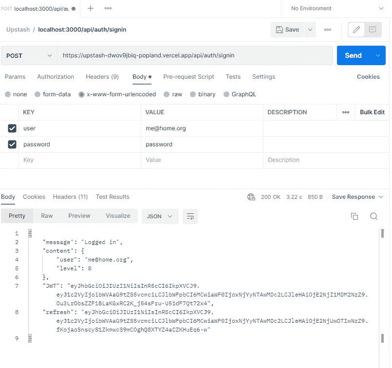
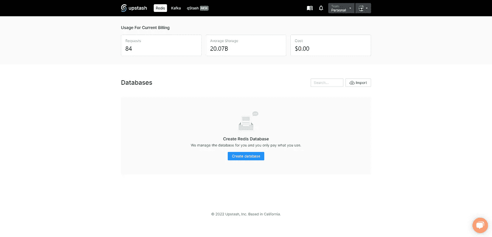
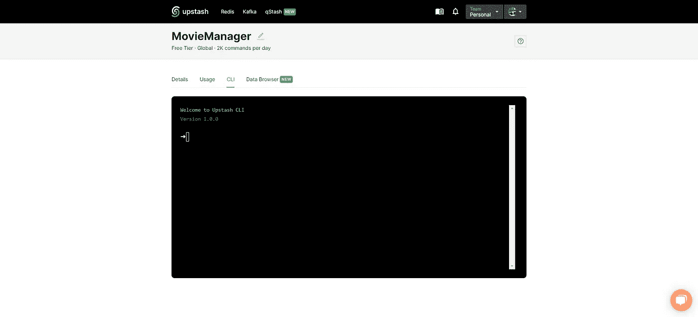
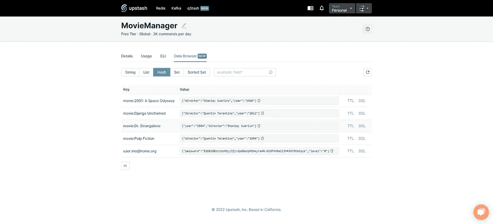
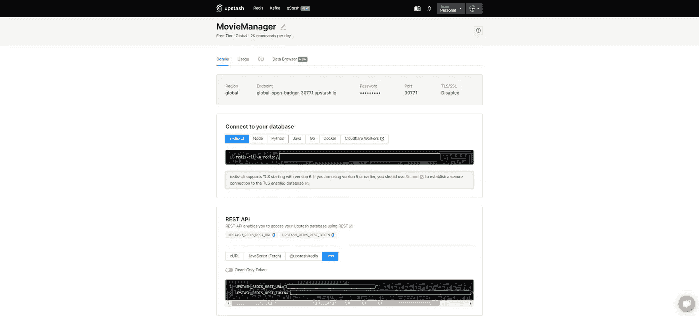
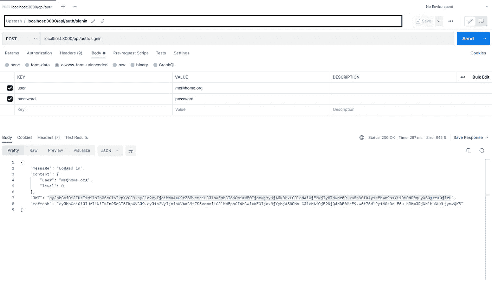
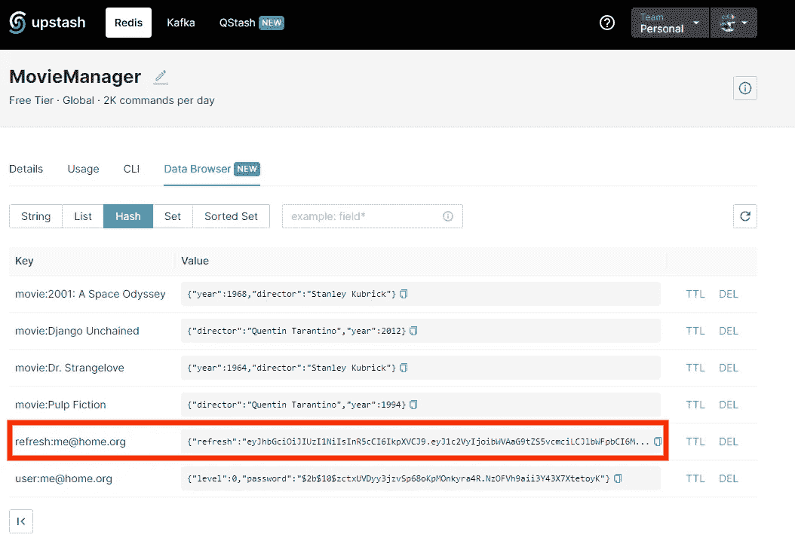
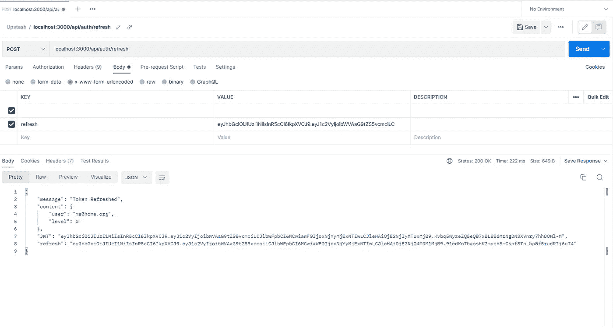
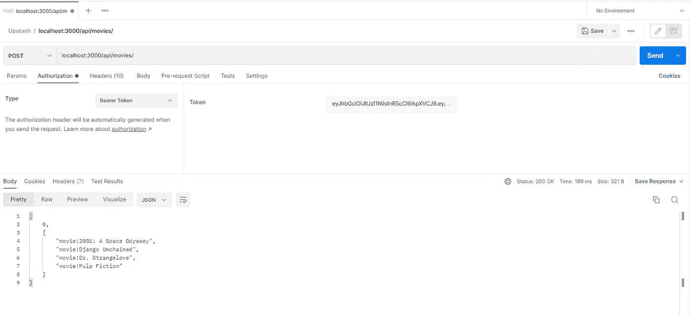
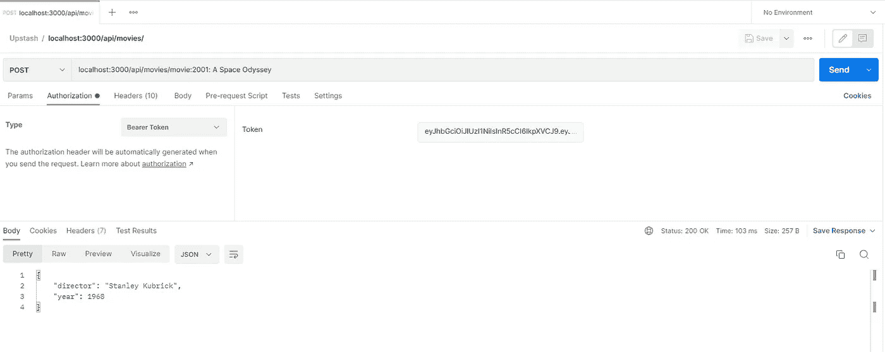

# 用 Next.js API Routes & Upstash Redis 构建一个经过认证的 API 服务

> 原文：<https://javascript.plainenglish.io/build-an-authenticated-api-service-with-next-js-api-routes-and-upstash-redis-a49fe6ad0311?source=collection_archive---------9----------------------->

## 关于如何利用 next . js API Routes &[upshredis](https://upstash.com/?utm_source=Lorenzo1)构建一个最小但功能完整的认证 Rest API 服务的教程。

在本文中，我们将构建一个最小但功能完整的认证 Rest API 服务，利用 Next.js API 路由和[upshredis](https://upstash.com/?utm_source=Lorenzo1)，我们将使用它作为超高速存储/缓存系统，用于数据、用户认证和 JWT 处理。请注意，这个项目不会有一个前端，但它将只公开可以用各种客户端查询的 API。

# 先决条件

要跟随教程，您需要:

*   一个新贵账户——[在这里注册一个免费账户](https://console.upstash.com/?utm_source=Lorenzo1)
*   Redis 的基础知识
*   Next.js API 路线的基本知识
*   认证和授权工作流的基本知识
*   您可以选择一个工具来发出 HTTP 请求

## 什么是 Upstash Redis

[Upstash](https://upstash.com/?utm_source=Lorenzo1) 是**基于 Redis 的无服务器内存云数据库**。我们将使用它来存储将由我们的 API 提供服务的数据，我们还将在[upshredis](https://upstash.com/?utm_source=Lorenzo1)中存储我们的用户群和用户令牌。

## 我们将建造什么

我们将编写一个 REST API 服务，允许客户端应用程序向它请求数据(在这个特定的例子中是电影列表)；我们将使用 JWT 保护端点，我们将编写一个 API 登录服务来获取令牌，我们还将实现一个刷新令牌工作流。

**我们不会关注**客户端开发(因为我们正在构建一个‘非个人化’的服务)，但是我们会提供我们服务的规范，这样任何人都可以为它构建一个客户端。

## 存储库和演示

为了跟进，您可能想要克隆项目存储库

[](https://github.com/popeating/upstash-jwt) [## GitHub - popeating/upstash-jwt

### 这是一个用 create-next-app 引导的 Next.js 项目。首先，运行开发服务器:打开…

github.com](https://github.com/popeating/upstash-jwt) 

您也可以在以下 URL 尝试演示:

[https://upstash-dwo v9 jbiq-pop land . vercel . app/API/auth/sign in](https://upstash-dwov9jbiq-popland.vercel.app/api/auth/signin)

要连接到服务，发出一个 POST HTTP 请求，传递用户名(*me@home.org*)和密码(*密码*)，如下例所示(使用 Postman):



## 建立 Redis 数据库

首先，你需要注册[upshredis](https://upstash.com/?utm_source=Lorenzo1)(一个免费计划将用于测试目的)，一旦登录到控制台，你可以创建一个新的数据库:



继续点击“创建数据库”，将其命名为 MovieManager，并将其设置为 Global。
我们现在使用 [Upstash](https://console.upstash.com/?utu_source=Lorenzo1) CLI 添加一些虚拟数据



我们将使用 HMSET 命令添加一些电影作为 Redis hash(它们基本上是对象):

```
hmset movie:’Dr. Strangelove’ director ‘Stanley Kubrick’ year 1964
hmset movie:’2001: A Space Odyssey’ director ‘Stanley Kubrick’ year 1968
hmset movie:’Pulp Fiction’ director ‘Quentin Tarantino’ year 1994
hmset movie:’Django Unchained’ director ‘Quentin Tarantino’ year 2012
```

我们还将添加一个将被授权访问数据的用户，该用户也将是一个 Redis 散列:

```
hmset user:’me@home.org’ password $2b$10$zctxUVDyy3jzvSp68oKpMOnkyra4R.NzOFVh9aii3Y43X7XtetoyK level 0
```

> **请注意**:密码是用`**bcrypt**`加密的(简单来说就是*密码*)，通常，需要访问 API 的用户通过网站注册(或者在网站上获取凭证)，在这个例子中我们不提供注册端点

在 [Upstash](https://console.upstash.com/?utm_source=Lorenzo1) CLI 中输入的每个命令都应该给你一个 OK 回复，如果一切都正确，你就可以进入*数据浏览器*并选择 Hash，你就会得到你插入的数据列表



## 授权工作流程

如前所述，我们的端点是不可公开访问的，因此我们需要一种方法来认证和授权用户。对于身份验证，我们提供一个登录端点；对于授权，受保护端点需要一个随请求一起发送的授权头。工作流程的详细工作方式如下:

*   用户请求登录端点，发布用户名和密码
*   服务器尝试对用户进行身份验证，如果用户有效，服务器创建并发回一个 JWT (JSON Web 令牌)和一个刷新令牌，刷新令牌也存储在我们的 [Upstash Redis](https://upstash.com/?utm_source=Lorenzo1) 实例中
*   客户端取回令牌并将它们存储在某个地方(如何/在哪里存储它们是客户端的责任)
*   客户端请求一个受保护的端点，在报头中发送 JWT
*   服务器接收 JWT，对其进行验证，如果验证通过，则发回客户端请求的数据
*   一旦 JWT 过期或即将过期，客户端可以通过向特定端点发送刷新令牌来请求新的 JWT，而无需重新登录。
*   服务器接收刷新令牌，对其进行验证，如果验证是肯定的，则发布新的 JWT 和刷新令牌，将它们发送回客户端，并再次存储新的刷新令牌

JWT 和刷新令牌采用相同的格式，获得几乎相同的信息，但使用两个不同的密钥(我们将在我们的`.**env**` 文件中设置)并获得两个不同的到期时间:一个是 JWT 的短到期时间(因为它是会话期间使用最多的令牌，我们让它很快到期，以防它被拦截)，另一个是刷新令牌的长到期时间。两者的持续时间取决于你需要停留的安全程度；通常，JWT 在不到一个小时内到期，而刷新令牌可以持续一个月。如果两个令牌都过期，用户需要再次登录。

# 设置项目

一旦我们完成了 upshredis 数据库，我们就可以开始初始化我们的项目；首先，我们创建一个新的 Next.js 项目:

```
**npx create-next-app upstash-jwt**
```

然后，我们进入新创建的文件夹`**upstash-jwt**`，安装所需的模块:

```
**npm i bcrypt jsonwebtoken @upstash/redis**
```

创建一个`**.env.local**`文件来存储您的密钥并填入正确的数据

创建将用于生成 JWT 的 SECRET_TOKEN 和 SECRET_RTOKEN，请记住这些密钥应该保密，并且应该非常随机/难以猜测，您可以使用 64 位十六进制字符串。
从您的 [Upstash 控制台](https://console.upstash.com/?utm_source=Lorenzo1)，详细信息选项卡，Rest API 部分获取 UPSTASH_REDIS_REST_URL 和 UPSTASH_REDIS_REST_TOKEN:



我们现在可以开始布置我们的端点了:

**POST /auth/signin**

**GET /movies/**
以 JSON 对象的形式返回电影列表，它需要一个有效的 JWT，在头中以这样的格式传递:
*授权:无记名 xxx*

**GET /movies/$ID** 返回 ID 为$ID 的电影的细节

**POST /auth/refresh**
生成并返回一个新的 JWT，刷新令牌应该作为`refreshToken` 参数传递。

# API 路线的代码

我们从登录端点开始，创建文件`**pages/api/auth/signin.js**`，如下所示:

我们的登录端点将只接受带有两个参数的 POST:**用户**和**密码**。首先，我们使用以下命令检查用户是否在 Redis 数据库中:

```
const user = await redis.hgetall(`user:${req.body.user}`);
```

如果用户在场，我们将比较加密的密码:

```
const validPassword = bcrypt.compare(req.body.password, user.password);
```

此时，如果密码匹配，我们可以假设用户通过了身份验证，我们可以发送回一个 JWT 和一个刷新令牌，我们还将刷新令牌存储在 Redis 实例中。为了做到这一点，我们使用了一些名为`**utils.js**` **的外部文件中的函数。**

客户端负责存储返回的令牌，在需要时使用它们进行授权，并在过期时刷新它们。

我们有一个函数生成我们的令牌`**generateAccessToken**`，一个函数生成我们的刷新令牌`**generateRefreshToken**`，一个函数将刷新令牌存储在我们的 Redis `**addToList**`中。这个`**utils.js**`文件也将用于保存所有其他的实用函数和引用(像 Redis 连接，令牌验证和刷新，等等):

现在，我们可以使用一个工具(比如 Postman)来测试签名过程，通过向`[**http://localhost:3000/api/auth/signin**](http://localhost:3000/api/auth/signin)`发送并传递用户名(*me@home.org*)和密码(*密码*)，您应该会得到一个包含用户详细信息的 JSON 对象以及一个 JWT 和一个刷新令牌:



如果一切正常，在 Redis 数据库中，现在应该可以看到新创建的刷新令牌的新散列条目:



接下来，我们通过编写令牌刷新路由`**refresh.js**`来完成认证过程

它使用来自`**utils.js**` 的 *tokenRefresh* 函数，首先验证令牌是否有效并且可以被解码，然后在 Redis 上检查用户是否获得了刷新令牌(我们之前用 *addToList* 存储的那个)，如果一切都正确，它生成一个新的 JWT、一个新的刷新令牌(并再次将其存储在 Redis 中)，并将所有内容发送回客户端。

我们可以使用我们的工具测试这个端点，发送到`[**http://localhost:3000/api/auth/r**](http://localhost:3000/api/auth/signin)**efresh**`并传递刷新令牌作为参数:



既然我们假设的客户机能够登录并刷新其令牌，那么让我们看看如何使用令牌来发出经过身份验证的请求。

创建一个新的 API 路由:`**api/movies/[[...id]].js**` ，它将用于获取电影列表和电影细节:

使用来自我们的`**utils.js**`的 *verifyToken* 函数，我们可以限制只有提供有效令牌的用户才能访问我们的 API 端点。我们做了几个示例查询，第一个得到电影列表。

```
**const result = await redis.scan(0, { match: ‘movie:*’ });**
```

第二个是根据 URL 请求中的 id 参数获取一部电影的详细信息:

```
**const result = await redis.hgetall(id);**
```

这两个请求都依赖于通过 *verifyToken* 检查的用户状态，但是您可以混合和匹配，例如，列表可以是公共的，细节可以受到保护。因为我们在用户(和令牌)中也存储了一个级别，所以我们可以有更多的授权级别。让我们试着得到一份电影列表:



还有一部电影的细节:



# 客户视角

正如我们之前所说，我们只关注服务器部分，这是一个 API 的主要范围，它应该是抽象的，它不是一个网站。客户端请求数据的方式(编程语言、库等等)是客户端开发人员的选择，我们提供一个端点列表，我们的端点期望什么，以及我们的端点返回给客户端什么。所有的数据处理、刷新延迟等等都是客户端策略。

# 下一步是什么

这只是一个受保护 API 的工作流程的基本示例。从这里开始，它只能得到改进:优化数据在 Redis 上的存储方式，通过将用户数据存储在另一个 Redis 实例上来提高登录安全性，检查并验证用户发送的数据，添加更多的端点，以 GraphQL 格式返回数据，为您的 API 构建一个客户端，限制每小时的最大调用次数，使用级别来限制访问…扩展和改进是无止境的！

*更多内容请看*[***plain English . io***](https://plainenglish.io/)*。报名参加我们的* [***免费周报***](http://newsletter.plainenglish.io/) *。关注我们关于*[***Twitter***](https://twitter.com/inPlainEngHQ)[***LinkedIn***](https://www.linkedin.com/company/inplainenglish/)*[***YouTube***](https://www.youtube.com/channel/UCtipWUghju290NWcn8jhyAw)*[***不和***](https://discord.gg/GtDtUAvyhW) *。对增长黑客感兴趣？检查* [***电路***](https://circuit.ooo/) *。***