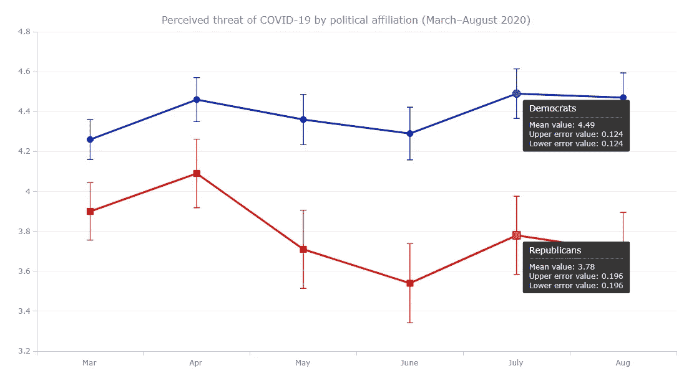

# 用 JavaScript 构建错误图表

> 原文：<https://javascript.plainenglish.io/build-an-error-chart-in-javascript-b54e74224bb8?source=collection_archive---------24----------------------->


**需要一个炫酷的互动** [**错误图表**](https://www.anychart.com/chartopedia/chart-type/error-chart/) **为你的网页或 app 可视化？让我做你的向导吧！跟随本教程，你将学习如何使用 JavaScript 轻松创建酷的交互式错误图表。**

在这里，我将按政治派别可视化疫情前六个月期间美国对新冠肺炎威胁的感知数据。所以你也可以探究民主党人和共和党人在这些态度上的分歧。数据来源于发表在 *Plos One* 杂志上的文章[“新冠肺炎和疫苗犹豫:一项纵向研究”](https://journals.plos.org/plosone/article?id=10.1371/journal.pone.0250123)。

# 什么是误差图

在我开始之前，我想确保我们在理解错误图表实际上是什么以及它是如何工作的这一点上是一致的。

误差图是一种数据可视化类型，通常用于借助所谓的误差线来显示数据的不确定性或可变性。后者可以添加到主图形的顶部，除了以线、柱、条、面积、标记或其他类型的系列的形式绘制的平均值之外，还可以表示值范围。

# 错误图表预览

现在，让我向您展示最终的错误图表，让您更加兴奋地学习如何自己创建一个错误图表！

因此，我将从 2020 年 3 月到 8 月，用政治倾向来代表美国民众对新冠肺炎威胁的感知。确切地说，我将以如下方式展示 Ariel Fridman、Rachel Gershon 和 Ayelet Gneezy 进行的纵向调查的[结果](https://journals.plos.org/plosone/article?id=10.1371/journal.pone.0250123)。自我认同的民主党人和共和党人的平均反应将在两个[折线图](https://www.anychart.com/chartopedia/chart-type/line-chart/)中可视化，误差条将代表 95%的置信区间。在调查中，回答的等级从 1 到 7，其中 1 是最低感知威胁，7 是最高感知威胁。


# 4 个简单步骤中的基本 JS 错误图表

用一个好的 JavaScript 图表库创建错误图表非常简单。在这里，我将使用 [AnyChart](https://www.anychart.com) ，这是一个灵活易用的。它有很棒的[文档](https://docs.anychart.com)，很多有用的[示例](https://www.anychart.com/products/anychart/gallery/)，还有一个[操场](https://playground.anychart.com)供你自己试验数据可视化代码。

掌握网络技术的基础知识总是好的。但是在创建像这样的基于 JavaScript 的交互式图形时，即使没有太多这样的背景知识，一切都很简单。

构建 JS 错误图表的过程可以分为以下四个基本步骤:

1.  创建一个 HTML 页面。
2.  包括 JavaScript 文件。
3.  添加数据。
4.  写一些 JS 图表代码。

# 1.创建 HTML 页面

我要做的第一件事是创建一个基本的 HTML 页面来保存我的错误图表。在那里，我定义了一个带有 id 属性的 block 元素(假设它是“container”)。接下来，我在`<head>`部分添加了样式属性，在这里我将`<div>`的宽度和高度设置为 100%,这样我的图表就可以呈现在整个页面上。

```
<html>
  <head>
    <title>JavaScript Error Chart</title>
    <style type="text/css">      
      html, body, #container { 
        width: 100%; height: 100%; margin: 0; padding: 0; 
      } 
    </style>
  </head>
  <body>
    <div id="container"></div>
  </body>
</html>
```

# 2.包括 JavaScript 文件

然后，我需要包括所有必要的脚本。我将从 [CDN、](https://cdn.anychart.com)中使用它们，但是如果你愿意，你也可以下载这些文件。

对于一个错误图表，我所需要的是[基础](https://docs.anychart.com/Quick_Start/Modules#base)模块。我在网页的`<head>`部分引用了它。

```
<html>
  <head>
    <title>JavaScript Error Chart</title>
    <script src="https://cdn.anychart.com/releases/8.11.0/js/anychart-base.min.js"></script>
    <style type="text/css">      
        html, body, #container { 
          width: 100%; height: 100%; margin: 0; padding: 0; 
        } 
    </style>
  </head>
  <body>  
    <div id="container"></div>
    <script>
 ***// All the JS error chart code will be here.***    </script>
  </body>
</html>
```

# 3.设置数据

有多种方式加载数据。在这种情况下，我想要可视化的数据量非常小。所以我可以直接把它放在代码里。

我将为民主党和共和党策划两个系列。所以我像这样添加数据:

```
var data1 = anychart.data
  .set([
    ['Mar', 4.26, 0.1, 0.1],
    ['Apr', 4.46, 0.11, 0.11],
    ['May', 4.36, 0.126, 0.126],
    ['June', 4.29, 0.132, 0.132],
    ['July', 4.49, 0.124, 0.124],
    ['Aug', 4.47, 0.124, 0.124]
  ])

var data2 = anychart.data
  .set([
    ['Mar', 3.9, 0.144, 0.144],
    ['Apr', 4.09, 0.172, 0.172],
    ['May', 3.71, 0.196, 0.196],
    ['June', 3.54, 0.198, 0.198],
    ['July', 3.78, 0.196, 0.196],
    ['Aug', 3.7, 0.194, 0.195]
  ])
```

现在所有的背景工作都已经整理好了，让我们进入创建 JavaScript 错误图表的主要部分。它只需要多几行代码。

# 4.写一些 JS 图表代码

首先，我添加了一个包含所有 JavaScript 图表代码的函数，以确保页面在执行任何操作之前都准备好了。在这个函数中，我创建了一个折线图，并为它提供了一个标题。

```
***// create a line chart*** var chart = anychart.line();***// add a chart title*** chart.title('Perceived threat of COVID-19 by political affiliation (March–August 2020)');
```

接下来，我以数组的形式设置两个系列的数据，如前一步所述。我使用`mapAs`函数来映射数组中每个元素所对应的内容。

```
***// create a dataset (democrats)*** var data1 = anychart.data
  .set([
    ['Mar', 4.26, 0.1, 0.1],
    ['Apr', 4.46, 0.11, 0.11],
    ['May', 4.36, 0.126, 0.126],
    ['June', 4.29, 0.132, 0.132],
    ['July', 4.49, 0.124, 0.124],
    ['Aug', 4.47, 0.124, 0.124]
  ])
 ***// map the data***  .mapAs({
    x: 0,
    value: 1,
    valueLowerError: 2,
    valueUpperError: 3
  });***// create a dataset (republicans)*** var data2 = anychart.data
  .set([
    ['Mar', 3.9, 0.144, 0.144],
    ['Apr', 4.09, 0.172, 0.172],
    ['May', 3.71, 0.196, 0.196],
    ['June', 3.54, 0.198, 0.198],
    ['July', 3.78, 0.196, 0.196],
    ['Aug', 3.7, 0.194, 0.195]
  ])
 ***// map the data***  .mapAs({
    x: 0,
    value: 1,
    valueLowerError: 2,
    valueUpperError: 3
  });
```

因为所有的数据值都在一个范围内，所以我使用`yScale`函数相应地配置 Y 轴。

```
var yScale = chart.yScale();
yScale.minimum(3.2);
yScale.maximum(4.8);
```

最后，我为每个数据集创建一个线序列，设置容器引用，并绘制结果错误图形。

```
***// create a line series for the first dataset*** var series1 = chart.line(data1);***// create a line series for the second dataset*** var series2 = chart.line(data2);***// set a container id for the chart*** chart.container('container');***// command to draw the chart*** chart.draw();
```

啊哈——一个可爱的交互式错误图表就在页面上！


我们可以清楚地看到，在疫情的最初几个月，民主党人(顶线)和共和党人(底线)对新冠肺炎威胁的看法存在分歧，相应的长期趋势似乎非常明显。

非常欢迎您仔细看看这个基于 JavaScript 的初始错误图表，并在 [AnyChart 游乐场](https://playground.anychart.com/irYKkg0W)或 [CodePen](https://codepen.io/shacheeswadia/pen/KKvjQaL) 上摆弄它的代码。

# 误差图表定制

虽然基本的错误图表已经准备好了，但是在外观、感觉和易读性方面仍然有改进的空间。AnyChart JS 库有很多很好的选项来增强错误图表，使它更加优雅，信息量更大。所以，让我带你走几个快速定制的步骤，你可能会喜欢。

# 1.添加网格和轴记号

首先，我想在 Y 轴上添加更多的记号，并显示网格线，以便于人们在研究这个错误图表时理解这些值。

```
var ticks = chart.yScale().ticks();
ticks.interval(0.2);chart.yGrid().enabled(true).stroke({
 ***// customize the stroke color***  color: "#ededed",
});
```

# 2.改变颜色

蓝色和红色通常分别用来代表民主党和共和党。因此，让我使用`stroke`属性相应地改变系列线和误差线的颜色，使图形更加直观。

```
***// create a line series for the first dataset*** var series1 = chart.line(data1).stroke("#031bbb", 3);***// create error bars for the first series*** var error1 = series1.error();
error1.valueErrorStroke("#031bbb", 1);***// create a line series for the second dataset*** var series2 = chart.line(data2).stroke("#de0100", 3);***// create error bars for the second series*** var error2 = series2.error();
error2.valueErrorStroke("#de0100", 1);
```

正如你所看到的，我还增加了笔画宽度，使线条更加突出。


用 [AnyChart 游乐场](https://playground.anychart.com/UKkV1F7X)或 [CodePen](https://codepen.io/shacheeswadia/pen/XWaLoVG) 上的代码检查这个 JS 错误表。

# 3.添加标记

为了强调折线图上的单个值，我想向两个系列添加两种不同类型的标记，指定它们的类型、大小和颜色。

```
***// set markers for the first series*** var series1 = chart.marker(data1).type("circle").size(5).stroke("#031bbb", 1).fill("#0066cc");

***// set markers for the second series*** var series2 = chart.marker(data2).type("square").size(5).stroke("#de0100", 1).fill("#de0100");
```

# 4.增强工具提示

默认的工具提示信息不多。但是我可以很容易地让它显示系列名称、平均值和上下误差值。

首先，我将这个系列命名为:

```
series1
  .name('Democrats');series2
  .name('Republicans');
```

我还想拆分工具提示，为每个系列提供自己的工具提示:

```
var tooltip = chart.tooltip();
tooltip.displayMode("separated");
```

最后，我格式化值的显示方式并设置工具提示的位置。

```
***// configure the tooltip formatter*** tooltip
  .fontColor('#E1E1E1')
  .titleFormat('{%seriesName}')
  .format(function () {
    return (
      'Mean value: ' +
      this.value +
      '\nUpper error value: ' +
      this.valueLowerError +
      '\nLower error value: ' +
      this.valueUpperError
    );
  });***// set the tooltip position*** chart.tooltip().positionMode('point');
```

一个令人惊叹的、有洞察力的 JavaScript (HTML5)错误图表已经准备好了！这些简单而有效的改变让视觉化变得更加吸引人！



查看完整的最终代码，并在 [AnyChart 游乐场](https://playground.anychart.com/m3sXHVgO/)或 [CodePen](https://codepen.io/shacheeswadia/pen/LYjKqOy) 上玩这个交互式 JS 错误图表。

# 结论

新冠肺炎的威胁可能还没有结束。但是我希望在本教程的帮助下，您使用 JavaScript 创建 web 交互式错误图表永远不会有压力！

如果你有任何问题，请不要犹豫，在下面的评论区提问。谢了。

*any Chart 的团队感谢 Shachee Swadia 作为博客的客座博文撰写了这篇伟大的 JavaScript 错误图表教程。*

*错误图表在* [*图表目录*](https://www.anychart.com/chartopedia/chart-type/error-chart) *中描述，这是我们选择正确图表类型的综合指南。*

*我们的博客里还有其他很棒的* [*JavaScript 制图教程*](https://www.anychart.com/blog/category/javascript-chart-tutorials/) *。*

*想投稿客串帖子？我们将很高兴收到您的来信。*

*原载于 2022 年 2 月 3 日 https://www.anychart.com*[](https://www.anychart.com/blog/2022/02/03/error-chart-js/)**。**

**更多内容看* [***说白了就是***](http://plainenglish.io/) *。报名参加我们的* [***免费周报***](http://newsletter.plainenglish.io/) *。在我们的* [***社区不和谐***](https://discord.gg/GtDtUAvyhW) *中获得独家写作机会和建议。**