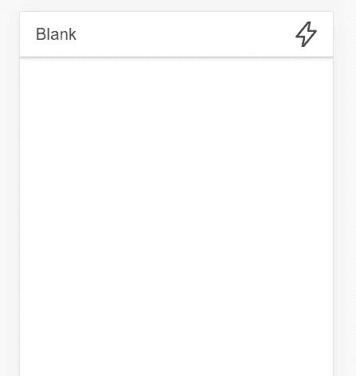

# 建立一个离线工作的离子应用程序

> 原文：<https://javascript.plainenglish.io/build-an-ionic-app-that-works-offline-ec8907bb5b8f?source=collection_archive---------5----------------------->

## 奖励:带有在线指示器


Photo by [Sigmund](https://unsplash.com/@sigmund?utm_source=medium&utm_medium=referral) on [Unsplash](https://unsplash.com?utm_source=medium&utm_medium=referral)

> …我想让这个应用程序脱机工作。我想让它告诉我什么时候离线，什么时候恢复在线。我想这**应该很简单吧？ *—*** *客户简介*

嗯，有人可能会说这可能是一个简单的命题，你是对的，它非常简单。但是，请记住，在您开始着手解决此客户简报之前，需要一些先决条件，即:

1.  对离子和角度发展有一些经验和熟悉。
2.  电容器方面的一些经验。

否则，应该很容易弄清楚。说真的只有 4 步。

**步骤 0:启动一个离子项目**

如果你对 Ionic 不熟悉，那就熟悉它，因为这是开发移动或网络应用最简单的方法。

[](https://www.ionicframework.com) [## 跨平台移动应用开发:Ionic 框架

### Ionic Framework 的应用程序开发平台构建了令人惊叹的跨平台移动、web 和桌面应用程序，只需一个…

www.ionicframework.com](https://www.ionicframework.com) 

我正在为此应用程序使用的版本:

*Ionic CLI 版本 6.18.1*

*离子版 6*

**步骤 1:在 Ionic 项目中生成服务**

这个想法是在一个服务中完成所有的过程。我将把这项服务称为网络检查服务。为了生成这个服务，我使用以下命令:

```
ionic g service services/network-checker
```

**第二步:设置网络插件**

下一步是设置网络插件。您需要使用以下命令将该插件安装到项目中:

```
npm install @capacitor/network
```

安装过程完成后，我们需要通过将它添加到 network-checker.service.ts:

**第 2 行:**从电容器/网络导入网络

**第 10 行:**函数`openCheckNetwork()`将启动一个 addListener 来监听网络状态的任何变化

**第 16 行:**函数`logNetworkState()`使用网络插件中的`getStatus()`函数获取通话时的网络状态。如果您注意到了，我在这个函数中使用了 *async-await* 来确保 getStatus()函数执行并返回值。

**第三步:从你想使用的地方调用函数**

我将在启动点从 home.page.ts 调用这些函数(`ngOnInit()`)。请注意，您可以使用 app.component.ts 或任何其他页面或组件来完成此操作，但我将使用 home.page.ts 来完成此操作。

**第 2 行:**导入`NetworkCheckerService`

**第 13 和 14 行:**执行`NetworkCheckerService`中的功能

好了，现在你可以使用 Capacitor 的网络插件来检查你的设备是否在线。

**奖金:在线指标！**

在 network-checker.service.ts 中创建一个在线指示器布尔值

我推荐使用像 *ngrx* 或 *ngxs* 这样的状态管理。它更好，更酷，让一切都有条不紊。然而，对于这个例子，我将只创建一个简单的布尔值作为 network-checker.service.ts 中的指示器，它将在 home.page.ts 中使用。

修改`network-checker.service.ts`添加一个在线指示器标志，如下所示:

第 8 行:上面的文件与前面的 network-checker.service.ts 文件完全一样，只是添加了一个名为`onlineIndicator`的布尔值。

第 15 行和第 23 行:根据设备是否在线，分配布尔值*真*或*假*。

我们现在可以使用`onlineIndicator`来检查设备是否在线。

因为我们已经在`home.page.ts`里面导入了`network-checker.service.ts`(见上图)。我们可以像这样在 HTML 文件中使用`network-checker.service.ts`:

第 5 行和第 8 行:这一行包括 **ngIf* ，如果设备在线，则显示绿色全闪标志，如果设备离线，则显示空闪轮廓。



Offline and online indicator in the top right of the app

给你。就这么简单。一定要试一试。

## 我应该什么时候使用这个？

以下是开发应用程序时确保其在线或离线的一些示例用例:

1.  当设备离线/在线时将数据同步到您的服务器。使用网络服务中的监听器，您可以在联机或脱机时更改“状态”并做不同的事情
2.  可以用来告诉用户你的系统在线/离线
3.  设备在线/离线时启用/禁用某些功能

谢谢你，祝你愉快。

*塞拉马特·孟加图拉*

*更多内容请看*[***plain English . io***](https://plainenglish.io/)*。报名参加我们的* [***免费周报***](http://newsletter.plainenglish.io/) *。关注我们关于*[***Twitter***](https://twitter.com/inPlainEngHQ)*和*[***LinkedIn***](https://www.linkedin.com/company/inplainenglish/)*。加入我们的* [***社区不和谐***](https://discord.gg/GtDtUAvyhW) *。*