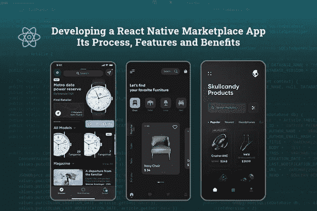
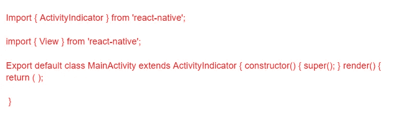
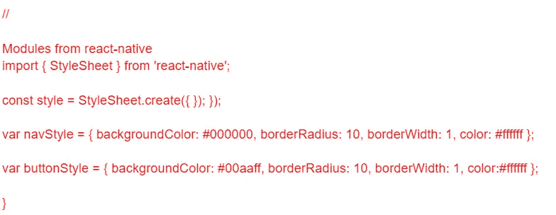

# 使用 React Native 构建按需市场应用

> 原文：<https://javascript.plainenglish.io/build-an-on-demand-marketplace-app-with-react-native-2a466270dc32?source=collection_archive---------3----------------------->

## 1.为什么使用 React Native？2.使用 React Native 3 构建按需市场应用程序。创建应用程序的成本，4。这款应用的前景。



像优步和 Airbnb 这样的按需市场应用已经完全改变了我们使用移动应用的方式。随着这些公司成为价值数十亿美元的公司，其他公司想通过创建自己的按需平台来利用这项新技术似乎是很自然的。

此外，像亚马逊、Urban Company 和 Flipkart 这样的按需市场应用程序正在扩大其在全球的影响力，并产生数万亿美元的收入，这无疑影响了各种创业公司投资这种应用程序类型。

好吧，如果你也受到创建一个按需市场应用程序的想法的启发，以给你的业务带来新的转变，那么你并不孤单。从创业公司到龙头企业，大家都是这么想的。

但问题是如何用定制的按需市场应用程序在行业中树立一个标杆。

区分市场应用程序的一个简单方法是寻找有助于增加业务竞争优势的先进技术。大多数人都直接看着 javascript！

难怪 JavaScript 长期保持市场地位，但是如果你想要一个适用于 Android 和 iOS 设备的 app 呢？

毫无疑问，React Native 是编程语言的最佳选择，可以帮助您为两种平台构建应用程序。

React Native 的流行在很短的时间内就失去了势头。下面你可以查看一下它的受欢迎程度的图表…


[Image Source](https://www.statista.com/statistics/869224/worldwide-software-developer-working-hours/)

在本文中，我们将讨论使用 React Native 创建按需市场应用程序，以及如何创建自己的应用程序。我们还将讨论该应用程序如何工作，并回顾在创建自己的应用程序时使用 React Native 而不是其他框架或语言的一些好处。

以下是这篇博客的主要亮点:

*   *你为什么要使用 React Native 开发一个按需市场应用？*
*   *开发一个成功的按需市场应用的秘诀是什么？*
*   *如何用 React Native 构建一个随需应变的市场 App？*
*   *创建一个按需市场应用程序需要多少成本？*
*   *结论:用 React Native 构建的 Marketplace 应用程序前景如何？*

让我们深入了解这几点，以便更好地理解:

# **为什么您应该使用 React Native 开发一个按需市场应用程序？**

如今，按需市场应用风靡一时。它们为人们提供了一种便捷的方式来获得他们需要的产品和服务，而不必离开他们的家。由于智能手机的普及，越来越多的人使用这些应用程序来获得他们需要的东西。

开发这些应用程序是一项令人生畏的任务，如果你不知道从哪里开始，它会让人不知所措。幸运的是，使用 React Native 你不必担心这些，因为它非常容易使用。

如果您不确定这是否是您的按需市场应用程序项目的正确工具，请看看下面的列表，它强调了您应该使用它的一些原因:

*   **更容易、更简单地访问:**创建原生移动应用需要 iOS 和 Android 开发语言技能。这意味着开发人员必须学习 Objective C(用于 iOS)和 Java(用于 Android)。仅仅为了制作一个应用程序而必须学习两种不同语言的想法可能看起来太多了，但 React Native 允许你用 JavaScript 编写代码——大多数 web 开发人员都知道这种语言——所以不存在学习曲线。
*   **它让设计师做出贡献:**开发人员可能在编码方面很棒，但即使是他们也会承认设计应用程序并不是他们的专长。幸运的是，React Native 允许精通 Sketch(或 Adobe XD)设计软件的设计师从头到尾参与这个过程。
*   **节省编码时间:**使用 React Native 开发按需市场应用的一个主要好处是它可以帮助节省时间。当开发人员花更少的时间来弄清楚如何做某事，而是专注于解决实际问题时，他们实际上花更少的时间来构建产品本身。原本需要几周的事情现在只需要几天或几个小时。
*   确保跨平台兼容性:跨平台工作:React Native 的另一个巨大优势是跨平台工作。无论你喜欢哪种操作系统，React Native 都很有可能满足你的需求。这不仅意味着开发人员在将应用程序从一个平台移植到另一个平台时，不必费力学习新的编程语言，还意味着无论用户使用哪种设备，他们都将获得无缝体验。
*   **开发反应灵敏的用户界面:**正如我们前面提到的，如今移动设备有各种形状和大小。所以总是建议 [**雇佣一个 React 原生开发者**](https://www.appsdevpro.com/hire-developers/hire-react-native-developers.html) 来定制完美适配不同屏幕尺寸的 app。无论你的用户喜欢大屏幕还是小屏幕，反应灵敏的用户界面让他们可以自由选择最适合自己的设备，而不会因此受到惩罚。

React Native 不需要开发人员创建同一应用的多个版本——这是一个繁琐的过程，会导致不必要的成本和资源浪费。相反，它允许参与项目的每个人都专注于他们各自的任务，所以一切都顺利而有效地进行。

*   **提供广泛的先决条件选择:**在开始使用 React Native 开发您的按需市场应用程序之前，您应该知道:您应该记住的一件重要事情是，创建一个成功的 React Native 应用程序有一定的先决条件。

希望 React Native 的这些特性能够鼓励你使用 React Native 编程语言开发应用。

# **开发一个成功的按需市场应用的秘诀是什么？**

市场上有数百种市场应用程序。你们中的许多人一定在如何让它在市场中脱颖而出的问题上进退两难。因此，下面是为你的企业开发一个成功的市场应用程序的秘诀:

*   首先，你需要有一个关于市场应用的好主意。想想你能提供什么独特的服务或产品，人们会愿意为此付费。
*   接下来，你需要建立一个有才华的开发人员团队，他们可以将你的愿景变成现实。React Native 是开发按需市场应用的一个很好的平台，因为它快速、高效且用户友好。
*   一旦你的团队就位，就该开始开发了！创建一个成功的按需市场应用的关键是确保用户体验是一流的。从注册流程到结账流程，每一个细节都需要仔细考虑并完美执行。
*   改善客户体验的一个方法是加入一个易于使用的评级系统，这样用户就知道哪些卖家比其他卖家更值得信赖。例如，如果卖家 A 有 4.5 星的评级，而卖家 B 只有 3 星，则客户可能仅基于评级选择卖家 A 而不是卖家 B。

## ***入门需要什么？***

为了使用 React Native 创建按需市场应用程序，您需要:

1.  一个成功的市场应用程序的想法(想法包括从购买食品配送服务到房屋清洁服务的任何事情)。
2.  一个才华横溢的程序员团队——别担心！我们的专家开发团队将为您提供创新应用。无论你是期待 [**雇佣应用开发者**](https://www.appsdevpro.com/hire-developers.html) 、iOS 开发者、Android 开发者，还是任何其他类型的开发者来完成你的项目；你可以在谷歌上搜索它，或者在这篇博客的末尾提出问题。

# **如何用 React Native 构建一个按需集市 App？**

React Native 是一个流行的移动应用开发框架。如果你想开发一个随需应变的市场应用，React Native 是一个很好的选择。在这篇博文中，我们将为您提供使用 React Native 开发按需市场应用程序的分步指南。此外，您还可以选择从一开始就避免编写应用程序的麻烦。不过，如果你有兴趣阅读如何设置项目、设计和 UI 元素，并最终发布你的应用程序，那么这个博客就是为你准备的。

## **使用 React Native 构建按需市场应用**

启动任何新的 React Native 项目时，您需要做的第一件事是安装 react-native cli。如果您还没有安装它，请转到命令行并键入:

```
**npm install -g react-native-cli.**
```

*安装完成后，我们可以通过在命令行或 Finder 中键入 react-native init MyAppName 来启动我们的新应用程序(这取决于您希望它保存的位置)。*

*现在我们的新应用程序已经创建好了，让我们在 Xcode 中打开它(它应该位于/MyAppName)并添加一些内容，这样它看起来就像一个真正的应用程序。*

*为此，点击* ***Xcode*** *中的 MyAppName 文件夹，然后点击左侧目标下的****myapp name****。*

最后，从“文件”菜单中选择“新建文件”,并根据创建文件的目的选择“文件”或“符号”。现在，只需在新创建的 React 本地项目的 Assets 文件夹中创建一个名为 ***的空白文件。***

**接下来，回到 MainActivity.js，编辑如下**



我们还需要为我们的应用程序创建一个图标。

继续在项目的根目录下保存一个名为“icon”的图像。确保它是尺寸为 128x128 像素的 a.png 文件。完成后，返回 Xcode，将图标拖到资产目录中的图像组上。

最后，让我们建立 Gradle 构建系统，这样我们以后就可以轻松地发布我们的代码了。打开 ***package.json*** 文件，将条目改为“build: ***react-native 而不是“iOS。"*** 更改此设置后，使用终端导航到您的项目目录并键入 ***npm run ios-prepare。***

现在，您可以再次使用终端并通过键入 cd 导航到您生成的 MyAppName 文件夹。/MyAppName 以便添加更多文件，如***home _ screen . js***或您的应用程序可能需要的任何其他文件！

恭喜你！您已经成功构建了一个基本的 React 本机应用程序。您可以看到使用 React Native 开始并更改您的原生移动应用程序是多么容易，因为所有代码都是基于 JavaScript 的，而不是 Objective C 或 Swift。

现在我们将进入造型！通过添加下面几行来导入所需的样式表模块:



这只需要几分钟就可以完成，您会喜欢这个结果的。既然你的应用已经准备好了，我们就来谈谈发布吧。React Native 允许您将应用程序部署到 Apple App Store 和谷歌 Play 商店。

你所需要做的就是告诉 React Native 你想在哪个平台上发布，剩下的由它来处理！React Native 最好的一个特点就是可以同时处理 iOS 和 Android。因此，如果你在一个平台上发布，它会自动为另一个平台生成一个应用程序。

将您的应用部署到商店也非常简单！在 Xcode 顶部菜单中点击“文件”->“归档”,然后给你的项目命名。

您需要输入您的 Apple 开发者帐户信息，以便将您的项目上传到 App Store，但是如果您不发布 iOS 版本，您可以跳过这一步。

由于更严格的指导方针，React 原生应用获得谷歌批准需要更长一点的时间，但这里你可以考虑 [**雇佣 React 原生应用开发者**](https://www.appsdevpro.com/hire-developers/hire-react-native-developers.html) 来应对挑战。由于他们有多年将应用上传到应用商店的经验，他们将应用被拒绝的风险降至最低。

## **创建一个按需市场应用程序需要多少成本？**

开发一个按需市场应用程序的平均成本从 15000 美元到 25000 美元以上不等。在不知道你需要在你的应用中集成什么的情况下，估算应用开发的成本是非常不可预测的。然而，考虑到市场统计数据和评估各种因素，我们在此得出了这些估计。

但是，当你知道实际上是什么造成的时候，估计应用程序开发成本并不是火箭科学。计算应用程序开发成本时，重点关注以下几点非常重要:

*   **应用程序的复杂性:**决定你需要为你的企业开发什么类型的应用程序。应用程序的复杂性将取决于您选择集成到应用程序中的特性和功能。
*   **操作系统选择:**你想在哪里启动一个 app？无论你是想打造原生的 Android/ iOS 应用，还是跨平台应用。根据您选择启动应用程序的平台，构建应用程序的成本会有很大差异。开发一个跨平台的应用比创建两个原生应用成本低 40%。
*   用户界面/UX 设计:一个简单的设计总是花费较少的时间来构建，并且总是被用户所欣赏。因此，雇佣一个应用程序开发者来帮助你建立简单直观的设计，让用户在应用程序上停留更长时间是值得的。
*   **特性和功能:**开发一个具备基本特性的应用，你的花费要远远低于高级应用版本。

希望这些因素能帮助你理解到底是什么导致了你的应用开发成本。然而，这些都是粗略的估计。最终的应用程序开发时间和成本可能会高于或低于这些数字，具体取决于项目需求。

## **结论:用 React Native 构建的 Marketplace 应用程序前景如何？**

对于投资者来说，将业务迁移到数字平台或计划创建一个按需市场应用程序是一个至关重要的决定。当你计划开发一个应用程序时，你最关心的当然是寻找能在未来长期存在的技术。你也可以选择 [**雇佣一个在特定语言方面有专长的移动应用开发者**](https://www.appsdevpro.com/hire-developers/hire-mobile-app-developers.html) 。

基于 JavaScript，React Native 是一个强大的框架，它为您提供了大量现成的小部件和跨平台兼容性。它导致更快的开发，更安全的未来，并节省开发成本。

因此，选择使用 React Native 开发按需市场应用程序对您来说是一个双赢的局面。你只需要一个绝妙的应用创意来启动你的业务。事实上，您可以联系我们或在下面留下您的疑问，以防您在应用程序开发方面寻求专家帮助。

*更多内容请看*[***plain English . io***](https://plainenglish.io/)*。报名参加我们的* [***免费周报***](http://newsletter.plainenglish.io/) *。关注我们关于*[***Twitter***](https://twitter.com/inPlainEngHQ)[***LinkedIn***](https://www.linkedin.com/company/inplainenglish/)*[***YouTube***](https://www.youtube.com/channel/UCtipWUghju290NWcn8jhyAw)*[***不和***](https://discord.gg/GtDtUAvyhW) *。***