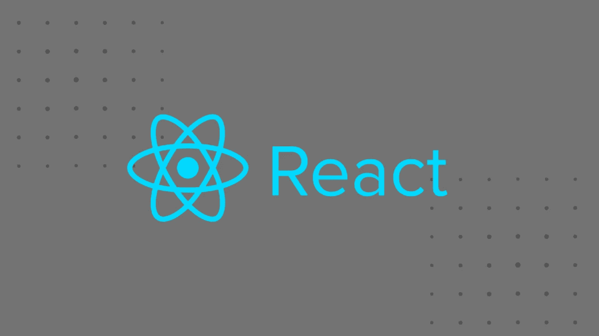
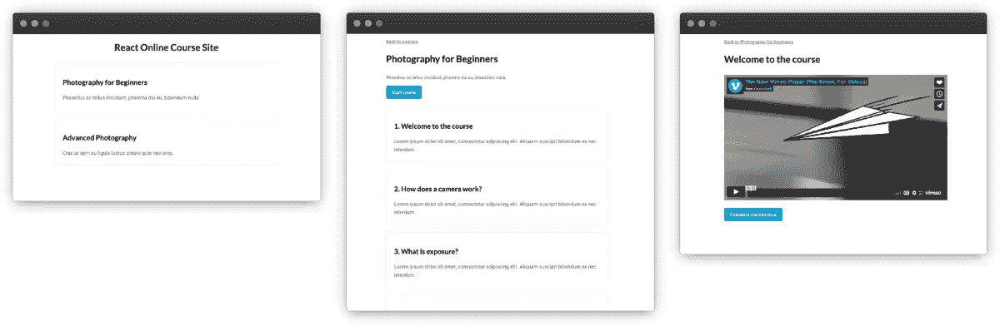
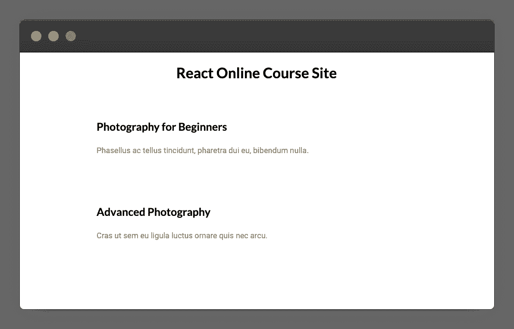
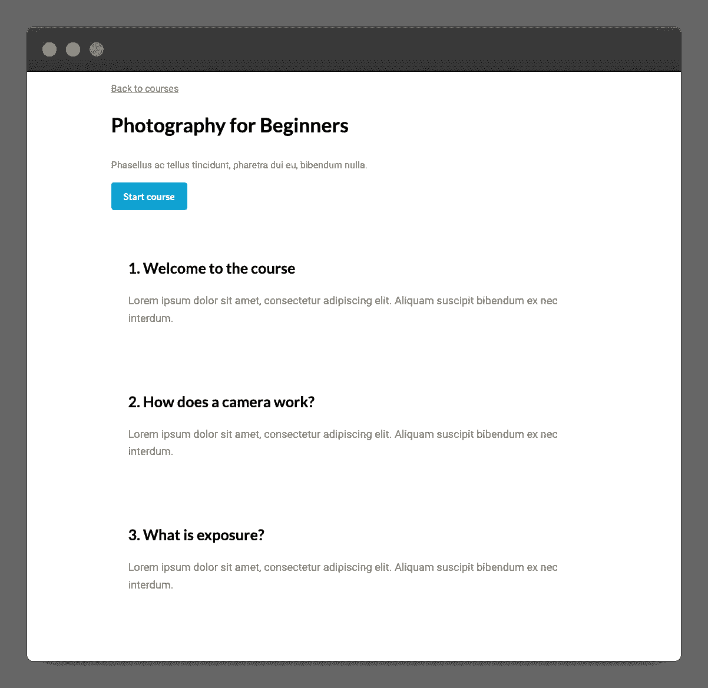
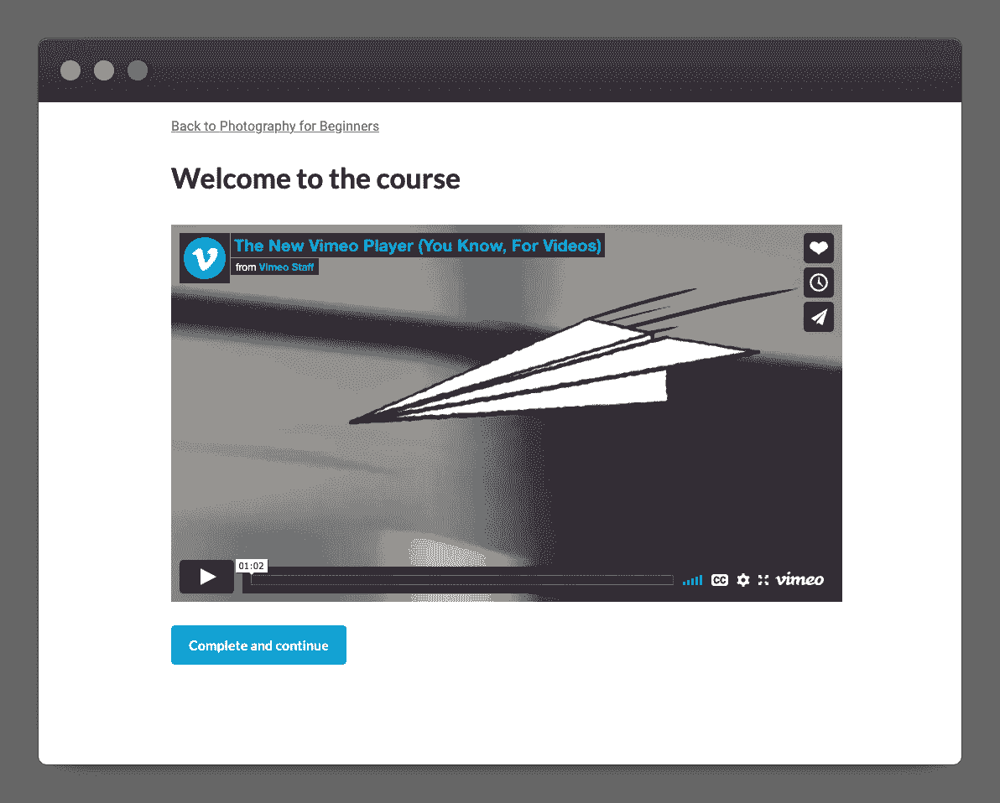
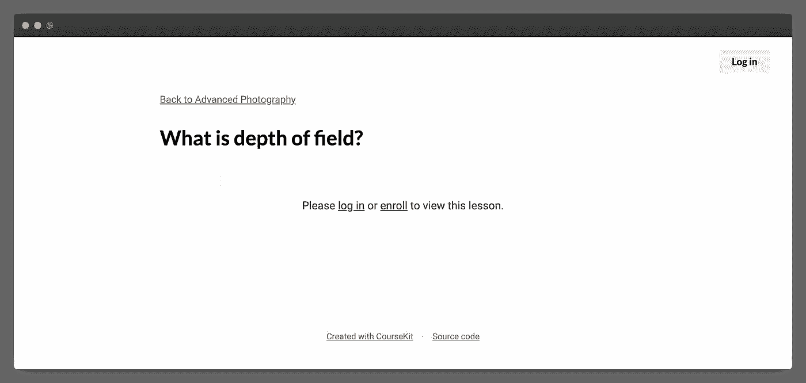

# 使用 React 构建在线课程

> 原文：<https://javascript.plainenglish.io/build-an-online-course-with-react-4cb417d82c79?source=collection_archive---------11----------------------->



分享你的知识的一个好方法是在线课程。我们可以构建自己的课程，这样我们就可以按照自己喜欢的方式设计和制作 UX，而不是拘泥于知名课程平台提供的枯燥、呆板的课程页面。

在本教程中，我将向您展示如何使用 React 创建单页应用程序课程网站。这些功能将包括基于 markdown 的内容、嵌入式 Vimeo 视频和课程导航。

我们将使这成为一个静态的网站，所以你不需要后端。以下是主页、课程页面和课程页面的外观:



在本教程的最后，我还将向您展示如何(可选地)注册学生，以便您可以跟踪学生的进度并保护课程内容，从而使您的课程盈利。对于这一部分，我们将集成 [CourseKit](https://coursekit.dev) ，这是一个用于托管在线课程的无头 API(声明:我是创始人)。

**您可以在这里** **查看成品的 demo，在这里** **获取源代码** [。](https://github.com/anthonygore/react-course)

# 使用 Create React 应用程序设置

让我们继续使用 [Create React App](https://reactjs.org/docs/create-a-new-react-app.html) 建立我们的单页应用程序课程网站。

```
$ npx create-react-app react-course 
$ cd react-course
```

我们还需要 [React 路由器](https://reactrouter.com/)来设置课程页面。

```
$ npm install --save react-router-dom
```

完成后，让我们启动开发服务器并开始构建！

```
$ npm start
```

# 配置路由器并创建页面

我们的课程应用程序将有三个页面:

*   一个显示可用课程的主页。
*   一个**课程页面**，将显示特定课程及其课程的信息。这将有一个动态路线`/courses/:courseId`。
*   显示特定课程的第一页。这样就会有一条动态路线`/courses/:courseId/lessons/:lessonId`。

因为我们使用 React Router，所以我们将为每个页面创建一个组件。让我们把这些放到目录中， *src/pages* 。

```
$ mkdir src/pages
$ touch src/pages/Home.js
$ touch src/pages/Course.js
$ touch src/pages/Lesson.js
```

# 将路由器添加到项目

我们现在需要编辑 *src/index.js* ，并用`BrowserRouter`包装我们的主`App`组件，这样路由器就可以工作了。

*src/index.js*

```
import React from 'react'
import ReactDOM from 'react-dom'
import App from './App'
import { BrowserRouter } from "react-router-dom"
import './index.css'ReactDOM.render(
  <BrowserRouter>
    <App />
  </BrowserRouter>,
  document.getElementById('root')
)
```

# 将页面添加到应用程序组件

我们现在将转到`App`组件并清除内容。然后，我们将使用上面声明的三个路由和页面创建自己的模板。

*src/app.js*

```
import { Routes, Route } from 'react-router-dom'
import Home from './pages/Home'
import Course from './pages/Course'
import Lesson from './pages/Lesson'

function App() {
  return (
    <div className="App">
      <main>
        <Routes>
          <Route
            path="/" 
            element={<Home />} 
          />
          <Route
            path="/courses/:courseId" 
            element={<Course />}
          />
          <Route
            path="/courses/:courseId/lessons/:lessonId"
            element={<Lesson />}
          />
        </Routes>
      </main>
    </div>
  )
}

export default App
```

完成后，我们已经建立了课程应用程序的页面结构。

# 创建课程数据文件

因为我们没有使用后端 API，所以我们的课程数据将存储在一个嵌套的 JavaScript 数组中。这个数组将用于填充我们的应用程序的内容。

该数组将由带有`id`、`title`、`description`的课程对象和课程对象的子数组组成。

课程对象将有一个`id`、`title`和`description`，还将包括一个`vimeoId`，它将是课程视频的 ID(这将在下面解释)。

> *提示:确保您的 id 是唯一且连续的。*

*src/courses.js*

```
const courses = [
  {
    id: 1,
    title: "Photography for Beginners",
    description: "Phasellus ac tellus tincidunt...",
    lessons: [
      {
        id: 1,
        title: "Welcome to the course",
        description: "Lorem ipsum dolor sit amet...",
        vimeoId: 76979871
      },
      {
        id: 2,
        title: "How does a camera work?",
        description: "Lorem ipsum dolor sit amet...",
        vimeoId: 76979871
      },
      ...
    ]
  },
  {
    id: 2,
    title: "Advanced Photography",
    description: "Cras ut sem eu ligula luctus ornare quis nec arcu.",
    lessons: [
      ...
    ]
  },
  ...
]

export default courses
```

# 创建主页

让我们现在开始构建我们的页面，从主页开始。我们将首先从刚刚创建的模块中导入`courses`数组。

在组件模板中，我们将映射数组并将数据传递到一个新的组件`CourseSummary`。

*src/pages/Home.js*

```
import courses from '../courses'
import CourseSummary from '../components/CourseSummary'

function Home() {
  return (
    <div className="Home page">
      <header>
        <h1>React Online Course Site</h1>
      </header>
      {courses.map((course) => (
        <CourseSummary course={course} key={course.id} />
      ))}
    </div>
  )
}

export default Home
```

# 课程摘要组件

该组件将显示每个课程的标题和描述，并将提供一个课程链接，允许用户选择他们想要参加的课程。我们通过 props 传递课程信息。

*src/components/course summary . js*

```
import { Link } from 'react-router-dom'

function CourseSummary(props) {
  return (
    <section key={props.course.id} className="summary">
      <div>
        <div className="title">
          <h2>
            <Link
              className="no-underline cursor-pointer"
              to={'/courses/' + props.course.id}
            >
              {props.course.title}
            </Link>
          </h2>
        </div>
        <p>
          <Link
            className="no-underline cursor-pointer"
            to={'/courses/' + props.course.id}
          >
            {props.course.description}
          </Link>
        </p>
      </div>
    </section>
  )
}

export default CourseSummary
```

完成后，一旦添加了一点 CSS，这就是我们的主页的样子(为了简洁，我不会在这里展示，但是你可以在[源代码](https://github.com/anthonygore/react-course)中看到它)。).



# 创建课程页面

我们将创建的下一个页面是课程页面。注意页面路径`/courses/:courseId`有一个课程 ID 的动态段，这是我们如何知道要显示哪个课程的数据。

让我们使用 React 路由器的`useParams`钩子在运行时提取动态段。

*src/pages/Course.js*

```
import { useParams } from 'react-router-dom'

function Course() {
  let { courseId } = useParams()
  console.log(courseId) // 1
}

export default Course
```

现在我们可以使用 ID 通过数组`find`从课程数据中获取相关的课程数据。

> 提示:如果 find 返回 null，你应该显示一个 404 页面。

*src/pages/Course.js*

```
import { useParams } from 'react-router-dom'
import courses from '../courses'

function Course() {
  const { courseId } = useParams()
  const course = courses.find(course => course.id === courseId)
}

export default Course
```

我们现在可以为课程定义一个模板。页眉将在页面顶部包含一个面包屑和课程的详细信息，包括标题和描述。

然后，我们将链接到第一课的文本“开始课程”。我们还将显示课程中包含的课程摘要，这些课程是通过映射到`lessons`子属性并将数据传递给另一个组件`LessonSummary`而创建的。

*src/pages/Course.js*

```
import { useParams } from 'react-router-dom'
import LessonSummary from '../components/LessonSummary'
import { Link } from 'react-router-dom'
import courses from '../courses'

function Course() {
  const { courseId } = useParams()
  const course = courses.find(course => course.id === parseInt(courseId))
  return (
    <div className="Course page">
      <header>
        <p>
          <Link to={'/'}>Back to courses</Link>
        </p>
        <h1>{course.title}</h1>
        <p>{course.description}</p>
        <Link 
          className="button primary icon" 
          to={`/courses/${courseId}/lessons/${course.lessons[0].id}`}
        >
          Start course
        </Link>
      </header>
      <div>
        {course.lessons.map((lesson, index) => (
          <LessonSummary
            courseId={courseId}
            lesson={lesson}
            num={index + 1}
            key={lesson.id}
          />
        ))}
      </div>
    </div>
  )
}

export default Course
```

# LessonSummary 组件

类似于`CourseSummary`组件，这个组件将接收带有课程数据的道具，这些道具可用于显示标题和描述作为可点击的链接。这将允许用户直接导航到课程。

*src/components/lessonsummary . js*

```
import { Link } from 'react-router-dom'

function LessonSummary(props) {
  return (
    <section key={props.lesson.id} className="summary">
      <div>
        <div className="title">
          <h2>
            <Link
              className="no-underline cursor-pointer"
              to={'/courses/' + props.courseId + '/lessons/' + props.lesson.id}
            >
              {props.num}. {props.lesson.title}
            </Link>
          </h2>
        </div>
        <p>
          <Link
            className="no-underline cursor-pointer"
            to={'/courses/' + props.courseId + '/lessons/' + props.lesson.id}
          >
            {props.lesson.description}
          </Link>
        </p>
      </div>
    </section>
  )
}

export default LessonSummary
```

完成后，课程页面将会是这样的:



# 创建课程页面

与课程页面类似，课程页面在 URL 中包含动态段。这一次，我们有了一个`courseId`和`lessonId`，允许我们使用数组查找来检索正确的课程和课程对象。

*src/pages/Lesson.js*

```
import { useParams } from 'react-router-dom'
import courses from '../courses'

function Lesson() {
  const { courseId, lessonId } = useParams()
  const course = courses.find(course => course.id === parseInt(courseId))
  const lesson = course.lessons.find(lesson => lesson.id === parseInt(lessonId))
}

export default Lesson
```

# Vimeo 嵌入

每节课都有相关的视频。在这个演示中，我们将使用一个 [Vimeo](https://vimeo.com/) 视频，尽管你可以使用任何允许嵌入你自己网站的视频服务。

您需要做的就是在视频上传后获取其 ID，并将其添加到课程数据模块中。ID 通常是一个类似`76979871`的数字。

在运行时，我们将嵌入一个 Vimeo 视频播放器，并使用其 ID 加载视频。为此，让我们安装[反应 Vimeo](https://github.com/u-wave/react-vimeo) 组件。

```
$ npm i -S @u-wave/react-vimeo
```

# 课程页面组件

现在让我们为课程页面组件创建一个模板。像课程页面一样，我们将在模板顶部提供面包屑和课程标题。

然后我们将使用`Vimeo`组件，并从我们的数据中给它传递一个带有 vimeo ID 的属性`video`。

*src/pages/Lesson.js*

```
import { Link, useParams } from 'react-router-dom'
import Vimeo from '@u-wave/react-vimeo'
import courses from '../courses'

function Lesson() {
  const { courseId, lessonId } = useParams()
  const course = courses.find(course => course.id === parseInt(courseId))
  const lesson = course.lessons.find(lesson => lesson.id === parseInt(lessonId))
  return (
    <div className="Lesson page">
      <header>
        <p>
          <Link to={'/courses/' + course.id}>Back to {course.title}</Link>
        </p>
        <h1>{lesson.title}</h1>
      </header>
      <div className="Content">
        <Vimeo video={lesson.vimeoId} responsive />
      </div>
    </div>
  )
}

export default Lesson
```

# 完成并继续按钮

我们将添加到课程页面的最后一个东西是一个*完成并继续*按钮。这允许用户在观看完视频后导航到下一课。

让我们创建一个名为`CompleteAndContinueButton`的新组件。这将使用 React Router 的`useNavigate`钩子导航到下一课(其 ID 作为道具传入)。

*src/components/completeandcontinuebutton . js*

```
import { useNavigate } from 'react-router-dom'

function CompleteAndContinueButton(props) {
  const navigate = useNavigate()
  function completeAndContinue () {
    navigate(`/courses/${props.courseId}/lessons/${props.lessonId}`)
  }
  return (
    <button className="button primary" onClick={completeAndContinue}>
      Complete and continue
    </button>
  )
}

export default CompleteAndContinueButton
```

我们将把这个组件直接添加到课程页面模板中的`Vimeo`组件下。请注意，我们需要获取下一课的 ID，并将其作为道具传递。我们将创建一个函数`nextLessonId()`来找到它。

*src/pages/Lesson.js*

```
import { Link, useParams } from 'react-router-dom'
import Vimeo from '@u-wave/react-vimeo'
import courses from '../courses'
import CompleteAndContinueButton from '../components/CompleteAndContinueButtons'

function Lesson() {
  ...
  const nextLessonId = () => {
    const currentIndex = course.lessons.indexOf(lesson)
    const nextIndex = (currentIndex + 1) % course.lessons.length
    return course.lessons[nextIndex].id
  }
  return (
    <div className="Lesson page">
      <header>...</header>
      <div className="Content">
        <Vimeo video={lesson.vimeoId} responsive />
        <CompleteAndContinueButton 
          courseId={courseId}
          lessonId={nextLessonId()}
        />
      </div>
    </div>
  )
}

export default Lesson
```

完成后，这就是我们的课程页面的样子。当然，视频是可以播放的，学生可以在看完之后浏览下一课。



# 添加学生注册

现在，我们的应用程序具有课程的基本功能:学生可以选择课程，选择课程，并观看视频。

然而，在线课程还有其他重要的方面我们没有包括在内。

首先是个性化。学生希望能够跟踪他们已经完成的课程，以防他们没有一次完成课程。

其次，我们可能想保护我们的内容，只有付费学生才能看到。这样我们就可以将我们的课程货币化。

这两个功能都需要一个允许学生注册的认证系统，这样我们就知道他们购买了哪些课程，完成了哪些课程。

# 课程工具包

创建课程后端是一项艰巨的任务。另一种选择是使用 [CourseKit](https://coursekit.dev) ，这是一个用于在线课程的无头 API，我们可以很容易地将它插入到我们创建的应用程序中。

CourseKit 旨在提供我们的应用程序中所缺少的功能:学生管理和基于角色的内容访问。

# 向我们的项目添加 CourseKit

要将 CourseKit 添加到这个项目中，我们需要创建一个帐户，并将我们的课程数据转移到那里。然后我们使用 CourseKit JavaScript 客户端通过 API 调用数据。

如果我们添加了 CourseKit，这就是课程页面的样子。请注意在用户验证之前内容是如何隐藏的。



> *这里是这个集成了 CourseKit 的网站的* [*完整演示*](https://demo.coursekit.dev) *。*

# 作为早期用户加入 CourseKit

CourseKit 目前处于公开测试阶段，这意味着它已经推出并发挥作用，但一些功能(如分析)仍在开发中。

我们对早期用户的邀请有限。如果您想申请一个，或者如果您只是想了解 CourseKit 的进展，请务必在本页留下您的详细信息:

[加入 CourseKit 测试版列表](https://coursekit.dev/#join)

*最初发布于*[*https://course kit . dev*](https://coursekit.dev/blog/online-course-react)*。*

*更多内容请看*[***plain English . io***](https://plainenglish.io/)*。报名参加我们的* [***免费周报***](http://newsletter.plainenglish.io/) *。关注我们关于*[***Twitter***](https://twitter.com/inPlainEngHQ)*和*[***LinkedIn***](https://www.linkedin.com/company/inplainenglish/)*。加入我们的* [***社区不和谐***](https://discord.gg/GtDtUAvyhW) *。*