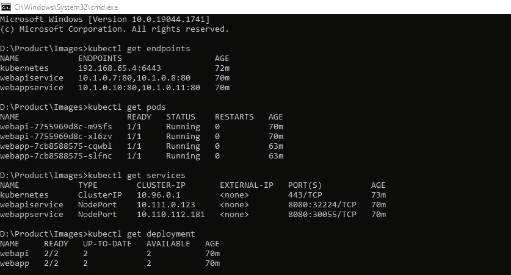
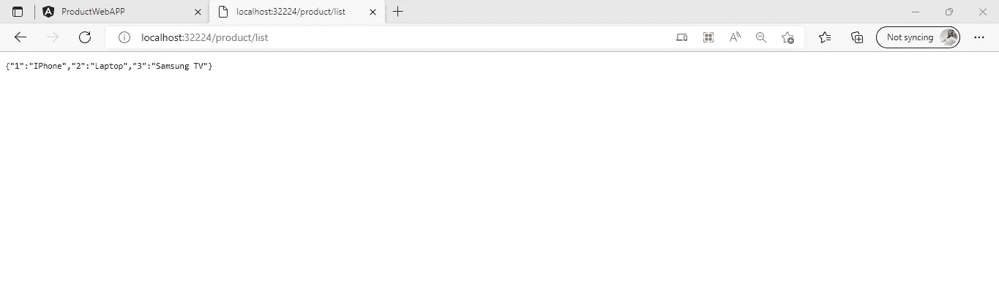
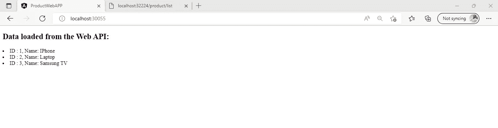

# 端到端构建。使用 Kubernetes 的 NET Core API 和 Angular 应用程序

> 原文：<https://javascript.plainenglish.io/build-end-to-end-net-core-api-and-angular-application-using-kubernetes-b1b75ea4bda9?source=collection_archive---------0----------------------->


今天我们将使用构建一个端到端的应用程序。NET Core API 6 和 Angular 14。

**先决条件**

1.  对码头工人的理解
2.  对 Kubernetes 的基本了解
3.  对…的基本了解。网络核心
4.  对角度的理解
5.  那边启用了 Kubernetes 的 Docker 桌面。

对于以上所有的话题，你可以访问我下面的博客，这些博客有助于你更容易地理解我们将要在这个博客中讨论的事情。

*   [库伯内特的介绍](https://blog.devops.dev/introduction-of-kubernetes-fc044018fd03)
*   [库伯内特的建筑](https://medium.com/@jaydeepvpatil225/architecture-of-kubernetes-d17afd3428db)
*   [介绍 Docker](https://blog.devops.dev/docker-introduction-and-architecture-8637d9d1c4dc)
*   [基础。Net Core REST API 和 Angular 应用使用 Docker](https://medium.com/@jaydeepvpatil225/build-net-core-rest-api-and-angular-application-using-docker-aa2249fc7d92)

**第一步:**

创造。NET Core API 6 应用程序使用 VS 代码来使用以下命令

首先，在您的本地机器上创建一个目录，我们把后端和前端应用程序放在那里。

```
mkdir Productcd Product
```

接下来，创建另一个文件夹 ProductWebAPI

```
mkdir ProductWebAPIcd ProductWebAPI
```

稍后，创建一个新的。ProductWebAPI 文件夹中的. NET 解决方案

```
dotnet new sln
```

接下来，在名为 ProductWebAPI 的项目中创建新的 web API 项目

```
dotnet new ProductWebAPI -o
```

最后，使用以下命令将 ProductWebAPI 的 csproj 文件添加到 sln 文件中

```
dotnet sln ADD ProductWebAPI.csproj
```

这样，我们就创建了一个新的。NET 核心 API 项目使用 Visual Studio 2022 in。NET 版本 6

**第二步:**

现在我们创建 ProductController 并创建一个简单的端点，它返回一个产品列表，如下所示

在这里，您可以看到我们创建了一个名为 list 的端点，它将返回一个产品列表的字典，我们将使用 Angular 14 应用程序显示这些产品。

**第三步:**

接下来，我们将把 CORS 策略添加到中使用的程序类中。网络核心 6

**CORS 支持**

CORS 的完整形式是跨产地资源共享。它是一个 W3C 标准，允许服务器从指定的域进行跨域调用，同时由于浏览器的安全性，默认情况下拒绝其他调用。它防止网页从一个域向另一个域发出 Ajax 请求。

但是很多时候我们使用多域应用程序，这些应用程序需要从一个域调用另一个域；在这种情况下，我们需要允许跨来源策略。

```
builder.Services.AddCors();
app.UseCors(builder =>
    {
        builder
        .AllowAnyOrigin()
        .AllowAnyMethod()
        .AllowAnyHeader();
    });
```

在这里，您可以看到我们放置了一些设置了 CORS 策略的代码，我们要求 Angular 应用程序从后端应用程序获取数据。

**第四步:**

创建 Docker 文件来创建我们将在 Kubernetes 中使用的 Docker 图像。

所以这里你可以看到

*   首先，我们采取。NET Core SDK 并为我们的应用程序设置工作目录
*   然后将我们的项目 csproj 文件复制到 docker 目录中
*   稍后，将所有剩余内容从本地复制到 Docker 目录，并为此创建 publish。
*   在最后一节中，我们获取 asp net 映像，并在设置工作目录后将我们的构建内容复制到它们的目录中，然后最后创建应用程序端点。

**第五步:**

现在，如果您想看到输出，使用下面的代码运行应用程序。NET CLI 命令

```
dotnet run
```

**第六步:**

让我们创建一个 docker 映像，然后使用下面的命令检查它是否工作正常

(注意:确保 Docker 桌面运行良好，并且在其上启用了 Kubernetes)

```
docker build -t productapi:v1 .
```

然后将这个图像运行到 docker 容器中

```
docker run -p 3000:80 productapi:v1
```

最后可以看到点击网址[http://localhost:3000/product/list](http://localhost:3000/product/list)后的输出

这就是关于 docker 的所有内容，我们看到了如何创建 docker 映像并将其运行到容器中。现在停止容器，并遵循后续步骤

现在，我们将为后端应用程序创建清单文件

在这里，您可以看到我们创建了部署、pod 和服务，然后提到了 docker 映像、容器、策略和应用程序副本数量的所有详细信息

接下来，我们应用这个清单文件并创建部署、pod、服务和端点来管理 Kubernetes 集群和访问应用程序

```
kubectl apply -f manifest.yml
```

这个命令将在 Kubernetes 中创建 Pods 和服务

```
kubectl get podskubectl get serviceskubectl get endpointskubectl get deployment
```



在服务部分，您可以看到访问应用程序的端点，现在您可以使用 URL[http://localhost:32224/product/list](http://localhost:3224/product/list)访问应用程序，您可以看到下面的输出



所以，这都是关于后端应用程序。

让我们从 **Angular** 应用程序开始，我们将使用 Angular 14 创建该应用程序，并在从后端应用程序获取数据后用于显示数据

**第一步:**

在项目文件夹中创建一个新项目

```
ng new ProductWebAPP
```

进入 ProductWebAPP 目录

```
cd ProductWebAPP
```

**第二步:**

创建一个新的服务，使用 HTTP 客户端模块从后端应用程序获取数据

ng g 服务演示

**第三步:**

将 HTTP 客户端模块导入 app.module.ts

**第四步:**

在 app.component.ts 中添加以下代码

**第五步:**

接下来，添加下面的 HTML 片段来显示我们要从后端应用程序获取的数据

第六步:

创建用于设置动态端口配置的 appEntryPoint.sh 文件

**第七步:**

接下来，创建一个 nginx-custom.conf 文件，该文件设置一些默认的 nginx 服务器配置

**第八步:**

在根目录中创建 Dockerfile

所以，你可以看到，

*   首先，我们获取应用程序的节点映像并设置 docker 目录，然后复制 package.json 文件和 docker 目录中的剩余数据
*   在第二部分中，我们采用 Nginx 服务器映像，并设置默认配置
*   最后，我们设置应用程序和文件的入口点，用于在运行时设置动态端口。

**第九步:**

此外，在用于设置后端 API URL 的 assets 文件夹和 config 目录中创建 config.json 和 config.template.json 文件

```
{
    "apiServer": {
    "url": "[http://localhost:3000](http://localhost:3000/)",
    "version": "v1"
    }
}
```

创建 config.template.json

```
{
    "apiServer": {
        "url": "${API_LINK}",
        "version": "v1"
    }
}
```

**第十步:**

现在，我们将创建一个 docker 映像，并在 docker 文件所在的根目录下使用以下命令将其运行到容器中。

```
docker build -t productapi:v1docker run -p 3002:80 productapi:v1
```

最后，您可以看到我们使用 URL [http://localhost:3002/，](http://localhost:3002/,)从后端应用程序获得的输出。现在，停止容器并按照下面的步骤操作

**第 11 步)**

让我们创建一个 manifest.yml 文件，并在 Kubernetes 上应用它来创建一个集群

接下来，将这个清单文件应用到 Kubernetes 集群

```
kubectl apply -f manifest.yml
```

这个命令将在 Kubernetes 中创建 Pods 和服务

```
kubectl get podskubectl get serviceskubectl get endpointskubectl get deployment
```


在服务部分，您可以看到访问应用程序的端点，现在您可以使用 URL[http://localhost:30055/](http://localhost:30055/product/list)访问应用程序，您可以看到下面的输出



## **结论**

我们讨论了如何创造？NET Core API 6 和 Angular 14 web 应用程序，然后使用 Kubernetes 一步一步地将其容器化。

我希望你明白我们在这个博客中讨论的所有事情

**快乐编码！**

*更多内容请看*[***plain English . io***](https://plainenglish.io/)*。报名参加我们的* [***免费周报***](http://newsletter.plainenglish.io/) *。关注我们关于*[***Twitter***](https://twitter.com/inPlainEngHQ)*和*[***LinkedIn***](https://www.linkedin.com/company/inplainenglish/)*。查看我们的* [***社区不和谐***](https://discord.gg/GtDtUAvyhW) *加入我们的* [***人才集体***](https://inplainenglish.pallet.com/talent/welcome) *。*