# 构建 Privex:一个跨平台的 React 原生聊天应用

> 原文：<https://javascript.plainenglish.io/build-privex-a-cross-platform-reactnative-chat-app-9d28df0c54ea?source=collection_archive---------17----------------------->

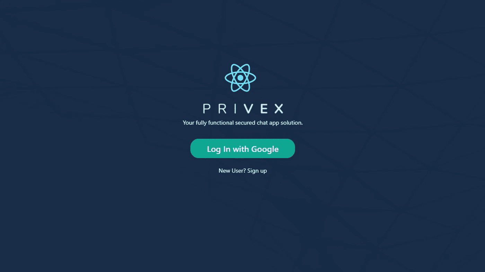

你将要建造的东西。看现场[演示](https://privex-d1c15.web.app/)和 Git 回购[这里](https://github.com/Daltonic/privex)。

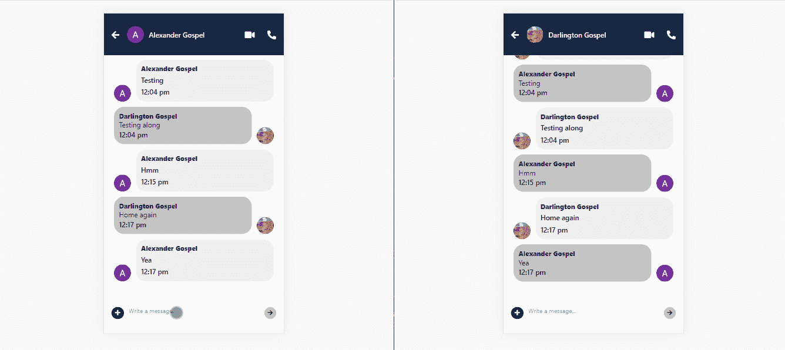

# 介绍

让我们现实一点，如果你还没有建立一个聊天应用程序，你仍然有点落后于软件开发的前沿。你需要把你的应用程序开发提升到一个新的水平。幸运的是，像 [React Native](https://reactnative.dev/) 这样的跨平台框架可以让你立刻构建一个现代聊天应用，就像上面看到的那样。

在本教程中，您将学习如何使用；ReactNative、 [CometChat](http://) 和 Firebase 来构建一个拥有惊艳 UI 的**一对一**聊天 app。

[现在就去我的 Youtube 频道查看免费的 web3 教程](https://www.youtube.com/channel/UCQteXYZ5mC-cuTxplzM4Hlw?sub_confirmation=1)。

如果你准备好了，让我们开始吧…

# 先决条件

要理解本教程，您应该已经熟悉了 ReactNative 其余的堆栈很容易掌握。下面列出了用于创建此应用程序的包。

*   [反应原生](https://reactnative.dev/)
*   [燃烧基地](http://)
*   [CometChat](https://app.cometchat.com/)
*   [世博会](http://)
*   [Node.js](http://)

# 安装项目依赖项

首先，在你的机器上下载并安装 **Node.js** 。然后，如果你还没有，去他们的[网站](https://nodejs.org/)完成安装。然后必须使用下面的命令将 Expo-CLI 安装到您的计算机上。您可以通过点击此[链接](http://)进入他们的文档页面。

`# Install Expo-CLI`

`npm install --global expo-cli`

之后，打开终端并创建一个名为 **privex** 的新 expo 项目，在提示时选择空白模板。用下面的例子来说明这一点。

```
#Create a new expo project and navigate to the directoryexpo init **privex**cd **privex**#Start the newly created expo projectexpo start
```

在终端上运行上述命令将创建一个新的 react-native 项目，并在浏览器上启动它。现在，您可以选择启动 IOS、Android 或 Web 界面，只需选择您想要的界面。要在 [IOS](https://docs.expo.dev/workflow/ios-simulator/) 或 [Android](https://docs.expo.dev/workflow/android-studio-emulator/) 上启动开发服务器，你需要一个模拟器，使用这里的说明来使用 IOS 或 Android 模拟器，否则，使用 web 界面并遵循教程。

很好，现在按照下面的说明为我们的项目安装这些关键的依赖项。**纱**是博览会的默认包经理；请参见下面的代码。

```
# Install the native react navigation librariesyarn add @react-navigation/nativeyarn add @react-navigation/native-stack#Installing dependencies into an Expo managed projectexpo install react-native-screens react-native-safe-area-context react-native-gesture-handler# Install an Icon pack and a state manageryarn add react-native-vector-icons react-hooks-global-state
```

很好，现在让我们为这个项目设置 [Firebase](https://console.firebase.google.com/) 。

# 设置 Firebase

运行以下命令，在项目中正确安装 firebase。

使用以下命令安装 Firebase:

```
expo install firebase
```

让我们从为这个项目配置 Firebase 控制台开始，包括我们将使用的服务。

如果您还没有 Firebase 帐户，请为自己创建一个。之后，转到 Firebase，创建一个名为 **privex** 的新项目，然后激活 Google 认证服务，详细如下。

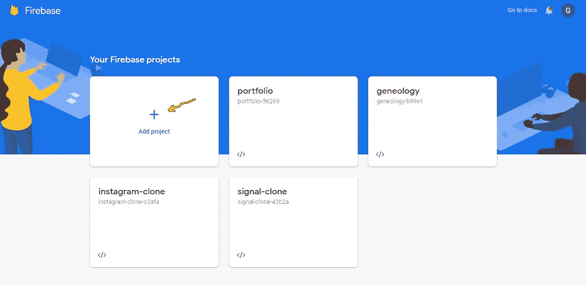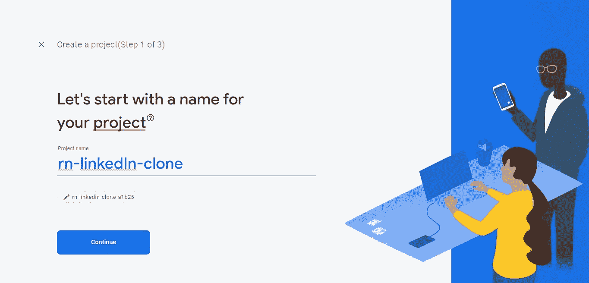

Firebase 支持通过各种提供者进行身份验证。例如，社会认证、电话号码以及传统的电子邮件和密码方法。因为我们将在本教程中使用 Google 认证，所以我们需要为我们在 Firebase 中创建的项目启用它，因为它在默认情况下是禁用的。单击项目的 authentication 选项卡下的登录方法，您应该会看到 Firebase 当前支持的提供者列表。

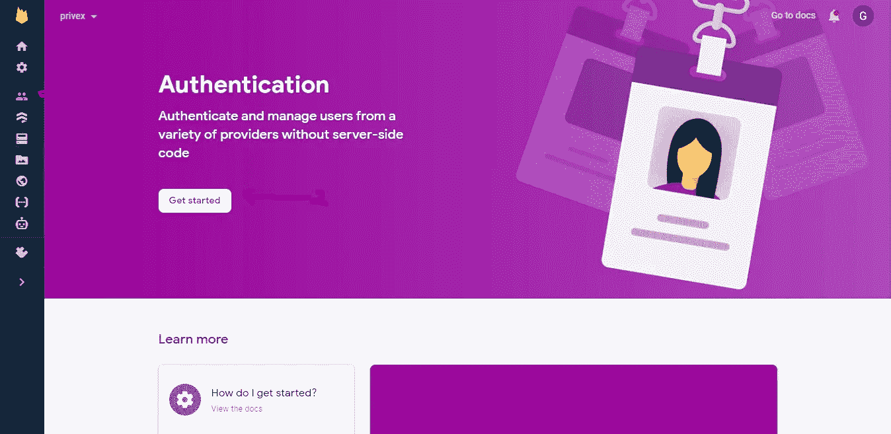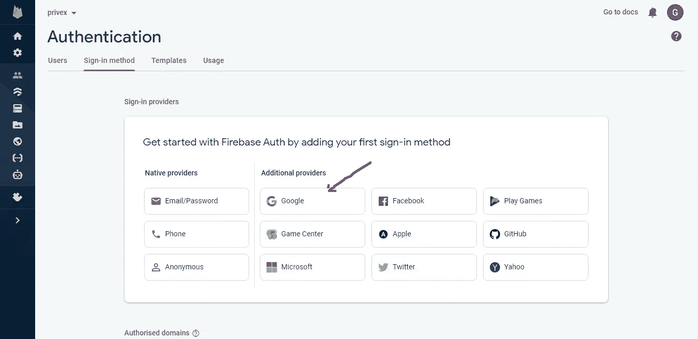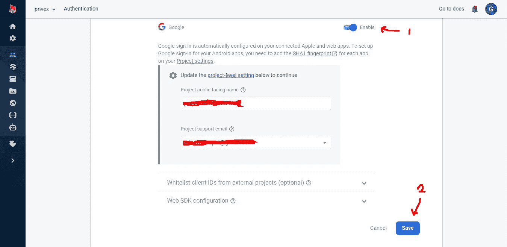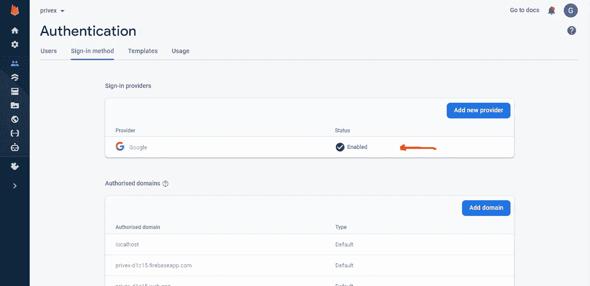

太好了，这就是 firebase 身份验证的全部内容，让我们生成 Firebase SDK 配置密钥。

您需要在 Firebase 项目下注册您的应用程序。

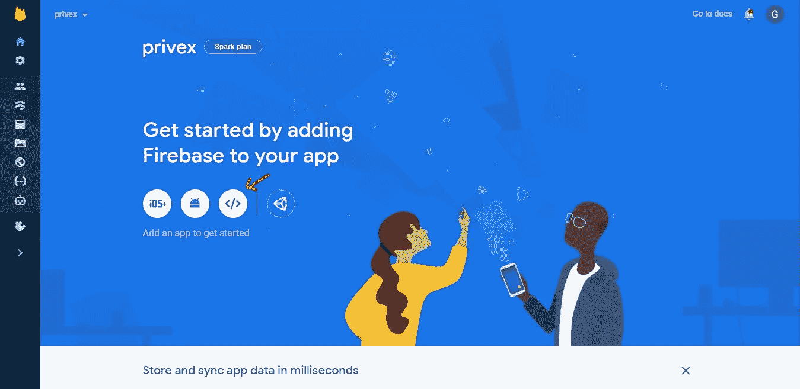

在项目的概述页面上，选择添加应用选项，并选择 **web** 作为平台。

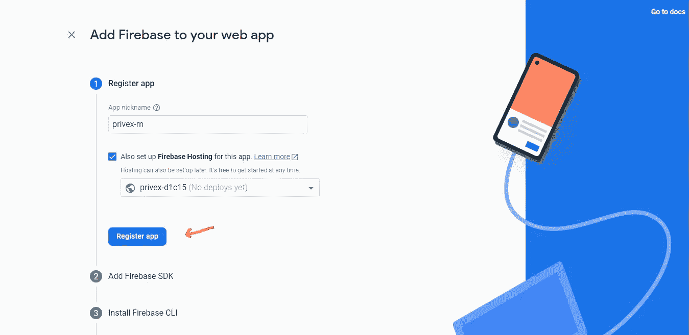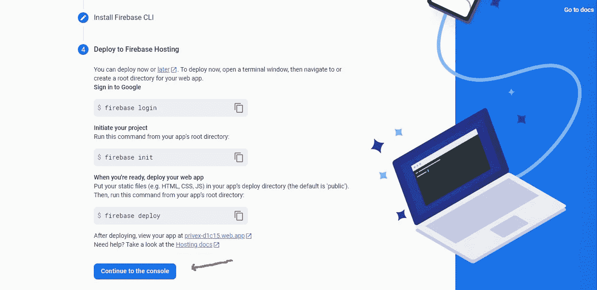

完成 SDK 配置注册后，返回到项目概述页面，如下图所示。

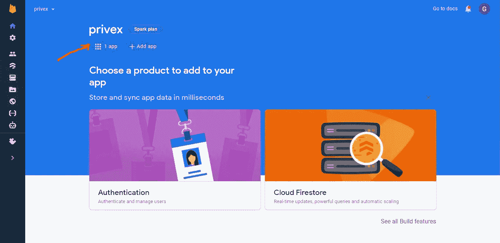

现在，您可以单击项目设置来复制您的 SDK 配置设置。

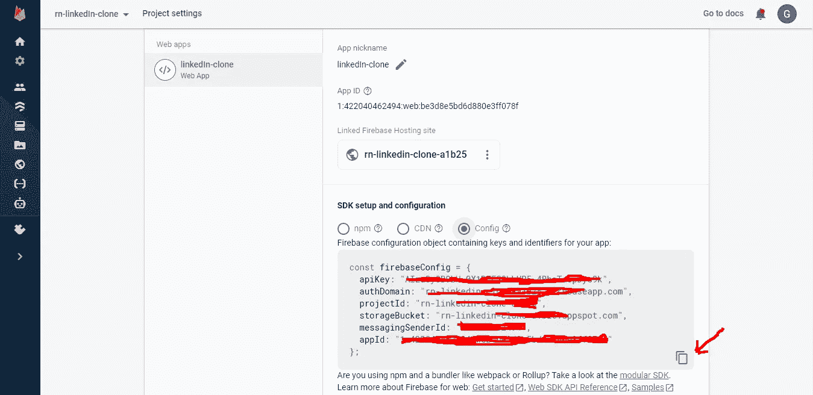

上图中显示的配置密钥必须复制到一个单独的文件中，该文件将在本项目稍后使用。

在这个项目的根目录下创建一个名为 **firebase.js** 的文件，在保存之前将下面的代码粘贴到其中。

如果你正确地遵循每件事，你是令人敬畏的。接下来我们将为 **CometChat** 做一些类似的事情。

# 设置 CometChat

如果您没有他们的帐户，请访问[come chat](https://app.cometchat.com/app/)并注册。接下来，登录，您将看到下面的屏幕。

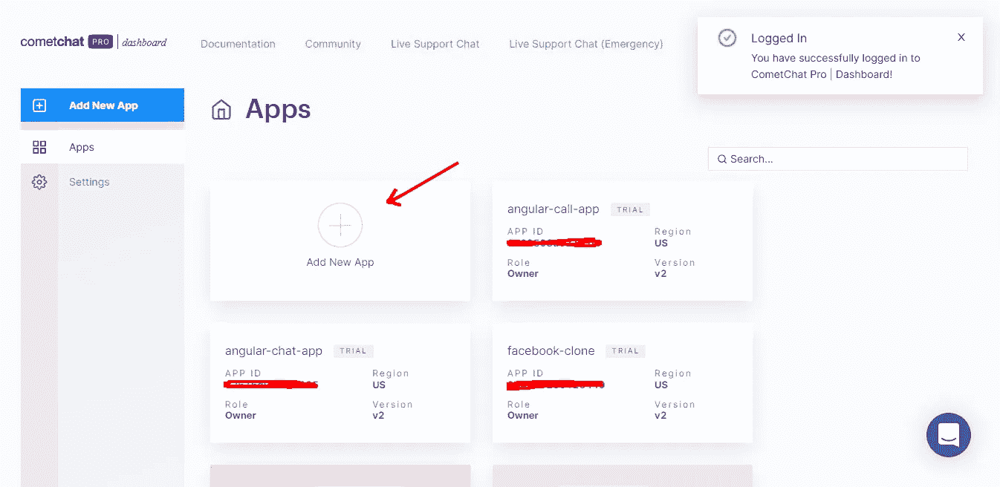

要创建新的应用程序，点击**添加新应用程序按钮**。您将看到一个模式，您可以在其中输入应用程序的详细信息。下图显示了一个示例。

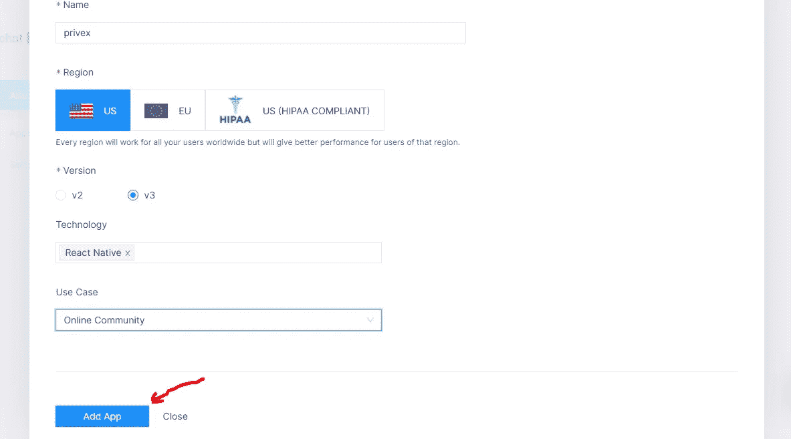

创建应用程序后，您将被定向到您的仪表板，看起来应该像这样。

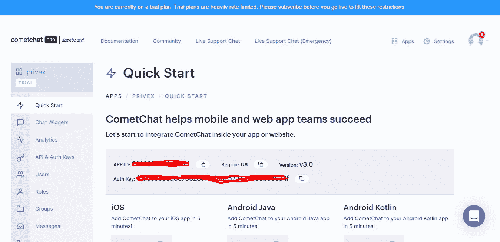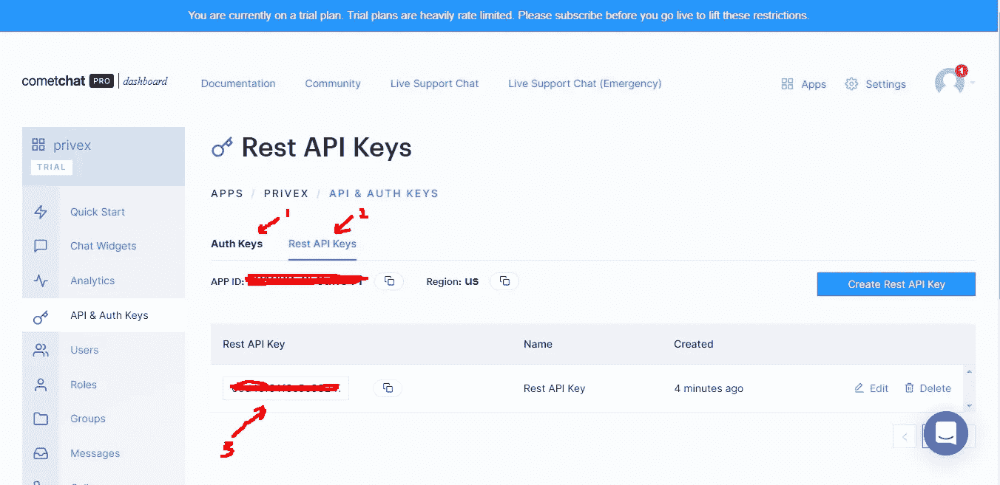

您还必须按照下述方式将这些密钥复制到一个单独的文件中。只需在项目的根目录下创建一个名为 **CONSTANTS.js** 的文件，并将下面的代码粘贴到其中。现在将这个文件包含在**中。gitIgnore** 文件，也位于这个项目的根目录下；这将确保它不会在网上发布。

```
*export* const CONSTANTS = {APP_ID: 'xxx-xxx-xxx',REGION: 'us',Auth_Key: 'xxx-xxx-xxx-xxx-xxx-xxx-xxx-xxx',}
```

最后，删除预加载的用户和组，如下图所示。

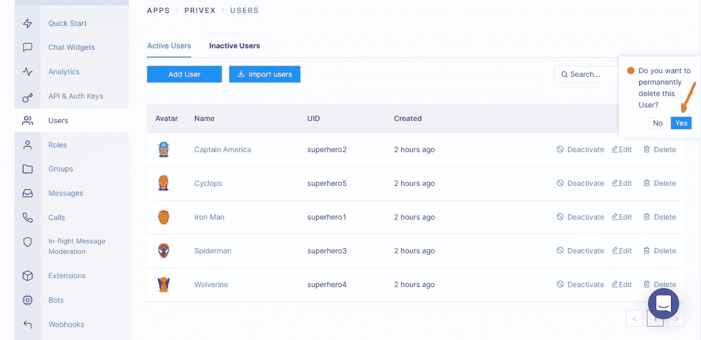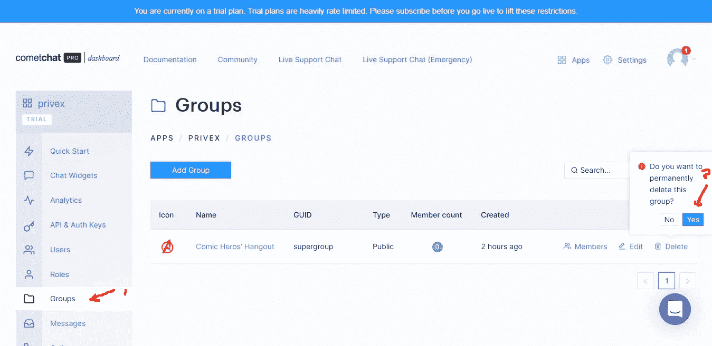

太棒了，这对于设置来说已经足够了，让我们开始将它们集成到我们的应用程序中，我们将从组件开始。

# 组件目录

该项目包含几个目录；让我们从组件文件夹开始。在这个项目的根目录下，创建一个名为 **components** 的文件夹。让我们从**标题**组件开始。

**表头组件**


这是一个支持我们的应用程序的美丽风格的组件。其中有一个头像元素，显示当前用户的个人资料图片。同样，使用这个头像，您可以从应用程序中注销。通过进入组件目录并创建一个名为 **HomeHeader.js** 的文件来创建这个文件，然后将下面的代码粘贴到其中。

**聊天容器组件**

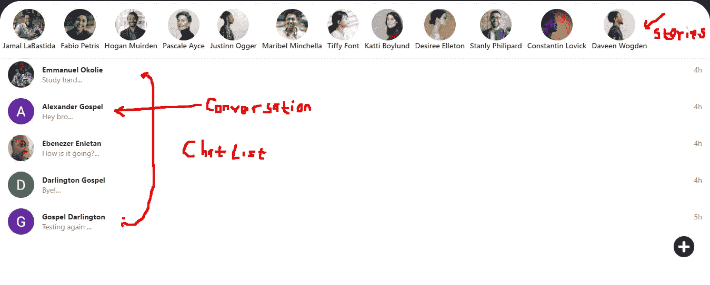

该组件负责展示用户最近的对话。它不仅如此，它还可以显示用户的故事和一个浮动按钮，用于显示所有在我们的应用程序中注册的用户。我们将分别研究它们，下面显示的是它们的代码。

**浮动按钮组件**

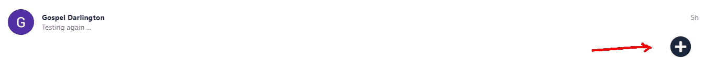

该组件负责启动**用户列表**模式，该模式允许我们与平台上的新用户聊天。下面是它的代码片段。

**用户列表组件**

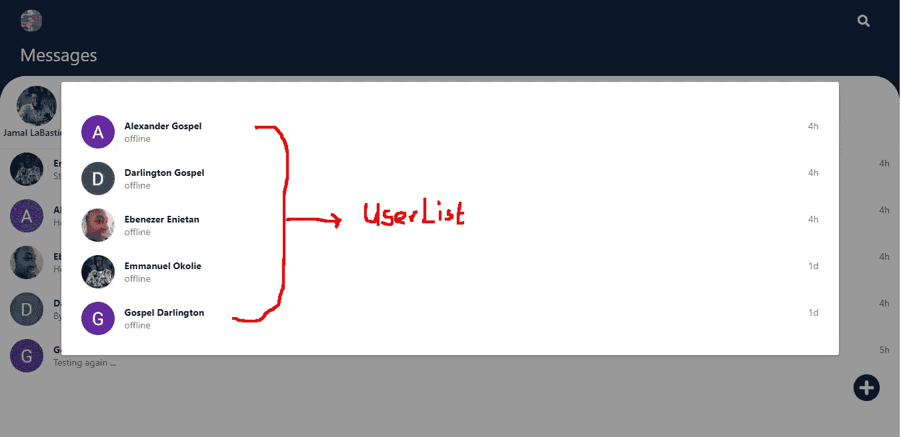

该组件由**浮动按钮**启动。它显示了我们平台上的所有用户，使您能够与他们进行首次对话。之后，他们会出现在你的对话列表中。下面是负责其实现的代码。

太棒了，我们刚刚完成了专用组件的构建，现在让我们开始制作屏幕。

# 屏幕目录

屏幕类似于网站页面；每个屏幕代表一个页面，您可以使用 **React Native** navigator 包从一个页面导航到下一个页面。让我们继续进入**登录屏幕**。

**登录屏幕**

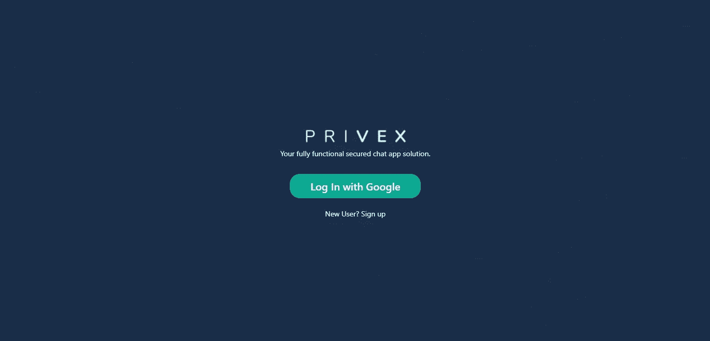

这个精心制作的屏幕在幕后做了很多事情。它使用 Firebase Google 身份验证让您登录系统。一旦您登录，Firebase **authStateChange** 函数会将您记为登录用户。这在 **AuthNavigation** 文件中执行。但是在你被允许进入系统之前，你的认证信息将会被检索并发送到 CometChat 进行注册或登录。一旦 **CometChat** 完成，你就可以进入系统了。完整的分解见下面的代码。

**主屏幕**

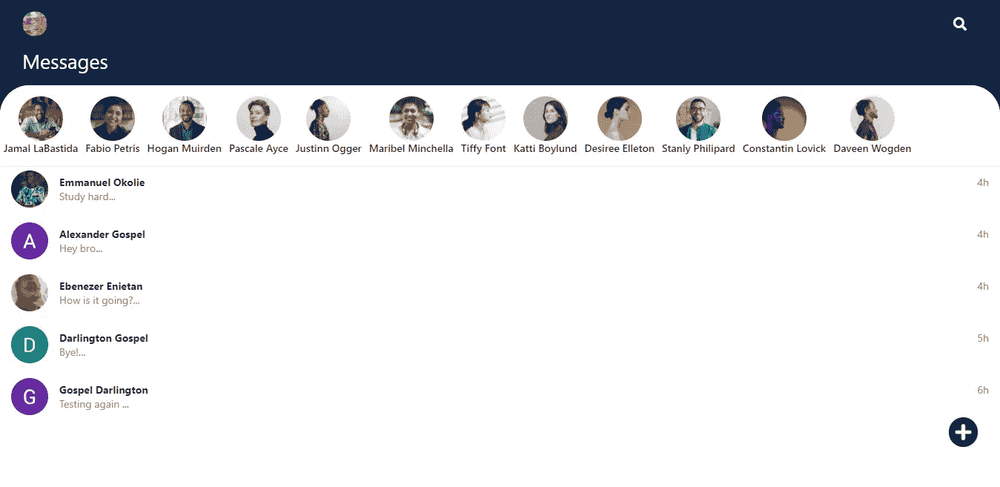

这个精心制作的屏幕将组件目录中的所有专用组件集中到一个空间中。每个组件都知道如何履行其职责。这里没有太多的话，让下面的代码做所有的解释。

```
*import* { SafeAreaView, StyleSheet } *from* 'react-native'*import* ChatContainer *from* '../components/ChatContainer'*import* FloatingButton *from* '../components/FloatingButton'*import* HomeHeader *from* '../components/HomeHeader'*import* UserList *from* '../components/UserList'const HomeScreen = ({ navigation }) => {*return* (<SafeAreaView *style*={styles.container}><HomeHeader /><ChatContainer *navigation*={navigation} /><FloatingButton /><UserList *navigation*={navigation} /></SafeAreaView>)}*export* *default* HomeScreenconst styles = StyleSheet.create({container: {flex: 1,backgroundColor: '#122643',},})
```

**聊天屏幕**

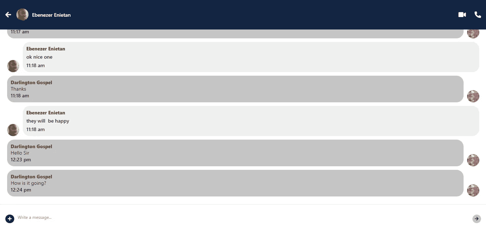

最后是屏幕，我们有聊天屏幕，让我们与另一个用户进行一对一的对话。它大量使用 **CometChat SDK** 进行操作，让我们来看看代码的功能。

有三个功能你应该注意，它们是这个屏幕的核心。**获取消息**、**发送消息**和**监听消息**功能。他们利用 **CometChat SDK** 并且每个人根据他们的名字执行他们的操作。

这是应用程序的最后一个屏幕，让我们用应用程序组件和路由器设置来密封它…

# 设置路由器

现在我们已经完成了项目的编码，让我们设置导航路由器和守卫。为此，请按照下面的说明创建并粘贴以下代码。

**导航文件**

这将屏幕分为两组:需要认证的屏幕和不需要认证的屏幕。

在项目的根目录下创建一个名为 **"navigation.js"** 的新文件，并将下面的代码粘贴到其中。

**授权导航文件**

该文件根据 firebase 身份验证服务的**身份验证状态**逻辑地向您显示屏幕。它还负责根据用户是注册还是登录到系统，将用户注册到 **CometChat** 。要继续，在项目的根目录下创建一个名为 **AuthNavigation.js** 的新文件，并将下面的代码粘贴到其中。

最后，应用程序组件…

**App 组件**

这个组件将这个项目的每个部分组合在一起。请用下面的代码替换该文件的内容。

```
*import* { CometChat } *from* '@cometchat-pro/react-native-chat'*import* { useEffect } *from* 'react'*import* AuthNavigation *from* './AuthNavigation'*import* { CONSTANTS } *from* './CONSTANTS'*export* *default* function App() {const initCometChat = () => {let appID = CONSTANTS.APP_IDlet region = CONSTANTS.REGIONlet appSetting = new CometChat.AppSettingsBuilder().subscribePresenceForAllUsers().setRegion(region).build()CometChat.init(appID, appSetting).then(() => console.log('Initialization completed successfully')).catch((error) => console.log('Initialization failed with error:', error))}useEffect(() => initCometChat(), [])*return* <AuthNavigation />}
```

干杯，你刚刚粉碎了这个应用程序，现在是时候用你学到的这个新技巧做更多的事情了。

如果您还没有这样做，您可以在您的终端上使用下面的代码启动您的服务器。

#在 web 视图上启动 React 本地服务器

```
yarn web
```

该应用程序应该像下图中的功能。

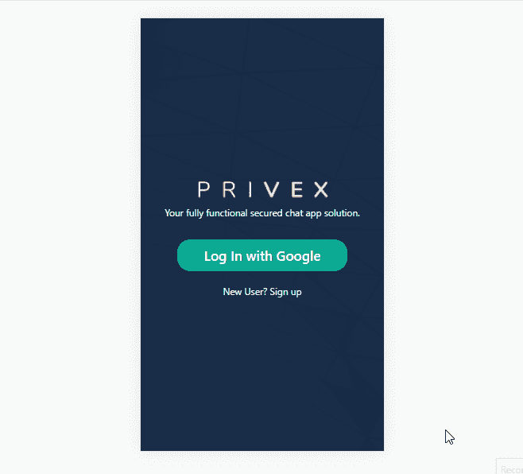

[立即在 Youtube 上观看我的免费 web3 教程](https://www.youtube.com/channel/UCQteXYZ5mC-cuTxplzM4Hlw?sub_confirmation=1)。

# 结论

我们已经到了本教程的结尾；希望你学到了新的东西。成为现代的开发人员可能很困难，但也不是不可能；你能完成的比你想象的更多；你需要的只是一点指导。现在你知道如何使用 React Native、Firebase 和 [CometChat](https://app.cometchat.com/) 来创建一个界面漂亮的聊天应用程序。我有更多这样的教程，将告诉你如何进行私人或公共的群聊。我很高兴看到你的伟大作品。

万事如意！

# 关于作者

福音书达林顿在 2016 年开始了他的软件工程师之旅。多年来，他在 React、React Native、Vue.js 等 JavaScript 堆栈方面的技能日臻成熟。

他目前是自由职业者，为客户开发应用程序，编写技术教程，教别人如何做他做的事情。

福音达林顿是开放的，可以听到你的声音。你可以通过 [LinkedIn](https://www.linkedin.com/in/darlington-gospel-aa626b125/) 、[脸书](https://www.facebook.com/darlington.gospel01)、 [Github](https://github.com/Daltonic) 或者他的[网站](https://daltonic.github.io/)联系到他。

*更多内容看* [***说白了。报名参加我们的***](http://plainenglish.io/) **[***免费周报***](http://newsletter.plainenglish.io/) *。在我们的* [***社区不和谐***](https://discord.gg/GtDtUAvyhW) *获得独家获取写作机会和建议。***