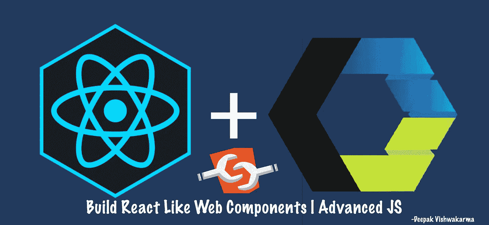
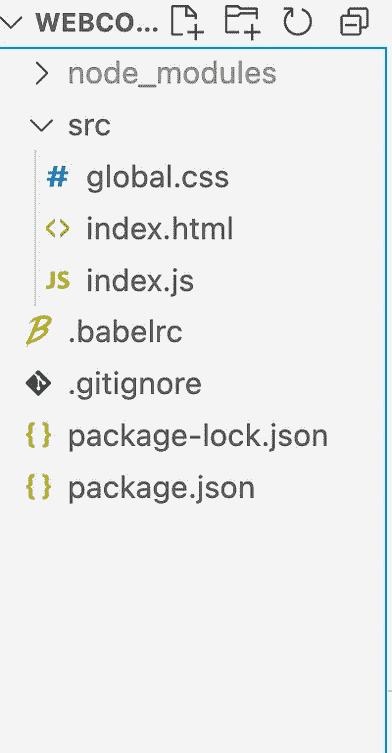
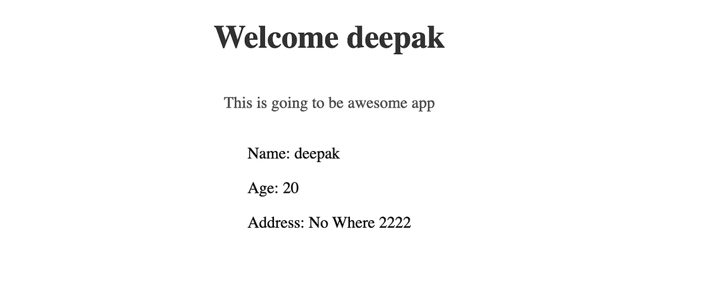

# 像普通 JavaScript 中的 Web 组件一样构建 React

> 原文：<https://javascript.plainenglish.io/build-react-like-web-components-in-plain-javascript-b9921dcf6df0?source=collection_archive---------5----------------------->

## 了解 JavaScript 的一些高级特性，创建自己的组件框架。



有许多库可用于创建 web 组件。然而，如果你想知道如何制作自己的组件框架。这篇文章将帮助你。

请注意，我正试图重新发明轮子。然而，学习一门语言的高级特性是有好处的。它将帮助你用那种语言有效地调试和工作。在本文中，我们将了解 JavaScript 的一些高级特性。

## **先决条件**

*   很好地理解 ES6 语法，如类、异步等待、代理
*   对 Web 组件、影子 DOM 有基本的了解

## 1.初始设置

我们将使用 ES6 和下一代 JavaScript 语法。我们需要一个代码转换器来转换代码以支持浏览器。我们还合并了多个文件，如 CSS、JS 和 HTML。一个好的捆扎机会非常有用。在这次演示中，我将使用带有巴别塔的包。你可以使用任何你想要的包。也可以从[**web-components-demo**](https://github.com/deepakshrma/webcomponent-demo/tree/start)repo 的 [**start**](https://github.com/deepakshrma/webcomponent-demo/tree/start) 分支下载代码，避免初始设置。



下载源代码后。尽管如此，您还是会看到文件。现在，您可以使用`npm start`命令在 [http://localhost:1234/](http://localhost:1234/) 启动 web 服务器。

```
// index.jsclass App extends HTMLElement {
  async connectedCallback() {
    this.attachShadow({ mode: "open" });
    const name = this.getAttribute("name") ?? "John Doe";
    this.shadowRoot.innerHTML = `
      <style>.title { text-align: center; } </style>
      <h1 class="title">Welcome ${name}</h1>
    `;
  }
}customElements.define("dv-app", App);
```

给定文件 **index.js** 包含单个 Web 组件 **App** 。每当**应用程序被**附加到 JavaScript 时， *connectedCallback* 就会被触发。它会在 *shadowRoot* **的 *innerHTML* 内编写 HTML 代码。** `this**.**getAttribute`在这里用来获取属性名的值。这些属性可以用作元素的道具。`customElements.define`用于注册一个 web 组件。现在，在 HTML 中使用`dv-app`就可以了。

```
//index.html<body>
  <**dv-app** name="deepak"></dv-app>
  <script type="module" src="index.js"></script>
</body>
```

## 2.创建一个可重用的组件类

如果你已经注意到在给定的**应用**组件中，多个可重用的行可以很容易地提取到一个单独的类中。让我们创建一个可重用的**组件**类。

```
// index.js
class Component extends HTMLElement {
  constructor() {
    super();
    this.attachShadow({ mode: "open" });
  }
  async connectedCallback() {
    // This will trigger
    this.#render();
  }
  async #render() {
    let view = await this.render();
    this.shadowRoot.innerHTML = view;
  }
  async render() {
    console.warn("Render method is not implemented");
    return "";
  }
}
```

现在我们可以更新 **App** 组件来使用**组件**。

```
class App extends Component {
  async render() {
    const name = this.getAttribute("name") ?? "John Doe";
    return `
    <style>.title { text-align: center; } </style>
    <h1 class="title">Welcome ${name}</h1>
  `;
  }
}
```

在给定的代码中，我将 **render** 和 **connectedCallback** 定义为异步方法。稍后，这对于支持**异步等待**调用非常有用。

**说明:**在上面给出的代码中，组件一打开就写 HTML。我们正在调用 **render** 方法并将字符串附加到 shadow DOM。如果您仍然在监视模式下运行服务器，您将看不到 UI 的任何变化。

## **3。向组件添加样式**

Web 组件应该是独立的。这意味着所有与组件相关的属性都应该写在组件本身中。这也包括 CSS 样式。
我们将创建一个基于主题的组件。我们将使用 CSS 变量来实现这一点。
让我们在 **global.css:** 中添加几个变量

```
/* global.css */:root {
  --dv-text-color: #333;
  --dv-text-color-slate: #4e4e4e;
}
```

为了支持来自组件的样式，让我们修改组件类。

```
class Component extends HTMLElement {
  **static styles = undefined;** // Define Optional, Just for reference

  //constructor() {
  //...async #render() {
    let view = await this.render();
    if (typeof this.constructor.styles !== "undefined") {
      **const style = [].concat(this.constructor.styles).join("\n");**
      view = `
        **<style>${style}</style>**
        ${view}
      `;
    }
    this.shadowRoot.innerHTML = view;
  }
  //...
}
```

我们来更新一下 **App** 代码。这个**渲染**的方法会干净很多。

```
class App extends Component {
  static styles = `
  **.title** { 
    text-align: center; 
    color: var(--dv-text-color); 
  } 
  **p** { 
    text-align: center;  
    color: var(--dv-text-color-slate)
  };
  `; async render() {
    const name = this.getAttribute("name") ?? "John Doe";
    return `
    <h1 **class="title"**>Welcome ${name}</h1>
    **<p>**This is going to be awesome app**</p>**
  `;
  }
}
```

## 4.组件的道具

React 提供了一种通过 props 将数据从*父组件传递到*子组件的好方法。在我们的组件中，我们将使用属性作为道具。虽然，不建议这么做。由于我们的应用程序不是很大，我们现在可以使用它。

使用属性作为道具有一个缺点。只有凝视可以作为 HTML 中的一个属性。所以我们需要自己对数据进行消毒和反序列化。

```
class Component extends HTMLElement {
   // ... **get props() {
    let props = {};
    for (let name of this.getAttributeNames()) {
      props[name] = this.getAttribute(name);
    }
    return props;
  }** async connectedCallback() {
    this.#render();
  }
  // ...
}
```

现在可以获得所有属性道具作为 **getter 属性**。现在，每当 render 方法被触发时，它将重新执行 props 计算并返回属性值。我们可以考虑以后使用缓存来优化它。为了演示，我们需要创建一个子组件。让我们创建一个**用户组件**。

```
class UserComponent extends Component {
  render() {
    **if (!this.props.user) return "";
    const { name, age, address } = JSON.parse(this.props.user) ?? {};**
    return `
      <div>
        <p>Name: ${name}</p>
        <p>Age: ${age}</p>
        <p>Address: ${address.street} ${address.pin}</p>
      </div>
    `;
  }
}
customElements.define("dv-user", UserComponent);
```

现在让我们更新应用程序来使用它。

```
class App extends Component {
  //..

  async render() {
    const name = this.getAttribute("name") ?? "John Doe";
    const user = {
      name: "deepak",
      age: 20,
      address: {
        street: "No Where",
        pin: 2222,
      },
    };return `
    <div>
      <h1 class="title">Welcome ${name}</h1>
      <p>This is going to be awesome app</p>
      **<dv-user user='${JSON.stringify(user)}'></dv-user>**
    </div>
  `;
  }
}
```

*如果你注意到了，我们正在使用* ***单引号(')*** *来编写 HTML。这只是为了避免解析问题。这是因为****JSON . stringify****使用* ***双引号(")*** *对字符串值进行序列化。*



## 5.添加用户交互

我们已经有了一个基本的工作组件结构。然而，仍然缺少一些东西。如果您想与组件交互，您将永远不知道 render 何时被调用。所以我们需要某种钩子。React 提供了 **componentDidMount** 钩子，你可以在那里编写你的事件监听器。我们需要在我们的**基础组件**中模仿这种行为。

```
class Component extends HTMLElement {
  //..
  **async onMount() {}** async connectedCallback() {
    this.#render();
  }
  async #render() {
    //..
    this.shadowRoot.innerHTML = view;
    // Run after render HTML
    **this.onMount();**
  }

}class App extends Component {
  //..
  **async onMount() {
    this.shadowRoot
      .querySelector("#btn")
      .addEventListener("click", 
        () => console.log("User has pressed btn")
      );
  }**
  async render() {
    const name = this.getAttribute("name") ?? "John Doe";
    return `
    <div>
      <h1 class="title">Welcome ${name}</h1>
      <p>This is going to be awesome app</p>
      **<button id="btn">Fetch User</button>**
      <dv-user name='deepak' age='20' address='${JSON.stringify({
        street: "No Where",
        pin: 2222,
      })}'></dv-user>
    </div>
  `;
  }
}
```

每次渲染后都会触发 **onMount** 钩子。这将确保你将总是在**挂载**钩子中得到附加的元素。
*既然我们一次又一次地重写****innerHTML****，那么在这种情况下我们就不需要****component will unmount****了。*

## 6.本地状态更新。

在用户交互时，您可能希望从网络上获取一些数据，并再次重新呈现组件。React 在每次状态更新时渲染。这可以通过使用 React 应用程序中的**设置状态**或**使用状态**钩子来实现。我们将使用 JavaScript 代理。我们将使用一个代理来创建一个可观察的**状态**对象。每当**状态**对象有更新时。它将在内部重新触发 render 方法。

首先，更新**组件**，在其中创建一个**代理状态**。

```
class Component extends HTMLElement {
  static styles = undefined;
  // Private local state
  **#state = {};** constructor() {
    super();
    this.attachShadow({ mode: "open" });
    **this.#bindState();**
  }
  #bindState() {
    const that = this;
    const handler = {
      get(target, prop) {
        return target[prop];
      },
      set(target, prop, value) {
        target[prop] = value;
        that.#render({ ...target });
        return target;
      },
    };
    **this.state = new Proxy(this.#state, handler);**
  }//...  
}
```

让我们稍微调整一下**应用**。

```
// Mock API
const fetchUser = () => {
  return new Promise((r) => {
    setTimeout(
      () =>
        r({
          name: "deepak",
          age: 20,
          address: {
            street: "No Where",
            pin: 2222,
          },
        }),
      2000
    );
  });
};class App extends Component {

  async onMount() {
    this.shadowRoot.querySelector("#btn").addEventListener("click", () => {
      **fetchUser().then((user) => {
        this.state.user = user;
      });**
    });
  }
  async render() {
    **const user = this.state.user ? JSON.stringify(this.state.user) : "";**
    return `
    <div>
      <h1 class="title">Welcome</h1>
      <p>This is going to be awesome app</p>
      <button id="btn">Fetch User</button>
      **<dv-user user='${user}'></dv-user>**
    </div>
  `;
  }
}
```


## 结论

我希望你从这篇文章中学到了很多。最好是先学习概念，然后在实际应用中应用。一旦你理解了这个概念，你就可以开始玩了。您可以定制和优化上述概念，以满足您的需求。然而，在你的框架中写点东西总是很有趣的。

*注意，为了演示高级特性，比如获取和更新网络调用的状态，我创建了一个工作示例。完整的代码总是可以在我的 GitHub repo*[*web-component-demo/m*ain](https://github.com/deepakshrma/webcomponent-demo)*中找到。
你也可以在*[*code sandbox*](https://codesandbox.io/s/react-like-web-components-2o43qw)*寻找运行代码。*

## 参考资料:

*   **ES6 教程:**[https://www.javascripttutorial.net/es6/](https://www.javascripttutorial.net/es6/)
*   **网页组件:**https://www.webcomponents.org/introduction

*更多内容请看*[***plain English . io***](https://plainenglish.io/)*。报名参加我们的* [***免费周报***](http://newsletter.plainenglish.io/) *。关注我们关于*[***Twitter***](https://twitter.com/inPlainEngHQ)*和*[***LinkedIn***](https://www.linkedin.com/company/inplainenglish/)*。查看我们的* [***社区不和谐***](https://discord.gg/GtDtUAvyhW) *加入我们的* [***人才集体***](https://inplainenglish.pallet.com/talent/welcome) *。*