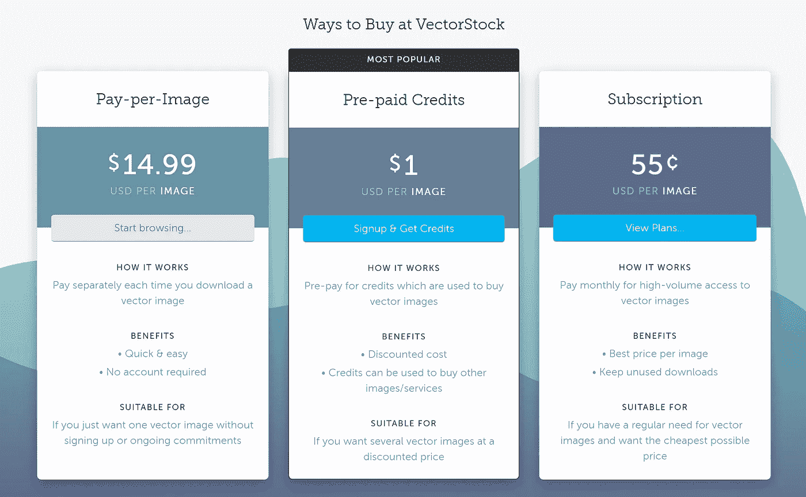

# 在别人之前建造这个 SaaS——人工智能矢量艺术

> 原文：<https://javascript.plainenglish.io/build-this-saas-before-someone-else-does-c4d7f7607270?source=collection_archive---------3----------------------->

## 用这个想法来建造你的下一个 SaaS

Photo by [Riccardo Annandale](https://unsplash.com/@pavement_special?utm_source=medium&utm_medium=referral) on [Unsplash](https://unsplash.com?utm_source=medium&utm_medium=referral)

你想建立并推出自己的软件公司吗？要做到这一点，你需要的只是一个解决问题的产品。

想出有利可图的点子并不容易。但你很幸运，因为你有我！

我免费给你出主意。你需要做的就是正确地执行它。

如果你准备好了，让我们马上开始吧！从问题开始。

# 问题

矢量插图很贵。当然，你可以免费获得一些插图。但是它们通常被过度使用，而且看起来不好看。

如果你想要更好看的矢量艺术，你必须付费。而且要付出很多。

原因是创造艺术需要设计师，而设计师为他们的画收取高额费用。

最终结果是好看的插图要花很多钱。

# 解决办法

这个问题可以通过使用 AI 生成插图来轻松解决。

人工智能图像走过了漫长的道路，变得更加容易理解，甚至对完全不理解人工智能的人来说也是如此。

你可以使用像 [Dall-E](https://openai.com/dall-e-2/) 或 [Stability AI](https://stability.ai/) 这样的工具在几秒钟内生成好看的图像。

人们正在迅速采用这些工具，并使用它们来为他们的博客帖子或社交媒体帖子生成图像。

这正是我们要做的。

我们可以使用 AI 在透明背景上生成插图类型的图像。这些图像可以重复使用，以创建进一步的图形设计。

可以肯定地说，顾客会为此付费，因为他们已经在矢量艺术上花钱了。

只要看看我找到的带矢量插图的第一页的定价就知道了。

Vectorstock Pricing

现在我们知道这个想法是可行的，让我们看看我们如何建立它。

*如果你还是不喜欢这个想法，就看看* [*StockAI*](https://www.stockai.com/) *或*[*AvatarAI*](https://avatarai.me/)*。这些产品在功能上很相似，而且都非常成功。*

# 履行

我们发现了问题，也有了解决方案。剩下要做的就是看看怎么做了。

我们一步步消化吧。

## 创建矢量艺术的模型

最重要的部分是训练一个可以为我们生成矢量艺术的模型。对于这一部分，我们必须使用 [Dreambooth](https://dreambooth.github.io/) 。

Dreambooth 是一种文本到图像的模型。你用自己的话描述形象，它会为你生成一个形象。

这个人工智能模型最好的部分是你可以个性化它。你可以用在互联网上找到的矢量插图来训练模型，它会在绘制图像时模仿设计。

*如何微调 Dreambooth 不在本文讨论范围之内，但是你可以在这里***了解更多信息。**

## *移除背景*

*所有生成的图像都将绘制在白色背景上。所以为了做出合适的矢量插图，我们需要把它去掉。*

*我们不必在这里重新发明轮子。已经有一些工具公开了一个 API 来完成这项工作:*

*   *[移除人工智能](https://removal.ai/api-documentation/)*
*   *[移除血糖](https://www.remove.bg/api)*

*我们只需要获取模型生成的图像，并使用背景去除 API 对其进行处理。*

*最终结果将是 PNG 格式的透明背景上的插图。*

## *网络界面*

*现在我们有了图像，我们只需要一个界面。web 界面应该非常类似于 [StockAI](https://www.stockai.com/) 。唯一的区别是，我们只显示矢量插图。*

**

*Stock AI landing page*

*该网站需要做到以下几点:*

*   *显示图像集合*
*   *如果在数据库中找不到，则生成新图像*
*   *让用户订阅产品*

*该网站应该是搜索引擎优化优化。出于这个原因，我接下来会选择[。在任何一天。然后我会将它与 Stripe 集成在一起来处理所有的支付和订阅。](https://nextjs.org/)*

**您可以* [*使用我的模板*](https://codewithbernard.gumroad.com/l/next-js-saas-starter) *引导一个预先配置了条带订阅管理的 NextJS 模板。**

## *货币铸造*

*有很多方法可以让这个网站赚钱。但是作为参考，我们来看看 StockAI 的定价模型。*

**

*他们免费提供服务(有限制)。您也可以订阅并获得更多访问权限。你也可以每年支付 599 美元来拥有你生成的图片。*

*这是一个非常灵活的定价模式，我相信它对矢量艺术同样适用。*

*另一种可能的方法是按生成的图像收费。我认为两者都可以。*

## *简单地说，这就是我们的想法*

*未来可以通过围绕一个特定的主题产生一整套矢量艺术来改进它。*

*但是对于 MVP 来说，一个可搜索的图像数据库绝对足够了。*

# *遗言*

*我们随处可见插图，尤其是在现代网站上。*

*他们给网站一个更好的外观，他们让用户在网站上滚动。*

*如果我们能创建一个强大的高质量矢量艺术数据库，用户会发疯的。*

*我刚刚打破的想法正是如此。它使用户可以通过键入文本轻松创建自己的矢量插图。最重要的是，它展示了过去已经生成的矢量插图。*

*剩下唯一要做的就是接受这个想法，并执行它！*

***在我的指导下启动你的下一次创业——**[**加入我的简讯**](https://founderstools.substack.com/) **！***

**更多内容看* [***说白了。报名参加我们的***](https://plainenglish.io/) **[***免费周报***](http://newsletter.plainenglish.io/) *。关注我们上*[***Twitter***](https://twitter.com/inPlainEngHQ)，[***LinkedIn***](https://www.linkedin.com/company/inplainenglish/)***，***[***YouTube***](https://www.youtube.com/channel/UCtipWUghju290NWcn8jhyAw)***，*** *和 [***不和***](https://discord.gg/GtDtUAvyhW)*** *对成长黑客感兴趣？检查出* [***电路***](https://circuit.ooo/) ***。****