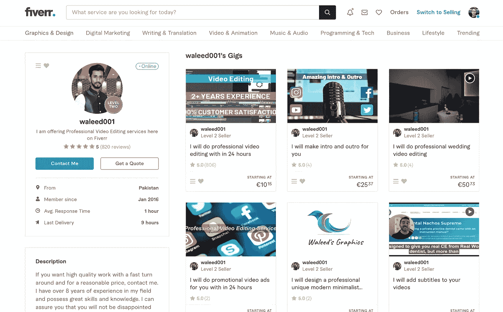
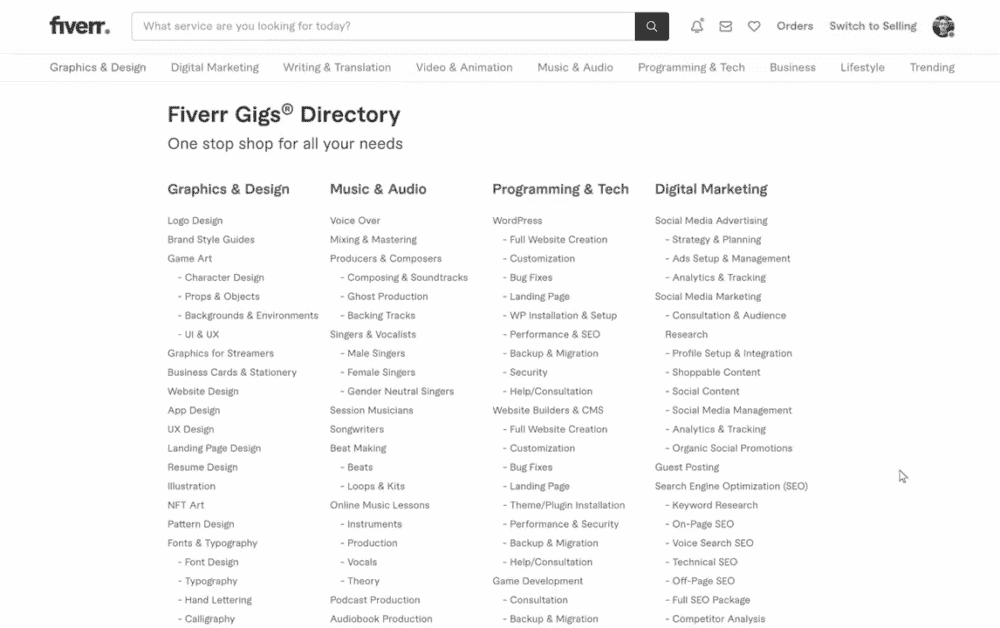
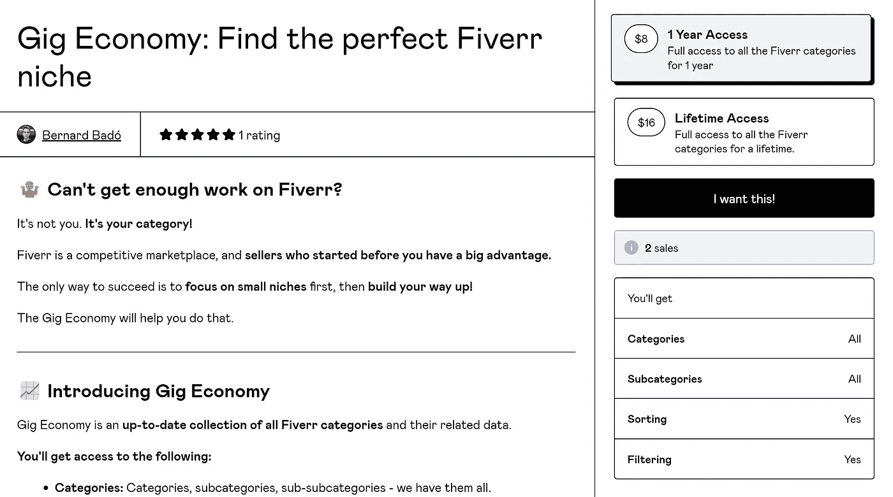
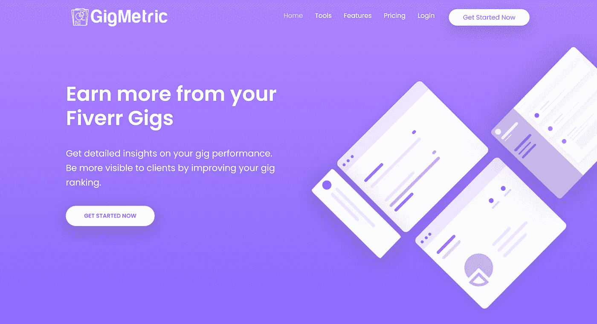

# 在别人之前建造这个 SaaS——五个监控

> 原文：<https://javascript.plainenglish.io/build-this-saas-before-someone-else-does-fiverr-monitoring-8ad41ca880a3?source=collection_archive---------3----------------------->

## 用这个想法来建造你的下一个 SaaS

Photo by [Linoleum Creative Collective](https://unsplash.com/@linoleum?utm_source=medium&utm_medium=referral) on [Unsplash](https://unsplash.com?utm_source=medium&utm_medium=referral)

你想建立下一个独角兽创业公司，赚几十亿美元吗？

那你可能来错地方了！我没有什么十亿美元的想法。

我有一个简单的想法，可以很容易地由一个编码器完成，并有可能使你每月数千美元。

如果你准备好了，让我们听听。

# SaaS 的想法:五个监测

想象一下，作为一个 Fiverr 卖家，你可以在一个仪表板上看到所有可用的 Fiverr gigs 类别。您可以:

*   *搜索并过滤所有类别&子类别。*
*   *查看每个类别的演出总数。*
*   *查看每个类别的评论数量。*
*   查看类别如何随时间变化。
*   *每个类别的 SERPs。*

这正是我们的产品要做的。

## 这个产品能解决问题吗？

当然，我刚刚列出的特性听起来不错，但是它们能解决实际问题吗？有人会拿出钱包来付钱吗？

让我们试着想想。

作为一个五元卖家，你试图最大化你的工作，带来尽可能多的客户。

卖家通过在他们主要类别的多个利基市场创造机会来做到这一点。

Fiver gigs of the user waleed001

这是一个有效的策略，但研究新的类别并为竞争分析它们并不是一件容易的事情。

目前，在 Fiverr 上有 600 多个类别。

一个一个地检查，我不想让我最大的敌人也这样。

Fiverr Gigs Directory

这正是我们产品的切入点。

我们按月收费，作为交换，我们的用户可以访问 Fiverr gigs 的目录，他们可以很容易地浏览。

# 会有人买单吗？

一个解决问题的产品创意是一回事，但让人们为之买单是完全不同的层面。

这个问题大到人们愿意为此买单吗？这是我们在开始打造产品之前需要回答的问题。

我试图不用写一行代码来验证这个想法，这正是我所做的。

我收集了所有五个类别的数据，并将其放入一个概念表中。

我把它列在了 Gumroad 上，在 Reddit 和 Twitter 上分享了它的链接，然后等了几天。

如你所见，我收到了 2 笔销售，这意味着人们实际上对此感兴趣。

[Gig Economy on Gumroad](https://codewithbernard.gumroad.com/l/gig-economy)

另外，我在网上搜索了一下，发现有一个竞争对手也在做类似的事情。

GigMetric landing page

有竞争对手不一定是坏事。这意味着我们的产品理念是有效的。最重要的是，GigMetric 没有获得很多流量，这意味着我们可以轻松地与他们竞争。

# 如何构建它

既然我们知道对这种产品有需求，那就让我们看看如何制造它。

## 正在获取 Fiverr 数据

不幸的是，Fiverr 没有提供一个我们可以用来轻松获取这些数据的 API。

这意味着我们必须刮它。

你可以自己制作刮刀，也可以付费购买像 [ScrapingBee](https://www.scrapingbee.com/) 或[scrapdo](https://scrape.do/)这样的服务，它们会帮你刮。

如果你决定自己构建它，我建议使用 Javascript 的[木偶师](https://github.com/puppeteer/puppeteer)或者 Python 的 [Scrapy](https://scrapy.org/) 。

一旦我们有了数据，我们希望通过网站向用户展示。

## 构建仪表板

仪表板将向用户显示我之前提到的所有数据。

构建这样的仪表板并不复杂。我们所要做的就是把收集到的数据显示给用户。

你可以用任何你喜欢的 web 框架来构建它。

如果我必须选择，我选择 [React](https://reactjs.org/) 和 [NextJS](https://nextjs.org/) ，因为我最熟悉这两种技术。

我还会使用[我的 SaaS 启动器](https://codewithbernard.gumroad.com/l/next-js-saas-starter?layout=profile)来引导应用程序，并设置 [Stripe](https://stripe.com/) 来处理支付和订阅。

一旦构建了仪表板，收集了数据，您就准备好进入市场并开始为产品做广告了。

# 最后的话

兼职制作 SaaS 产品很有趣，这是学习新技能的好方法。但最重要的是，这是赚取额外收入的好方法。

你不需要建立一个新的脸书或谷歌来获得成功。

你所要做的就是建立一个解决特定问题的微型创业公司。然后把它推销给它的用户，每个月赚几千美元。

***准备好了吗？用我的*** [***SaaS 首发模板***](https://codewithbernard.gumroad.com/l/next-js-saas-starter) ***又省时省力。***

*更多内容请看*[***plain English . io***](https://plainenglish.io/)*。报名参加我们的* [***免费周报***](http://newsletter.plainenglish.io/) *。关注我们上*[***Twitter***](https://twitter.com/inPlainEngHQ)[***LinkedIn***](https://www.linkedin.com/company/inplainenglish/)*[***YouTube***](https://www.youtube.com/channel/UCtipWUghju290NWcn8jhyAw)**和* [***不和***](https://discord.gg/GtDtUAvyhW) *对成长黑客感兴趣？检查* [***电路***](https://circuit.ooo/) ***。*****