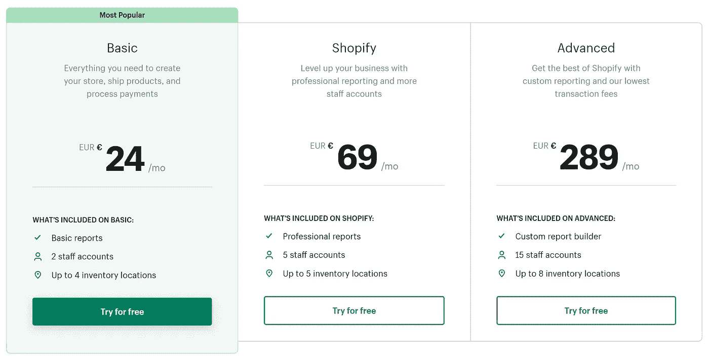
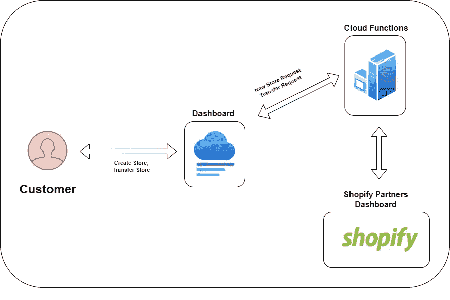

# 在别人之前建造这个 SaaS——无限购物试用版

> 原文：<https://javascript.plainenglish.io/build-this-saas-before-someone-else-does-unlimited-shopify-trial-b5f3f2bc7eb2?source=collection_archive---------9----------------------->

## 用这个想法来建造你的下一个 SaaS

Photo by [Japheth Mast](https://unsplash.com/@japhethmast?utm_source=medium&utm_medium=referral) on [Unsplash](https://unsplash.com?utm_source=medium&utm_medium=referral)

你想建立并启动你自己的软件公司吗？要做到这一点，您需要的只是一款能够解决问题的产品。

提出有利可图的想法并不那么容易。但你很幸运，因为你得到了我！

我会免费给你这个主意。您需要做的就是正确地执行它。

如果你准备好了，我们就开始吧！从问题开始。

# 问题

[shootify 提供 14 天的免费试用](https://www.shopify.com/)。但当这 14 天结束时，您需要掏钱。

新用户首先想熟悉界面。玩转设计，尝试各种应用集成。

要做到这一切，14 天根本不够。

# 解决办法

这个问题可以很容易地通过一个无限的 Shopify 试用版来解决。

常规用户无法使用此功能。但是它可以被拥有[shoppiy partners 账户](https://www.shopify.com/partners)的开发者使用。

> 向世界各地的 shootify 商家提供您的专业知识，或向企业家介绍 shootify。(来源:[shotify](https://www.shopify.com/partners))

如果您是合作伙伴，您可以创建任意数量的商店，并且在开始销售产品之前无需支付一分钱。

这个概念相当简单，许多新加入 Shopify 的人会喜欢这个工具。如果你不相信我，就看看这个[红迪帖子](https://www.reddit.com/r/shopify/comments/x5ridd/i_dont_want_to_start_selling_right_away/)。

现在，有趣的是，让我们看看如何构建它。

# 履行

我们发现了问题，并且有了解决方案。剩下要做的就是看看怎么做。

## 新商店请求

第一步是为用户提供注册界面。

用户将填写基本信息:

*   名字
*   国家
*   商店名称

## 创建商店

下一步是获取信息，并使用我们的合作伙伴帐户创建一个商店。

不幸的是，Shopify 没有为此提供 API，所以我们只有两个选择:

*   手动创建存储
*   创建一个机器人，它将为我们创建一个商店

要创建这样一个机器人，您可以使用 JavaScript 的[木偶师](https://github.com/puppeteer/puppeteer)或者 Python 的[硒](https://www.selenium.dev/)。

商店创建后，我们会通过电子邮件将凭据发送给用户，以便他们可以开始摆弄他们的商店。

在这一点上，用户有一个无限制的免费试用，他们可以与他们的商店互动，就像他们与 14 天免费试用一样。

## 转移商店

当用户完成他们的商店，并希望开始销售时，我们需要将商店的所有权从我们的合作伙伴帐户转移到实际用户。

在这一点上，商店变得活跃，用户需要支付 Shopify 订阅才能运行它。

## 货币铸造

精彩的部分来了！

因为他们使用了我们的合作伙伴账户，所以我们获得了相当于商家每月订购金额的 **20%的佣金。**

Shopify pricing breakdown

这使得我们可以免费使用这款 SaaS，同时还能获得丰厚的利润。

让我来给你分析一下这些数字:

*   1 家店= 6 美元 MRR
*   10 家店= 60 美元 MRR
*   100 家商店= 600 美元 MRR
*   1000 家商店= 6000 美元 MRR

用什么技术造的不重要。但是给你我的意见，我会选择 [Next.js](https://nextjs.org/) 并将其与 [Firebase 可调用函数](https://firebase.google.com/docs/functions/callable)集成。

Next.js 几乎是在 React 中构建前端应用程序的标准。最重要的是，我可以使用 Firebase 函数来完成自动化任务，比如商店创建或转换。

Application diagram

## 简单地说，这就是我们的想法

它可以通过为付费用户增加额外的功能来改善。但我相信，如果有人想要无限的免费试用，他们不会很热衷于为产品付费。

# 遗言

Shopify 的无限免费试用很容易实现。但不是每个人都知道这一点。

即使有，也不知道如何利用它来赚钱。

我刚刚打破的想法正是如此。它让用户很容易创建自己的商店，并拥有无限的免费试用。最重要的是，你可以通过提供这项服务来赚钱。

剩下唯一要做的就是接受这个想法，并执行它！

**在我的指导下启动你的下一次创业——**[**加入我的简讯**](https://founderstools.substack.com/) **！**

*更多内容请看*[***plain English . io***](https://plainenglish.io/)*。报名参加我们的* [***免费周报***](http://newsletter.plainenglish.io/) *。关注我们关于*[***Twitter***](https://twitter.com/inPlainEngHQ)[***LinkedIn***](https://www.linkedin.com/company/inplainenglish/)*[***YouTube***](https://www.youtube.com/channel/UCtipWUghju290NWcn8jhyAw)*[***不和***](https://discord.gg/GtDtUAvyhW) *。对增长黑客感兴趣？检查* [***电路***](https://circuit.ooo/) *。***