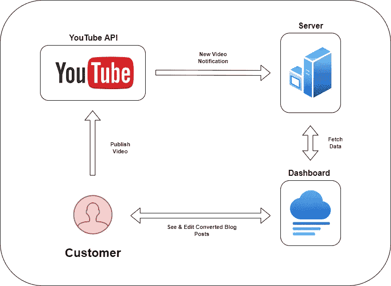

# 在别人之前建立这个 SaaS——将 YouTube 放入博客帖子

> 原文：<https://javascript.plainenglish.io/build-this-saas-before-someone-else-does-youtube-into-blog-post-e74217f4df62?source=collection_archive---------0----------------------->

## 用这个想法来建造你的下一个 SaaS

Captured by [Mikhail Nilov](https://www.pexels.com/sk-sk/photo/ceruzka-cierne-saty-stastny-drzanie-7594319/)

你想建立并推出自己的软件公司吗？要做到这一点，你需要的只是一个解决问题的产品。

想出有利可图的点子并不容易。但你很幸运，因为你有我！

我免费给你出主意。你需要做的就是正确地执行它。

如果你准备好了，让我们马上开始吧！从问题开始。

# 问题

Youtube 上有大量的内容创作者。每天，他们都想出新的点子来娱乐我们或与我们分享有价值的信息。

他们花了极大的精力来创作视频内容。他们一点也不知道，他们的许多辛勤工作没有得到利用。他们限制了他们的影响力，也限制了他们的收入潜力。

# 解决办法

这个问题可以通过[内容再利用](https://en.wikipedia.org/wiki/Repurposing)轻松解决。

一个视频可以变成多个 TikToks。一集播客可以变成一系列 YouTube 视频。

或者在我们的例子中，一个**视频可以变成一篇博文。**

通过将视频转化为博客帖子，YouTube 可以创建常青树 SEO 内容，获得新观众的关注，但最重要的是，接触到不太喜欢观看 YouTube 视频的观众。

这个概念相当简单，很多 YouTube 创作者会为这个工具而疯狂。

现在，有趣的部分，让我们看看我们如何能建立它。

# 履行

我们发现了问题，也有了解决方案。剩下要做的就是看看怎么做了。

## 收听新的视频上传

第一步是当我们的同事 Youtuber 上传一个新的视频时，请听。我们希望一切都自动发生，不需要用户采取任何行动。

这一步可以通过使用 [Youtube Webhooks](https://developers.google.com/youtube/v3/guides/push_notifications) 轻松完成。我们的服务器将监听由 Youtube Webhook 触发的通知。

当新视频发布时，我们创建一个新的作业来处理转换。

## 将视频转换为博客文章

下一步是拍摄一段视频，并将其转换成书面形式，在我们的例子中，就是一篇博客文章。

为了进行转换，我们需要从视频中提取音频通道(可以通过在服务器上使用 [FFmpeg](https://ffmpeg.org/) 来实现)。

一旦我们有了音频通道，我们就可以通过语音到文本转换服务来运行它。

有很多服务可以轻松做到这一点。举几个例子:

*   [谷歌语音转文本](https://cloud.google.com/speech-to-text)
*   [亚马逊转录](https://aws.amazon.com/transcribe/)
*   [深度程序](https://deepgram.com/)

就我个人而言，我会选择 Deepgram，因为它的价格和易于集成。

一旦转换完成，我们就只剩下需要格式化、检查错误和校对的博文了。

当所有这些都完成后，一篇新的博客文章将出现在我们的 web 应用程序的仪表板中。

## 正在整理博客文章

当转换完成后，用户需要检查他们的博客文章，看看是否一切正常，并做一些最后的编辑。

所有这些都将发生在我们的应用仪表板中。它可以是仪表板式的应用程序，用户可以:

*   *连接他们的 Youtube 频道*
*   *看看他们以后转换了什么视频*
*   *查看正在进行的转换*
*   *编辑和格式化转换后的博客文章*

正如您所猜测的，这是一个基于 web 的应用程序。

Application diagram

用什么技术造的不重要。但是给你我的意见，我会选择 [Next.js](https://nextjs.org/) 。

Next.js 几乎是在 React 中构建前端应用程序的标准。最重要的是，我可以使用 [Vercel 无服务器函数](https://vercel.com/docs/concepts/functions/serverless-functions)来完成转换工作。

这将允许我免费托管整个应用程序，并最小化我的服务器成本。

## 更进一步

信不信由你，简而言之，这就是 SaaS 的想法。当然，它可以在未来通过集成像 [WordPress](https://wordpress.com/) 或 [Ghost](https://ghost.org/) 这样的主要博客提供商来改进。

这样，用户可以直接从我们的应用程序发布博客文章。使得整个过程更加顺利。

但是要打造一个 MVP，就不用担心这个特性了。

# 结束语

内容再利用是一个很好的方式，可以更有规律地发布文章，接触到更多的受众，并且增长更快。

有许多机构提供这种服务，收取不合理的费用。他们是昂贵的，因为他们手工做这个过程。

如果你能自动化这个过程，并提供一个更便宜的解决方案，内容创作者会发疯的。

剩下唯一要做的就是接受这个想法，并执行它！

**在我的指导下启动你的下一次创业——**[**加入我的简讯**](https://founderstools.substack.com/) **！**

*更多内容请看*[***plain English . io***](https://plainenglish.io/)*。报名参加我们的* [***免费周报***](http://newsletter.plainenglish.io/) *。关注我们关于*[***Twitter***](https://twitter.com/inPlainEngHQ)[***LinkedIn***](https://www.linkedin.com/company/inplainenglish/)*[***YouTube***](https://www.youtube.com/channel/UCtipWUghju290NWcn8jhyAw)***，以及****[***不和***](https://discord.gg/GtDtUAvyhW) *对成长黑客感兴趣？检查* [***电路***](https://circuit.ooo/) ***。*****