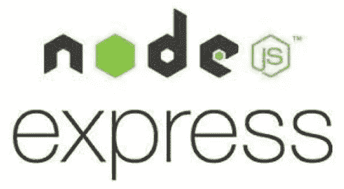

# 使用 Express 构建您的第一个 Node.js API

> 原文：<https://javascript.plainenglish.io/build-your-first-node-api-and-express-238f23af3341?source=collection_archive---------16----------------------->

## 使用 Express 在 Node.js 中创建简单 API 的指南。

嘿，现在你想开始做一些真正有趣和重要的事情吗？如果你想开始，你需要坚实的技术基础，了解正确的框架和特性会有很大帮助。所以，今天我们在这里开始使用 Express 在 Node.js 中创建我们的第一个简单 API。我们开始吧。



Node.js and Express

# Node.js 和 Express 快速演练

所以，我们要用的技术是 Node.js 和 Express。但是它们是什么呢？

首先，Node.js 是一个 JavaScript 运行时环境。这意味着它使 JavaScript 代码在您的机器上运行，而不是像通常那样在浏览器上运行。这是一项非常有用和强大的技术，因为它允许我们在后端开发和服务器端运行时使用 JavaScript 及其所有的额外功能和特性。

然后，Express 可能是为 Node.js 编写的最著名的框架。当谈到 API、web 服务和一般的 web 应用程序时，它可以被认为是事实上的标准。它可以创建路由、接收请求并给出响应。它真的很强大，也有不错的性能，同时记住 Javascript 是一种解释语言，所以速度不是他的主要优势。虽然，它比许多著名的后端开发替代方法要快得多，这也是它被广泛使用的原因。

# 让我们创建 API

**配置**

为此，您需要正确安装 Node.js。如有需要请点击此处链接:【https://nodejs.org/】

*如果我们想在 Node.js 中编写我们的第一个 API，我们必须选择一个存储库，从那里开始所有的开发过程。在这个特定的存储库中，您必须打开终端并编写:*

```
*>> npm init*
```

*然后，点击输入一串时间。此时，将创建一个 package.json 文件。不要删，永远不要。在这一点上，我们必须安装一些有用的软件包，使我们的应用程序运行。它们是 Express、cors、morgan 和 nodemon。*

*我们之前说过，Express 用于管理所有的 API。Morgan 很有用，因为当 API 运行时，在服务器终端上，您可以以一种用户友好的方式看到所有到达和发送的请求。这不是强制性的，但最好有。*

*需要 Cors 来使 Javascript 正确工作并避免问题。Nodemon 不是强制性的，但它将使开发过程更快，因为它将让我们看到我们在服务器中做了什么改变，而不用关闭它。它将我们的更改推送到实时服务器上。绝对有帮助。要安装这些依赖项，您需要在终端中键入以下内容:*

```
*>> npm install express cors morgan nodemon*
```

*安装所有东西需要几秒钟时间。至此，我们已经准备好用真正的代码构建我们的 API 了。用 Javascript 创建一个文件，在终端中触摸或者用视觉命令。您可以随意调用它，但建议使用 index.js 或 server.js。我们将使用名为 server.js 的文件*

***第一行代码***

*此时，我们需要导入我们之前导入的所有依赖项，因此我们需要输入该代码的第一行，这样就可以完成所有工作了:*

```
*const express = require('express');const morgan = require('morgan');const cors = require('cors');*
```

*现在，您已经成功地导入了使一切正常工作所需的所有依赖项。*

*然后，我们需要创建我们的服务器，它将能够管理来自世界各地的各种类型的所有请求，我们可以想象。因此，我们需要初始化应用程序，并将所有依赖功能放入其中。让我们用这段代码来做这件事:*

```
*const app = express();app.use(cors());app.use(morgan('dev'));app.use(express.json());*
```

*写完这些，我们初始化了 express 应用程序，这是我们第一个 API 的核心。然后，我们将导入的所有有用的功能与其他依赖项放在一起。关于 morgan 和 cors，现在他们很好，并且会帮助我们以我们喜欢的方式开发应用程序。*

*最后一行允许我们将 JSON 字符串解析为 API 的请求和响应。否则，我们就无法理解客户想要什么，也就无法回答正确的方式。*

***路线和响应***

*此时，服务器需要有一些他可以等待请求的路由，他还需要知道如何正确地回答这些请求。所以，我们来定义一下。*

*本文中我们的目标是构建一个简单的 API，而不是大规模的 API 或连接到数据库的东西。如果你对更高级的话题感兴趣，告诉我，我会实现的。*

*因此，每当带有 route /connected 的 GET 请求到达时，我们简单的第一个 API 将简单地响应“Welcome”，并且每当带有 route /sends 的 POST 请求到达时，将响应“You send me this string:"+string”。*

*万一你不知道什么是路由，你可以把它想象成某个类型的所有请求都到达的地方，所以服务器已经知道如何回答了。它们通过斜线和某种测试来区分，这使得路由在特定服务器中是唯一的。*

*如果你不知道什么是 GET 和 POST 方法，它们是两个最著名和最常用的 HTTP 方法。GET 用于客户端需要从服务器获取数据的时候，POST 用于客户端需要向服务器发送数据的时候。可以找到很多有价值的资源，让你了解整个 HTTP 协议。*

*这两种方法之间的另一个区别是 POST 带有一个主体，一个给出请求所需的所有信息的地方，而 GET 没有。如果你想用 GET 方法检索一些特定的东西，你必须通过 URL 传递它，而不是在主体中。*

*因此，要实现这两条非常简单的路线，我们需要的代码如下:*

```
*app.get('/connect', (req, res) => {
     res.send('Welcome');
});app.post('/sends', (req, res) => {
     const string= req.body.string; 
     res.send('You sent me this string:' + string);
});*
```

*这些函数看起来很简单，但是我将对它们进行一些评论。两者都有两个参数，req 是请求，res 是响应。从 req 中你可以得到你需要的所有信息，例如在 post 中我们得到正文中发送的文本。*

*此时，为了向客户机发回一个答案，我们使用 res. send()，它将括号内的内容返回给客户机。现在，服务器只需要打开并可供客户端使用。所需的代码行如下:*

```
*const port = 3000;app.listen(port, () => { console.log(`Hello world app listening on port ${port}!`);});*
```

*现在，您可以在终端上运行命令:*

```
*>> nodemon server*
```

*服务器将处于活动状态并正常工作。但是如何测试 API 呢？可以用很多工具，比如邮差或者失眠。选一个，第一个也有网络版。当服务器正在运行时，您必须输入您选择的应用程序的 URL 来测试 GET 和 POST:*

```
*>> http://localhost:3000/connect
>> http://localhost:3000/sends*
```

*一定要在正确的时刻将方法放入 GET 或 POST，否则什么都不会起作用。对于 POST 请求，您还必须添加一个主体。我建议你去正文部分，或者有写 JSON 之类的东西的地方。此时，您可以在编辑器中键入以下 JSON 字符串:*

```
*{"string": "RANDOM STRING FOR THE TEST"}*
```

*无论你写什么，都会有一个字符串，你会在响应中看到它。我知道也许关于测试它们的教程和需要的软件不是最好的，但是如果你对邮差或失眠有兴趣，请告诉我，我会尽快提供。*

## ***结论***

*在本文中，我们学习了如何在 Node.js 和 Express 中构建我们的第一个简单的 API，这是 JavaScript 世界中两个最重要的后端技术。至此，你的基础知识就建立起来了，以后你就可以轻松地对它们进行缩放了。这也可以是一篇为更有经验的人写的文章，当他从零开始一个新项目时，他可以简单地复制代码，而不是再次搜索所有容易忘记的简单基础。*

*感谢您的阅读，希望您喜欢这个内容。如果你做到了，让我知道并考虑鼓掌。希望不久能见到你。*

**更多内容请看*[***plain English . io***](https://plainenglish.io/)*。报名参加我们的* [***免费周报***](http://newsletter.plainenglish.io/) *。关注我们关于*[***Twitter***](https://twitter.com/inPlainEngHQ)*和*[***LinkedIn***](https://www.linkedin.com/company/inplainenglish/)*。加入我们的* [***社区不和谐***](https://discord.gg/GtDtUAvyhW) *。**