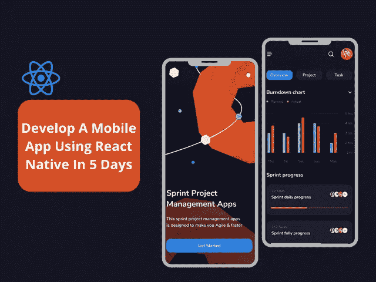
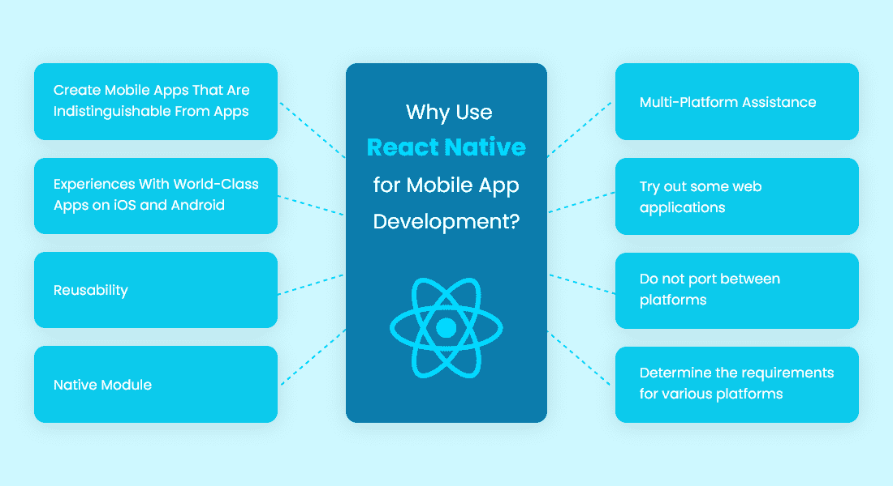

# 使用 React Native 在 5 天内构建您的移动应用

> 原文：<https://javascript.plainenglish.io/build-your-mobile-app-in-5-days-with-react-native-c701a472ae86?source=collection_archive---------4----------------------->

## 使用 React Native 在短短 5 天内开发出一款功能齐全的移动应用



在数字化时代，开发一个移动应用程序已经成为当务之急。在最短的时间内推出最好的商业应用的竞赛是组织所寻求的。

虽然有数百种技术可用于创建移动应用程序，但如果我们说您可以使用 React Native 在短短 5 天内创建一个全功能的移动应用程序，会怎么样？

相信有可能在 2023 年仅用 5 天时间创建您的第一个 React 原生跨平台应用程序，这是否令人惊讶？

嗯，这 100%是真的！

随着移动应用程序开发领域的新兴技术和创新，对于开发者来说，一切都变得如此简单和实用。

你所需要的只是合适的 React 原生应用程序开发团队和一个出色的应用程序创意，它可以帮助你建立行业基准。

因此，考虑到企业家对开发高性能应用程序的日益增长的需求，我们在这里向您提供一个快速教程，介绍如何通过 5 个简单的步骤创建一个 React 原生移动应用程序。

在开始开发应用程序之前，让我们从 React Native 的基础知识开始。了解基于 React-Native 的移动应用如何为企业带来益处。

*   *了解 React Native 作为跨平台框架的理念*
*   *2023 年，React 原生移动应用开发如何惠及组织？*
*   *构建成功 React 原生应用的秘密咒语*
*   *使用 React Native 开发移动应用的简单 5 步是什么？*
*   *通过 5 个简单步骤使用 React Native 开发移动应用*
*   *使用 React Native 开发一款获奖的移动应用需要多少成本？*

为了更好地理解，让我们深入这些要点的细节。

# **了解 React Native 作为跨平台框架的背景**

React Native 是一个免费的开源软件库，允许开发人员仅使用 JavaScript 构建原生移动应用。它支持多种平台，是跨平台移动应用开发的理想选择。

该库本身主要是用 JavaScript 编写的，有些部分可以用其他语言编写，如用于 iOS 开发的 TypeScript 或 Swift。

截至 2018 年，React Native 正式并入脸书的主要代码库，使得在不依赖 Cordova 或 PhoneGap 等第三方平台的情况下构建更高级的应用程序比以往任何时候都更容易。

如果你正在考虑用 React Native 构建你的下一个移动应用，你将需要雇佣一个 React Native 开发者。要使用 React Native 创建应用程序，您需要使用一些重要的工具，如 React Native CLI 工具和 Android Studio(或 Xcode) IDE，在您各自的平台上编译应用程序。

使用这个工具的一个主要好处是它使你的应用程序代码可移植。这意味着，当你需要切换平台时，例如，从 iOS 到 Android，你可以无缝地迁移它，而不必从头重写代码库。

它还具有许多其他功能，使开发人员非常容易使用，例如开发原型有多快，你的应用程序有多快，因为你编译的代码中没有 Java 或 Objective-C 语言等等。

如果您仍在为是否应该考虑 React Native 用于移动应用程序开发而左右为难，那么您必须检查它的受欢迎程度:

*   *据统计，美国排名前 500 的应用中，有 14.85%采用了 React Native。*
*   *据统计，美国排名前 500 的应用中，有 14.85%采用了 React Native。*
*   *React Native 是 2021 年* [*38%的开发者使用的第二流行的跨平台框架*](https://www.statista.com/statistics/869224/worldwide-software-developer-working-hours/) *。*


[Image Source](https://www.statista.com/statistics/869224/worldwide-software-developer-working-hours/)

# **React 原生移动应用开发如何在 2023 年惠及组织？**

企业最常见的需求之一是需要提高对公众的影响力。为了帮助实现这一目标，组织应该考虑在 2023 年使用 React 原生移动应用程序开发。



[Image Source](https://www.bacancytechnology.com/blog/why-use-react-native#:~:text=React%20Native%20Market%20Share,app%20on%20iOS%20or%20Android.)

通过 React Native 创建的应用具有无缝的外观和感觉，因为它们被设计为在每个设备平台上表现为本机应用。React Native 提供了各种各样的小部件，为应用程序创建了一个漂亮的 UI。

可以 [**聘请一个手机 app 开发者**](https://www.appsdevpro.com/hire-developers/hire-mobile-app-developers.html) 让它更有冲击力。这意味着你可以构建一个更适合用户环境的应用，而不是感觉像一个附加组件。

> 以下是 React Native 提供的一些优势:

**轻松的 iOS 和 Android 应用开发:**使用 React Native 有助于跨平台应用开发更加顺利，移动操作系统设计人员在对 iOS 和 Android 等操作系统平台进行更新时，会不断更新功能和规范。创建不同版本的应用程序也更容易。

**改善用户体验:**跨平台框架可能会有问题且速度缓慢，但 React Native 使得在所有类型的设备(从手机到平板电脑到台式电脑)上创建具有令人难以置信的用户体验的惊人应用成为可能。

容易理解的编码语言:因为许多开发人员已经知道 JavaScript 和 HTML，所以他们很容易过渡到学习代码如何在这些语言中工作。已经了解 Java 的开发人员也可以在项目中使用这些技能。

**经济高效的解决方案:**成本节约来自于不必开发两个不同版本的应用程序，也不必让两个团队在一个项目上工作。无论你有什么类型的组织，营销你的产品或服务的需求是最重要的。

**简而言之:**通过 React Native 构建移动应用将为用户提供无缝的内容导航体验。此外，在 React Native 中创建跨平台应用程序，只需要一个团队同时开发 iOS 和 Android 应用程序，从而节省了时间和资金。

# **构建成功 React 原生应用的秘密咒语**

无论你选择了多么优秀的应用程序开发框架，应用程序的成功取决于开发者的专业知识和项目规划的深度。如果你打算 [**雇佣一个应用开发者**](https://www.appsdevpro.com/hire-developers.html) 用 React Native 创建一个移动应用，那么确保你有正确的应用开发策略。

在进行了市场研究并分析了其他应用的成功之后，我们在这里揭示了构建一个成功的 React 原生应用的秘密咒语:

1.  **进行市场调查:**调查你的目标受众规模，找到符合你预算的应用。这不仅有助于你瞄准一个有利可图的市场，还能帮你节省任何不可预见的成本。如果同时针对 OS 和 Android 平台，那么选择 React 原生框架将是最佳选择。
2.  **选择合适的开发人员:**一旦你完成了研究，找一个对 React Native 有深入了解的开发人员。确保他们能够使用相同的代码库为多种设备开发移动应用。
3.  **设计线框和原型:**为了提供出色的用户体验，为应用程序内的交互设计线框和原型非常重要。这将有助于你想象你的用户应该如何浏览不同的菜单和屏幕，输入数据和提交新的信息。请记住，这个设计将被用作您最终产品的蓝图。
4.  **设置特性和功能:**写下详细的规格，详细说明你希望你的应用程序拥有的所有特性和功能。确保在选择应用程序的特性和功能时非常小心，因为这将有助于您的应用程序脱颖而出。

此外，在编写规格时，要考虑到跨平台的因素，包括确保功能可以跨多种操作系统和屏幕尺寸工作，同时遵守特定的指导原则。

**简而言之:**选择合适的编程语言和库栈来构建你的应用，可以帮助你开发出成功的移动应用。你所需要的只是一个计划，然后 [**雇佣一个 React 本地开发者**](https://www.appsdevpro.com/hire-developers/hire-react-native-developers.html) 。他们将帮助您创建一个符合您预算的应用程序，并帮助您实现目标。因此，如果你想知道如何在 5 天内使用 React Native 创建一个移动应用程序，那么请继续阅读。

*快速提示:无论你是刚开始使用 JavaScript 编程语言的创业者还是开发者，我们已经总结了一个使用 React Native 以简单的方式开发移动应用的快速教程。任何一个技术水平不高的人，甚至可以在短短 5 天内理解开发一个 app 的流程。*

# **使用 React Native 开发移动应用的 5 步教程**

如果您将注意力放在 React Native 的生态系统上，并开始安装设置的先决条件，那么开始 React Native 应用程序开发过程会更容易。

因此，让我们直接进入开发和安装 React 本机应用程序的逐步过程..

## **步骤 1:使用 React Native 创建一个项目**

有许多很棒的 React 原生初学者工具包可以帮助您启动并运行。我最喜欢的一个叫做“创建本地应用博览会”有了这个初学者工具包，你可以快速搭建你的第一个应用程序。

如果您以前已经使用过这个框架，那么还可以选择从头开始创建您自己的定制项目。

***现在，假设我们想使用 React Native for iOS 构建一个杂货 app。***

以下是几个简单的步骤:

*   create-react-native-app-name GroceryApp-type IOs 创建应用程序后，在 Xcode 中打开它，然后选择“打开方式>目标”
*   选择“创建新项目”。点击“单视图应用程序”。你可以雇佣一个 iOS 开发者来创建一个项目。他们将帮助您在正确的文件夹中创建项目。
*   给它起个名字，比如 GroceryApp。
*   下一个窗口将询问您想要定位的设备类型。选择“iPhone”或“iPad ”,具体取决于您正在开发的设备。
*   为了将您的应用程序部署到模拟器，只需点击“模拟器”，然后选择屏幕左上角列出的设备之一。

## **第二步:React 原生应用开发设置**

在开始开发应用程序之前，需要设置一些初步要求。它们如下:

通过运行以下命令安装 create-react-native-app "全局命令

```
npm install -g create-react-native-app//
```

使用此命令后，将打开一个窗口，您可以在其中使用此命令创建一个新项目:

```
create-react-native-app MyAppName //created MyAppName successfully. //
```

确保您在您的项目文件夹中，并运行以下命令来添加**库/SDK**

注意:这是大多数应用程序开发人员在开始 react 本机应用程序开发过程时使用的通用命令。然而，我们计划在 5 天内完成开发项目。因此，确保您拥有正确的 React 本地开发环境。

通常，一家知名的 React 原生开发公司有一个用于 React 原生应用程序开发的适当机器设置，所以这是为单独处理项目的 React 原生应用程序开发人员准备的。

***所以要开始 React 原生 app 开发流程需要安装 Node 和 React 原生 SDK。***

React Native 网站上提供了安装 Node 的说明，但是安装 SDK 最简单的方法是使用 npm。为此，请打开您的终端并键入:

```
npm install -g react-native-cli
```

这将安装我们构建应用程序所需的 CLI 工具。接下来，使用终端导航到您选择的文件夹(即 cd 桌面)，然后键入:

```
react-native init MyFirstAppNameHere
```

这将创建一个名为 MyFirstAppNameHere 的新目录，其中包含创建 React 本机应用程序所需的所有必要文件。

如果您希望它是其他的东西，您可以在命令中更改 *MyFirstAppNameHere* ！

一旦进入目录，应该有两个文件， ***index.js 和 package.json*** 。现在让我们用 Atom 或 Sublime Text 3 之类的文本编辑器打开它们来编辑它们——Atom 是默认安装在大多数 MAC 上的，所以打开它吧！在 index.js 中，在顶部找到下面一行:

```
import * as React from ‘react’;
```

## **第四步:开始开发应用**

这一步最刺激！随着您添加不同的组件，您将开始看到您的应用变得栩栩如生。你也可以 [**雇佣一个 Android 开发者**](https://www.appsdevpro.com/hire-developers/hire-android-developers.html) 来看看这些组件将如何在 Android 设备上开始工作。我们的目标不仅是构建应用的初始外壳，还包括探索 React Native 的工作方式，以便我们在接下来的步骤中进行测试。让我们开始吧！

**4.1** 打开终端，输入以下命令:NPM init-y。

这将在我们的计算机上的当前目录中为我们的项目创建一个新的 ***package.json 文件*** ，它应该类似于:

***Users/your name here/react-native-tutorial/。***

它为我们创建了一个新的 package.json 文件的所有样板代码，这意味着我们可以在以后需要的时候使用它来安装包

通过在终端中键入以下命令，首先安装 react-native:

```
npm install -g react-native-cli
```

**4.3** 输入以下命令来设置我们的 iOS 和 Android 环境(按顺序):

```
react-native init MyMobileAppcd MyMobileApp react-native run–ios
```

或者

```
react-native run–android
```

根据您的设备使用命令。

**4.4** 出现提示时，针对每个问题选择继续或取消，直到您看到“您希望您的项目是开源的吗？

如果您不想让别人看到您正在做的事情，请选择“否”,反之亦然。

**4.5** 接下来，让我们编辑 src 文件夹内的 index.js 和 main.js 文件。

index.js 文件有两个带文本的按钮，分别是 hello 和 the world 单击其中一个按钮，将其文本更改为您想要的任何内容！

4.6 **将 import React 下面 main.js 顶部的这两行从‘React’改过来；**

***导入{见习}***

***出自‘react-native’；//改为:从“react-native”导入{ AppRegistry }；//***

**4.7** 最后，回到您之前运行 npm init 的终端，键入 npm start，然后按键盘上的 enter 键，这将在我们的浏览器中以 localhost:8081/index.html 提供我们的应用程序。

**4.8** 如果你得到一个错误信息说“找不到命令”，检查以确保你键入的是 npm start 而不是 NPM sert——或者这两个词之间没有空格。

享受探索您的新应用程序的乐趣！注意标题是如何垂直居中和水平对齐其他文本的，因为它使用的是 Flexbox。

关于在 React Native 中构建应用程序，你还注意到了什么？

## **步骤 5:创建第一屏幕“Hello Word”**

你好，世界！如果到目前为止您已经完成了所有的步骤，我们现在就可以开始编写第一行代码了。我们浏览的最后一页是 src 文件夹。src 文件夹是存储我们所有代码的地方。让我们现在从那个目录开始。打开“index.js”文件，编辑它以包含以下代码行:

```
const mainScene = react. createScene ( ) ;mainScene. setBackgroundColor ( ‘#a0c3d8’ ) ; 
```

那么这段代码是做什么的呢？React 的工作原理是分别声明每个场景，然后将它们添加到一起，形成您的应用程序。

为了让一个场景正常工作，它需要一个背景颜色，我们用***‘setBackgroundColor’***函数调用来设置。我们还需要确保当我们使用 onEnter 函数调用改变场景时，我们的背景颜色也会改变。总结一下我们到目前为止所做的工作:

*   我们在文件的顶部声明场景变量为 mainScene
*   我们创建了一个新的 React 场景，叫做 mainScene
*   我们给主场景添加了背景色
*   当进入或退出应用程序中的任何其他 React 场景时，使用 onEnter()或 onExit()函数调用，变量名后跟括号()-Save index.js。

现在，让我们通过返回终端并再次键入 react-native run-ios 来再次尝试运行该应用程序。一旦你看到苹果标志出现在你的屏幕上，轻按任何地方打开选项列表，如相册，设置等。向下滚动并点击 HelloWorld。您应该会看到类似这样的内容:

成功了！恭喜你用 React Native 构建了你的第一个应用。

现在的问题是，创建一个 React 原生移动应用程序需要多少成本？

## **使用 React Native 开发一款成功的移动应用需要多少成本？**

React Native 是一个强大的跨平台框架，它提供了多种可以加速开发过程的现成小部件。这最终意味着您将能够节省成本和时间。但是 [**雇佣一个 React 原生开发者**](https://www.appsdevpro.com/hire-developers/hire-react-native-developers.html) 要花多少钱，以及 app 开发的整体成本？这是组织和创业公司最常问的问题之一。

所以，说实话，手机 app 开发是没有标准成本的。成本和应用程序开发时间受各种因素的影响很大，如应用程序的复杂性，你雇佣的开发团队，UI/UX 设计，测试，特性和功能。

不同的业务有不同的要求，因此没有适合所有解决方案的解决方案。目前，每个平台开发一个原生移动应用的平均成本在 15，000 美元左右。然而，当您使用 React Native 时，您可以节省高达 40%的移动应用程序开发成本，因为 70–80%的代码是可重用的。

因此，使用 React Native 开发应用程序将节省您的金钱和时间。

# **总结**

React Native 无疑是最受欢迎的框架之一，可以用来构建提供漂亮的原生用户界面的应用程序，您可以在为自己的企业创建跨平台应用程序时利用这一点。通过 [**雇佣一个移动应用开发者**](https://www.appsdevpro.com/hire-developers/hire-mobile-app-developers.html) ，你可以轻松创建一个 React 原生应用，给你的业务带来巨大的推动。

但本教程的目标是教你如何在 5 天内开始使用 React Native。如果你准备花很长时间来学习应用程序开发的过程，这些步骤真的会有用。

否则，您可以简单地外包 react 本地开发公司，为您的企业创建一个功能性的移动应用程序。因此，如果你有一个想法，并希望推出一个在多个平台上运行的商业应用程序，那么你可以向我们提出疑问，或联系我们进行有时限的项目交付。

========================================

*更多内容请看*[***plain English . io***](https://plainenglish.io/)*。报名参加我们的* [***免费周报***](http://newsletter.plainenglish.io/) *。关注我们关于*[***Twitter***](https://twitter.com/inPlainEngHQ)[***LinkedIn***](https://www.linkedin.com/company/inplainenglish/)*[***YouTube***](https://www.youtube.com/channel/UCtipWUghju290NWcn8jhyAw)*[***不和***](https://discord.gg/GtDtUAvyhW) *。***