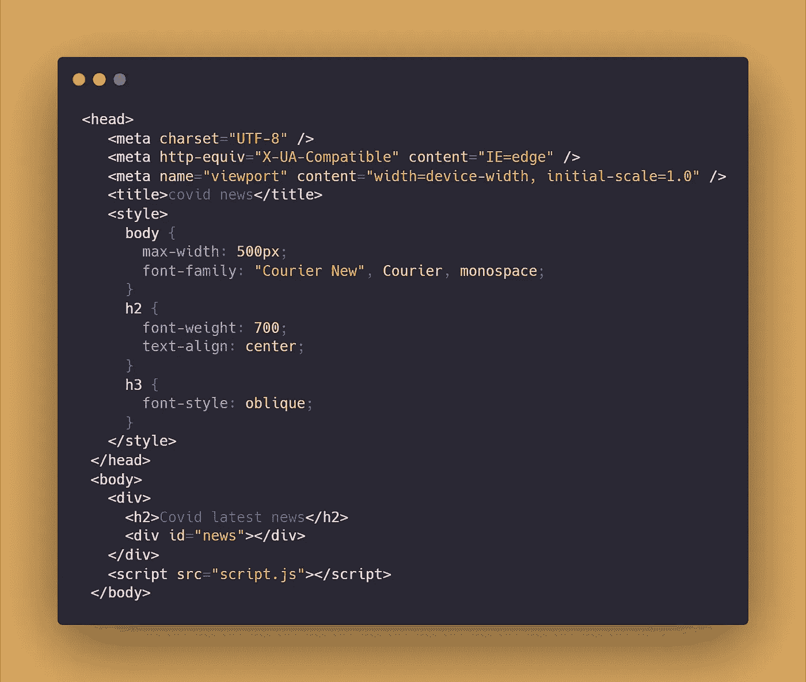
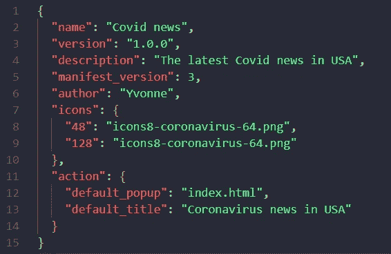

# 用 JavaScript 构建你自己的 Chrome 扩展

> 原文：<https://javascript.plainenglish.io/build-your-own-chrome-extensions-with-javascript-b408cef8b5a8?source=collection_archive---------11----------------------->

image from SAE School

想不到只需 5 分钟就能如此轻松地构建 Chrome 扩展。下面是我如何用 JavaScript 和 API 构建一个。

我试着用[冠状病毒智能 API](https://rapidapi.com/SmartableAI/api/coronavirus-smartable) 获取最新新闻并显示收件箱。

首先，构建一个 index.html 文件来构建 DOM 和一些样式选项。

链接脚本文件。

第二，去 Rapid API 找到 [Corinavirus Smartable API](https://rapidapi.com/SmartableAI/api/coronavirus-smartable) ，用 *Javascript fetch* 的方式复制代码。

获取数据，然后你可以告诉有 30 个新闻列表，我只抓取第一个。

用`innerHTML`改变 HTML。并且记得运行函数。

下一步是展示 Chrome 扩展。

第三，构建名为“manifest.json”的文件。

您可以设置 4 种不同大小的图标图像。

# 以下是在 Chrome 浏览器中的操作方法:

右上角有三个点，用于查找扩展:

并打开右上角的开发者模式:

然后上传您的项目文件夹:

然后就可以看到自己的 chrome 扩展了。

你写下的细节:

最终测试:

试一试不是很有趣吗？用这种方法，你可以构建更出色的 Chrome 扩展。

> 继续做你想做的事。在通往顶峰的路上向我们所有人问好。
> 
> 请跟随并成为我的学习伙伴。和平。✌️

*更多内容看* [***说白了。报名参加我们的***](https://plainenglish.io/) **[***免费周报***](http://newsletter.plainenglish.io/) *。关注我们关于* [***推特***](https://twitter.com/inPlainEngHQ) ，[***LinkedIn***](https://www.linkedin.com/company/inplainenglish/)*，*[***YouTube***](https://www.youtube.com/channel/UCtipWUghju290NWcn8jhyAw)*，* [***不和***](https://discord.gg/GtDtUAvyhW) *。对增长黑客感兴趣？检查* [***电路***](https://circuit.ooo/) *。***