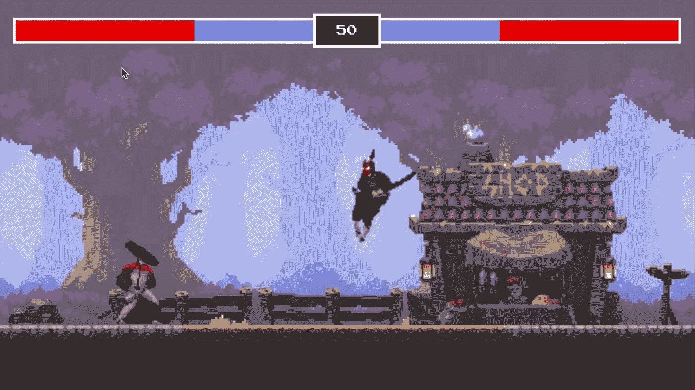
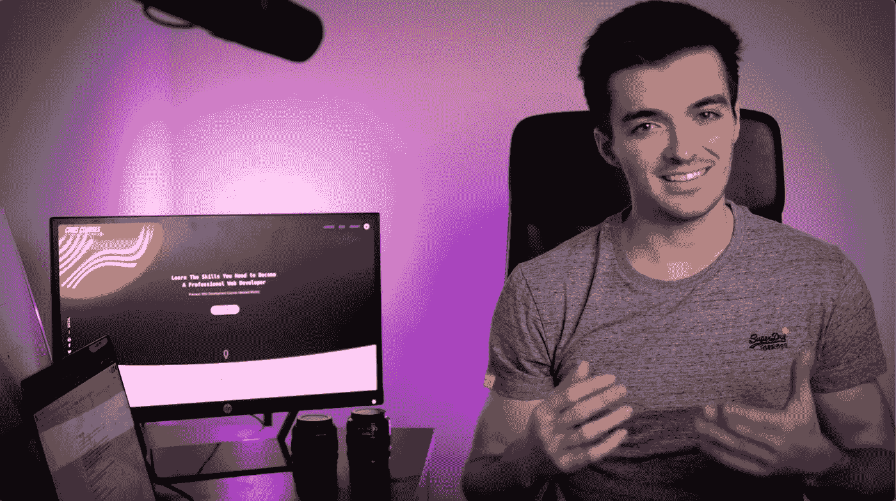
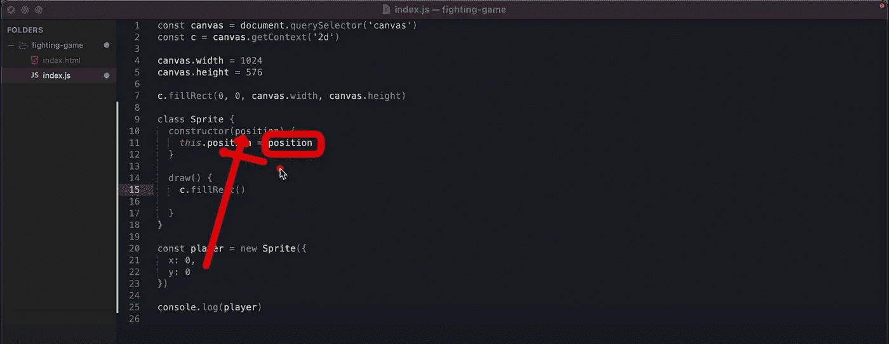
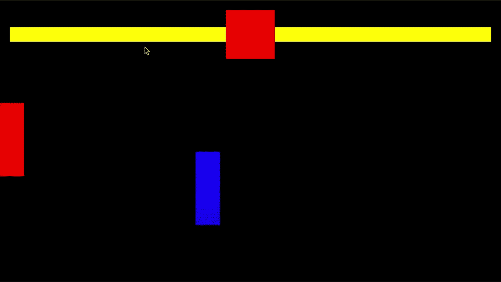
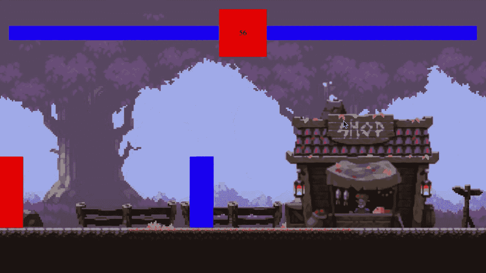

# 在几分钟内构建自己的 JavaScript 忍者游戏

> 原文：<https://javascript.plainenglish.io/build-your-own-javascript-ninja-game-in-minutes-d201d7774e3e?source=collection_archive---------5----------------------->

## 空闲时间知识构建者

## 如何用 JavaScript 轻松地创建一个基于画布的 HTML 游戏

Ninja Fighting Game. Image courtesy Chris Courses.

你会花 4 个小时看别人写 JavaScript 游戏吗？

我做到了。

从专业角度来说，这是我一生中最美好的 4 个小时。

# **通过实时观看学习 JavaScript**

几个月前，我在 YouTube 上看到一个视频，一个创作者用纯 JavaScript 编写了一个侧滚平行格斗游戏。只是出于好奇，我开始观看，只是因为我很好奇一个人将如何着手编写一个基于画布的游戏。

我写 JS 已经超过 20 年了，但是我从来没有真正有时间去钻研像游戏这样的东西。

这个家伙的所作所为引起了我的注意，他没有遗漏从头开始编写游戏所需要的任何东西。

如果你对 JavaScript 几乎一无所知，并且你想像我一样以编写游戏或仅仅编写商业应用程序开始你的编码生涯，那么不要害怕！你不会被留在黑暗中看这个视频和其他人喜欢它。

# 介绍克里斯课程的克里斯利斯

在花了 4 个小时观看“这个家伙”完全凭空创造了一个游戏之后，我必须知道更多。我做了一些调查，发现他的名字是克里斯托弗·里斯，他住在离我很近的佛罗里达州。克里斯经营着一个名为[克里斯课程](https://chriscourses.com)的教育和学习网站。

Chris Lis of Chris Courses. Image courtesy Chris Courses

我联系了 Chris 讨论他做的一些事情，因为我认为他学习像 JavaScript 这样的语言的方法是纯粹的天才。事实上，克里斯的教学方式不仅仅是知识性的，而是娱乐性的，没有废话，而且非常坦率地说，它看起来很上瘾——至少对于像我这样有特殊程度的极客人格障碍的人来说。

我承认我没有坐下来一口气看完克里斯 4 个小时的游戏创作视频。不，我花了大约一周的时间断断续续地进行 30 到 45 分钟的训练。但是这一切都是值得的。

# 不仅仅是一个简单的速成班

克里斯给我印象最深的是他的整体教学方法。

他不仅仅是给你看代码，让你自己解决剩下的问题。

不，Chris 深入一线，带您从头开始设置您的环境！

如果你对如何编写 period 一无所知，你可以看看 Chris，他会带你了解如何让你的游戏运行起来:从配置你的 IDE，安装/导入必要的 JS 库，从哪里开始(以及为什么)；在你自己的 GitHub repo 中保存和存储你的代码，与他人分享。

Chris writes code in real-time while you watch, then highlights what you need to pay attention to. Image courtesy Chris Courses.

Chris 然后解释了为什么他在代码中使用某些命令；为什么一个命令可能比其他命令更好使用；以及为什么使用类很重要，以及如何为依赖注入设置这些类。

我也喜欢克里斯在课程中做了大量的重构。

这一点很重要，因为你从编写简单的程序(函数)开始，当它变得太难处理时，Chris 就把程序代码剥离出来，转储到一个类对象中，现在可以设置这个类对象以供适当的重用。

就像我们作为程序员在现实世界中经常做的那样。

# 入门指南

显然，我不会试图将 4 个小时的课程压缩到一篇文章中，但我确实想指出为什么这些课程不仅对初学者如此重要，而且对像我这样的高级程序员也如此重要。

克里斯开始向你展示最基本的东西。您将首先设置您的 HTML 画布，在代码中添加对象，移动这些对象，检测碰撞，更新属性，模拟重力；然后是添加武器，攻击，并从与演员“冲突”的攻击中扣除“生命值”。

What the Ninja Fighting Game looks like before background or sprites have been added. Image courtesy Chris Courses.

在这里，我们可以看到游戏的设计随着背景艺术的加入而进步，但我们的演员仍然只是屏幕上显示的粗糙的基本对象。

克里斯使用在 [**Itch.io**](https://itch.io) 上公开的预制艺术和精灵。

如果你从来没有去过 Itch，这个网站已经被塞满了——充满了免费的、请求捐赠的和付费的游戏，游戏创作者和设计者的内容，他们很乐意让你把他们的产品用于你的下一个游戏创意。

# 尝试 JavaScript——或者更深入地研究

我写代码 40 年，写 JS 20 多年。即使作为一名经验丰富的软件工程师，当你像我一样只以编写业务代码为生时，也常常会错过或理解一些东西。

我喜欢看到克里斯的动画引擎的简单性，以及他如何调整帧速率来创建我作为商业编码人员从未处理过的东西。老实说，在企业领域，我们只是不处理这类事情，比如动画，至少不经常。

看着 Chris 实时开发这个简单的游戏，我学到了很多东西。是的，有一些东西我想我也可以给克里斯看，但是这些或多或少都是无关紧要的，可能更多的是出于“个人偏好”的考虑。

Building your own JavaScript fighting game. Video courtesy Chris Courses.

# 以有趣的方式学习 JavaScript！

我最喜欢 Chris 所做的事情是，他教人们用有趣的方式编码。我的意思是，谁不想在编写自己的第一个游戏时学习 JS 编码呢？

我希望在我第一次学习编码的时候就有这样的东西——话说回来，当我在 80 年代初第一次学习苹果的时候，Chris 还要再过 20 年才会出生(是的，变老真糟糕！).

我是一名自学成才的软件工程师，所以我非常尊重像克里斯制作的课程。这些都是一流的，免费或非常便宜的挖掘。

在 Chris 的课程中，学习 JavaScript 还有很多内容。Chris 还会教你 web 应用开发的基础知识，包括:CSS、HTML 和 ThreeJS，three js 是 JavaScript 的 3D 动画库。

因此，如果你只是对编写 JS 游戏感到好奇，或者对加深自己的 JS 技能感兴趣，请使用下面的资源链接查看免费的 YouTube 视频或 Chris 的网站。

您可以从头开始，或者使用他预先构建的代码来构建您自己的忍者战斗游戏，同时学习 JavaScript 编码的更深层次。

尽情享受吧！

____________________

**资源:**

[克里斯课程 YouTube 上的格斗游戏](https://www.youtube.com/watch?v=vyqbNFMDRGQ)
[克里斯课程网站](https://chriscourses.com/)
[克里斯课程 GitHub 上的源代码](https://github.com/chriscourses)

____________________

*Beau Beauchamp 是一名 web 应用程序架构师，拥有 20 多年在云中开发企业级应用程序的经验。*

*本文中的所有图片和内容均拥有版权，经 Chris Courses 许可用于编辑用途。*

*更多内容看* [***说白了就是***](https://plainenglish.io/) *。报名参加我们的* [***免费周报***](http://newsletter.plainenglish.io/) *。关注我们* [***推特***](https://twitter.com/inPlainEngHQ) ，[***LinkedIn***](https://www.linkedin.com/company/inplainenglish/)*，*[***YouTube***](https://www.youtube.com/channel/UCtipWUghju290NWcn8jhyAw)*，*[*不和*](https://discord.gg/GtDtUAvyhW) *。*