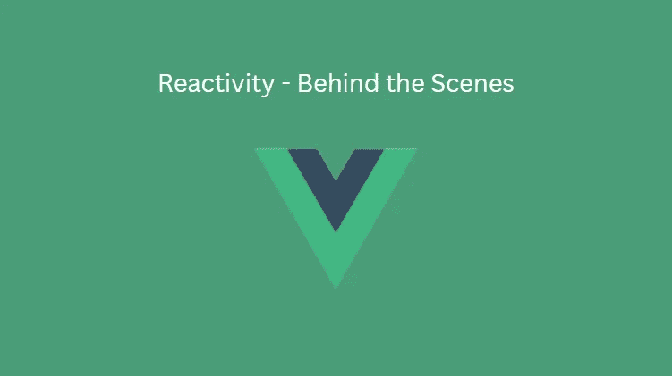

# 像 Vue.js 一样建立自己的反应系统

> 原文：<https://javascript.plainenglish.io/build-your-own-reactive-system-like-vue-js-33d02ce38bd2?source=collection_archive---------6----------------------->

## 一个简单的例子，使用普通的 JavaScript 创建你自己的反应系统，比如 VueJS



Vue Reactivity

整个 Vue 生态系统最显著的特征之一是 Vue 的高反应性。它简化了开发人员的状态管理，使他们的生活更加轻松。作为一名开发人员，你不需要担心当你的应用程序状态改变时更新视图，因为 Vue 在后台处理得很好。

通过一个非常基本的例子，我们将在本文中尝试构建一个小的反应式系统，利用 Vue 使用的相同技术使其组件状态反应。

## 什么是反应性？

反应性简单地描述了应用程序状态的变化，这种变化是由对它的一个依赖对象或属性的修改引起的。让我们用一个例子来更好地把握这一点。

如果我们看下面的 JavaScript 代码并执行它。

```
let firstname = 'Code';
let fullname = firstname + ' Ceeker';console.log(fullname);
```

我们将得到下面的输出。

```
Output: **Code Ceeker**
```

上面的输出没有什么令人惊讶的，因为这是上面的代码所预期的。

现在，让我们尝试更新代码以输出修改后的`firstnam`。

```
let firstname = 'Code';
let fullname = firstname + ' Ceeker';console.log(fullname);firstname **= 'Modified Code';
console.log(fullname);**
```

产量是多少？

```
Output: **Code Ceeker
        Code Ceeker**
```

它仍然是一样的，这是正确的，因为我们没有用修改后的`**firstname**`重新计算`**fullname**` 。我们只是在修改`**firstname**`的值。而且，我们知道，默认情况下 JavaScript 不是反应式的，因此上面的代码也不是。

**这里我们实际需要的是当我们给** `**firstname**` **赋一个新值的时候，它也应该在** `**fullname**` **中得到反映。这就是反应性的含义。**

如果这是在 Vue 中编码的，那么由于 Vue 的反应系统，我们将得到作为'**修改代码 Ceeker** '的输出。这也不需要重新计算`**fullname**` 。

***那么我们可以用普通的 JavaScript 让上面的代码反应吗？***

是的，我们可以通过使用 Vue 在幕后使用的相同方法使上面的代码具有反应性。

## 如何让代码具有反应性？

在 JavaScript 中，有一个名为 **Proxy** 的内置特性，Vue 利用它来包装您的属性，并在您为其赋值时得到通知。想了解更多关于代理的细节，请点击[这里](https://developer.mozilla.org/en-US/docs/Web/JavaScript/Reference/Global_Objects/Proxy)。

因此，每当一个新值被赋给一个属性时，Vue 就会意识到这一点，并更新它所有的引用。

我们将在这里尝试使用相同的技术，通过使用一个**代理**，使上面的普通 JavaScript 代码具有反应性。

首先，让我们创建一个具有所需属性的对象。

```
const **data** = {
 firstname: 'Code',
 fullname: 'Ceeker'
};
```

为了给**数据对象**增加反应性，我们用一个**代理对象**包装该数据对象。

```
const proxy = new **Proxy**(**data**, **handler**);
```

> 以上是现代 JavaScript 中内置的构造函数，所以请确保你是在 chrome 这样的现代浏览器上运行这段代码。

您可能对**代理构造函数**中传递的**第二个参数(即处理程序)**感到疑惑。

这是**处理程序对象**，它提供代理支持的某些**特性，如陷阱**。例如，通过在处理程序中添加一个**设置函数**来设置陷阱。

```
const handler = {
 **set(target, key, value)** {
 }
}
```

**在处理程序中，从代理构造函数自动接收 set 函数的目标、键和值参数。**

为了理解它的作用，让我们在控制台记录目标、键和值的值。

```
const handler = {
 set(target, key, value) {
  **console.log(target);
  console.log(key);
  console.log(value);**
 }
}
```

此外，由于**代理**对象包装了**数据**对象，我们可以使用代理对象访问数据对象的属性，如下所示。

```
const proxy = new Proxy(data, handler);
**proxy.firstname = 'Modified Code';**
```

使用上面的代码和 handler 对象，我们可以看到下面的 console.log 消息。

```
**1\. {firstName: 'Modified Code'} // Data object**
**2\. firstName                    // Key(property name)**
**3\. Modified Code                // Value**
```

1.  **目标**是本质上被包装的对象，即我们传递给代理构造器的**数据对象**。
2.  **键**是**属性(即** `**firstname**` **)** ，我们为其设置了**新值**。
3.  **值**是我们设置给`**firstname**` 属性的**新值**。

这显示了一个处理程序在那里做什么。

## 应用反应性

所以，回到我们最初的代码，每当`**firstname**` 改变时，我们需要改变`**fullname**` 。在一个**代理对象**的帮助下，通过设置一个所谓的**设置陷阱**这样的处理程序，我们可以实现这个。

**我们可以定义一个 setter 函数，每当代理对象上的一个属性被设置为一个新值时，这个函数就会被触发。**

然后我们可以检查我们正在设置的**键**是否是`**firstname**`，并用分配的新值**更新**设置陷阱**中的`**fullname**` 属性。**

```
const handler = {
 set(target, key, value) {
  **if(key === 'firstname'){
   target.fullname = value + ' Ceeker';
  }
  target.firstname = value;** }
}
```

现在，如果我们尝试用这个代理设置来执行我们的初始代码，我们会看到更新`**firstname**` 也会更新`**fullname**` 属性。

```
const data = {
 firstname: 'Code',
 fullname: 'Ceeker'
};**const handler = {
 set(target, key, value) {
  if(key === 'firstname'){
   target.fullname = value + ' Ceeker';
  }
  target.firstname = value;
 }
}****console.log(data.fullname);  // Ceeker**const proxy = new Proxy(**data**, **handler**);
**proxy.firstname = 'Modified Code';****console.log(data.fullname);  // Modified Code Ceeker**
```

**输出**

```
**Code Ceeker
Modified Code Ceeker**
```

代码`**proxy.firstname = ‘Modified Code’**`将触发代理处理程序的`**set**` 函数，该函数随后也更新数据属性的`**fullname**`和`**firstname**`。

这就是我们如何创建我们的反应系统来跟踪一个属性并在 **firstname** 属性改变时更新另一个属性。

简而言之，Vue 通过一些额外的简化实现了这一点。它监视你的数据属性，任何时候其中一个属性发生变化，它都会更新你程序中使用它的部分。这就是 Vue 的运作方式，但显然它的运作方式比我们这里的更复杂。但这只是一个快速概述，应该有助于您了解 Vue 反应性一般是如何工作的。

感谢您的阅读。

*更多内容请看*[***plain English . io***](https://plainenglish.io/)*。报名参加我们的* [***免费周报***](http://newsletter.plainenglish.io/) *。关注我们关于*[***Twitter***](https://twitter.com/inPlainEngHQ)[***LinkedIn***](https://www.linkedin.com/company/inplainenglish/)*[***YouTube***](https://www.youtube.com/channel/UCtipWUghju290NWcn8jhyAw)*[***不和***](https://discord.gg/GtDtUAvyhW) *。对增长黑客感兴趣？检查* [***电路***](https://circuit.ooo/) *。***