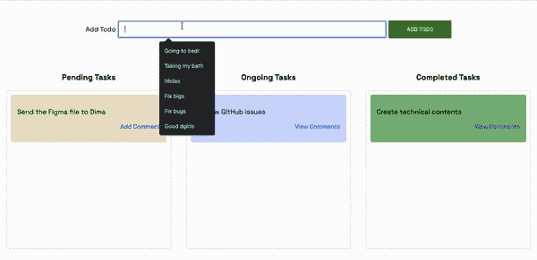
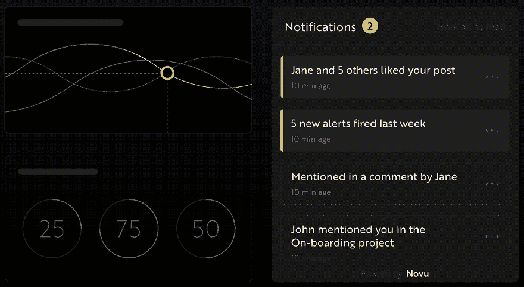
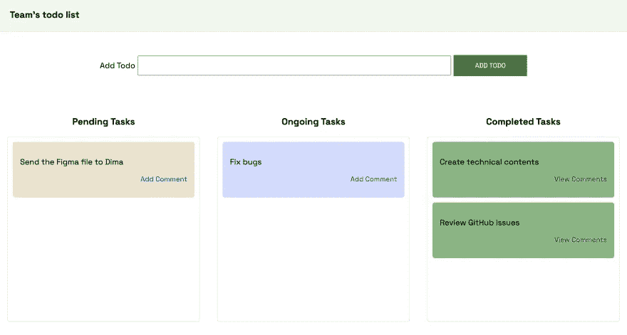
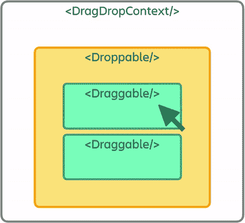
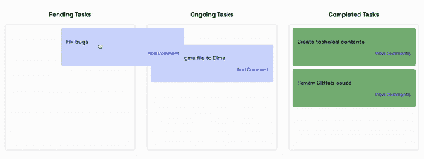
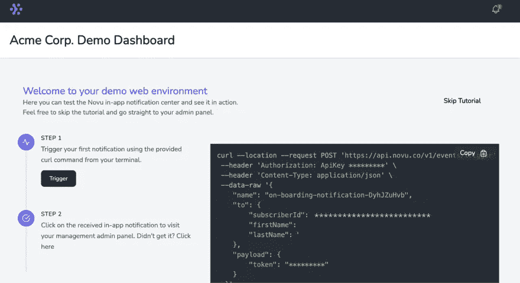
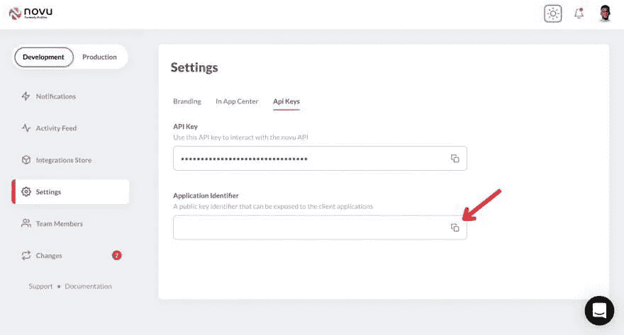
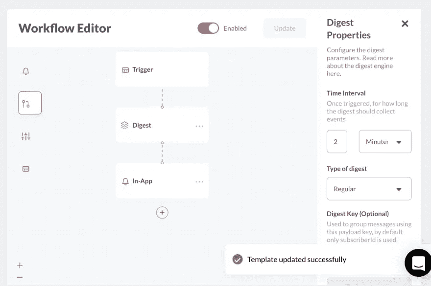
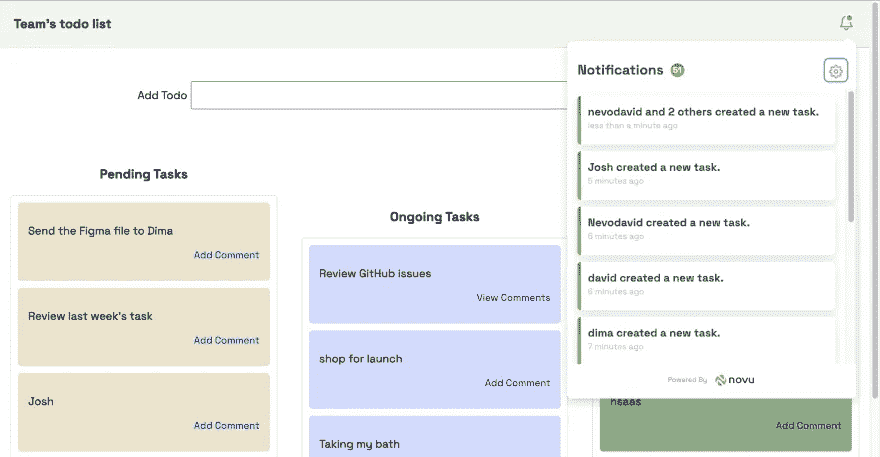

# 用 Node.js、React 和 Websockets 构建漂亮的看板

> 原文：<https://javascript.plainenglish.io/building-a-beautiful-kanban-board-with-node-js-react-and-websockets-d6114e187e10?source=collection_archive---------1----------------------->


# 这篇文章是关于什么的？

在这篇文章中，你将学习如何建立一个看板板，就像你在 JIRA，星期一和特雷罗一样。我们将使用 React、Socket.io 和 React beautiful DND，通过一个漂亮的拖放功能来实现它。用户将能够登录，创建和更新各种任务，并添加评论。



# novu——第一个开源通知基础设施

简单介绍一下我们的背景。Novu 是第一个开源的[通知基础设施](https://novu.co/)。我们基本上帮助管理所有的产品通知。可以是**应用内**(开发者社区里的铃铛图标— **Websockets** )、电子邮件、短信等等。

如果你能给我们一颗星星，我会非常高兴！这将帮助我每周写更多的文章🚀
[https://github.com/novuhq/novu](https://github.com/novuhq/novu)



我们还将在 Hacktoberfest 期间送出一些精美礼品😇

# Socket.io 是什么？

[Socket.io](https://socket.io/) 是一个流行的 JavaScript 库，它允许我们在 web 浏览器和 Node.js 服务器之间创建实时的双向通信。这是一个高性能和可靠的库，优化处理大量的数据，最小的延迟。它遵循 WebSocket 协议，并提供更好的功能，例如回退到 HTTP 长轮询或自动重新连接，这使我们能够构建高效的实时应用程序。


# 如何用 Socket.io & React.js 创建实时连接

在这里，我们将为项目设置项目环境。您还将学习如何将 Socket.io 添加到 React 和 Node.js 应用程序中，并通过 Socket.io 连接两个开发服务器进行实时通信。

创建包含两个子文件夹 client 和 server 的项目文件夹。

```
mkdir todo-list
cd todo-list
mkdir client server
```

通过终端导航到客户端文件夹，创建一个新的 React.js 项目。

```
cd client
npx create-react-app ./
```

安装 Socket.io 客户端 API 和 React 路由器。 [React Router](https://reactrouter.com/docs/en/v6) 是一个 JavaScript 库，使我们能够在 React 应用程序的页面之间导航。

```
npm install socket.io-client react-router-dom
```

从 React app 中删除 logo、测试文件等冗余文件，更新`App.js`文件显示 Hello World 如下图。

```
function App() {
    return (
        <div>
            <p>Hello World!</p>
        </div>
    );
}
export default App;
```

导航到服务器文件夹并创建一个`package.json`文件。

```
cd server & npm init -y
```

安装 Express.js、CORS、Nodemon 和 Socket.io 服务器 API。

[Express.js](https://expressjs.com/) 是一个快速、极简的框架，为在 Node.js 中构建 web 应用程序提供了几个特性。 [CORS](https://www.npmjs.com/package/cors) 是一个 Node.js 包，允许不同域之间的通信。

[Nodemon](https://www.npmjs.com/package/nodemon) 是一个 Node.js 工具，在检测到文件变化后自动重启服务器，而 [Socket.io](https://socket.io/docs/v4/server-api/) 允许我们在服务器上配置一个实时连接。

```
npm install express cors nodemon socket.io
```

创建一个`index.js`文件 web 服务器的入口点。

```
touch index.js
```

使用 Express.js 设置一个简单的 Node.js 服务器。当您在浏览器中访问`http://localhost:4000/api`时，下面的代码片段会返回一个 JSON 对象。

```
//👇🏻index.js
const express = require("express");
const app = express();
const PORT = 4000;app.use(express.urlencoded({ extended: true }));
app.use(express.json());app.get("/api", (req, res) => {
    res.json({
        message: "Hello world",
    });
});app.listen(PORT, () => {
    console.log(`Server listening on ${PORT}`);
});
```

导入 HTTP 和 CORS 库，以允许客户端和服务器域之间的数据传输。

```
const express = require("express");
const app = express();
const PORT = 4000;app.use(express.urlencoded({ extended: true }));
app.use(express.json());//New imports
const http = require("http").Server(app);
const cors = require("cors");app.use(cors());app.get("/api", (req, res) => {
    res.json({
        message: "Hello world",
    });
});http.listen(PORT, () => {
    console.log(`Server listening on ${PORT}`);
});
```

接下来，将 Socket.io 添加到项目中，以创建实时连接。在`app.get()`块之前，复制下面的代码。

```
//New imports
.....
const socketIO = require('socket.io')(http, {
    cors: {
        origin: "http://localhost:3000"
    }
});//Add this before the app.get() block
socketIO.on('connection', (socket) => {
    console.log(`⚡: ${socket.id} user just connected!`);
    socket.on('disconnect', () => {
            socket.disconnect()
      console.log('🔥: A user disconnected');
    });
});
```

从上面的代码片段来看，`socket.io("connection")`函数与 React 应用程序建立连接，然后为每个套接字创建一个唯一的 ID，并在用户访问网页时将该 ID 记录到控制台。

当您刷新或关闭网页时，套接字触发 disconnect 事件，表明用户已从套接字断开连接。

通过在`package.json`文件的脚本列表中添加 start 命令来配置 Nodemon。下面的代码片段使用 Nodemon 启动服务器。

```
//In server/package.json"scripts": {
    "test": "echo \"Error: no test specified\" && exit 1",
    "start": "nodemon index.js"
  },
```

现在，您可以使用下面的命令运行带有 Nodemon 的服务器。

```
npm start
```

# 构建用户界面

在这里，我们将为应用程序创建用户界面。它分为三个页面:登录页面、任务页面(应用程序的中心部分)和评论页面(用户可以在这里对每个任务进行评论)。

导航到`client/src`并创建一个包含`Login.js`、`Task.js`和`Comments.js`文件的组件文件夹。

```
cd client/src
mkdir components
cd components
touch Login.js Task.js Comments.js
```

更新`App.js`文件，通过 React Router 在不同的路径上渲染新创建的组件。

```
import { BrowserRouter, Route, Routes } from "react-router-dom";
import Comments from "./components/Comments";
import Task from "./components/Task";
import Login from "./components/Login";function App() {
    return (
        <BrowserRouter>
            <Routes>
                <Route path='/' element={<Login />} />
                <Route path='/task' element={<Task />} />
                <Route path='/comments/:category/:id' element={<Comments />} />
            </Routes>
        </BrowserRouter>
    );
}export default App;
```

导航到`src/index.css`文件并复制下面的代码。它包含了设计这个项目所需的所有 CSS。

```
@import url("https://fonts.googleapis.com/css2?family=Space+Grotesk:wght@300;400;500;600;700&display=swap");
* {
    font-family: "Space Grotesk", sans-serif;
    box-sizing: border-box;
}
a {
    text-decoration: none;
}
body {
    margin: 0;
    padding: 0;
}
.navbar {
    width: 100%;
    background-color: #f1f7ee;
    height: 10vh;
    border-bottom: 1px solid #ddd;
    display: flex;
    align-items: center;
    justify-content: space-between;
    padding: 20px;
}
.form__input {
    min-height: 20vh;
    display: flex;
    align-items: center;
    justify-content: center;
}
.input {
    margin: 0 5px;
    width: 50%;
    padding: 10px 15px;
}
.addTodoBtn {
    width: 150px;
    padding: 10px;
    cursor: pointer;
    background-color: #367e18;
    color: #fff;
    border: none;
    outline: none;
    height: 43px;
}
.container {
    width: 100%;
    min-height: 100%;
    display: flex;
    align-items: center;
    justify-content: space-between;
    padding: 10px;
}.completed__wrapper,
.ongoing__wrapper,
.pending__wrapper {
    width: 32%;
    min-height: 60vh;
    display: flex;
    flex-direction: column;
    padding: 5px;
}
.ongoing__wrapper > h3,
.pending__wrapper > h3,
.completed__wrapper > h3 {
    text-align: center;
    text-transform: capitalize;
}
.pending__items {
    background-color: #eee3cb;
}
.ongoing__items {
    background-color: #d2daff;
}
.completed__items {
    background-color: #7fb77e;
}
.pending__container,
.ongoing__container,
.completed__container {
    width: 100%;
    min-height: 55vh;
    display: flex;
    flex-direction: column;
    padding: 5px;
    border: 1px solid #ddd;
    border-radius: 5px;
}
.pending__items,
.ongoing__items,
.completed__items {
    width: 100%;
    border-radius: 5px;
    margin-bottom: 10px;
    padding: 15px;
}
.comment {
    text-align: right;
    font-size: 14px;
    cursor: pointer;
    color: rgb(85, 85, 199);
}
.comment:hover {
    text-decoration: underline;
}
.comments__container {
    padding: 20px;
}
.comment__form {
    width: 100%;
    display: flex;
    align-items: center;
    justify-content: center;
    flex-direction: column;
    margin-bottom: 30px;
}
.comment__form > label {
    margin-bottom: 15px;
}
.comment__form textarea {
    width: 80%;
    padding: 15px;
    margin-bottom: 15px;
}
.commentBtn {
    padding: 10px;
    width: 200px;
    background-color: #367e18;
    outline: none;
    border: none;
    color: #fff;
    height: 45px;
    cursor: pointer;
}
.comments__section {
    width: 100%;
    display: flex;
    align-items: center;
    justify-content: center;
    flex-direction: column;
}.login__form {
    width: 100%;
    height: 100vh;
    display: flex;
    flex-direction: column;
    align-items: center;
    justify-content: center;
}
.login__form > label {
    margin-bottom: 15px;
}
.login__form > input {
    width: 70%;
    padding: 10px 15px;
    margin-bottom: 15px;
}
.login__form > button {
    background-color: #367e18;
    color: #fff;
    padding: 15px;
    cursor: pointer;
    border: none;
    font-size: 16px;
    outline: none;
    width: 200px;
}
```

# 登录页面

在这里，应用程序接受用户名并将其保存在本地存储中以供识别。

如下更新`Login.js`文件:

```
import React, { useState } from "react";
import { useNavigate } from "react-router-dom";const Login = () => {
    const [username, setUsername] = useState("");
    const navigate = useNavigate(); const handleLogin = (e) => {
        e.preventDefault();
        //👇🏻 saves the username to localstorage
        localStorage.setItem("userId", username);
        setUsername("");
        //👇🏻 redirects to the Tasks page.
        navigate("/tasks");
    };
    return (
        <div className='login__container'>
            <form className='login__form' onSubmit={handleLogin}>
                <label htmlFor='username'>Provide a username</label>
                <input
                    type='text'
                    name='username'
                    id='username'
                    required
                    onChange={(e) => setUsername(e.target.value)}
                    value={username}
                />
                <button>SIGN IN</button>
            </form>
        </div>
    );
};export default Login;
```

# 任务页面

在这里，我将指导您创建 Tasks 页面的 web 布局。下图显示了页面的布局。



将布局分为三个部分，即:`Nav.js`、`AddTask.js` -表单输入部分，和`TasksContainer.js` -包含任务。

```
cd src/components
touch Nav.js AddTask.js TasksContainer.js
```

渲染`Task.js`文件中的组件。

```
import React from "react";
import AddTask from "./AddTask";
import TasksContainer from "./TasksContainer";
import Nav from "./Nav";
import socketIO from "socket.io-client";/*
👇🏻  Pass Socket.io into the required components
    where communications are made with the server
*/
const socket = socketIO.connect("http://localhost:4000");const Task = () => {
    return (
        <div>
            <Nav />
            <AddTask socket={socket} />
            <TasksContainer socket={socket} />
        </div>
    );
};export default Task;
```

将下面的代码复制到`Nav.js`文件中。

```
import React from "react";const Nav = () => {
    return (
        <nav className='navbar'>
            <h3>Team's todo list</h3>
        </nav>
    );
};
export default Nav;
```

如下更新`AddTask.js`文件:

```
import React, { useState } from "react";const AddTask = ({ socket }) => {
    const [task, setTask] = useState(""); const handleAddTodo = (e) => {
        e.preventDefault();
        //👇🏻 Logs the task to the console
        console.log({ task });
        setTask("");
    };
    return (
        <form className='form__input' onSubmit={handleAddTodo}>
            <label htmlFor='task'>Add Todo</label>
            <input
                type='text'
                name='task'
                id='task'
                value={task}
                className='input'
                required
                onChange={(e) => setTask(e.target.value)}
            />
            <button className='addTodoBtn'>ADD TODO</button>
        </form>
    );
};export default AddTask;
```

将下面的代码复制到`TasksContainer.js`文件中。它为挂起、正在进行和已完成的任务呈现三个父元素。

```
import React from "react";
import { Link } from "react-router-dom";const TasksContainer = ({ socket }) => {
    return (
        <div className='container'>
            <div className='pending__wrapper'>
                <h3>Pending Tasks</h3>
                <div className='pending__container'>
                    <div className='pending__items'>
                        <p>Debug the Notification center</p>
                        <p className='comment'>
                            <Link to='/comments'>2 Comments</Link>
                        </p>
                    </div>
                </div>
            </div> <div className='ongoing__wrapper'>
                <h3>Ongoing Tasks</h3>
                <div className='ongoing__container'>
                    <div className='ongoing__items'>
                        <p>Create designs for Novu</p>
                        <p className='comment'>
                            <Link to='/comments'>Add Comment</Link>
                        </p>
                    </div>
                </div>
            </div> <div className='completed__wrapper'>
                <h3>Completed Tasks</h3>
                <div className='completed__container'>
                    <div className='completed__items'>
                        <p>Debug the Notification center</p>
                        <p className='comment'>
                            <Link to='/comments'>2 Comments</Link>
                        </p>
                    </div>
                </div>
            </div>
        </div>
    );
};export default TasksContainer;
```

恭喜你！💃🏻布局现在设置好了。因此，让我们为评论页面创建一个简单的模板。

# 评论页面

将下面的代码复制到`Comments.js`文件中。它将注释和用户名记录到控制台。

```
import React, { useEffect, useState } from "react";
import socketIO from "socket.io-client";
import { useParams } from "react-router-dom";const socket = socketIO.connect("http://localhost:4000");const Comments = () => {
    const [comment, setComment] = useState(""); const addComment = (e) => {
        e.preventDefault();
        console.log({
            comment,
            userId: localStorage.getItem("userId"),
        });
        setComment("");
    }; return (
        <div className='comments__container'>
            <form className='comment__form' onSubmit={addComment}>
                <label htmlFor='comment'>Add a comment</label>
                <textarea
                    placeholder='Type your comment...'
                    value={comment}
                    onChange={(e) => setComment(e.target.value)}
                    rows={5}
                    id='comment'
                    name='comment'
                    required
                ></textarea>
                <button className='commentBtn'>ADD COMMENT</button>
            </form> <div className='comments__section'>
                <h2>Existing Comments</h2>
                <div></div>
            </div>
        </div>
    );
};export default Comments;
```

用户界面现在已经完成。接下来，让我们将 React Beautiful DND 添加到应用程序中，以启用拖放功能。

# 如何使用 React Beautiful DND 添加拖放功能

在这里，您将了解如何使用 React Beautiful DND 添加拖放功能，以及 React 应用程序和 Socket.io Node.js 服务器之间的通信。

# React Beautiful DND 是如何工作的？

[React Beautiful DND](https://github.com/atlassian/react-beautiful-dnd) 是一个高性能的库，允许我们选择一个项目并将其从当前位置拖动到页面上的另一个位置。



上图解释了如何设置 React Beautiful DND。您必须将所有可拖动和可放下的物品包装在`<DragDropContext/>`内。`<Droppable/>`组件保存放置在`<Draggable/>`组件中的可拖动项目。

# 用 React Beautiful DND 使任务可拖可放

在这里，您将了解如何将 React Beautiful DND 添加到 React 应用程序中，并使任务可以从一个类别移动到另一个类别(待定、正在进行和已完成)。

安装 React Beautiful DND 并确保您没有在严格模式下使用 React。(检查`src/index.js`)。

```
npm install react-beautiful-dnd
```

打开`server/index.js`文件，创建一个包含每个任务类别的所有虚拟数据的对象。

```
//👇🏻 server/index.js//👇🏻 Generates a random string
const fetchID = () => Math.random().toString(36).substring(2, 10);//👇🏻 Nested object
let tasks = {
    pending: {
        title: "pending",
        items: [
            {
                id: fetchID(),
                title: "Send the Figma file to Dima",
                comments: [],
            },
        ],
    },
    ongoing: {
        title: "ongoing",
        items: [
            {
                id: fetchID(),
                title: "Review GitHub issues",
                comments: [
                    {
                        name: "David",
                        text: "Ensure you review before merging",
                        id: fetchID(),
                    },
                ],
            },
        ],
    },
    completed: {
        title: "completed",
        items: [
            {
                id: fetchID(),
                title: "Create technical contents",
                comments: [
                    {
                        name: "Dima",
                        text: "Make sure you check the requirements",
                        id: fetchID(),
                    },
                ],
            },
        ],
    },
};//👇🏻 host the tasks object via the /api route
app.get("/api", (req, res) => {
    res.json(tasks);
});
```

接下来，获取`TasksContainer.js`文件中的任务。下面的代码片段在呈现组件之前将 tasks 对象转换为数组。

```
import React, { useState, useEffect } from "react";
import { Link } from "react-router-dom";const TasksContainer = () => {
    const [tasks, setTasks] = useState({}); useEffect(() => {
        function fetchTasks() {
            fetch("http://localhost:4000/api")
                .then((res) => res.json())
                .then((data) => {
                    console.log(data);
                    setTasks(data);
                });
        }
        fetchTasks();
    }, []); return (
        <div className='container'>
            {/* 
            👇🏻 Returns an array of each tasks (Uncomment to view the data structure) {Object.entries(tasks).map((task) => console.log(task))} */} {Object.entries(tasks).map((task) => (
                <div
                    className={`${task[1].title.toLowerCase()}__wrapper`}
                    key={task[1].title}
                >
                    <h3>{task[1].title} Tasks</h3>
                    <div className={`${task[1].title.toLowerCase()}__container`}>
                        {task[1].items.map((item, index) => (
                            <div
                                className={`${task[1].title.toLowerCase()}__items`}
                                key={item.id}
                            >
                                <p>{item.title}</p>
                                <p className='comment'>
                                    <Link to='/comments'>
                                        {item.comments.length > 0 ? `View Comments` : "Add Comment"}
                                    </Link>
                                </p>
                            </div>
                        ))}
                    </div>
                </div>
            ))}
        </div>
    );
};export default TasksContainer;
```

将“react-beautiful-dnd”中所需的组件导入到`TasksContainer.js`文件中。

```
//👇🏻 At the top of the TasksContainer.js file
import { DragDropContext, Droppable, Draggable } from "react-beautiful-dnd";
```

如下更新`TaskContainer.js`文件:

```
return (
    <div className='container'>
        {/** --- 👇🏻 DragDropContext  ---- */}
        <DragDropContext onDragEnd={handleDragEnd}>
            {Object.entries(tasks).map((task) => (
                <div
                    className={`${task[1].title.toLowerCase()}__wrapper`}
                    key={task[1].title}
                >
                    <h3>{task[1].title} Tasks</h3>
                    <div className={`${task[1].title.toLowerCase()}__container`}>
                        {/** --- 👇🏻 Droppable --- */}
                        <Droppable droppableId={task[1].title}>
                            {(provided) => (
                                <div ref={provided.innerRef} {...provided.droppableProps}>
                                    {task[1].items.map((item, index) => (
                                            {/** --- 👇🏻 Draggable --- */}
                                        <Draggable
                                            key={item.id}
                                            draggableId={item.id}
                                            index={index}
                                        >
                                            {(provided) => (
                                                <div
                                                    ref={provided.innerRef}
                                                    {...provided.draggableProps}
                                                    {...provided.dragHandleProps}
                                                    className={`${task[1].title.toLowerCase()}__items`}
                                                >
                                                    <p>{item.title}</p>
                                                    <p className='comment'>
                                                        <Link to={`/comments/${task[1].title}/${item.id}`}>
                                                            {item.comments.length > 0
                                                                ? `View Comments`
                                                                : "Add Comment"}
                                                        </Link>
                                                    </p>
                                                </div>
                                            )}
                                        </Draggable>
                                    ))}
                                    {provided.placeholder}
                                </div>
                            )}
                        </Droppable>
                    </div>
                </div>
            ))}
        </DragDropContext>
    </div>
);
```

*   从上面的代码片段中:
*   `DragDropContext`包装了整个拖放容器，[drop able](https://github.com/atlassian/react-beautiful-dnd/blob/master/docs/api/droppable.md)代表了 [draggable elements](https://github.com/atlassian/react-beautiful-dnd/blob/master/docs/api/draggable.md) 的父元素。
*   可拖动和可删除组件接受一个可拖动和可删除的 ID。它们还接受一个子元素，`provided`——允许我们将每个元素作为可拖动和可放下的项目来引用和呈现。
*   请随意将代码分成不同的组件，并单击[此处](https://github.com/atlassian/react-beautiful-dnd)了解更多关于 React Beautiful DND 的信息。

`DragDropContext`接受一个道具`onDragEnd`，它在拖动一个元素后立即触发。

```
//👇🏻 This function is the value of the onDragEnd prop
const handleDragEnd = ({ destination, source }) => {
    if (!destination) return;
    if (
        destination.index === source.index &&
        destination.droppableId === source.droppableId
    )
        return; socket.emit("taskDragged", {
        source,
        destination,
    });
};
```

上面的代码片段接受被拖动项的目的地和源，在通过 Socket.io 向 Node.js 服务器发送消息之前，检查它是否被拖动到可拖放的目的地，以及源和目的地是否不同。

在后端创建一个`taskDragged`事件的监听器。

```
socketIO.on("connection", (socket) => {
    console.log(`⚡: ${socket.id} user just connected!`); socket.on("taskDragged", (data) => {
        console.log(data);
    }); socket.on("disconnect", () => {
        socket.disconnect();
        console.log("🔥: A user disconnected");
    });
});
```

让我们简单检查一下拖动项目后返回的数据:


下面的代码片段显示了这个项目从 Pending 类别移动到了 proceeding 类别。指数也从 0 变成了 1。

```
{
  source: { index: 0, droppableId: 'pending' },
  destination: { droppableId: 'ongoing', index: 1 }
}
```

接下来，让拖动的项目保持在它的目的地。按如下方式更新`taskDragged`监听器:

```
socket.on("taskDragged", (data) => {
    const { source, destination } = data; //👇🏻 Gets the item that was dragged
    const itemMoved = {
        ...tasks[source.droppableId].items[source.index],
    };
    console.log("DraggedItem>>> ", itemMoved); //👇🏻 Removes the item from the its source
    tasks[source.droppableId].items.splice(source.index, 1); //👇🏻 Add the item to its destination using its destination index
    tasks[destination.droppableId].items.splice(destination.index, 0, itemMoved); //👇🏻 Sends the updated tasks object to the React app
    socket.emit("tasks", tasks); /* 👇🏻 Print the items at the Source and Destination
        console.log("Source >>>", tasks[source.droppableId].items);
        console.log("Destination >>>", tasks[destination.droppableId].items);
        */
});
```

在`TasksContainer`组件中为`tasks`事件创建一个监听器。

```
useEffect(() => {
    socket.on("tasks", (data) => setTasks(data));
}, [socket]);
```



恭喜你！🎉现在，您可以将项目从一个类别拖放到另一个类别。

# 如何创建新任务

在本节中，我将指导您从 React 应用程序创建新任务。

更新`AddTask.js`文件，将新任务发送到后端服务器。

```
import React, { useState } from "react";const AddTask = ({ socket }) => {
    const [task, setTask] = useState(""); const handleAddTodo = (e) => {
        e.preventDefault();
        //👇🏻 sends the task to the Socket.io server
        socket.emit("createTask", { task });
        setTask("");
    };
    return (
        <form className='form__input' onSubmit={handleAddTodo}>
            <label htmlFor='task'>Add Todo</label>
            <input
                type='text'
                name='task'
                id='task'
                value={task}
                className='input'
                required
                onChange={(e) => setTask(e.target.value)}
            />
            <button className='addTodoBtn'>ADD TODO</button>
        </form>
    );
};export default AddTask;
```

在后端服务器上为`createTask`事件创建一个监听器，并将该项添加到`tasks`对象中。

```
socketIO.on("connection", (socket) => {
    console.log(`⚡: ${socket.id} user just connected!`); socket.on("createTask", (data) => {
        // 👇🏻 Constructs an object according to the data structure
        const newTask = { id: fetchID(), title: data.task, comments: [] };
        // 👇🏻 Adds the task to the pending category
        tasks["pending"].items.push(newTask);
        /* 
        👇🏻 Fires the tasks event for update
         */
        socket.emit("tasks", tasks);
    });
    //...other listeners
});
```

# 完成评论页面

在本节中，您将学习如何添加和检索每个任务的注释。

如下更新`Comments.js`文件:

```
import React, { useEffect, useState } from "react";
import socketIO from "socket.io-client";
import { useParams } from "react-router-dom";const socket = socketIO.connect("http://localhost:4000");const Comments = () => {
    const { category, id } = useParams();
    const [comment, setComment] = useState(""); const addComment = (e) => {
        e.preventDefault();
        /*
        👇🏻 sends the comment, the task category, item's id and the userID.
         */
        socket.emit("addComment", {
            comment,
            category,
            id,
            userId: localStorage.getItem("userId"),
        });
        setComment("");
    }; return (
        <div className='comments__container'>
            <form className='comment__form' onSubmit={addComment}>
                <label htmlFor='comment'>Add a comment</label>
                <textarea
                    placeholder='Type your comment...'
                    value={comment}
                    onChange={(e) => setComment(e.target.value)}
                    rows={5}
                    id='comment'
                    name='comment'
                    required
                ></textarea>
                <button className='commentBtn'>ADD COMMENT</button>
            </form>
            <div className='comments__section'>
                <h2>Existing Comments</h2>
                <div></div>
            </div>
        </div>
    );
};export default Comments;
```

回想一下，评论页面的路径是`/comments/:category/:id`；上面的代码片段从页面的 URL 中检索项目的类别及其 ID，然后将项目的类别、ID、用户 ID 和注释发送到 Node.js 服务器。

接下来，在 Node.js 服务器上创建一个事件监听器，它通过 ID 向特定任务添加注释。

```
socket.on("addComment", (data) => {
    const { category, userId, comment, id } = data;
    //👇🏻 Gets the items in the task's category
    const taskItems = tasks[category].items;
    //👇🏻 Loops through the list of items to find a matching ID
    for (let i = 0; i < taskItems.length; i++) {
        if (taskItems[i].id === id) {
    //👇🏻 Then adds the comment to the list of comments under the item (task)
            taskItems[i].comments.push({
                name: userId,
                text: comment,
                id: fetchID(),
            });
            //👇🏻 sends a new event to the React app
            socket.emit("comments", taskItems[i].comments);
        }
    }
});
```

通过 Socket.io 获取注释。

```
const Comments = () => {
    const { category, id } = useParams();
    const [comment, setComment] = useState("");
    const [commentList, setCommentList] = useState([]); //👇🏻 Listens to the comments event
    useEffect(() => {
        socket.on("comments", (data) => setCommentList(data));
    }, []); //...other listeners
    return (
        <div className='comments__container'>
            <form className='comment__form' onSubmit={addComment}>
                ...
            </form> {/** 👇🏻 Displays all the available comments*/}
            <div className='comments__section'>
                <h2>Existing Comments</h2>
                {commentList.map((comment) => (
                    <div key={comment.id}>
                        <p>
                            <span style={{ fontWeight: "bold" }}>{comment.text} </span>by{" "}
                            {comment.name}
                        </p>
                    </div>
                ))}
            </div>
        </div>
    );
};export default Comments;
```

最后，当页面加载到浏览器时，添加这个`useEffect`钩子来获取评论。

```
useEffect(() => {
    socket.emit("fetchComments", { category, id });
}, [category, id]);
```

在后端监听事件，并触发 comments 事件以返回与项目 ID 和类别相匹配的评论列表。

```
socket.on("fetchComments", (data) => {
    const { category, id } = data;
    const taskItems = tasks[category].items;
    for (let i = 0; i < taskItems.length; i++) {
        if (taskItems[i].id === id) {
            socket.emit("comments", taskItems[i].comments);
        }
    }
});
```

恭喜你！💃🏻我们已经完成了这个项目。

# 额外:用 Novu 发送通知

如果您想在用户添加评论或新任务时向应用程序添加通知，您可以在`Nav.js`组件中使用 Novu 轻松实现。

Novu 允许您添加各种通知类型，如电子邮件、短信和应用程序内通知。

# 如何向 React 和 Node.js 应用程序添加 Novu

要添加应用内通知，请在服务器上安装 Novu Node.js SDK，并在 React 应用中安装通知中心。

```
👇🏻 Install on the client
npm install @novu/notification-center👇🏻 Install on the server
npm install @novu/node
```

通过运行下面的代码创建一个 Novu 项目。您可以使用个性化的仪表板。

```
👇🏻 Install on the client
npx novu init
```

在创建 Novu 项目之前，您需要登录 Github。下面的代码片段包含了运行`npx novu init`后应该遵循的步骤

```
Now let's setup your account and send your first notification
❓ What is your application name? Devto Clone
❓ Now lets setup your environment. How would you like to proceed?
   > Create a free cloud account (Recommended)
❓ Create your account with:
   > Sign-in with GitHub
❓ I accept the Terms and Condidtions (https://novu.co/terms) and have read the Privacy Policy (https://novu.co/privacy)
    > Yes
✔️ Create your account successfully.We've created a demo web page for you to see novu notifications in action.
Visit: http://localhost:57807/demo to continue
```

访问演示网页`http://localhost:57807/demo`，从该页面复制您的订户 ID，并点击跳过教程按钮。我们将在本教程的后面使用它。



从[文档](https://docs.novu.co/notification-center/react-components)中更新`components/Nav.js`文件，以包含 Novu 及其应用内通知所需的元素。

```
import React from "react";
import {
    NovuProvider,
    PopoverNotificationCenter,
    NotificationBell,
} from "@novu/notification-center";
import { useNavigate } from "react-router-dom";const Nav = () => {
    const navigate = useNavigate(); const onNotificationClick = (notification) =>
        navigate(notification.cta.data.url);
    return (
        <nav className='navbar'>
            <h3>Team's todo list</h3>
            <div>
                <NovuProvider
                    subscriberId='<SUBSCRIBER_ID>'
                    applicationIdentifier='<APP_ID>'
                >
                    <PopoverNotificationCenter
                        onNotificationClick={onNotificationClick}
                        colorScheme='light'
                    >
                        {({ unseenCount }) => (
                            <NotificationBell unseenCount={unseenCount} />
                        )}
                    </PopoverNotificationCenter>
                </NovuProvider>
            </div>
        </nav>
    );
};export default Nav;
```

上面的代码片段将 Novu 通知铃图标添加到 Nav 组件中，使我们能够查看应用程序中的所有通知。

💡`NovuProvider`组件需要您之前从`http://localhost:57807/demo`复制的用户 ID，以及您在 [Novu 管理平台](https://web.novu.co/settings)上 API 密钥下的设置部分中可用的应用 ID。



接下来，让我们为应用程序创建工作流，它描述了您想要添加到应用程序中的特性。

从发展侧栏中选择通知，并创建通知模板。选择新创建的模板，单击工作流编辑器，并确保工作流如下所示:



从上图来看，Novu 在发送应用内通知之前触发了摘要引擎。

[Novu Digest](https://docs.novu.co/platform/digest) 允许我们控制在应用程序中发送通知的方式。它收集多个触发事件，并将它们作为单个消息发送。上图是每 2 分钟发送一次通知，在你用户多，更新频繁的情况下可以有效。

点击`In-App`步骤，编辑通知模板以包含以下内容。

```
{{userId}} added a new task.
```

💡Novu 允许你使用[手柄模板引擎](https://docs.novu.co/platform/templates#messages)向模板添加动态内容或数据。用户名变量的数据将作为请求的有效负载插入到模板中。

点击`Update`按钮保存模板并返回代码编辑器。

# 向应用程序添加 Novu

从包中导入 Novu，并在服务器上使用 API 键创建一个实例。

```
//server/index.jsconst { Novu } = require("@novu/node");
const novu = new Novu("<YOUR_API_KEY>");
```

创建一个通过 Novu 向 React 应用程序发送通知的函数。

```
const sendNotification = async (user) => {
    try {
        const result = await novu.trigger(<TEMPLATE_ID>, {
            to: {
                subscriberId: <SUBSCRIBER_ID>,
            },
            payload: {
                userId: user,
            },
        });
        console.log(result);
    } catch (err) {
        console.error("Error >>>>", { err });
    }
};//👇🏻 The function is called after a new task is created
socket.on("createTask", (data) => {
        const newTask = { id: fetchID(), title: data.task, comments: [] };
        tasks["pending"].items.push(newTask);
        socket.emit("tasks", tasks);
//👇🏻 Triggers the notification via Novu
        sendNotification(data.userId);
    });
```

上面的代码片段在应用程序中添加新任务时向所有用户发送通知。



# 结论

到目前为止，您已经学习了如何在 React 和 Node.js 应用程序中设置 Socket.io，如何通过 Socket.io 在服务器和客户端之间进行通信，以及如何使用 React Beautiful DND 拖放项目。

这是一个使用 Socket.io 和 React Beautiful DND 可以构建什么的演示。您可以通过添加身份验证、向特定用户分配任务的能力以及在用户删除评论时添加通知来随意改进应用程序。

本教程的源代码可以在这里找到:[https://github . com/novuhq/blog/tree/main/react-beautiful-dnd-todo-list](https://github.com/novuhq/blog/tree/main/react-beautiful-dnd-todo-list)


感谢您的阅读！

Novu 将在 Hacktoberfest 上送出超酷的礼物！如果你能给我们一颗星星来支持我们，我会很高兴！⭐️

[](https://github.com/novuhq/novu) [## GitHub - novuhq/novu:🚀开源通知基础设施。功能齐全的…

### 🚀开源通知基础设施。功能齐全的微服务，可发送短信、电子邮件、Slack 和 Push…

github.com](https://github.com/novuhq/novu) 

*更多内容请看*[***plain English . io***](https://plainenglish.io/)*。报名参加我们的* [***免费周报***](http://newsletter.plainenglish.io/) *。关注我们关于*[***Twitter***](https://twitter.com/inPlainEngHQ)[***LinkedIn***](https://www.linkedin.com/company/inplainenglish/)*[***YouTube***](https://www.youtube.com/channel/UCtipWUghju290NWcn8jhyAw)***，以及****[***不和***](https://discord.gg/GtDtUAvyhW) **