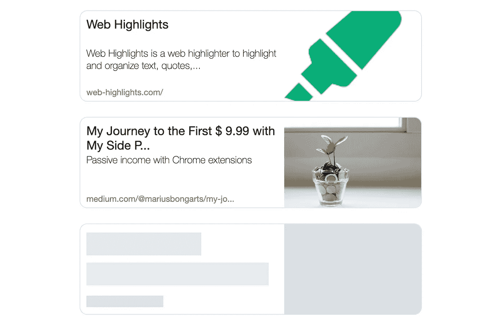
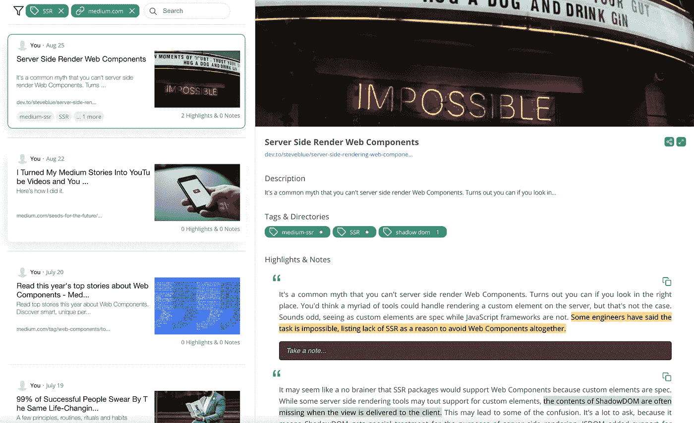

# 用 Web 组件构建漂亮的链接预览

> 原文：<https://javascript.plainenglish.io/building-a-beautiful-link-preview-with-web-components-bfbf7af71be4?source=collection_archive---------2----------------------->

## 从 URL 获取打开的图形数据以显示缩略图预览

Web Highlights Link Preview Component

*本文原载于* [*网集锦博客*](https://web-highlights.com/blog/) *。你可以在这里找到***。**

*最近，我改进了我的 [Web Highlights](https://web-highlights.com/) 应用仪表板的设计，为每个高亮页面显示一个链接预览。这是新设计的样子:*

**

*[Web Highlights](http://web-highlights.com/)dashboard*

*在这篇文章中，我想分享如何创建这样一个链接预览组件，并使网页出现缩略图。*

*如果你关注我的文章，你可能会知道我是 Web 组件的忠实粉丝。所以，当然，我也用 Web 组件构建了这个组件。*

*出于几个原因:*

*   *我可以在 Vue.js web 应用程序以及基于 web 组件的 Chrome 扩展中使用该组件。*
*   *架构封装得更好*
*   *任何人都可以重用该组件*

*假设你还没有被说服。嵌入应用程序就像在您的 web 应用程序中包含这几行代码一样简单:*

*你可以在这里找到一个[的演示。这里还有一个](https://web-highlights.github.io/webhighlights-link-preview/)[代码笔](https://codepen.io/marius2502/pen/zYWyPxe)展示了在任何地方使用链接预览是多么容易:*

*CodePen: Web Highlights Link Preview*

# *前端*

*对于组件的设计，我遵循了一个普通的中等做。预览卡包含标题、描述、链接和预览图像。以下是缩略图预览组件的外观:*

**

*Link Preview Component*

*此外，当从我们的 API 获取开放图形数据时，该组件显示了一些**加载**指示器，我们将在后面介绍。*

**

*Link Preview Component loading state*

*在本文中，我不会详细讨论 CSS 实现。但是你可以在这里找到 Github 库。请随意查看。*

## *构建 Web 组件*

*为了构建这个 web 组件，我创建了定制元素`webhighlights-link-preview`。为了让开发更容易，我使用了谷歌的 Lit 库。*

*我们通过使用 Lit 的`customElement` decorator 创建我们的定制元素，并提供一些反应性属性，使我们的元素可由客户端定制:*

*客户端必须提供一个`url`,我们将从我们的 API 中获取开放图形数据。此外，如果您想使用不同的 API，可以提供一个替代的`apiUrl` URL。*

*并非每个网站都提供开放图形元数据标签，以便在我们找不到给定 URL 的**标题**、**描述**或**图像**时，客户端可以提供一些后备数据。*

*此外，我们需要一个 reactive 属性来存储获取的相应 URL 的元数据:*

*`OpenGraphMetaData`接口定义了我们期望从 API 获得的对象。看起来是这样的:*

*因此，如果您想创建自己的 API，您需要让您的服务器响应适应这个`OpenGraphMetaData`接口，并在 components `apiUrl`属性中提供端点的 URL。*

*此外，我们需要知道组件是否应该显示文本加载指示器。在这种情况下，只要我们的`metaData`属性是`undefined`，我们就想显示它。为了在模板中检查这一点，我们创建了一个简单的 getter:*

*现在，在模板中，我们可以有条件地添加一些 CSS 类，使我们的组件显示一个加载状态，这取决于`metaData`是仍在从服务器获取还是已经被加载:*

# ***获取打开的图形数据***

*为了获得预览所需的所有数据，我们必须从相应的 URL 中获取 Open Graph 元数据标签。如果您不熟悉开放图协议，您应该先看看这篇文章:*

* [## 让你的网站有一个漂亮的缩略图链接预览

### 理解并应用开放图协议到你的网站。最近，我试图找出如何使链接…

web-highlights.com](https://web-highlights.com/blog/turn-your-website-into-a-beautiful-thumbnail-link-preview/) 

使用像 [OpenGraph.io](https://www.opengraph.io/) 这样的 API 可以获得必要的数据。使用这样的 API，我们不需要创建服务器来获取数据。不幸的是，大多数 API 的请求数量有限。例如，OpenGraph.io 将其限制为 100 个请求。

由于我不想为获取开放图形数据支付任何费用，所以我创建了一个简单的 Netlify 函数，使用开源的 **openGraphScraper** 库获取开放图形数据。这个库是一个简单的节点模块，用于抓取任何网站的开放图形。

在生产中，我为我的 [Web Highlights](http://web-highlights.com/) 应用程序使用普通的服务器环境，因为我还想提供一些服务器端缓存来减少加载时间。但是，对于这个例子，一个简单的 Netlify 函数应该就可以了。

我们可以通过从库中导入`ogs`对象来获得任何 URL 的开放图形数据:

然后像这样获取数据:

之后，我们通过使用适配器函数将接收到的`SuccessResult`接口适配到我们期望的`OpenGrapgMetaData`接口:

下面是 Netlify 处理程序的样子:

现在，在我们的前端，我们可以通过从端点获取所需的元数据:* 

# *最后的想法*

*感谢阅读这篇文章。我希望你能按照我的建议来构建你自己的链接预览组件，或者重用我们在这里创建的组件。请注意，我不能保证所提供的 Netlifiy API 将永远可用。因此，如果您计划在生产中使用该组件，请确保提供您自己的端点。*

*我总是乐于回答问题，并乐于接受批评。随时欢迎联系我！通过**[**LinkedIn**](https://www.linkedin.com/in/marius-bongarts-6b3638171/)**，**关注我**[**Twitter**](https://twitter.com/MariusBongarts)或 [**订阅**](https://medium.com/subscribe/@mariusbongarts) 通过电子邮件获取我的故事。*****

*****[**这里是无限制访问媒体上每一个内容的链接**](https://medium.com/@mariusbongarts/membership) **。如果你使用这个链接注册，我会赚一小笔钱，不需要你额外付费。*******

***** [## 通过我的推荐链接加入 Medium-Marius bong arts

### 作为一个媒体会员，你的会员费的一部分会给你阅读的作家，你可以完全接触到每一个故事…

medium.com](https://medium.com/@mariusbongarts/membership)***** 

# *****关于作者*****

*****我是埃森哲软件工程分析师宋。最驱动我的是我想创造一些可能对他人有帮助并改变他人生活的东西的冲动。*****

*****比如你是否厌倦了浏览自己的历史来寻找前几天看到的信息？我的 [**网站重点介绍 Chrome 扩展**](https://chrome.google.com/webstore/detail/web-highlights-%20-bookmark/hldjnlbobkdkghfidgoecgmklcemanhm) 覆盖了你，并将通过以结构化和高效的方式组织你的研究来提高你的生产力。就像你在书和文章上做的那样，突出显示任何网页或 PDF 上的文本。你的精彩片段会直接同步到 web-highlights.com[的网络应用上，你可以在任何地方找到它们。](https://web-highlights.com/)*****

******更多内容看* [***说白了就是 io***](https://plainenglish.io/) *。报名参加我们的* [***免费周报***](http://newsletter.plainenglish.io/) *。关注我们关于* [***推特***](https://twitter.com/inPlainEngHQ) ， [***领英***](https://www.linkedin.com/company/inplainenglish/) *，*[***YouTube***](https://www.youtube.com/channel/UCtipWUghju290NWcn8jhyAw)*[***不和***](https://discord.gg/GtDtUAvyhW) *。*******