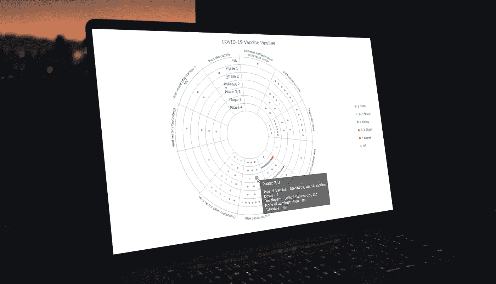
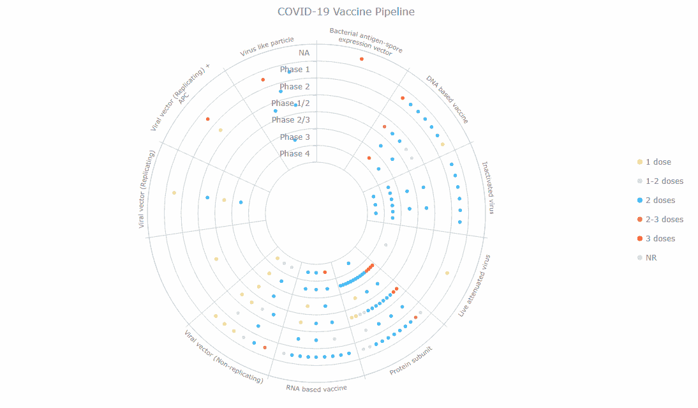
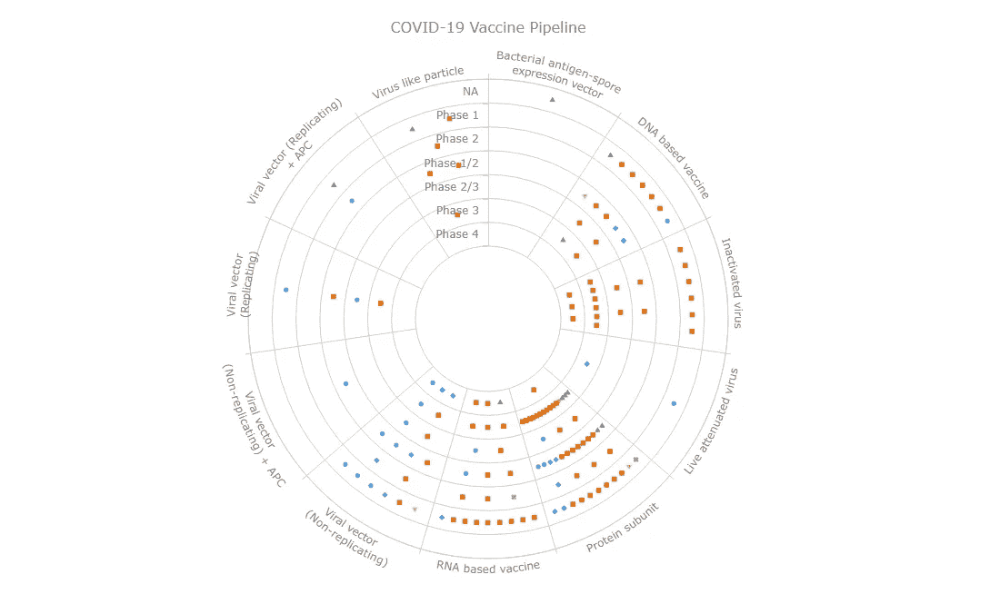
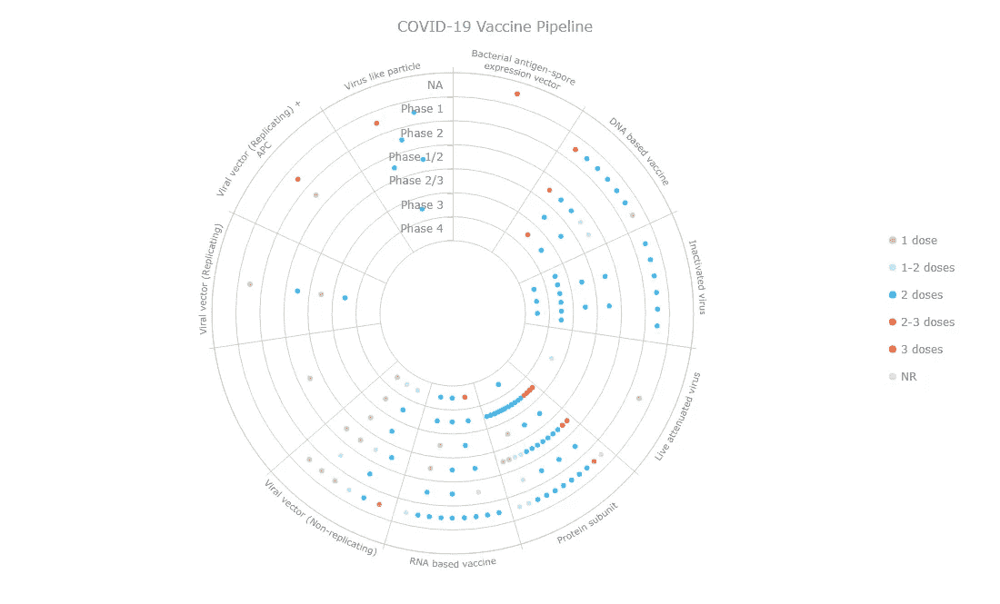
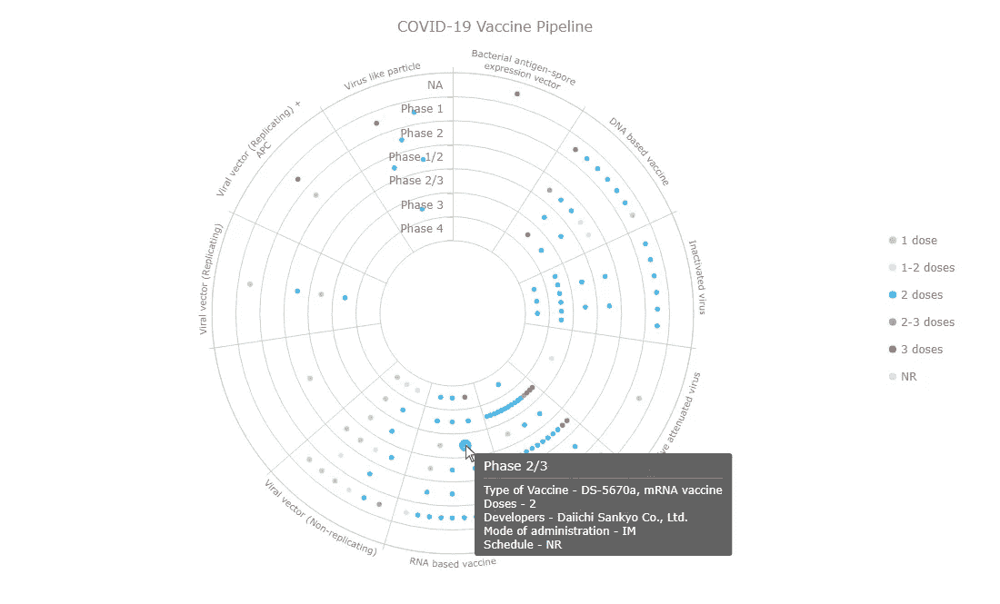

# 构建 JS 中的靶心图:新冠肺炎疫苗管道

> 原文：<https://javascript.plainenglish.io/building-a-bullseye-chart-in-js-covid-19-vaccine-pipeline-bd70ff81ba24?source=collection_archive---------16----------------------->

## 了解如何用 JavaScript 创建牛眼图，并探索新冠肺炎疫苗管道中来自世卫组织的可视化数据。



靶心图通过一组同心环可视化数据，广泛用于药物管道和临床试验数据分析。本教程将解释如何用 JavaScript 创建这种类型的图表。更重要的是，您将看到一个出色的、典型的交互式靶心图实例！

我从世卫组织的疫苗追踪系统中整理了目前正在进行临床研究的所有新冠肺炎候选疫苗的详细信息。现在，请和我一起在一个基于 JS 的交互式靶心图中，按照疫苗类型和开发阶段来绘制！

# 靶心图预览

您想知道生成的图表是什么样子吗？下面先睹为快！接下来，您将学习如何构建这个迷人的基于 JavaScript 的靶心图，该图展示了新冠肺炎疫苗的概况！



# 构建 JavaScript 牛眼图

使用 JavaScript 创建牛眼图的过程可以分为四个基本步骤:

1.  创建一个 HTML 页面。
2.  包括脚本。
3.  连接数据。
4.  做一些 JavaScript 编码。

现在，一步一步地检查它在现实中是如何进行的！

## 1.创建基本的 HTML 页面

我做的第一件事是用一个块级 HTML 元素(`<div>`)创建一个基本的 web 页面来保存未来的牛眼图。

为了在后面的代码中方便地引用`<div>`元素，我为它提供了一个`id`值。

我还将其`height`和`width`参数设置为 100%。因此，我的牛眼图将呈现在整个 HTML 页面上。

```
<html>
  <head>
    <title>JavaScript Bullseye Chart</title>
    <style type="text/css">      
      html, body, #container { 
        width: 100%; height: 100%; margin: 0; padding: 0; 
      } 
    </style>
  </head> <body>
    <div id="container"></div>
  </body>
</html>
```

## 2.包括脚本

现在，我需要引用所有将用于创建我心目中的靶心图的脚本。这将转到页面的`<head>`部分。

有许多 JavaScript 图表库，它们是预先编写的 JavaScript 代码的集合，旨在促进数据可视化的开发。但是，并不是所有的都支持牛眼图。拥有这种类型图表的其中一个是 AnyChart，它对于非商业用途是免费的，并且入门非常简单，所以我决定在本教程中使用它作为例子。

为了制作靶心图，我需要库的[核心](https://docs.anychart.com/Quick_Start/Modules#core)和[极地](https://docs.anychart.com/Quick_Start/Modules#polar)模块。

```
<html>
  <head>
    <title>JavaScript Bullseye Chart</title>
    <script src="https://cdn.anychart.com/releases/8.11.0/js/anychart-core.min.js"></script>
    <script src="https://cdn.anychart.com/releases/8.11.0/js/anychart-polar.min.js"></script>
    <style type="text/css">      
      html, body, #container { 
        width: 100%; height: 100%; margin: 0; padding: 0; 
      } 
    </style>
  </head> <body>  
    <div id="container"></div>
    <script>
 ***// All the JS bullseye chart code goes here.***    </script>
  </body>
</html>
```

## 3.连接数据

所以。我从世界卫生组织网站的[新冠肺炎疫苗跟踪器和景观](https://www.who.int/publications/m/item/draft-landscape-of-covid-19-candidate-vaccines)部分获取疫苗数据，并将其整理成 JSON [文件](https://gist.githubusercontent.com/shacheeswadia/3cc96d8ed792bfa0c04fbd3825816fde/raw/606c2646df568f30bd39dc01fcd4efe6e92b3bac/vaccineData.json)。

为了加载数据文件，我将使用一个方便的[数据适配器](https://docs.anychart.com/Working_with_Data/Data_Adapter/Overview)实用程序。所以我把它和其他脚本一起引用。然后我将简单地使用`data.loadJsonFile`函数连接数据集。

现在我们已经有了可视化的持有者页面、脚本和数据，让我来告诉你如何编写一个可爱的交互式 JavaScript 靶心图！

## 4.做一些 JS 编码

虽然靶心图可能看起来很奇特，但是使用 JavaScript 图表库构建这样的数据可视化并不复杂。我将解释每一个动作，并在代码本身中留下解释性说明。

因此，首先，我添加了一个包含所有代码的函数，这确保了它里面的所有内容只有在页面准备好之后才会执行，然后从 JSON 文件中加载数据。

```
anychart.onDocumentReady(function () {
  anychart.data.loadJsonFile(    "https://gist.githubusercontent.com/shacheeswadia/3cc96d8ed792bfa0c04fbd3825816fde/raw/606c2646df568f30bd39dc01fcd4efe6e92b3bac/vaccineData.json",
    function (data) {...}
  );
});
```

然后，我创建了一个极坐标图实例。

```
var chart = anychart.polar();
```

我希望我的靶心图在中心有一个洞，所以我设置了内半径。

```
chart.innerRadius(80);
```

接下来，我指定 Y 量表(用于临床研究阶段)和 X 量表(用于疫苗类型)作为序号，并定义我希望这些值出现的顺序。

```
***// y scale shows phases
// set it as ordinal***
chart.yScale("ordinal");***// define the order of values on the scale***
chart
  .yScale()
  .values([
    "Phase 4",
    "Phase 3",
    "Phase 2/3",
    "Phase 1/2",
    "Phase 2",
    "Phase 1",
    "NA"
  ]);***// x scale shows vaccine types
// set it as ordinal***
chart.xScale("ordinal");***// define the order of values on the scale***
chart
  .xScale()
  .values([
    "Bacterial antigen-spore expression vector",
    "DNA based vaccine",
    "Inactivated virus",
    "Live attenuated virus",
    "Protein subunit",
    "RNA based vaccine",
    "Viral vector (Non-replicating)",
    "Viral vector (Non-replicating) + APC",
    "Viral vector (Replicating)",
    "Viral vector (Replicating) + APC",
    "Virus like particle"
  ]);
```

之后，我添加了一个函数，该函数将设置具有给定属性的系列，创建一个标记系列(一个标记将代表一种疫苗)，根据剂量数美化要显示的系列名称，设置系列大小、名称、id，最后返回系列。

```
***// set a series with the given properties***
function createSeries(seriesId) {
 ***// create a series***
  const series = chart.marker(); ***// the name for display is beautified***
  const seriesName =
    seriesId +
    (seriesId == "NR" ? "" : seriesId == 1 ? " dose" : " doses"); ***// set the size, name, id*** 
  series.size(2).name(seriesName).id(seriesId); return series;
}
```

接下来，我创建一个函数，它将负责添加带有给定数据的标记序列。首先，我将数据中的剂量数设置为系列 ID。然后，我检查这样一个系列是否已经存在，如果不存在，我使用之前配置的函数创建一个具有系列 ID 的系列。之后，我将数据添加到序列中，并指定`x`和`y`值，这样疫苗的类型在 X 刻度上，临床试验阶段在 Y 刻度上。最后，一旦定义了函数，我就逐点遍历数据集。

```
***// add a marker series with the given data*** function addPoint(item) {
 ***// the number of doses is a series id***  const seriesId = item["Number of doses"]; ***// check if there is a series like we need***  var series = chart.getSeries(seriesId); ***// if there is no such series we create and configure it***  if (series == null) {
    series = createSeries(seriesId);
  } ***// add the data into the series***  series
    .data()
    .getDataSets()[0]
    .append({
      x: item["Vaccine platform description"],
      y: item["Phase"],
      ...item
    });
}***// loop through the dataset
// point by point*** data.forEach((vaccine) => addPoint(vaccine));
```

由于我在牛眼图中可视化的数据量很大，并且在图的几乎每个部分都有多个点，所以我平均分布标记以避免重叠。

```
***// spread bullets throughout a sector*** chart.spreadValues("valueEqual");
```

快好了！我做的最后一件事是添加一个标题，并在容器中绘制最终的靶心图。

```
***// set the chart title*** chart.title("COVID-19 Vaccine Pipeline");***// set the chart container id*** chart.container("container");***// draw the resulting bullseye chart*** chart.draw();
```

就是这样！一个令人惊叹的基于 JS 的交互式靶心图只需要几行代码就可以完成了！



牛眼图显示，目前临床研究中的绝大多数新冠肺炎疫苗属于蛋白质亚单位类型。其中一些已经处于第三阶段，看起来我们可以期待它们中的许多将很快上市。

这个(初始)JavaScript 靶心图的交互版本可以在 [CodePen](https://codepen.io/shacheeswadia/pen/eYeEopd) 和 [Playground](https://playground.anychart.com/A70XGZhc) 上获得，并带有完整的源代码。

# 自定义 JavaScript 牛眼图

现在，让我向您展示如何添加一些功能和美学上的更改，使这样一个基于 JavaScript 的牛眼图看起来更好看，更有见地。

## 1.修改标记

我想先调整一下标记的外观。

为了减少混乱，我把它们都显示为圆圈。

```
chart.markerPalette(["circle"]);
```

然后我定义一个自定义调色板。由于我的所有系列都是根据剂量数创建的，因此颜色会根据定义的调色板自动更新，其中每个标记的颜色都对应于系列类型。

```
chart.palette([
  "#dce778",
  "#c8e4fb",
  "#35baf6",
  "#ff8b66",
  "#f55d2c",
  "#e7cbeb"
]);
```

## 2.添加图例

我根据一个参数给标记着色，所以我最好给靶心图提供一个图例，说明每种颜色代表什么。

我定义图例并指定其位置、布局和对齐方式。

```
let legend = chart.legend();
legend.enabled(true);
legend.position("right");
legend.itemsLayout("vertical");
legend.align("center");
```

此外，图例项的类型和大小由负责设置系列的函数决定。

```
series.legendItem().iconType("circle").iconSize(8);
```

在 [CodePen](https://codepen.io/shacheeswadia/pen/eYeEopd) 和 [Playground](https://playground.anychart.com/A70XGZhc) 上可以获得带有修改标记和图例的新定制的 JavaScript 牛眼图。



## 3.改进工具提示

数据中有很多关于每种疫苗的信息，我想在工具提示中全部显示出来。这将使我的靶心图更加翔实。

我使阶段出现在工具提示的标题中，并且使用`getData`功能，我访问与每个数据点相关联的其他信息并且包括它。

```
chart
  .tooltip()
  .titleFormat("{%y}")
  .format(function () {
    return (
      "Type of Vaccine - " +
      this.getData("Type of candidate vaccine ") +
      "\n Doses - " +
      this.getData("Number of doses") +
      "\n Developers - " +
      this.getData("Developers ") +
      "\n Mode of administration - " +
      this.getData("Route of administration") +
      "\n Schedule - " +
      this.getData("Schedule")
    );
  });
```

瞧。一个迷人的和信息丰富的 JavaScript 靶心图已经完成了！交互式探索它，并在 [CodePen](https://codepen.io/shacheeswadia/pen/Bamdbxq) 或[操场](https://playground.anychart.com/NqbZnt3R/)上摆弄它的全部代码。



# 结论

牛眼图类型非常适合按阶段可视化临床研究等数据，现在您可以看到，用 JavaScript 创建非常简单。如果你有任何问题或建议，请告诉我。

我们希望世界能够摆脱致命的病毒和其他感染。但是，当我们到达目的地时，让我们接种疫苗，保持健康，创造一些激动人心的、有用的可视化效果！

***经沙奇·斯瓦迪亚许可发布最初于 2022 年 3 月 1 日出现在*** [***黑客正午***](https://hackernoon.com/how-to-create-bullseye-charts-with-js-covid-19-vaccine-pipeline) ***上，标题为“如何用 JS 创建牛眼图:新冠肺炎疫苗管道”。***

***参见其他***[***JavaScript 图表教程***](https://www.anychart.com/blog/category/javascript-chart-tutorials/) ***。***

[***联系我们***](https://www.anychart.com/support/) ***看看你是否有一个很酷的帖子。***

*原为 2022 年 3 月 25 日在*[*https://www.anychart.com*](https://www.anychart.com/blog/2022/03/25/bullseye-chart-js/)*发表。*

*更多内容请看*[***plain English . io***](https://plainenglish.io/)*。报名参加我们的* [***免费周报***](http://newsletter.plainenglish.io/) *。关注我们关于*[***Twitter***](https://twitter.com/inPlainEngHQ)*和*[***LinkedIn***](https://www.linkedin.com/company/inplainenglish/)*。加入我们的**[***社区不和谐***](https://discord.gg/GtDtUAvyhW) *。**