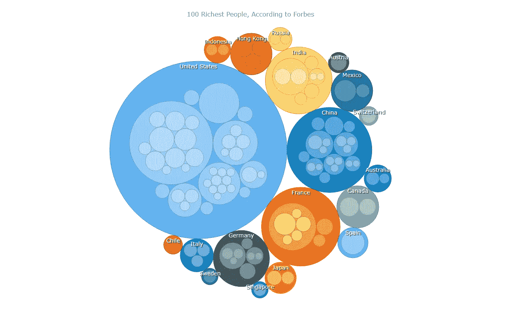

# 用 JavaScript 构建圆形包装图

> 原文：<https://javascript.plainenglish.io/building-a-circle-packing-chart-with-javascript-2ec9d4e51dc6?source=collection_archive---------10----------------------->


**圆形包装图**是一种常见的数据可视化技术，用于通过嵌套的圆形来表示分层组织的数据。由于与使用嵌套矩形的[树形图](https://www.anychart.com/chartopedia/chart-type/treemap/)相似，有时它被称为圆形树形图。美国数学家威廉·瑟斯顿于 1985 年将圆填充引入数据分析，它极大地揭示了数据的层次结构。

我想展示如何在 JavaScript 的帮助下轻松构建一个优雅的交互式圆形包装图！在这个循序渐进的教程中，我们将根据福布斯亿万富翁排行榜，按国家和行业列出 2022 年世界上最富有的 100 个人。所以，收拾好你的行李，做好准备，因为你的大脑会变得稍微丰富一些！

# 圈出将要创建的包装图

让我演示一下我们的 JavaScript circle 包装图完成后的样子。而且会互动！一旦你完成本教程，你将完全有能力在你自己的圆形包装图中快速可视化你自己的数据。


现在，让我们开始制作吧！

# 用 JavaScript 实现基本圆形包装图

尽管这不是必需的，但是掌握一些 HTML、CSS 和 JavaScript 的知识会让你更容易理解这些概念。不过，就算你是个彻头彻尾的新手，也没必要慌张。当我们完成时，你将学会如何自己制作圆形包装图，因为我们将深入检查每个步骤。

任何 JavaScript 图表，包括我们的圆形包装图，都可以通过四个常规步骤创建:

1.  准备一个网页。
2.  包括所有必要的 JS 文件。
3.  加载您的数据。
4.  写一些 JavaScript 图表代码。

让我们更详细地探索这些步骤，以准备一个惊人的基于 JS 的交互式圆形包装图。

## 1.准备网页

首先，我们需要一个圆形包装图的位置。

如果你还没有网页，就建立一个。在那里，通过添加一个具有唯一 ID 的 HTML 块元素来创建一个容器。此外，为该元素指定一些 CSS 规则，以定义图表的显示方式。

以下是我的 HTML 页面的外观:

```
<!DOCTYPE html>
<html lang="en">
  <head>
    <meta charset="utf-8">
    <title>Circle Packing Chart in JavaScript</title>
    <style type="text/css">      
      html, body, #container { 
        width: 100%; 
        height: 100%; 
        margin: 0; 
        padding: 0; 
      } 
    </style>
  </head>
  <body>
    <div id="container"></div>
  </body>
</html>
```

在我的例子中，block 元素是`<div>`。它的 ID 是`container`。将`width`和`height`属性设置为 100%，将`margin`和`padding`设置为 0，会使圆形包装图出现在整个页面中；但是你可以根据自己的情况来定义所有你认为合适的东西。

## 2.包括所有必要的 JS 文件

接下来，我们需要在`<head>`部分引用所有必要的 JavaScript 文件。

当你[利用正确的数据可视化工具](https://www.anychart.com/blog/2017/03/05/how-to-choose-the-right-javascript-charting-component-10-factors-you-have-to-consider/)时，创建一个圆形包装图将不会像想象中那么困难或耗时。对于本教程，我选择使用 [AnyChart JS 图表](https://www.anychart.com/)。它是少数几个支持开箱即用的 circle packing charts 的 JavaScript 图表库之一，并且对初学者友好，因为它提供了大量现成可用的[示例](https://www.anychart.com/products/anychart/gallery/)，并且有完整的[文档](https://docs.anychart.com/)。

要添加所需的 JavaScript 文件，我们有两种选择:本地下载或从内容交付网络(CDN)使用。让我们选择第二个。添加用于制图的[核心](https://docs.anychart.com/Quick_Start/Modules#core)和[圆包装](https://docs.anychart.com/Quick_Start/Modules#circle_packing)脚本。此外，如果您要可视化文件中的数据，就像我在这种情况下一样，包括[数据适配器](https://docs.anychart.com/Working_with_Data/Data_Adapter/Overview)模块以方便数据加载。JS 代码本身将被放在`<body>`部分的`<script>`标签中(也可以在`<head>`部分设置)。

下面是我当前的 HTML 页面:

```
<!DOCTYPE html>
<html lang="en">
  <head>
    <meta charset="utf-8">
    <title>Circle Packing Chart in JavaScript</title>
    <script src="https://cdn.anychart.com/releases/8.11.0/js/anychart-core.min.js"></script>
    <script src="https://cdn.anychart.com/releases/8.11.0/js/anychart-circle-packing.min.js"></script>
    <script src="https://cdn.anychart.com/releases/8.11.0/js/anychart-data-adapter.min.js"></script>
    <style type="text/css">      
      html, body, #container { 
        width: 100%; 
        height: 100%; 
        margin: 0; 
        padding: 0; 
      } 
    </style>
  </head>
  <body>
    <div id="container"></div>
    <script>
 ***// The JS Circle Packing Chart’s code will be written here.***    </script>
  </body>
</html>
```

## 3.加载您的数据

现在是添加数据的时候了。

我想可视化福布斯最富有的人的排名数据，[福布斯亿万富翁 2022](https://www.forbes.com/billionaires/) ，其中包括他们的净资产，国家，财富来源和行业的信息。我已经从上面的链接中提取了 100 个最富有的人的数据，并保存在一个 [JSON 文件](https://gist.githubusercontent.com/awanshrestha/ff3ae5c08238b1f4f950f022aaad2f6f/raw/3766915befaeea7a32f3d41fdc2ece110e7543d7/circle-packing-chart.json)中。(可以随意使用其他[支持的数据格式](https://docs.anychart.com/Working_with_Data/Supported_Data_Formats)，只要确保数据的设置方式符合[圆形包装图](https://docs.anychart.com/Basic_Charts/Circle_Packing_Chart#data)的数据说明。)

为了正确加载数据，准备使用`anychart.data.loadJsonFile()`功能。像这样:

```
anychart.data.loadJsonFile('https://gist.githubusercontent.com/awanshrestha/ff3ae5c08238b1f4f950f022aaad2f6f/raw/3766915befaeea7a32f3d41fdc2ece110e7543d7/circle-packing-chart.json');
```

现在，只剩下几行 JavaScript 代码来完成圆形包装图！

## 4.编写一些 JavaScript 图表代码

最后，我们需要一些 JavaScript 代码来创建圆形包装图。

添加`anychart.onDocumentReady()`函数，它将包含整个图表的 JS 代码。它确保代码在页面完全加载之前不会运行。

```
<script>
   anychart.onDocumentReady(function () {
  ***// The JS Circle Packing Chart's code will be written here.*** </script>
```

如步骤 3 所示加载 JSON 数据文件，并添加数据。

```
<script>

  anychart.onDocumentReady(function () {

 ***// load a json data file*** anychart.data.loadJsonFile('https://gist.githubusercontent.com/awanshrestha/ff3ae5c08238b1f4f950f022aaad2f6f/raw/3766915befaeea7a32f3d41fdc2ece110e7543d7/circle-packing-chart.json',
      function(data) {

 ***// add the data***        var treeData = anychart.data.tree(data, 'as-table');

      }
    ); });</script>
```

使用`circlePacking()`函数创建一个圆形包装图实例，将数据集传递给它。

```
***// create a circle packing chart instance*** var chart = anychart.circlePacking(treeData);
```

最后，给图表一个标题，将它放入之前指定的容器中，并使用`draw()`命令显示它。

```
***// add a chart title*** chart.title("Forbes Top 100 Richest people");
***// specify the container element id*** chart.container('container')
***// initiate the drawing of the chart*** chart.draw();
```

Tada！基于 JavaScript 的圆形包装图准备好了！



你可以在 [AnyChart Playground](https://playground.anychart.com/U15jLGZ6) 图表上找到这个简单的 JavaScript 圆形包装图的交互版本以及源代码。请随意尝试。

为了您的方便，我还会将完整的圆形包装图代码放在下面。

```
<!DOCTYPE html>
<html lang="en">
  <head>
    <meta charset="utf-8">
    <title>Circle Packing Chart in JavaScript</title>
    <script src="https://cdn.anychart.com/releases/8.11.0/js/anychart-core.min.js"></script>
    <script src="https://cdn.anychart.com/releases/8.11.0/js/anychart-circle-packing.min.js"></script>
    <script src="https://cdn.anychart.com/releases/8.11.0/js/anychart-data-adapter.min.js"></script>
    <style type="text/css">
      html,
      body,
      #container {
        width: 100%;
        height: 100%;
        margin: 0;
        padding: 0;
      }
    </style>
  </head>
  <body>
    <div id="container"></div>
    <script> anychart.onDocumentReady(function () {

 ***// load a json data file*** anychart.data.loadJsonFile('https://gist.githubusercontent.com/awanshrestha/ff3ae5c08238b1f4f950f022aaad2f6f/raw/3766915befaeea7a32f3d41fdc2ece110e7543d7/circle-packing-chart.json',
          function(data) {

 ***// add the data***            var treeData = anychart.data.tree(data, 'as-table');

 ***// create a circle packing chart instance***            var chart = anychart.circlePacking(treeData);

 ***// add a chart title***            chart.title("Forbes Top 100 Richest people");

 ***// specify the container element id***            chart.container('container');

 ***// initiate the drawing of the chart***            chart.draw();

          }
        ); });

    </script>
  </body>
</html>
```

我们可以立即从圆形包装图中推断出，大多数顶级亿万富翁来自美国，其次是中国。与此类似，我们也可以获得有关行业和净值金额的见解。

但是，这只是 JS 圈包装图的基础版。图形可以进一步定制，看起来更好(仍然没有太多的麻烦)

# JavaScript 高级圆形包装图

到目前为止用 JS 创建的圆形包装图看起来已经很顺眼了。但偶尔，体面是不够的。此外，在某些情况下，您可能需要调整图表的外观和功能。

幸运的是，您可以轻松定制圆形包装图表，以满足您的需求和口味。现在，我将演示一些您可能也想进行的快速定制，以改善可视化效果:

A.自定义工具提示。

B.自定义外观。

C.自定义标题。

D.自定义标签。

## A.自定义工具提示

当我们将鼠标悬停在圆圈上时，会显示净值。让我们自定义工具提示，使其包含更多信息。

```
chart
  .tooltip()
  .useHtml(true)
  .format(function () {
    var src = this.item.get('industry');
    if (src) {
      return '<div>'
        + '<span>Name: ' + this.name + '</span><br/>'
        + '<span>Net worth in billions USD:' + this.value + '</span><br/>'
        + '<span>Source: ' + this.item.get('source') + '</span>'
        + '</div>'
    }
    return '<span>Total net worth: ' + this.value.toFixed(2) + ' billion USD</span>';
  });
```

现在我们可以清楚地看到亿万富翁圈子的名字、净值和财富来源，以及行业和国家集团的总净值。

## B.自定义外观

默认情况下，图表的背景颜色是白色。我们换成灰色吧。使用`background()`功能很容易做到这一点。

让我们使用`stroke()`函数稍微增加圆形边框的厚度。

```
***// customize the background*** chart.background('#f6f6f6');
***// customize the stroke*** chart
  .stroke(function () {
    return {
      thickness: 1,
    };
  });
***// customize the stroke in the hovered state*** chart
  .hovered()
  .stroke(function () {
    return {
      thickness: 2,
    };
  });
```


这款 JS 圈包装的互动版在 [AnyChart 游乐场](https://playground.anychart.com/ZwCauFfE)有售。根据你的喜好改变颜色。

## C.自定义标题

图表标题很容易增强。跟着我，我只需启用 HTML 并更改字体颜色、大小和粗细:

```
chart
  .title()
  .enabled(true)
  .useHtml(true)
  .text(
    '<span style = "color: #112B3C; font-weight: 600; font-size: 18px;">100 Richest People, According to Forbes</span>'
  );
```

这是标题增强后圆形包装图的外观:

## D.自定义标签

目前，国家名称以默认格式显示。让我们自定义它们，使它们以更优雅的方式出现在框中:

```
chart
  .labels()
  .fontSize('14')
  .fontColor('#696969')
  .textShadow('none')
  .anchor('center-top').offsetY('-3%');

chart.labels()
  .background()
  .enabled(true)
  .fill("#f6f6f6 0.8")
  .stroke("#888888")
  .corners(5);
```

圆形包装图现在看起来非常经典漂亮。为什么不会呢？毕竟，它正被用来可视化拥有数十亿资产的人！


这个最终的 JavaScript circle 包装图的完整源代码可以在下面找到，也可以在 [AnyChart 游乐场](https://playground.anychart.com/UFPukRgn)上找到。

```
<!DOCTYPE html>
<html lang="en">
  <head>
    <meta charset="utf-8">
    <title>Circle Packing Chart in JavaScript</title>
    <script src="https://cdn.anychart.com/releases/8.11.0/js/anychart-core.min.js"></script>
    <script src="https://cdn.anychart.com/releases/8.11.0/js/anychart-circle-packing.min.js"></script>
    <script src="https://cdn.anychart.com/releases/8.11.0/js/anychart-data-adapter.min.js"></script>
    <style type="text/css">
      html,
      body,
      #container {
        width: 100%;
        height: 100%;
        margin: 0;
        padding: 0;
      }
    </style>
  </head>
  <body>
    <div id="container"></div>
      <script>

anychart.onDocumentReady(function () {

 ***// load a json data file*** anychart.data.loadJsonFile('https://gist.githubusercontent.com/awanshrestha/ff3ae5c08238b1f4f950f022aaad2f6f/raw/3766915befaeea7a32f3d41fdc2ece110e7543d7/circle-packing-chart.json',
    function(data) {

 ***// add the data***      var treeData = anychart.data.tree(data, 'as-table');

 ***// create a circle packing chart instance***      var chart = anychart.circlePacking(treeData);

 ***// customize the tooltip***      chart
        .tooltip()
        .useHtml(true)
        .format(function () {
          var src = this.item.get('industry');
          if (src) {
            return '<div>'
              + '<span>Name: ' + this.name + '</span> <br/>'
              + '<span>Net worth in Billions: ' + this.value + '</span> <br/>'
              + '<span>Source: ' + this.item.get('source') + '</span>'
              + '</div>' 
          }
          return '<span>' + this.value.toFixed(2) + ' Billion Dollars </span>';
        );

 ***// add a chart title***      chart
      .title()
      .enabled(true)
      .useHtml(true)
      .text(
        '<span style = "color: #112B3C;font-weight:600;font-size:18px;">Forbes Top 100 Richest People</span>'
      );

 ***// customize the appearance***      chart.background('#f6f6f6');
      chart
        .hovered()
        .stroke(function () {
          return {
            thickness: 2,
          };
        });
      chart
        stroke(function () {
          return {
            thickness: 1,
          };
        });

 ***// customize the labels (country names)***      chart
        .labels()
        .fontSize('14')
        .fontColor('#696969')
        .textShadow('none')
        .anchor('center-top').offsetY('-3%');

      chart.labels()
         .background()
         .enabled(true)
         .fill("#f6f6f6 0.8")
         .stroke("#888888")
         .corners(5); 

 ***// specify the container element id***      chart.container('container');

 ***// initiate the drawing of the chart***      chart.draw();

    }
  );});

    </body>
  </script>
</html>
```

# 结论

太棒了。我们的 JavaScript 圆形包装图已经构建好了。这个过程很简单，对吧？现在，开始创建您自己的 JavaScript 圆形包装图可视化吧！[圆形包装图文档](https://docs.anychart.com/Basic_Charts/Circle_Packing_Chart)和[圆形包装图示例](https://www.anychart.com/products/anychart/gallery/Circle_Packing/)分别为您提供进一步的指导和启发。

此外，还有大量其他的[图表类型](https://docs.anychart.com/Quick_Start/Supported_Charts_Types)可供使用，不要害怕查看它们。你会惊奇地发现，你也可以轻松地用 JS 构建它们！

最后，请不要犹豫询问或提出建议。我期待着看到您将创建的 JavaScript circle 包装图表！

***感谢 Awan Shrestha 贡献了这个超赞的圆形包装图教程！***

***不要错过我们的***[***JavaScript 图表教程***](https://www.anychart.com/blog/category/javascript-chart-tutorials/) ***其他图表类型。***

准备好为我们的博客写一篇这样酷的客座博文了吗？请 [***取得联系***](https://www.anychart.com/support/) ***告诉我们你的想法！***

*原载于*[***www.anychart.com***](https://www.anychart.com/blog/2022/09/08/circle-packing-chart/)*2022 年 9 月 8 日。*

*更多内容请看*[***plain English . io***](https://plainenglish.io/)*。报名参加我们的* [***免费周报***](http://newsletter.plainenglish.io/) *。关注我们关于*[***Twitter***](https://twitter.com/inPlainEngHQ)[***LinkedIn***](https://www.linkedin.com/company/inplainenglish/)*[***YouTube***](https://www.youtube.com/channel/UCtipWUghju290NWcn8jhyAw)***，以及****[***不和***](https://discord.gg/GtDtUAvyhW) *对成长黑客感兴趣？检查* [***电路***](https://circuit.ooo/) ***。*****