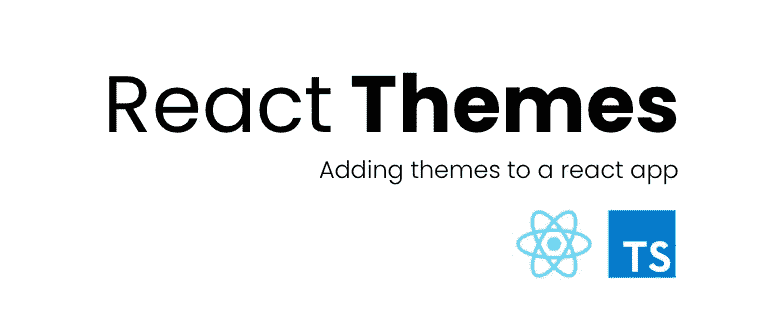
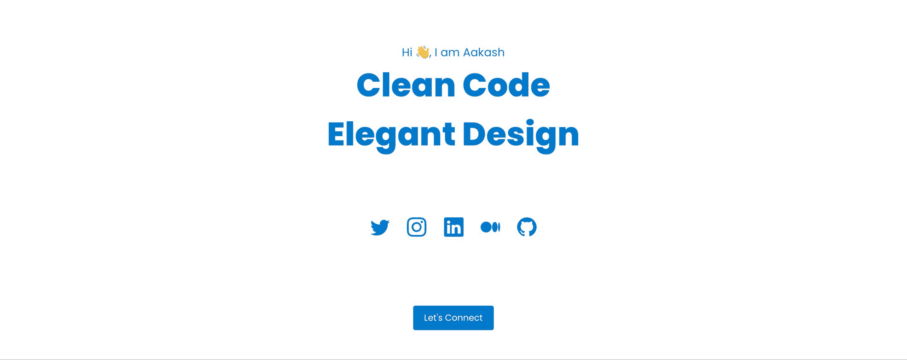
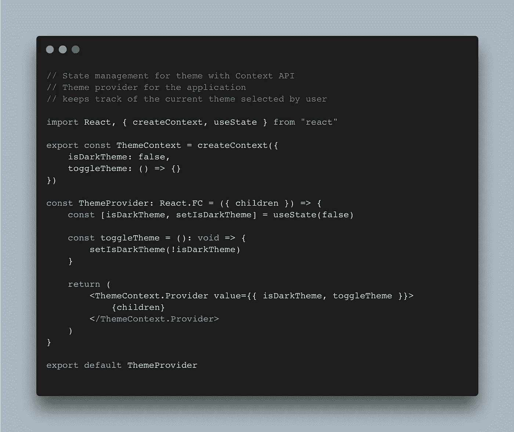
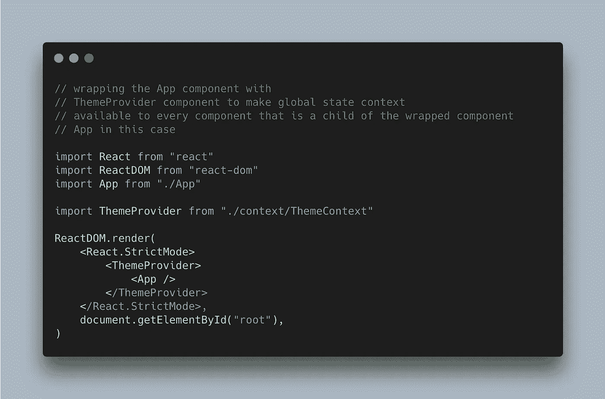
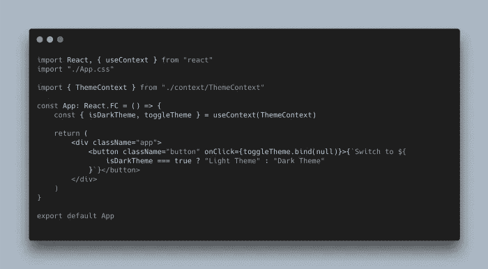
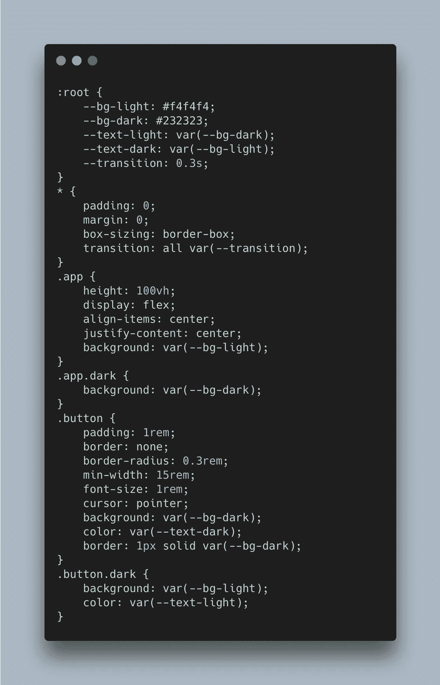
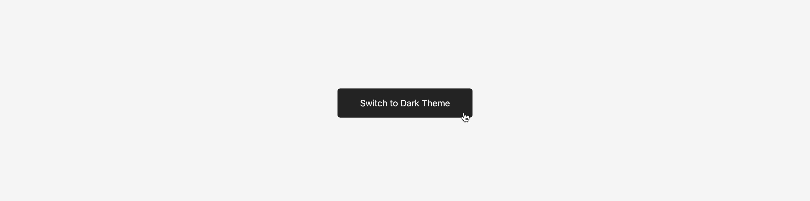

# 使用 React 的上下文 API 构建自定义主题提供程序

> 原文：<https://javascript.plainenglish.io/building-a-custom-theme-provider-using-reacts-context-api-4e10de8eaf43?source=collection_archive---------1----------------------->

## 在 React 应用中添加对切换主题的支持——没有库，从零开始，以简单的方式。

老实说，在任何应用程序中，主题都是一个非常好的小特性。以 VS 代码甚至 GitHub 为例。他们给用户自由，按照用户想要的方式定制应用程序。你想要黑暗主题吗？好吧！哦不，我想要一个高对比度的主题…好吧，你有了！尽管有不同的主题可供选择很有趣，但这个小特性实际上是一个至关重要的可访问性特性。对吗？

在开始向我们的 React 应用程序添加替代主题之前，我想指出的是，尽管有各种各样的库(如 MUI 和 Antd)可用于添加主题，但了解如何从头开始总是一个好主意。

和往常一样，您可以在支持的 GitHub 资源库中找到本文的完整代码:

 [## GitHub-the-dev designer/react-themes:构建主题提供程序并为 React 添加主题支持…

### 构建主题提供程序，并向 React 应用程序添加主题支持，无需任何外部库。支持存储库…

github.com](https://github.com/the-devdesigner/react-themes) 

# 在引擎盖下寻找🔍

无论如何，主题在任何应用程序中实际上是如何工作的？不是整体的深入工作而是高水平的？为了使事情非常非常简单，让我们假设我们的应用程序只是一个简单的`index.html`页面，只有一个`style.css`样式表。加载页面时，样式表也会加载，并带有所有预定义的样式和属性。现在，我决定将主题改为更暗的版本(灯光主题是默认的)，这意味着我以某种方式将所有的灯光颜色改为更暗的颜色——动态地。只要页面没有刷新，我就有我的黑暗主题。

# 让我们进一步简化💁‍♂️

1.  我们知道，在页面刷新时，我们会丢失我们的黑暗主题，这意味着应该有一些适当的状态管理，对吗？毕竟，我们的应用程序必须不断地知道用户将主题从亮/默认改为暗。
2.  那么我们也必须有某种方式来提供这种输入——一个按钮或一个开关。
3.  而且肯定的是，CSS 是为黑暗版本定义的。

# 设置我们的项目💻

1.  要开始，我们需要一个 React 应用程序。我使用 TS 和 react，所以我将运行`npx create-react-app <app-name> --template typescript`来获得一个基本的 React 应用程序和类型脚本。如果不使用 TS，运行相同的命令；只需移除`--template typescript`。
2.  一旦基本的应用程序完成，如果你愿意，继续清理你的项目目录——删除不需要的文件，切换到 ES6 方式定义组件(这是我更喜欢做的)。
3.  我们最常使用的两个默认文件是`App.tsx`和`App.css`。
4.  为了管理全局主题状态(姑且称之为全局主题状态)，我们将使用 React 附带的上下文 API。我们稍后将为此创建一个`ThemeContext.tsx`。关于是否应该使用上下文，可能会有不同意见。对我来说，它是 React 中状态管理的上下文。

# 编码时间到了🚀

为了简单起见，我们将从在我们的`App.tsx`文件中添加一个`Button`开始，它也将是我们用来在亮(默认)和暗主题之间切换的按钮。

# ThemeContext.tsx

让我们首先创建 ThemeContext，然后在应用程序中使用它。这里我们声明`isDarkTheme`状态，默认设置为`false`。然后我们有一个`toggleTheme()`函数，它本质上翻转了`isDarkTheme`标志的值。这个状态将负责应用程序中所有主题相关的魔法，因为所有相关的 css 都将基于它被应用/删除。

**ThemeContext.tsx** — global state management for theme using React’s Context API

# index.tsx

要使用我们的`isDarkTheme`标志和`toggleTheme()`函数，我们必须首先用`ThemeProvider`组件包装`App`组件。

**index.tsx** — Wrapping the highest component with **ThemeProvider**

# App.tsx

现在我们引入了`useContext`钩子，并将`ThemeContext`作为参数传递给钩子，以使用我们的全局状态变量。

App.tsx — simple setup, a button with dynamic label

# App.css

最后一步，为明暗模式添加样式。默认情况下，灯光主题将被加载，一旦我们将`isDarkMode`改为`true`，黑暗模式 CSS 将覆盖默认值。

**App.css** — chaining .dark class to .app and .button class overrides values on theme mode change.

# 决赛成绩

即使这是一个相当简单的例子，添加主题也不过如此。我们所要做的就是根据用户选择的主题，以某种方式与整个应用程序沟通，告诉它哪个 CSS(或 CSS 的一部分)必须被加载和修改。

如果你希望看到这个实现的完整项目，你可以看看我的投资组合—[https://www.thedevdesigner.com](https://www.thedevdesigner.com)我用完全相同的方法添加主题。

如果您喜欢这个项目并觉得它很有趣，请务必查看我的其他文章，在这些文章中，我讨论了 React、TypeScript 和 Node.js。

> 结束！再次感谢！

## 进一步阅读

 [## 使用 React 和 Bit 在组件中进行主题化

### 工程和设计团队面临的一个大的组织问题是分离外观和感觉…

比特云](https://bit.cloud/blog/theming-in-components-with-react-and-bit-l386casw) 

*更多内容请看*[***plain English . io***](https://plainenglish.io/)*。报名参加我们的* [***免费周报***](http://newsletter.plainenglish.io/) *。关注我们关于*[***Twitter***](https://twitter.com/inPlainEngHQ)[***LinkedIn***](https://www.linkedin.com/company/inplainenglish/)*[***YouTube***](https://www.youtube.com/channel/UCtipWUghju290NWcn8jhyAw)***，以及****[***不和***](https://discord.gg/GtDtUAvyhW) *对成长黑客感兴趣？检查* [***电路***](https://circuit.ooo/) ***。*****