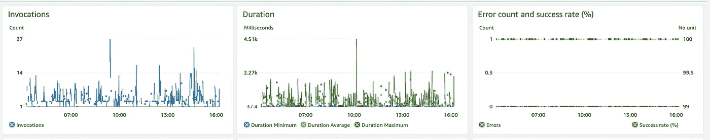
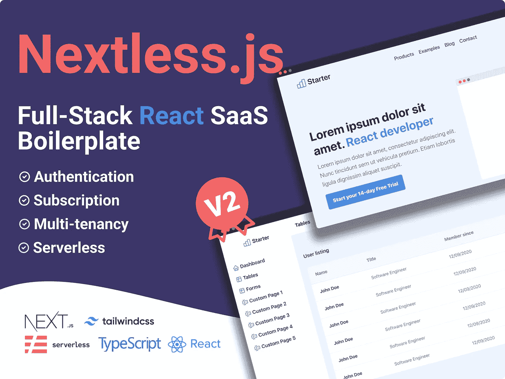

# 在 AWS 上构建全栈应用:100%无服务器

> 原文：<https://javascript.plainenglish.io/building-a-full-stack-application-on-aws-100-serverless-53ff47342e10?source=collection_archive---------5----------------------->

## 我使用 AWS 服务通过 React 和 Node.js 构建全栈应用，以及我如何使用它们来制作我的 SaaS 应用。

Photo by [Christopher Gower](https://unsplash.com/es/@cgower?utm_source=medium&utm_medium=referral) on [Unsplash](https://unsplash.com?utm_source=medium&utm_medium=referral)

无服务器计算是一个很大的话题！它是构建应用程序的下一步，这已经不是什么新闻了。对于一个资源有限的小团队来说，这是千真万确的。

这是一个快速增长的市场。亚马逊网络服务(AWS)不仅是最大的提供商，也是我的最爱。

作为一名开发人员，我欣赏可以自动化的东西。如果每件事都有一个函数或方法，我想做的就是“自动化那些无聊的事情”并且更有效率。幸运的是，AWS 可以提供这种能力。

我喜欢 AWS，不是因为它由一套著名的可爱的昵称服务组成，而是因为它是一个完整的包。AWS 让您可以在一个地方完全控制您的项目。

在本文中，我将分享我使用 React 和 Node.js 构建全栈应用程序时使用的 AWS 服务，以及我如何使用它们来制作我的 SaaS 应用程序。

## **熟悉编程语言**

对 Python 或 JavaScript 概念的良好理解将帮助您用 AWS 构建一个全栈应用程序。

我非常喜欢 JavaScript，因为它是一种通用的编程语言。JavaScript 在服务器端和前端都能很好地工作。

有了一些基础知识后，可能性是无限的:你可以用 React 在客户端(前端)编码，用 Express.js 和 Node.js 在服务器端(后端)编码。

## **关于 JavaScript 的快速知识**

-网页浏览器自带 JavaScript

- JavaScript 是一种广泛使用的编程语言

-例如，与 C/C++相比，JavaScript 的入门门槛较低

- JavaScript 是一门有趣的学习语言

我可以继续列举 101 个你应该学习 JavaScript 的理由。但是，这将使这篇文章比它应该的更长。所以，一旦我习惯了编写编程语言(不管是不是 JavaScript)，接下来的事情就是…

## **跳到一个基础设施框架上作为代码**

如前所述，JavaScript 有无限的可能性。你不需要成为 JavaScript 专家，但掌握一些 Express.js 知识肯定会有所帮助。然后，我还需要学习如何部署你的应用程序。

学习编程语言很棒，但是我的项目并不面向全世界。它只在我的本地机器上运行，我不能和我的朋友分享它。今天，最大的云提供商之一是 AWS。

为了让 AWS 体验更愉快，我还使用了无服务器框架和 AWS 云开发工具包(CDK)。我可以在 JavaScript 和配置文件中声明我的 AWS 资源，而不是使用 AWS 控制台。因此，您可以轻松地将其复制到开发、试运行和生产等环境中。

在分享了在 AWS 上启动全栈应用程序的所有基本要求之后，我将向您展示我用来构建我的 SaaS 应用程序的服务。

**1。放大主机**

AWS Amplify Hosting logo

有了 Amplify Hosting，在 AWS 上启动和托管前端代码变得极其简单。在我的例子中，前端是用 React 编写的。更准确地说，我将 Next.js 与 TypeScript 和 Tailwind CSS 一起使用。Amplify Hosting 还为我处理自定义域和 SSL 证书。

这无疑是 Vercel 和 Netlify 的一个很好的替代品。但是，Amplify Hosting 的好处是它可以在我自己的 AWS 帐户上托管。

像它的对应物一样，我可以连接我的 GitHub 库来放大托管。它还将设置一个连接到我的 GitHub 帐户的简单 CI/CD 管道。这样，我可以通过简单地推送您的更改来轻松部署您的代码。不再需要手动部署，并通过加快应用程序部署来改善开发人员的体验。

**2。AWSλ**

对于我的应用程序的后端，我使用 AWS Lambda。这是一个运行在 AWS 上的无服务器计算平台。Lambda 是 AWS 增长最快的产品之一。

基本上，在为我的 SaaS 或 web 应用程序实现业务逻辑之后，我需要运行我的代码，AWS Lambda 可以帮助我实现这一点。

有了 AWS Lambda，我只需要在 AWS 上部署我的代码，AWS Lambda 会处理剩下的事情。我不需要担心服务器、自动扩展、升级、维护等问题。我可以 100%专注于我的代码。

**3。AWS API 网关**

为了将我的 AWS Lambda 连接到世界，我需要使用 AWS API Gateway。这是一项允许我将您的应用程序前端连接到 AWS Lambda 的服务。通过 API Gateway，我的前端可以向我的 AWS Lambda 发送请求并接收响应。

和前面的服务一样，AWS API Gateway 也是一个托管服务，我可以用它来处理、保护、监控和管理我的 REST API。

**4。AWS Cognito**

在构建应用程序时，安全性应该始终是重中之重。为此，我使用亚马逊 Cognito。AWS Cognito 允许我轻松添加身份验证，而无需从头开始实现。

你可以很容易地在你的应用程序中添加电子邮件认证和社交认证，比如谷歌、脸书、苹果和亚马逊。这会节省你很多时间和精力。

结合 AWS API 网关，我可以保护我的后端，并将我的 AWS Lambda 限制为只允许经过身份验证的用户使用。

**5。DynamoDB**

在全栈应用中，我还需要存储数据。而且，我们都知道管理数据库有时是一项艰巨的任务！这就是我选择 DynamoDB 的原因。

DynamoDB 是一个运行在 AWS 上的无服务器数据库。作为一个无服务器的数据库，我不必担心维护它，AWS 为我处理。它可以根据我的流量自动扩展，并在需要时扩展到零。

**6。云观察**

部署我的应用程序后，我需要跟踪应用程序在生产中的行为。我用 CloudWatch 来做这件事。

Lambda dashboard with metrics

一旦 CloudWatch 设置完毕，它就会收集日志、指标和事件，用于监控和操作数据。我还可以使用控制面板来可视化它，并全面了解我的 AWS 资源、应用程序和服务。

有了这些信息，我可以分析我的应用程序的健康状况和性能。然后，我还设置了警报来自动监控应用程序并采取适当的措施。

## **结论**

学习利用 Amazon Web Services (AWS)的能力帮助我构建了快速、安全和可靠的应用程序。我向任何希望开发全栈应用的人推荐这些服务。您可以通过统一的界面将所有东西放在同一个地方。

通过利用无服务器的强大功能，您不必担心底层基础架构。AWS 负责管理服务器，以执行任何规模的应用程序、数据库和存储系统。您会惊讶地发现，构建更高效的应用程序可以节省多少时间。

我花了 5 个月的时间来理解和构建我的第一个 AWS 全栈应用。这不是一次轻松的旅程，但我对结果非常满意。所以，我已经建立了一个 [AWS 样板](https://nextlessjs.com)，让所有开发人员的过程更容易。只需要几个命令，不需要任何配置，就可以在 AWS 上得到一个全栈应用，这里是全栈应用的[演示。](https://demo.nextlessjs.com)

它不仅托管在 AWS 上，还包括用 React 构建的 UI 组件和用 Tailwind CSS 样式的 Next.js。因此，使用 Nextless.js 创建一个简单的全栈应用程序是一件轻而易举的事情，完全不需要服务器(前端、后端和数据库)。

AWS SaaS Boilerplate

感谢您的阅读！你可以在推特[上关注我，当我发布新故事时，你会收到通知。](https://twitter.com/ixartz)

*更物在* [***素朴***](https://plainenglish.io/) *。报名参加我们的* [***免费周报***](http://newsletter.plainenglish.io/) *。*[***Twitter***](https://twitter.com/inPlainEngHQ)*和**[***LinkedIn***](https://www.linkedin.com/company/inplainenglish/)*。查看我们的* [***社区不和*T42**](https://discord.gg/GtDtUAvyhW)和加入我们的[T47*人才集体*](https://inplainenglish.pallet.com/talent/welcome) *。**