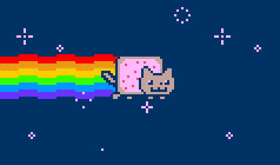
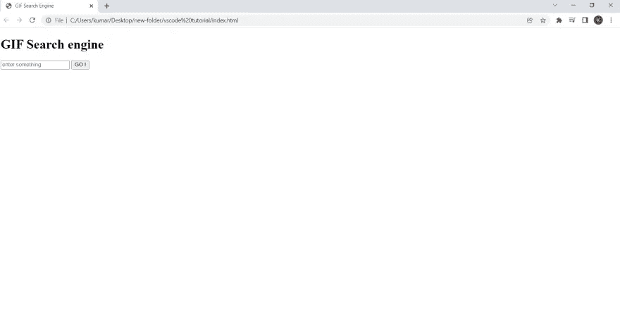
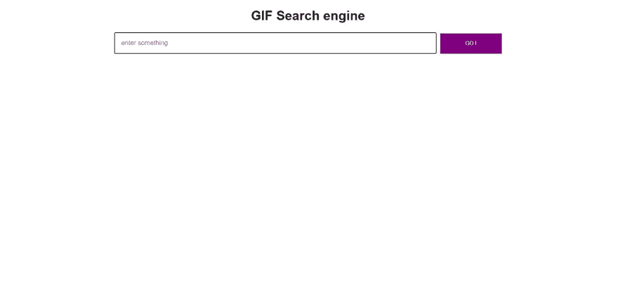
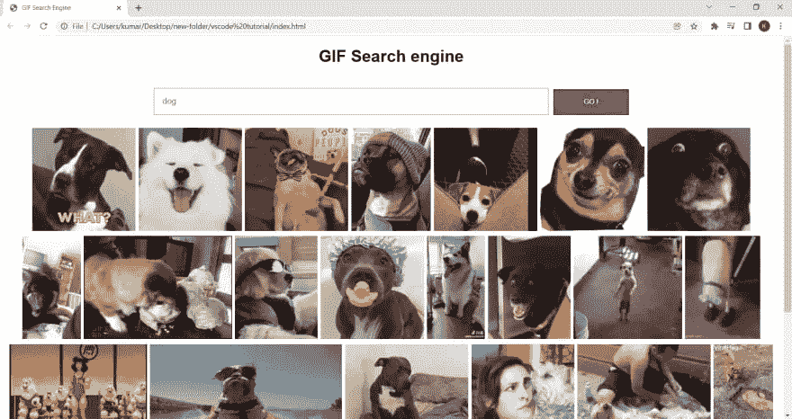

# 在 10 分钟内建立一个 GIF 搜索引擎:初学者友好的 JavaScript 教程

> 原文：<https://javascript.plainenglish.io/building-a-gif-search-engine-in-just-10-mins-3c8963af835d?source=collection_archive---------10----------------------->



大家好！在这篇文章中，我将解释如何在 10 分钟内使用 HTML、CSS 和 JavaScript 构建自己的 GIF 搜索引擎——不要担心，这是一个初学者友好的教程！

# 先决条件

1.  HTML、CSS3、JavaScript
2.  GIF API 密钥
3.  对 HTML 事件和 AJAX 了解不多者优先
4.  你的时间和耐心(最重要)

# HTML

HTML 或超文本标记语言定义了网页的结构，如标题、段落、换行符等，就像人体的骨骼一样。因此，在我们的 GIF 搜索引擎中，我们还需要一个类似占位符的结构，让我们知道用户想要看到哪种类型的 GIF，以及一个提交输入的按钮。

*   首先，我们需要创建一个名为`index.html`的文件(让我告诉你，我们将使用内部 CSS 和 JavaScript，也就是说，我们将在我们的 index.html 文件中使用`<style></style>`和`<script></script >`标签来编写 CSS 和 JavaScript 代码)
*   现在让我们添加样板文件

```
<!DOCTYPE html>
<html lang="en">
  <head>
    <meta charset="UTF-8" />
    <meta http-equiv="X-UA-Compatible" content="IE=edge" />
    <meta name="viewport" content="width=device-width, initial-scale=1.0" />
    <title>GIF Search Engine</title>
    <style>
      /*this will contain our styles */
    </style>
  </head>
  <body>
    <script>
      /*this will contain our JavaScript code */
    </script>
  </body>
</html>
```

这里我们有`<style >` & `<script >`，我们将在这里定义 CSS 和 JavaScript。

现在让我们添加一些 HTML 标签来构建我们的网页。

```
<div class="container">
      <h1>GIF Search engine</h1>
      <div class="inputfiled">
        <input
          type="text"
          class="input userinput"
          placeholder="enter something"
        />
        <button class="go">GO !</button>
      </div><div class="output"></div>
    </div>
```

将这些添加到 body 标签中。



如你所见，我们的结构已经准备好了。现在让我们给它添加一些样式

# CSS

CSS 会给我们的网页带来风格，就像给食物增加味道一样。

```
.container {
        text-align: center;
        font-family: sans-serif;
      }
      .input {
        width: 50%;
        padding: 15px;
        margin: 2px;
        font-size: 16px;
        color: blueviolet;
        font-weight: 300;
        border: 2px solid rgb(233, 173, 173);
      }
      button {
        width: 10%;
        padding: 15px;
        margin: 2px;
        color: white;
        background-color: purple;
        border: 2px solid purple;
        cursor: pointer;
      }
      img {
        margin: 3px;
      }
      .inputfiled {
        padding: 20px;
      }
```

将这些添加到`style`标签中。



# JavaScript

JavaScript 为网页带来了动态性，就像你可以设置一些点击按钮的指令，或者每次当用户请求一个新的 GIF 类别时，我们需要返回一个新的输出，或者当我们使用 GIF API 时，JavaScript 将帮助我们从 GIF 服务器获取数据。

# 托多斯

1.  抓住用户的输入
2.  使用 GIF API 获取数据
3.  向用户显示数据

现在让我们添加 JavaScript。

```
/*this will contain our JavaScript code */
      /*Grab the input from teh user */
      var input = document.querySelector("input");
      document.querySelector("input").addEventListener("keyup", (e) => {
        /*only works when Enter key is clicked */
        clearOutput();
        if (e.which === 13) {
          getData(input.value);
        }
      });
      document.querySelector("button").addEventListener("click", (e) => {
        clearOutput();
        getData(input.value);
      });
      /*Get data from the API*/
      function getData(input) {
        var API_KEY = "Your api key ";
        var url =
          "https://api.giphy.com/v1/gifs/search?api_key=" +
          API_KEY +
          "&q=" +
          input +
          "&limit=25&offset=0&rating=g&lang=en"; /*this will only return maximum  25 gifs at a time*/
        fetch(url)
          .then((response) => response.json())
          .then((data) => showData(data.data))
          .catch((e) => {
            console.log(e);
          });
      }
      /*Display the output*/
      function showData(data) {
        data.forEach((element) => {
          var src = element.images.fixed_height.url;
          var output = document.querySelector(".output");
          output.innerHTML += "";
        });
      }
      /*clearing the ouptut*/
      function clearOutput() {
        var output = document.querySelector(".output");
        output.innerHTML = "";
      }
```

在这里，您可以看到我添加了两个事件侦听器来获取来自用户的输入，然后我将输入传递给`getData()`,这样我们就可以使用输入从 GIF 服务器`the fetch() APIO returns a promise and we are resolving it via then() and catch ()`获取所需的数据。现在，我们从 API 获取了数据，我将它传递给`showData()`,在那里我循环访问一个名为 data 的数组，然后从一个元素中提取`image url`并存储它 到一个名为`src`的变量，最后，我们只是动态地添加一个图像标签到输出`div`。

现在你一定在想`clearOutput()`。让我告诉你，如果你在输入中输入“狗”,那么你会得到最多 25 张狗的 GIF 图片，所以基本上，我们添加了`img`标签，现在当你再次输入另一个输入，如“猫”,我们需要清除输出 div 中的所有内容，否则`"cat"` GIF 将与`dog`GIF 连接。



# 放在一起

```
<!DOCTYPE html>
<html lang="en">
  <head>
    <meta charset="UTF-8" />
    <meta http-equiv="X-UA-Compatible" content="IE=edge" />
    <meta name="viewport" content="width=device-width, initial-scale=1.0" />
    <title>GIF Search Engine</title>
    <style>
      /*this will contain our styles */
      .container {
        text-align: center;
        font-family: sans-serif;
      }
      .input {
        width: 50%;
        padding: 15px;
        margin: 2px;
        font-size: 16px;
        color: blueviolet;
        font-weight: 300;
        border: 2px solid rgb(233, 173, 173);
      }
      button {
        width: 10%;
        padding: 15px;
        margin: 2px;
        color: white;
        background-color: purple;
        border: 2px solid purple;
        cursor: pointer;
      }
      img {
        margin: 3px;
      }
      .inputfiled {
        padding: 20px;
      }
    </style>
  </head>
  <body>
    <div class="container">
      <h1>GIF Search engine</h1>
      <div class="inputfiled">
        <input
          type="text"
          class="input userinput"
          placeholder="enter something"
        />
        <button class="go">GO !</button>
      </div><div class="output"></div>
    </div>
    <script>
      /*this will contain our JavaScript code */
      /*Grab the input from teh user */
      var input = document.querySelector("input");
      document.querySelector("input").addEventListener("keyup", (e) => {
        /*only works when Enter key is clicked */
        clearOutput();
        if (e.which === 13) {
          getData(input.value);
        }
      });
      document.querySelector("button").addEventListener("click", (e) => {
        clearOutput();
        getData(input.value);
      });
      /*Get data from the API*/
      function getData(input) {
        var API_KEY = "your API key";
        var url =
          "https://api.giphy.com/v1/gifs/search?api_key=" +
          API_KEY +
          "&q=" +
          input +
          "&limit=25&offset=0&rating=g&lang=en"; /*this will only return maximum  25 gifs at a time*/
        fetch(url)
          .then((response) => response.json())
          .then((data) => showData(data.data))
          .catch((e) => {
            console.log(e);
          });
      }
      /*Display the output*/
      function showData(data) {
        data.forEach((element) => {
          let src = element.images.fixed_height.url;
          var output = document.querySelector(".output");
          output.innerHTML += "";
        });
      }
      /*clearing the ouptut*/
      function clearOutput() {
        var output = document.querySelector(".output");
        output.innerHTML = "";
      }
    </script>
  </body>
</html>
```

# 结论

恭喜你！你刚刚学会创建一个 GIF 搜索引擎。如果你有任何疑问，请随时问我。保持快乐，保持安全！

# 连接

【https://twitter.com/kumarkalyan_ 

[https://www.linkedin.com/in/kumar009/](https://www.linkedin.com/in/kumar009/)

*更多内容看* [***说白了。报名参加我们的***](http://plainenglish.io/) **[***免费周报***](http://newsletter.plainenglish.io/) *。在我们的* [***社区不和谐***](https://discord.gg/GtDtUAvyhW) *获得独家获取写作机会和建议。***