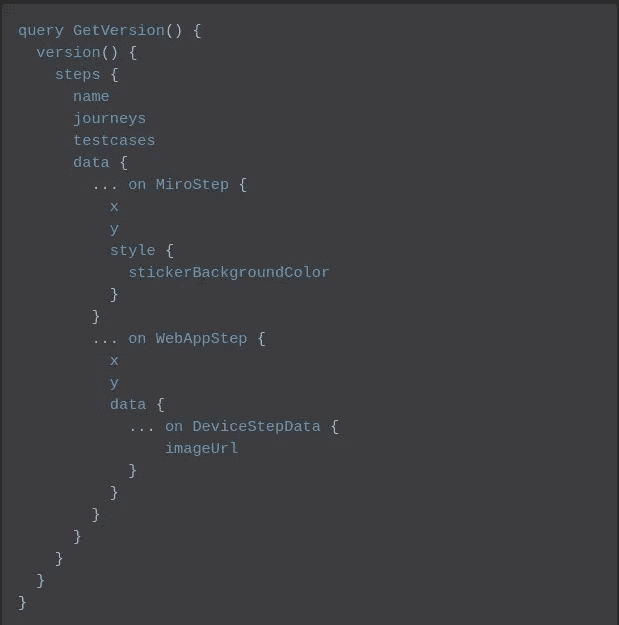
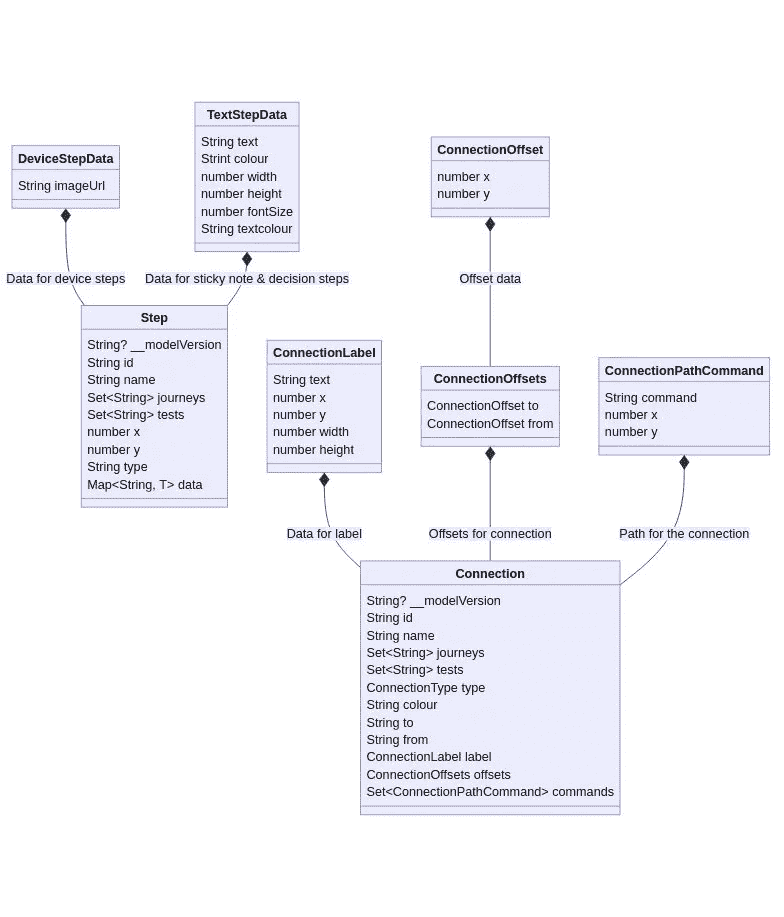
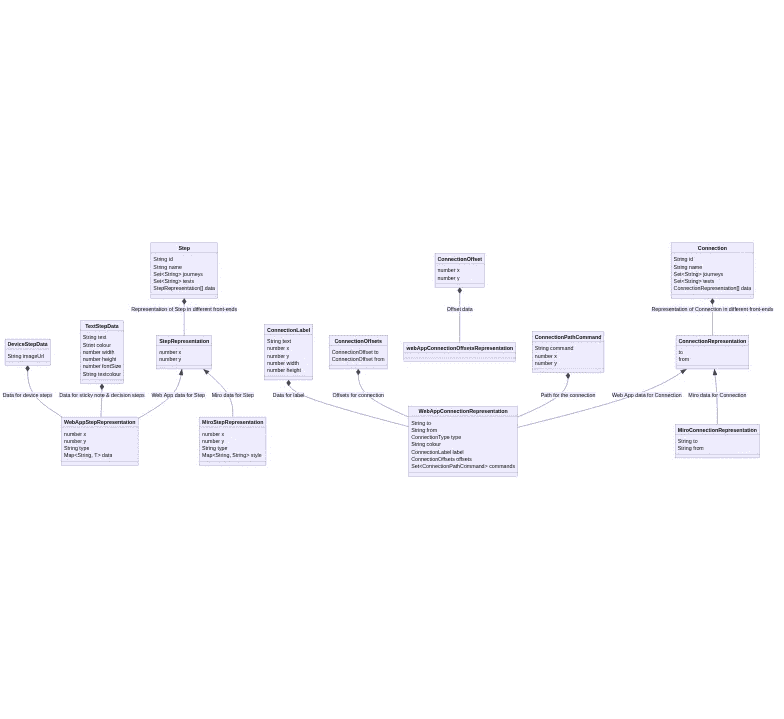
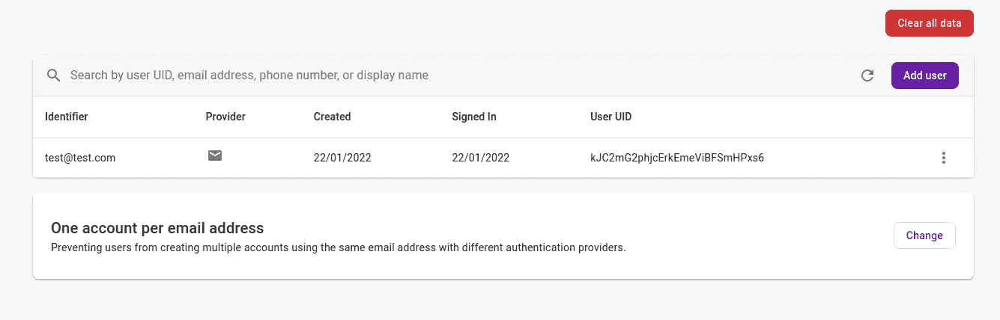
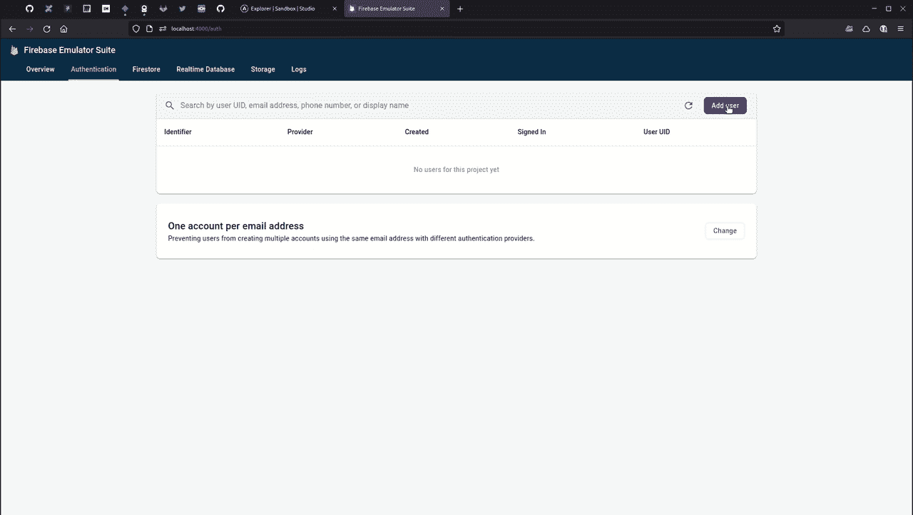

# 使用 Firebase 函数和 Apollo 构建一个 GraphQL API

> 原文：<https://javascript.plainenglish.io/building-a-graphql-api-using-firebase-functions-and-apollo-9fd56649e556?source=collection_archive---------0----------------------->

## 为了在我的 web 应用程序中构建灵活性，我想放弃使用 Firebase SDK &使用 GraphQL，但是我如何在 Firebase 上运行 Apollo 呢？

Photo by [Tudor Baciu](https://unsplash.com/@baciutudor?utm_source=medium&utm_medium=referral) on [Unsplash](https://unsplash.com?utm_source=medium&utm_medium=referral)

在 2021 年 10 月推出 [Reciprocal.dev](https://reciprocal.dev) alpha 之后，我开始研究我们整合的产品如何与我们着手解决的问题保持一致。

虽然我对完成的产品感到满意，但我脑海中有一种挥之不去的感觉——我们已经开发了一个允许用户构建交互式用户旅程地图的 web 应用程序，但当我们第一次定义对这样一个产品的需求时，我们正在 Miro 中构建我们的用户旅程地图。

意识到这一点后，我做了一个概念验证，证明从我们的网络应用程序中引入[产品并将其翻译成 Miro 插件](https://colinwren.medium.com/my-experiences-building-a-plugin-of-my-app-for-miro-8bbcf1ecd95c)是多么容易，尽管我们仍在评估其结果，但它凸显了一个可能被我们的技术实现所阻碍的潜在商业机会。

alpha 的数据模型非常专注于 web 应用程序所需的数据，我们广泛使用了 Firebase SDK，这意味着支持该数据的多个前端是不可行的，因为每个系统的 SDK 在画布上定义实体的方式不同，并且对可用的库有所限制。

我在日常工作中一直在使用 [GraphQL](https://graphql.org/) ,觉得类型条件功能很适合我们的问题，因为它允许 Miro 插件请求对象的 Miro 表示，web 应用程序可以请求 web 应用程序表示，同时保持其余数据的结构不变。

A pseudo-code query of how the type conditional and inline fragment functionality of GraphQL would allow for different data to be returned based on the representation needed by the front-end

使用 GraphQL(或任何 API)还将允许根据接口构建前端，这意味着我们可以在不影响前端的情况下重构后端，前提是接口没有被破坏。

在前端，使用 API 的决定也应该消除后端调用对 Firebase SDK 的依赖，因为我一直使用`functions.httpsCallable`来节省时间，因为这使得后端实现中的身份验证工作更容易。

前端不需要使用 Firebase SDK 来进行身份验证、加载/保存数据和处理存储，这意味着如果我们希望迁移到另一个技术堆栈，前端现在将更加易于移植。

一旦我们同意投入时间来构建 GraphQL API，我就开始构建一个运行在 Firebase 函数上的 Apollo 服务器来验证这种方法。

# 步骤 1:构建模式

不像 REST API 依赖于支持信息(Swagger、JSON schema 等)。)为了定义从 API 返回的对象类型，GraphQL 通过[将这些类型融入到 API 的定义中，该模式不仅定义了返回对象的类型，还定义了操作和这些操作的参数。](https://graphql.org/learn/schema/)

如果您以前使用过 JSON 模式，那么您应该会发现使用 GraphQL 模式相对容易，尽管存在一些差异，例如 GraphQL 缺乏对`Map` / `Object` / `Dict`对象的内置支持，并且需要单独的`Input`类型作为参数，即使它们与模式中的另一种类型相同。

GraphQL 服务器在运行时使用该模式来确定服务器将公开哪些查询和变化，并将使用该模式来验证对这些操作的调用，因此首先开始构建模式对我来说是有意义的。

我喜欢[在我的代码库中使用架构决策记录(ADR)](https://medium.com/geekculture/documenting-the-context-behind-your-code-with-architectural-decision-records-110a8db4d653),因为这允许我捕捉我所做决策的相关信息，这样我就可以在以后不得不重构代码时查看笔记。因此，我创建了一个新的 ADR 来捕获更改现有数据模型的决策，这是通过为 TypeScript 中的每个实体构建一组类并使用这些对象构建 GraphQL 架构来实现的，使用代码生成工具来构建可在 TypeScript 中使用的类型。

作为 ADR 的一部分，我捕获了将对步骤和连接实体进行的更改，以允许定义这些对象的多种表示，这样系统就可以支持多个前端。

我使用 [Mermaid](https://mermaid-js.github.io/mermaid/#/) 来定义类图，这样就有了变化的可视化表示，因为这样更容易理解。

The data model for Steps and Connections. On the left is the original which was heavily tied to one way of representing the object. On the right is the solution which allows for multiple representations of the same object

在构建模式时，我使用了`[graphql-schema-linter](https://www.npmjs.com/package/graphql-schema-linter)`工具来确保我的模式是有效的(尽管由于与我的连接实体的命名冲突，我不得不禁用与中继相关的规则),一旦模式构建完成，我就启动一个本地 Apollo 服务器来验证定义是否正确注册。

# 步骤 2:让 Apollo 服务器运行在 Firebase 函数上

构建了模式并验证了它的正确性后，我继续研究如何在 Firebase 函数上运行 GraphQL 服务器。我选择了 [Apollo](https://www.apollographql.com/) 来做这件事，因为它是我最有经验的 GraphQL 服务器。

最初在 Google 上搜索如何做到这一点，返回了两种方法，一种是使用`[apollo-server-express](https://www.npmjs.com/package/apollo-server-express)`然后使用它，因为 Firebase 函数与 Express 兼容，另一种是使用`[apollo-server-cloud-functions](https://www.npmjs.com/package/apollo-server-cloud-functions)`，它提供了另一种方法的包装器，因此需要编写的代码更少。

我遵循 [Fabio](https://medium.com/u/73ed71c0e436?source=post_page-----9fd56649e556--------------------------------) 的建议，采用了`apollo-server-cloud-functions`的方法([https://medium . com/@ piu ccio/running-Apollo-server-on-firebase-cloud-Functions-265849 e9 F5 b 8](https://medium.com/@piuccio/running-apollo-server-on-firebase-cloud-functions-265849e9f5b8))，但是因为我在 Firebase 函数代码库中使用了 TypeScript，所以我在`apollo-server-express`中遇到了一个问题，因为 CORS 的类型定义导致了编译错误。

为了解决`apollo-server-express`中类型的问题，我必须将`skipLibCheck: true`添加到我的`tsconfig.json`中，这是我从这个 Github 问题中找到的:[https://Github . com/apollographql/Apollo-server/issues/927 # issue comment-445537360](https://github.com/apollographql/apollo-server/issues/927#issuecomment-445537360)

一旦我解决了类型问题，我就能够让 Apollo 服务器运行在 Firebase 模拟器上(可通过`[firebase-tools](https://www.npmjs.com/package/firebase-tools)`包安装),在复制了我的 GraphQL 模式并实现了一些虚拟解析器之后，我就能够使用一个 [pollo Sandbox Explorer](https://studio.apollographql.com/sandbox/explorer) 来测试 API。

A basic Apollo server on Firebase Functions, this would usually expose the GraphQL server on https://localhost:5001/[project name]/[deployment locale]/GraphQL which can be used in the Apollo Sandbox Explorer to interact with it

# 步骤 3:让 GraphQL 模式更有用

虽然 GraphQL 服务器使用的模式对于允许 API 消费者知道发送什么和他们将接收什么非常有用，但是如果应用程序代码本身可以使用实体类型以便更快地捕捉错误，该模式将会更加有用。

幸运的是，有一种方法可以做到这一点，那就是使用[一个名为](https://www.graphql-code-generator.com/) `[graphql-codegen](https://www.graphql-code-generator.com/)` [的工具，它获取 GraphQL 模式并将其转换成代码](https://www.graphql-code-generator.com/)。对于我的用例，我只需要生成一组可以在我的 TypeScript 代码中使用的类型，但是使用该工具可以有多种方式来使用该模式。

为了生成我需要的类型，我最终配置了`graphql-codegen`来创建一个包含操作和解析器的`types.d.ts`文件。

The GraphQL codegen config used to generate the types files that could be used in downstream TypeScript projects to add type checks based on the GraphQL schema

一旦我从模式中生成了类型，下一步就是发布模式和类型，这样它们就可以被下游服务使用，比如我的 Firebase 函数代码、web 应用程序和 Miro 插件。

为此，在将模式文件和生成的`types.d.ts`添加到`package.json`中的`files`数组之前，我确保它们都在 repo 的根目录下(即不在目录下)。这意味着当运行`npm publish`时，两个文件都将被打包，并可从库的根目录访问。

Example of package.json set up for publishing library with both schema and generated types

# 步骤 4:从库中加载 GraphQL 模式

在将模式和类型发布为库以供下游使用之后，下一步是从 GraphQL Firebase 函数使用的 Apollo 服务器配置中的库中导入模式。

为了从文件中加载模式，并将其用作 Apollo 配置的`typeDefs`值，我需要从`[@graphql-tools/graphql-file-loader](https://www.npmjs.com/package/@graphql-tools/graphql-file-loader)`库导入`GraphQLFileLoader`，并从`[@graphql-tools/load](https://www.npmjs.com/package/@graphql-tools/load)`库将此实例传递给`loadTypedefsSync`的`loaders`参数。

By loading the schema from the library there’s a single source of truth for the schema and within that schema repo I’m free to use whatever tools I need to when building it before publishing the schema

# 步骤 5:认证用户

除了一两个例外，我正在构建的 API 将处理的大多数操作都要求对用户进行身份验证，以便后端可以处理他们有权访问的记录。

在后端 alpha 实现中，任何认证需求都是通过使用`[requests.onCall](https://firebase.google.com/docs/functions/callable)`函数来处理的，因为这些函数会处理认证并通过上下文对象向函数提供认证数据。

在前端 alpha 实现中，这些函数将使用 Firebase SDK 的一部分`[functions.httpsCallable](https://firebase.google.com/docs/functions/callable)`来调用。这将负责前端代码所需的任何身份验证。

alpha 实现对 Firebase SDK 的依赖意味着我没有在该 SDK 之外进行身份验证的现有实现。幸运的是，Firebase admin SDK 提供了为用户创建 jwt 的方法，以及在使用这些令牌进行身份验证时验证它们的方法。

Apollo 服务器没有被定义为一个普通的 Firebase 函数，所以我不能只在函数实现的开头添加一个检查，相反，我需要使用 Apollo 服务器配置的`context`属性来定义一个回调，该回调可以检查身份验证并向 Apollo 上下文添加任何相关的值，以便解析器稍后使用。

这个 Apollo 上下文非常方便，不仅可以从 JWT 获取用户的 ID，还可以让解析器访问在顶层功能模块中创建的 Firestore 实例，因为这样可以将代码分开，以便于维护。

## 创造一个 JWT

Firebase admin SDK 有一个`admin.auth().createCustomToken`功能，可以创建一个可用于验证用户身份的 JWT。可以向该函数传递一组用户数据来生成令牌，最低要求是提供用户的 ID。

## 验证 JWT

在 GraphQL 上下文回调中，可以从通过`request.headers.authorization` 路径传递给回调的请求对象中访问 JWT。

验证 JWT 的函数要求字符串只包含令牌，因此在读取`authorization`头时，您需要去掉字符串的`Bearer` 部分。

Firebase admin SDK 有一个`admin.auth().verifyIdToken`函数，将 JWT 解码成一个对象，您可以从 so 中读取编码值。用户的 ID 可以在这个解码对象的`uid`属性下找到。

Verifying the JWT within the GraphQL context and setting the userId and Firestore instance in the context so it’s available to the resolvers

## 仿真器陷阱

通过`createCustomToken`创建的 JWT 无法被`verifyIdToken`验证，因为`aud`属性与`verifyIdToken`预期的不同。为了创建具有正确`aud`属性的令牌，需要进行一个额外的调用，该调用将产生一个可以验证的 JWT。

一旦您通过`createCustomToken`生成了 JWT，您需要将该令牌作为 POST 的一部分发送给可通过认证仿真器使用的 `/www.googleapis.com/identitytoolkit/v3/relyingparty/verifyCustomToken`端点，当您将`returnSecureToken`设置为 true 时，它将返回一个可以正常工作的 JWT。下一步中的代码显示了如何做到这一点。

# 第六步:测试一切正常

现在，在 Apollo 中设置了身份验证，是时候尝试一个示例调用了，但是为了做到这一点，我们需要创建一个用户，创建一个 JWT 令牌来对他们进行身份验证，并创建一些要返回的测试数据。

如果您还没有启用认证或 Firestore 模拟器，那么您可以运行`firebase init`并选择要安装的附加模拟器。

在身份验证模拟器下，您将看到一个带有“添加用户”按钮的用户列表，当按下该按钮时，将向您显示一个创建新用户的表单。您可以通过提供电子邮件地址和密码来创建新用户。

The authentication emulator UI with created user

一旦你创建了一个用户，你在系统中就有了一个用户，你可以创建一个使用`createCustomToken`的 JWT，但是你需要提供用户的 UID 给那个函数，并且创建的令牌需要通过`verifyCustomToken`转换成仿真器接受的令牌。

为了让事情变得简单，我将令牌管理和测试数据创建整合到一个端点中，我可以将用户 ID 发送到这个端点，这个端点将返回模拟器友好的 JWT。

This endpoint takes the ID of the generated user, creates the test data in Firestore for the resolvers to work with, and creates a JWT that can be used to authenticate the user

然后，我使用返回的 JWT 在 Apollo Sandbox Explorer UI 中设置授权头(在操作面板的底部有一个提供变量和头的方法)。

在提供了我希望运行的查询所需的一些变量之后，我能够针对运行在 Firebase Functions 模拟器上的 Apollo 服务器成功地执行一个经过身份验证的 GraphQL 调用。

Creating a user in Firebase auth emulator, using the endpoint to create the test data and the JWT to authenticate with, and then executing a query in the Apollo Sandbox Explorer UI

# 摘要

在 Firebase 上运行 GraphQL 相对来说比较简单，但是如果您希望通过 Firebase 模拟器在本地进行测试，那么身份验证需要做更多的工作。

通过从使用 Firebase SDK 与 Firestore 交互到实现 API 来实现这一点，我们现在在如何重构应用程序以及如何发展 [Reciprocal.dev](https://reciprocal.dev) 方面有了更多的灵活性。

通过使用`graphql-codegen`工具，我能够通过 GraphQL 模式获得我的应用程序中实体的一个真实来源，然后生成代码来帮助下游使用这些实体，例如 TypeScript 的类型定义。

## 进一步阅读

 [## 我用 Next.js、Fauna 和 WunderGraph 为 GraphQL 实时查询构建了一个无服务器的实时聊天应用程序

### 使用无服务器技术创建可扩展的实时聊天应用程序的分步指南，来自…

javascript.plainenglish.io](/i-built-a-serverless-live-chat-app-with-next-js-fauna-and-wundergraph-for-graphql-live-queries-b671d9646f6)  [## 如何从头开始构建一个 GraphQL 电子商务应用程序

### 这就是你要建造的东西！埃森哲的一项调查(19 个国家的 20，000 多名消费者)发现，47%的人…

简明英语. io](https://plainenglish.io/blog/how-to-build-a-graphql-ecommerce-app-from-scratch)  [## 如何将 API 组合和集成在一起，就像您正在使用 API 的 NPM 一样

### 将两个 API 整合到一个应用程序中，该应用程序显示了历史上最大的音乐会，按国家首都排列。与……

简明英语. io](https://plainenglish.io/blog/how-to-compose-and-integrate-apis-together-as-if-you-were-using-npm-for-apis) 

*更多内容尽在* [***说白了. io***](https://plainenglish.io/) *。报名参加我们的* [***免费周报***](http://newsletter.plainenglish.io/) *。关注我们关于* [***推特***](https://twitter.com/inPlainEngHQ) ，[***LinkedIn***](https://www.linkedin.com/company/inplainenglish/)*，*[***YouTube***](https://www.youtube.com/channel/UCtipWUghju290NWcn8jhyAw)*，* [***不和***](https://discord.gg/GtDtUAvyhW) *。对增长黑客感兴趣？检查* [***电路***](https://circuit.ooo/) *。*