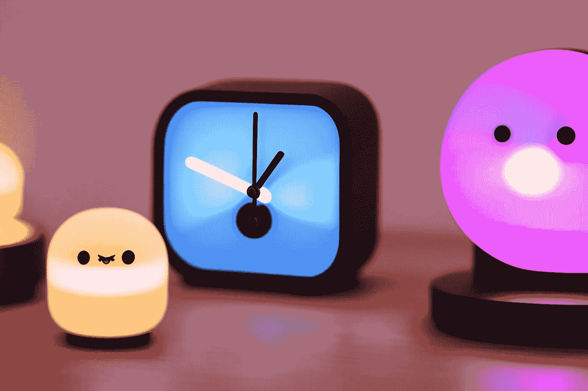
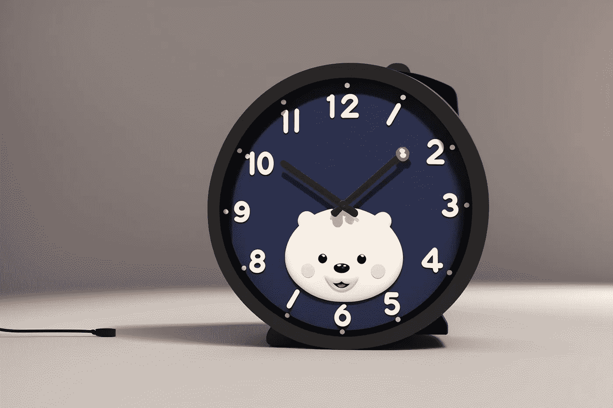

# 用 JavaScript 和 TypeScript 构建人类可读的时间格式化程序

> 原文：<https://javascript.plainenglish.io/building-a-human-readable-time-formatter-in-javascript-and-typescript-5997c05df4d7?source=collection_archive---------18----------------------->

## JavaScript 技巧

## 解决“人类可读时间”形的逐步指南



我决定继续用 JavaScript 和 TypeScript 编写我对 CodeWars 谜题的解决方案。我的目标是继续练习，不满足于现在的知识。所以我开始撰写这个关于 JavaScript 和 TypeScript 的技巧“专栏”。我今天从第一个问题开始:给定一个数字，我如何将它转换成人类可读的时间？

# 问题是:人类可读的时间

链接到[形](https://www.codewars.com/kata/52685f7382004e774f0001f7)

编写一个函数，它接受一个非负整数(秒)作为输入，并以人类可读的格式(`HH:MM:SS`)返回时间

`HH` =小时，填充到 2 位数，范围:00 - 99 `MM` =分钟，填充到 2 位数，范围:00 - 59 `SS` =秒，填充到 2 位数，范围:00 - 59

最长时间不超过`359999` ( `99:59:59`)

# 我的解决方案



问题评级`5 kyu`。这是一个错误的评级:它更容易。最复杂的部分是计算一分钟和一小时的秒数。剧透:一分钟总有`60`秒，一小时总有`3600`秒。

知道了这一点，我可以使用[余数运算符(](https://developer.mozilla.org/en-US/docs/Web/JavaScript/Reference/Operators/Remainder) `[%](https://developer.mozilla.org/en-US/docs/Web/JavaScript/Reference/Operators/Remainder)` [)](https://developer.mozilla.org/en-US/docs/Web/JavaScript/Reference/Operators/Remainder) 来获得我需要的值:

```
const getSeconds = (s: number): number => s % 60;
const getMinutes = (s: number): number => Math.floor((s % 3600) / 60);
const getHours = (s: number): number => Math.floor(s / 3600);
```

第二个困难是理解如何将数字转换成字符串。或者，更准确地说，如何确保一位数前面有一个零。为此，我可以使用 [String.padStart()](https://developer.mozilla.org/en-US/docs/Web/JavaScript/Reference/Global_Objects/String/padStart) 方法，将长度设置为`2`，并将`0`字符用作`padString`。

```
const pad = (n: number): string => n.toString().padStart(2, "0");
```

最后，我可以使用[模板文字](https://developer.mozilla.org/en-US/docs/Web/JavaScript/Reference/Template_literals)来创建最终的字符串。

```
`${pad(hh)}:${pad(mm)}:${pad(ss)}`;
```

通过将所有这些函数放在一起，我得到了我的编程问题的解决方案。

```
const getSeconds = (s: number): number => s % 60;
const getMinutes = (s: number): number => Math.floor((s % 3600) / 60);
const getHours = (s: number): number => Math.floor(s / 3600);

const pad = (n: number): string => n.toString().padStart(2, "0");

export function humanReadable(seconds: number): string {
  const s: number = getSeconds(seconds);
  const m: number = getMinutes(seconds);
  const h: number = getHours(seconds);

  return `${pad(h)}:${pad(m)}:${pad(s)}`;
}
```

感谢阅读！敬请关注更多内容。

***不要错过我的下一篇文章—报名参加我的*** [***中邮箱列表***](https://medium.com/subscribe/@el3um4s)

[](https://el3um4s.medium.com/membership) [## 通过我的推荐链接加入 Medium—Samuele

### 阅读萨缪尔的每一个故事(以及媒体上成千上万的其他作家)。不是中等会员？在这里加入一块…

el3um4s.medium.com](https://el3um4s.medium.com/membership) 

## 更多内容请访问 [PlainEnglish.io](https://plainenglish.io/) 。

*报名参加我们的* [***免费每周简讯***](http://newsletter.plainenglish.io/) *。关注我们关于* [***推特***](https://twitter.com/inPlainEngHQ) ， [***领英***](https://www.linkedin.com/company/inplainenglish/) ***，***[***YouTube***](https://www.youtube.com/channel/UCtipWUghju290NWcn8jhyAw)***，以及****[***不和***](https://discord.gg/GtDtUAvyhW) *

## *想扩大你的软件创业规模吗？检查[电路](https://circuit.ooo/?utm=publication-post-cta)。*