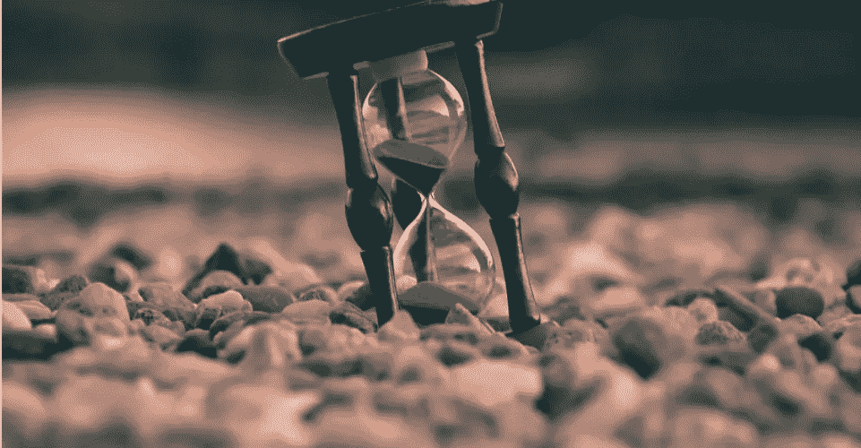
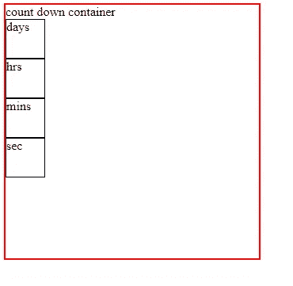
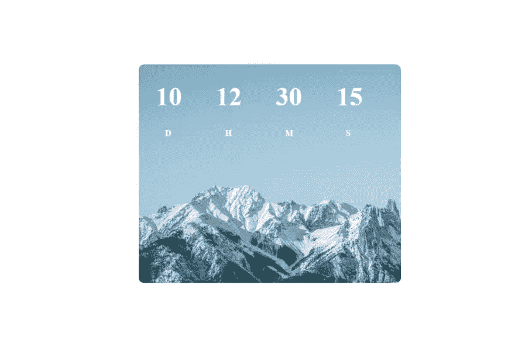
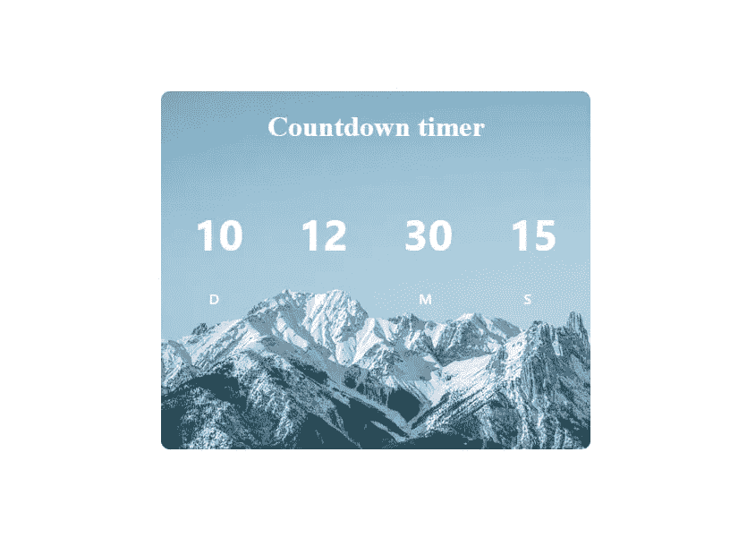

# 如何在 10 分钟内构建一个 JavaScript 倒计时器

> 原文：<https://javascript.plainenglish.io/building-a-javascript-countdown-timer-in-just-10-mins-c0b5d4bf1a28?source=collection_archive---------7----------------------->

## 使用 JavaScript、HTML 和 CSS 创建倒计时器的快速指南。



# 介绍

在这篇文章中，我将使用 HTML、CSS 和普通的 JavaScript 构建一个漂亮的倒计时器。我们的倒计时器会显示特定日期和时间前的剩余时间。

# 制作结构

我们都知道 HTML 是用来构建 web 开发项目的。

```
<main>
      <h1>Time remaining for the Fest</h1>
      <div class="countdown-container">
        <div class="days-c">
          <p class="big-text" id="days"></p>
          <span>Days</span>
        </div>
        <div class="hours-c">
          <p class="big-text" id="hours"></p>
          <span>Hours</span>
        </div>
        <div class="minutes-c">
          <p class="big-text" id="minutes"></p>
          <span>Minutes</span>
        </div>
        <div class="seconds-c">
          <p class="big-text" id="seconds"></p>
          <span>Seconds</span>
        </div>
      </div>
    </main>
```

在这里，我把我们倒计时定时器的所有微型元素放在一个`div`中，这样我们就可以通过添加背景图片来给我们的定时器一个类似盒子的形状和一个漂亮的 UI。同样，我将`<p>` & `<span>`分隔在一个单独的`div`中，用不同的类和名称对每个元素进行分类，即天、小时、分钟和秒。让我们简化一下，考虑一下`body`元素是任何设备的整个屏幕，而`<div class='countdown-timer '></div>`是一个盒子，包含另外四个盒子，即天、小时、分钟和秒。请参见下图:



# 设计我们的计时器

现在我们的结构已经准备好了，所以让我们添加一些 CSS 来给我们的倒计时器一个漂亮的外观。

# `<body>`

我希望我所有的元素成为屏幕的中心，我也希望整个屏幕有一个背景色，为了让这些事情发生，我会使用。

```
body
{
  display: flex;
  align-items: center;
  justify-content: center;
  background-color: #eeee;
}
```

# `<main>`

在这里，我将创建一个漂亮的箱形结构，高度分别为 25 和 30 雷姆，背景图片也很漂亮:

```
main {
  background: url(https://images.unsplash.com/photo-1646429411544-b735d4c77bb7?ixlib=rb-1.2.1&ixid=MnwxMjA3fDB8MHxwaG90by1wYWdlfHx8fGVufDB8fHx8&auto=format&fit=crop&w=872&q=80);
  height: 25rem;
  width: 30rem;
  color: white;
  border-radius: 10px;
}
```


这就是现在的样子。

# 固定字体和大小

```
.countdown-container span {
  margin: 1.5rem;
  font-size: 1rem;
  font-weight: 500;
}.big-text {
  margin: 1rem;
  font-size: 3rem;
  font-weight: bolder;
  padding: 5px;
}
```



# 对准`countdown-container`

```
.countdown-container {
  padding: 1rem;
  margin: 1rem;
  display: flex;
  justify-content: center;
  font-family: 'Segoe UI', Tahoma, Geneva, Verdana, sans-serif;
}
```



# 动态添加值

现在我们的样式部分已经结束了，让我们动态添加计时器值，为此，我将添加一些 JavaScript。

# 抓住元素

现在我们将抓住我们的微量元素来增加价值。

```
const days = document.getElementById('days')
const hours = document.getElementById('hours')
const minutes = document.getElementById('minutes')
const seconds = document.getElementById('seconds')
```

# 定义和调用函数

因为我们正在构建一个倒计时器，所以我们需要一个`date`对象，我们还将使用 JavaScript `Math.floor()`来过滤期望值。现在，首要任务是获得剩余时间。

```
//the final date   
    const fest = new Date(2022, 3, 2);
  // the system date   
  const current = new Date();
  //time remianing   
  const sec = (fest - current) / 1000;
```

我们减去两天将得到一个以毫秒为单位的值，所以我们用 1000 除以它，得到以秒为单位的值。现在让我们将它转换为天、小时、分钟和秒。

```
const d = Math.floor(sec / 3600 / 24);
    const hrs = Math.floor(sec / 3600) % 24;
    const min = Math.floor(sec / 60) % 60;
    const s = Math.floor(sec) % 60
```

现在我们有了自己的值，所以让我们使用`innerText`属性动态地将它们添加到我们的 HTML 中。

```
days.innerText = d;
    hours.innerText = hrs;
    minutes.innerText = min;
    seconds.innerText = s;
```

现在，为了每秒改变数值，我们将使用`setInterval(handler, milisec)`。

# 把它放在一起

```
const days = document.getElementById('days')
const hours = document.getElementById('hours')
const minutes = document.getElementById('minutes')
const seconds = document.getElementById('seconds')function goCountown() {
  //the final date   
    const fest = new Date(2022, 3, 2);
  // the system date   
  const current = new Date();
  //time remianing   
  const sec = (fest - current) / 1000;
    const d = Math.floor(sec / 3600 / 24);
    const hrs = Math.floor(sec / 3600) % 24;
    const min = Math.floor(sec / 60) % 60;
    const s = Math.floor(sec) % 60
    days.innerText = d;
    hours.innerText = hrs;
    minutes.innerText = min;
    seconds.innerText = s;
}
goCountown()setInterval(goCountown, 1000)
```

# 结论

在本文中，我介绍了一些重要的主题，如 CSS flex、JavaScript Dates 和 Math.floor()。我希望这篇文章能帮助每个人获得网站开发的基本知识。如果你喜欢这篇文章，请随意评论、反应和分享。感谢您给我宝贵的时间阅读我的文章。敬请期待下期。编码快乐！

# 连接

[推特](https://twitter.com/kumarkalyan_)
领英

*更多内容看* [***说白了就是 io***](https://plainenglish.io/) *。报名参加我们的* [***免费周报***](http://newsletter.plainenglish.io/) *。关注我们关于*[***Twitter***](https://twitter.com/inPlainEngHQ)*和*[***LinkedIn***](https://www.linkedin.com/company/inplainenglish/)*。加入我们的* [***社区不和谐***](https://discord.gg/GtDtUAvyhW) *。*