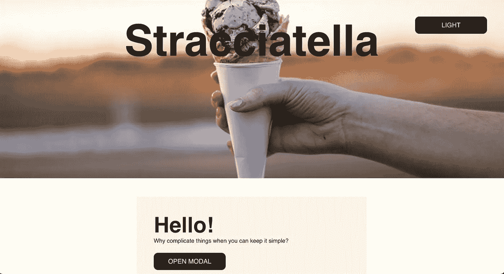
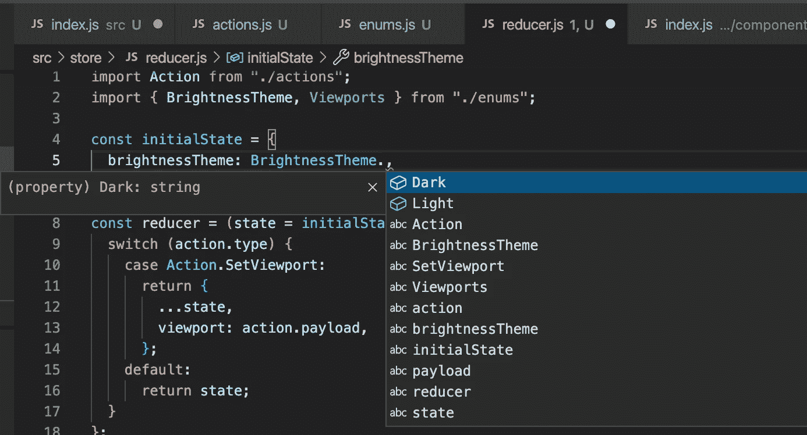

# 构建一个没有框架的现代 Web 应用程序——类、组件和继承

> 原文：<https://javascript.plainenglish.io/building-a-modern-web-app-without-frameworks-classes-components-inheritance-1bfd314fc582?source=collection_archive---------2----------------------->

## 没有反应，没有 Vue.js？有可能用组件、状态管理、主题化和继承来构建一个现代化的前端应用吗？

没有 React，没有 Vue.js，没有 Angular，没有 jQuery？有没有可能轻松地**构建一个现代前端应用程序**，其中组件和状态管理遵循所有最佳实践**，只使用普通的旧 JavaScript** ，使用类、继承，并添加更高级的架构模式，如 store 和 reducer？

> 嗯，这正是我所做的，我认为这太棒了！

让我解释一下…

# 目录

*   [简介](#5088)
*   [为什么，为了什么？](#5dac)
*   [使用 Webpack 进行环境设置](#0383)
*   [启动示例应用](#51df)
*   [用 HTML 制作模板](#2998)
*   [CSS 变量和主题](#6668)
*   [组件类型](#3517)
*   [建筑简单构件](#68fc)
*   [全局应用状态](#aef3)
*   [创建商店和减速器](#3b7d)
*   [订阅店铺变更](#676e)
*   [theme toggle 组件](#93cb)
*   [类和模板继承](#d406)
*   [总结](#2c50)

# 下载样板文件

如果您想使用样板文件，请下载它:

[](https://github.com/webondevices/stracciatella) [## GitHub—webon devices/stracciatella:一个简单的普通 JS 前端应用程序的样板文件，带有…

### 此时您不能执行该操作。您已使用另一个标签页或窗口登录。您已在另一个选项卡中注销，或者…

github.com](https://github.com/webondevices/stracciatella) 

我称之为 Stracciatella，因为它基本上是香草味的🍦


# 介绍

整个应用架构被分成**可重用的 JavaScript、CSS 和 HTML 块**组织成单独的文件夹和模块。这些块要么是你的组件，你的页面模板，要么是其他可重用的代码。

您的组件和页面模板有自己的 HTML 模板和 CSS 样式表，它们的应用程序逻辑在 JavaScript `Class` 或独立模块中的独立函数中捕获。您可以导入和导出它们，并用`new`关键字进行初始化。

为了使用模板和嵌套，我使用了一个简单的 Webpack 插件来允许将 HTML 文件导入到其他 HTML 文件中。是的，Webpack 是一个库，但是正如你将会看到的，我使用它几乎就像一个 polyfill。

应用程序逻辑的其余部分被分解成模块，并与组件一起导出和导入到其他文件中，就像您基于 React、Vue.js 或 Angular 等常用框架处理任何其他复杂的前端应用程序一样！



澄清一下，我对整个项目的最初动机是**尽可能让事情简单、轻量、快速**！我对 React 或其他框架没有固有的问题，它们对于某些项目来说是完全合理的。

在过去的 7-8 年里，我一直在使用 React 和类似的现代框架和架构，所以我 100%相信模块化和使用可重用组件。因此，最大的挑战是实现类似的抽象，并从本质上找到一种方法，将我的 HTML、CSS 和 JS 分成块，然后自由地组合它们。

**^**T7**回顶**T10**^**

# 为什么，为了什么？

我认为以这种方式从头开始构建简单的 web 应用程序有很多好处:

*   你从 100%的谷歌灯塔速度分数开始！
*   你 100%了解你的代码库
*   你不包括你不需要的代码
*   您的 web 应用程序加载速度极快
*   你会成为更好的 JavaScript 开发人员
*   修复 JS 和 CSS 中的 Bug 既容易又不费力

我建议对简单的 web 应用程序和简单的网站使用我的样板文件。

我如何知道所有这些在生产中是否可行？当我在一家英国豪华旅行社做软件工程顾问时，我用同样的架构重建了它的网站。

项目进展顺利，我对结果非常满意。该网站已经运行了一年多，没有出现任何问题。

**^** [**回顶**](#c369)t19】^

# 使用 Webpack 进行环境设置

第一个挑战是建立一个环境，在这个环境中，我可以在本地服务器和`localhost`上提供模板，并将整个应用程序整合在一起，还可以实现一些自动化。你还会看到我使用 SCSS 进行一些非常基本的处理，比如导入变量。

为了解决这一切，我使用了一个简单的 Webpack 设置，允许我简单地运行`npm start`来启动整个应用程序，然后访问`localhost:8080`来预览我的工作。正如您所料，它还会为我编译 CSS 和 JS 文件！

如果你仔细查看`webpack.common.js`和插件部分，你会发现一些代码暴露了本地服务器的模板:

```
plugins: [
  new HtmlWebpackPlugin({
    template: "./src/pages/home/home.html",
    filename: "index.html",
  }),
],
```

这将查看`src/pages/home`文件夹，获取`home.html`文件，并在服务器上将其显示为`index.html`。因此，你可以直接进入`localhost:8080/`的根目录，这个页面就会为你服务。

如果您在`src/pages/about/about.html`中有第二个关于页面的 HTML 页面模板，并且您想在`localhost:8080/about`中公开它，那么您只需添加一个新的声明:

```
plugins: [
  new HtmlWebpackPlugin({
    template: "./src/pages/about/about.html",
    filename: "about/index.html",
  }),
],
```

现在，我们的 web 应用程序有了单独的页面模板！

**^** [**回顶**](#c369)t17】^

# 启动示例应用程序

为了能够轻松演示该架构的所有方面，我将开始构建一个简单的页面，如下所示:


它将允许我们:

*   打开和关闭模式窗口
*   在亮/暗主题之间切换

该应用程序将具有:

*   组件和页面模板
*   主题和变量
*   类来演示本地状态和继承
*   一个存储器和一个减速器来演示全局状态
*   以及围绕它的所有样板文件，使应用程序易于扩展

**^** [**回顶**](#c369) **^**

# 用 HTML 制作模板

好的，我们现在用`npm start`运行应用程序，我们有一个来自`home.html`文件的页面。你可以在这里添加你常用的 HTML 内容，一切都会像预期的那样工作。我们已经取得了一些进展！

现在，如果我们有一个组件，想把它的 HTML 导入到我们的 HTML 页面模板中，会怎么样呢？嗯，我对此做了一些研究，没有本地方法可以将一大块 HTML 导入另一个 HTML 文件中。

为了解决这个相对简单的任务，我添加了 post HTML include 和模块加载器 Webpack 插件。

[post HTML include 插件](https://github.com/posthtml/posthtml-include)允许我在一个单独的 HTML 文件中包含一段 HTML，并将其包含在另一个 HTML 中:

```
<body>
  <include src="components/button/button.html"></include>
</body>
```

这会将`button.html`的内容导入到您的页面模板中。这里我们应该提到，我们还有一个`npm run build`命令，它可以生成一个分发文件夹，在那里您将得到一个`home.html`文件，其中所有的导入都已经被协调和复制了！

使用 post HTML 插件，**你甚至可以将某些值注入到你的模板中**。在我们的例子中，`button.html`接受一个自定义的`class`和一个`text`值:

```
<button class="str-button {{class}}">{{text}}</button>
```

然后在`home.html`中，我们可以将这些值传入:

```
<include src="components/button/button-primary.html">
  {
    "text": "Open Modal",
    "class": "home__open-modal"
  }
</include>
```

更重要的是，我们可以做嵌套，所以在你的组件中，你实际上可以进入多个层次，并有额外的包含！

post HTML include 插件有一些限制，但是它可以和 [post HTML 模块插件](https://github.com/posthtml/posthtml-modules)一起工作来扩展我们的工具集。作为一个例子，你可以传递一大块 HTML，甚至是组件的`<includes>`。比方说，如果您有一个菜单组件，并且您想从其他组件传入您的菜单项:

```
<module href="src/components/menu/menu.html">
  <include src="components/menu-item/menu-item.html">
    {
      "text": "home",
      "url: "/",
    }
  </include>
  <include src="components/menu-item/menu-item.html">
    {
      "text": "about",
      "url: "/about",
    }
  </include>
</module>
```

然后在`menu.html`中，您可以使用`<content>`元素来放置您注入的 HTML 内容:

```
<ul class="str-menu">
  <content></content>
</ul>
```

你的`menu-item.html`文件会给你列表项:

```
<li class="str-menu-item">
  <a href="{{url}}">{{text}}</a>
</li>
```

不错！

**^** [**回顶**](#c369)t23】^

# CSS 变量和主题

对于 CSS 样式，我决定使用 SCSS 来允许我简单地导入 CSS 块，也可以处理变量，你会看到为什么我不能只使用普通的旧 CSS 自定义属性。

在`src`文件夹的根目录中，我们有一个`styles.scss`文件，它是我们所有样式的入口点。它只是引入了我们所有的风格:

```
// Theme
@import "./theme/variables.scss";
@import "./theme/normalize.scss";
@import "./theme/theme.scss";
@import "./theme/base.scss";// Global styles
@import "./global/containers.scss";// Static styles
@import "./static-styles/flex/flex.scss";// Static components
@import "./static-components/horizontal-rule/horizontal-rule.scss";// Components
@import "./components/modal/modal.scss";
@import "./components/button/button.scss";// Pages
@import "./pages/home/home.scss";
```

这里的顺序非常重要，因为如果以后想使用变量和可重用模块，就需要定义它们。因此，我们需要从应用程序的变量开始，包括所有字体、颜色和以“str-”为前缀的测量值，以区分 Stracciatella 的品牌价值:

```
/* Fonts */
$helvetica: "Helvetica";/* Colors */
$str-black: black;
$str-white: white;
$str-dark-brown: #2b231d;
$str-brown: #bc6c25;
$str-cream: #fefae0;
$str-green: #283618;/* Breakpoints */
$str-tablet: 768px;
$str-laptop: 1024px;
$str-desktop: 1280px;/* Unit */
$unit: 12px;
```

我们有所有的品牌颜色、断点和 12 像素的单位，这将是我们测量的基础。

在设计系统中，边距、填充和尺寸通常是基本单位的倍数，以保持一致性。

添加一个简单的 [normalize](https://necolas.github.io/normalize.css/) 之后，是时候根据我们预定义的值来构建我们的主题了:

```
:root {
  /* Colors */
  --primary: #{$str-green};
  --accent: #{$str-brown};
  --accent-dark: #{$str-dark-brown};
  --light: #{$str-cream};
  --background: #{$str-white};
  --text: #{$str-black}; /* Fonts */
  --font-primary: #{$helvetica}; /* Breakpoints */
  --tablet: #{$str-tablet};
  --laptop: #{$str-laptop};
  --desktop: #{$str-desktop}; --unit: #{$unit};
}body.dark {
  --background: #{$str-black};
  --text: #{$str-white};
  --light: #{$str-dark-brown};
  --accent-dark: #{$str-cream};
}
```

好了，我们现在从已经定义的颜色变量中定义主题值，如“原色”、“强调色”、“背景色”或“文本”颜色。

我觉得这里需要说明两件事！

首先，为什么我们需要额外的步骤来定义一个`--primary`颜色属性，而不是仅仅在应用程序中使用`$str-green`的品牌价值？我可以给你两个理由:

*   **主题化:**假设您正在为奥迪网站构建一个“立即购买”按钮，但也想为兰博基尼网站重用相同的按钮。在这种情况下，您可以定义按钮使用主要品牌颜色，只需添加`background-color: var(--primary)`。有了这个，你可以只改变原色的值一次，从一个品牌的颜色到另一个品牌的颜色，而不必改变 CSS 代码本身。例如，在我们的例子中，当 body 有了`.dark`类来实现一个黑暗主题时，我们将改变这些值。
*   **抽象值:**你可能还想引入第二层颜色定义，以便更准确地实现你的设计系统。原色或强调色只是品牌的基本价值，但它们可以用在很多地方:边框颜色、带有透明度的阴影或标题文本的颜色。如果您以后需要进行一些更改，这些附加分组会对您有所帮助。

我需要解释的第二件事是，为什么我对变量使用 SCSS，然后对实际的主题值使用 CSS 自定义属性。这很简单:CSS 自定义属性不允许你从另一个属性的值定义一个新的属性:

```
/* This will NOT work */
--primary: var(--str-green);
```

继续我们的主风格文件，我们正在导入`base.scss`。这个文件负责为所有标准 HTML 元素和主体的全局样式分配一些基本值。

在这之后，我们有了组件和页面的所有导入，所以现在让我们讨论一下这些。

**^** [**回顶**](#c369)t17】^

# 组件类型

在开发应用程序的过程中，我意识到组件是不一样的，它们需要进行不同的分类和处理:

*   **静态样式:**这些是简单的可重用 CSS 块，就像带有 flexbox 的中心对齐元素，或者特定的边框样式，或者可能是阴影。我们的组件库定义的所有组件和可重用样式都将以前缀`.str-`开始，例如，用于 flexbox 定心的可重用静态样式将具有`.str-flex-center`类。
*   **静态组件:**这些组件可以只有 HTML 或者 HTML 和 CSS，但是不允许有 JS 逻辑。在我们的例子中，我们有每个模板的`<head>`部分的可重用定义，根本没有 CSS，还有一个 HTML 中带有`<hr>`元素的水平标尺分隔符组件，以及`.str-horizontal-rule`类下的一些相关 CSS 样式。为了遵循一些 [BEM](http://getbem.com/) 方法，组件中的任何附加元素都需要用双下划线分隔。我们将通过一些例子回到这个问题上。
*   **组件:**这些组件类似于静态组件，但是会有一些 JS 逻辑分配给它们，并带有`class`定义。

除此之外，我们还有页面和页面模板。它们有自己的 HTML 和一个相关的 CSS 文件。随着应用的增长，你甚至可以考虑添加一些页面级的 JavaScript。

当您将组件导入模板时，您可能需要额外的样式来定义页面级别的布局。任何与单页面模板严格相关的样式都需要加上前缀:`home__hero`、`home__content`等。

通常情况下，**组件样式负责组件**框架内发生的一切，它通常会尝试伸展 100%的可用宽度。

然后，您的**页面级样式负责定义总体布局，并在该布局中调整组件**的大小和位置。

如果你确定了一些可以跨模板使用的样式，比如“宽容器”或“窄容器”样式，这些样式也应该加上前缀并保存在一个单独的文件中:`global__wide-container`、`global__narrow-container`等。

**^** [**回顶**](#c369) **^**

# 头部静态组件

让我们开始构建我们的页面模板，因为我们通常从顶部到按钮工作，让我们从文档的`<head>`开始:

```
<head>
  <meta charset="utf-8" />
  <meta name="viewport" content="width=device-width, initial-scale=1" />
  <include src="static-components/head/head.html">
    {
      "title_text": "Home Page"
    }
  </include>
</head>
```

除了头部静态组件的`include`之外，这里没有什么特别的，头部静态组件将简单地添加一个`<title>`并生活在`static-components/head/head.html`内部，本质上是我们的第一个组件:

```
<title>{{title_text}}</title>
```

当页面呈现时，标题将是“主页”，我们从模板传递到组件中。

**^** [**回到顶级**](#c369) **^**

# HorizontalRule 静态组件

进入到文档的`<body>`部分，我们有一个全屏英雄图像和一些内容的盒子，我们可以把它们翻译成一些 HTML:

```
<main>
  <section class="home__hero str-flex-center">
    <h1>Stracciatella</h1>
  </section> <section class="home__introduction global__container--narrow">
    <h2>Hello!</h2>
    <p>Why complicate things when you can keep it simple?</p>
    <include src="static-components/horizontal-rule/horizontal-rule.html"></include> <!-- ... -->
  </section>
</main>
```

请注意所有的类，以及我是如何添加它们的，还包括了第二个静态组件，它将使用自己的 HTML 和 CSS:

[https://github . com/webondervices/stracciatella/tree/main/src/static-components/卧式-rule](https://github.com/webondevices/stracciatella/tree/main/src/static-components/horizontal-rule)

**^** [**回顶**](#c369)^

# 按钮组件

现在事情越来越令人兴奋了！我们现在将需要一些 JS 逻辑和一个新的按钮组件以及`class`来支持所有你可能从按钮中得到的功能。

如果您查看样板文件夹，您可能已经注意到按钮有三个单独的 HTML 文件，这是因为它们导出时有三个不同的类名，以提供按钮的默认版本、主版本和辅助版本:

```
/* button.html */
<button class="str-button {{class}}">{{text}}</button>/* primary-button.html */
<button class="str-button--primary {{class}}">{{text}}</button>/* secondary-button.html */
<button class="str-button--secondary {{class}}">{{text}}</button>
```

请注意我们现在是如何使用主要和次要修饰符后缀来分隔类名的。您还可以添加其他状态作为修改器，例如活动、禁用等。

所有这些都使得样式更容易构建和理解:

```
@mixin default-button {
  /* default button style */ &:hover {
    transform: scale(1.1);
  } &:active {
    opacity: 0.6;
    transform: scale(0.9);
  }
}.str-button {
  @include default-button; &--primary {
    @include default-button;
    background-color: var(--primary);
    color: var(--background);
  } &--secondary {
    @include default-button;
    background-color: var(--text);
    color: var(--background);
  }
}
```

我认为这很酷！

好了，我们现在准备好创建我们的第一个班级了！我们将其添加到`Button.js`文件中:

```
class Button {
  constructor(DOMelement, clickCallback = () => {}) {
    this.el = DOMelement;
    this.el.addEventListener("click", clickCallback);
   }
}export default Button;
```

就组件逻辑而言，这可能是我们能做到的最简单的了。我们的类向传入的 DOM 元素添加了一个 click 事件侦听器，并分配了 click 回调函数。

所有这些逻辑都发生在`constructor`内部，当您用`new`关键字创建一个新的类实例时，这个逻辑只运行一次。您可以使用构造函数在开始时设置实例。构造函数接收的参数值是在实例化新的类实例时传入的值:

```
new Button(DOMelement, clickCallback);
```

**^** [**回顶**](#c369) **^**

# 主应用程序文件

要在另一个文件中使用我们的组件类，您所要做的就是导入它，然后选择一个 DOM 元素并使用`new`关键字。让我们在`index.js`条目文件中这样做，这样我们可以讨论一些其他的事情:

```
import Button from "./components/button/Button";
import "./style.scss";function initialise() {
  const myButtonDOM = document.querySelector(".home__test-button");
  const callback = () => {
    console.log("The button was clicked!!");
  };
  const myButton = new Button(myButtonDOM, callback);
}document.addEventListener("DOMContentLoaded", initialise);
```

这个文件本质上是我们应用程序的入口点。最后一行负责在页面加载完成后调用 main 函数。然后我们首先获取按钮 DOM 元素并创建一个回调函数，然后从`Button`类中初始化按钮的一个新实例，并将其保存到`myButton`变量中。

现在，我们类的所有属性和方法都可以在实例上访问。在这个简单的类中，我们没有方法，只有一个属性`this.el`，我们将传入的 DOM 元素赋给它:

```
/* The instance can return the original DOM element */
myButton.el
```

另外，请注意 Webpack 如何要求导入样式表:

```
import "./style.scss";
```

**^** [**回顶**](#c369) **^**

# 弹出模式组件

现在我们已经了解了基础知识，让我们引入一个更复杂的弹出模态组件。

我们的模态组件需要是一个 HTML 模块，这样我们就可以从页面模板本身传入模态内容:

```
<module href="src/components/modal/modal.html" locals='{"id": "info-modal"}'>
  <p>I don't think I have anything else to say...</p>
  <include src="components/button/button-primary.html">
    {
      "text": "Close Modal",
      "class": "home__close-modal"
    }
  </include>
</module>
```

该模式将包含一段文本和一个按钮来关闭自己。除此之外，我们还为这个模型传入一个 ID，为这个按钮传入一个标签和一个类名。

模态组件将把您传入的内容放在它的 HTML 模板(src/components/modal/modal . HTML)中的`<content>`标签的位置:

```
<div class="str-modal str-flex-center" id="{{id}}">
  <div class="str-modal__container">
    <button type="button" class="str-modal__close">Close</button
    <div class="str-modal__content">
 **<content></content>**
    </div>
  </div>
</div>
```

现在让我们继续讨论模态类的应用程序逻辑:

```
class Modal {
  constructor(DOMelement, openButtonsDOMlist, closeButtonsDOMlist,openCallback, closeCallback) { this.isOpen = false;
    this.el = DOMelement;
    this.contentWrapper = DOMelement.querySelector(".str-modal__content");
    this.openButtons = openButtonsDOMlist;
    this.openCallback = openCallback;
    this.ownCloseButton = DOMelement.querySelector(".str-modal__close");
    this.closeButtons = closeButtonsDOMlist;
    this.closeCallback = closeCallback [...openButtonsDOMlist].forEach((button) => {
      button.addEventListener("click", (event) => {
        event.preventDefault();
        this.open();
      });
    }); [...closeButtonsDOMlist, this.ownCloseButton].forEach((button) => {
      button.addEventListener("click", (event) => {
        event.preventDefault();
        this.close();
      });
    });
  } open() {
    this.isOpen = true;
    this.el.classList.add("opened");
    document.querySelector("html").classList.add("modal-open");
    this.openCallback();
  } close() {
    this.isOpen = false;
    this.el.classList.remove("opened");
    document.querySelector("html").classList.remove("modal-open");
    this.closeCallback();
  }
}export default Modal;
```

这可能看起来需要消化很多，但是构造函数的前半部分只是将值保存到`this`对象中，使其在整个类和所有实例中都可用。

像以前一样，我们将模态容器的 DOM 元素保存到`this.el`，我们还将内部内容包装器和内部关闭按钮保存到`this.contentWrapper`和`this.ownCloseButton`。需要记住的一件重要事情是不要使用`document.querySelector`,因为那样会获取整个页面上给定类的所有元素，而不仅仅是当前组件实例。取而代之的是，你使用`this.el.querySelector`,因为它只会查看所提供的 DOM 元素内部，也就是我们正在处理的当前模态窗口 DOM 元素。

继续，我们还将`this.isOpen`设置为`false`，它保持模态的打开状态，并且**将基本上作为本地状态**运行。

模态组件也可以接受一个打开和关闭按钮的传入列表(DOM 元素列表),所以我们也把它们保存在`this`对象上。这些按钮将能够控制模态并打开和关闭它。

最后，我们可以传入可选的“打开时”和“关闭时”回调函数，当这些事件在模型的生命周期中发生时，这些函数将被触发。

我们在`class`的`constructor`中做的最后一件事是遍历打开和关闭按钮，并为每个按钮添加一个事件监听器。在事件监听器的回调中，我们分别调用两个内部方法`open`和`close`。

所以本质上，**我们的类所做的就是获取一个打开和关闭按钮的列表，并确保当任何打开和关闭按钮被按下时** `**open**` **和** `**close**` **方法被调用。**

现在让我们看看`open`方法内部发生了什么:

```
open() {
  this.isOpen = true;
  this.el.classList.add("opened");
  document.querySelector("html").classList.add("modal-open");
  this.openCallback();
}
```

首先，我们将内部打开状态改为`true`，并将包装器 DOM 元素的类名改为`opened`。然后可以在 CSS 中使用这个类来隐藏/显示模式:

```
.str-modal {
  display: none; &.opened {
    display: flex;
  } /* Rest of the styling */
}
```

然后我们还将`modal-open`类添加到整个文档的`<html>`元素中。这是为了以防万一，例如，当模态打开时，防止在主体内滚动:

```
html {
  scroll-behavior: smooth;
  overflow-y: auto; &.modal-open {
    overflow: hidden;
  }
}
```

最后，我们触发`onCloseCallback`函数，该函数是在模式初始化时传入的。就是这样！

`close`方法与此完全相同，但方向相反:

```
close() {
  this.isOpen = false;
  this.el.classList.remove("opened");
  document.querySelector("html").classList.remove("modal-open");
  this.closeCallback();
}
```

就这样，`Modal`类完成了！那么我们现在如何使用这个新组件呢？

我们在主`index.js`文件中初始化`initialise`函数内的类，就像我们对按钮示例所做的一样:

```
// Buttons for modal
const openButtons = document.querySelectorAll(".home__open-modal");
const closeButtons = document.querySelectorAll(".home__close-modal");[...openButtons, ...closeButtons].forEach((button) =>
  new Button(button));// Modal
const modalContainer = document.getElementById("info-modal");
new Modal(modalContainer, openButtons, closeButtons, () => {
  console.log("Modal opened!!");
}, () => {
  console.log("Modal closed!!");
});
```

为了让模式工作，我们需要首先初始化按钮。我们用`.home__open-modal`类选择所有打开按钮，用`.home__close-modal`类选择所有关闭按钮。然后我们将它们合并成一个数组，并用`Button`类初始化它们。

然后，我们获取带有`info-modal` ID 的模态容器，然后将所有按钮和回调传递给`new Modal()`调用。

这样，模态就完全工作了:你可以点击“打开模态”按钮，然后你可以用模态组件提供的 X 按钮和我们在模板中定义的作为模态内容一部分的附加关闭按钮来关闭它。

在这个例子中，模态在内部处理所有的逻辑，我们甚至没有将模态实例保存到变量中。但是如果我们这么做了呢？

```
const infoModal = new Modal(...);
```

我们现在将模态实例保存到一个变量中，这给了我们很大的灵活性。`infoModal`现在包含了关于模态的所有信息，你可以通过访问它的内部属性来发现模态是否打开:

```
infoModal.isOpen
```

这将根据模态的状态返回`true`或`false`。

您还可以通过调用实例上的方法随时打开或关闭模式:

```
infoModal.open();
infoModal.close();
```

如果你愿意，你可以把这些作为一个按钮的点击回调来传递，这给了我们另一种让按钮控制模态的方法:

```
new Button(buttonEl, infoModal.open);
```

或者一个切换按钮？？

```
new Button(buttonEl, () => {
  if (infoModal.isOpen) {
    infoModal.close();
  } else {
    infoModal.open();
  }
});
```

讨论这些组件在更复杂的系统中结合的所有可能性和方式是不可能的，因为我们所处理的只是普通的旧 JavaScript，而天空是无限的！

**^** [**回顶**](#c369)t14】^

# 全局应用程序状态

我们现在可以看到如何创建和初始化组件，以及它们如何处理内部状态，公开方法和属性，传递回调，最重要的是，彼此交互。

然而，在多个组件和级别之间传递值和回调很容易引入不必要的复杂性，更重要的是很难跟踪错误。

为此，**我们需要一个全局状态管理系统**，比如 Redux、Flux 或 React Context。如果我们想让事情变得简单，我们需要创建自己的系统！

在我们的例子中，我们将在这个全局状态中管理单个属性:**全局亮度主题**，它可以是**暗**或**亮**。

现在让我们看看我们最终会得到什么样的界面，以了解我们实际上在构建什么！

单独的状态(暗或亮)将是一个简单的字符串“暗”或“亮”，当我们最终从我们的存储(本质上是我们的状态管理类实例)中检索到状态时，我们将能够将该状态与一个字符串进行比较:

```
// Theme is set to dark
store.getState().brightnessTheme === "dark"// Theme is set to light
store.getState().brightnessTheme === "light"
```

您将能够在应用程序的任何地方获取状态，并根据当前主题执行操作。

显然，您也可以随时随地改变状态本身:

```
store.dispatch(
  setBrightnessTheme("dark")
);
```

最后，您可以订阅更改，并在状态更改时做一些事情:

```
store.subscribeValue("brightnessTheme", (theme) => {
  // This function is called when brightnessTheme changes
  // The theme we get is the new value
});
```

你可能听说过**在代码中使用神奇的字符串或神奇的数字被认为是不好的做法**。这些是没有保存到变量中的字符串或数字值，所以它们没有任何关于它们来自哪里以及它们代表什么的解释。

在我们的例子中，我们在状态的生命周期中多次输入“黑暗”和“光明”,这很容易出错。相反，您希望在一个地方定义所有可能的值:

```
const BrightnessTheme = {
  Dark: "dark",
  Light: "light",
};export { BrightnessTheme };
```

然后将你的价值观与这些进行比较:

```
import { BrightnessTheme } from "../store/enums";// Theme is set to dark
store.getState().brightnessTheme === BrightnessTheme.Dark// Theme is set to light
store.getState().brightnessTheme === BrightnessTheme.Light
```

额外的好处是，一旦像这样定义了值，就可以通过 VSCode 获得 IntelliSense 建议:



现在犯错误变得更加困难，你不再需要记住所有可用的选项。

**^**T7**回顶**T10**^**

# 创建商店和减速器

**存储本质上是我们的状态容器**，我们将把它实现为一个 JavasScript 类。它将存储状态，并为我们提供上面提到的方法，如`getState`、`dispatch`、`subscribeValue`。

如果你没有使用过现代框架，状态本质上是一个值(字符串、数字、布尔值、对象等)。)定义了应用程序的某种“状态”,所以当它发生变化时，我们通常希望 UI 也能更新和重新呈现。

存储本身非常简单，实际上它自己做不了多少事情，相反，大部分状态处理将发生在 reducer 内部。

缩减器**是一个函数，它采用一个动作和应用程序的先前状态，并返回新状态**。动作描述了意图是什么，reducer 函数将基于动作和动作传递的任何潜在值返回新的和可能修改的状态。

我们的状态对象可以包含多个单独的状态属性。我们的只有一个:

```
{
  brigthnessTheme: BrightnessTheme.Dark
}
```

所以我们假设动作是“将亮度主题改为光”。我们将这些动作定义为对象:

```
{
  type: "setBrightnessTheme",
  payload: "light",
}
```

使用这些信息，reducer 函数应该能够计算出新的状态，并返回更新后的值:

```
{
  brigthnessTheme: BrightnessTheme.Light
}
```

我们的 action 对象的惟一问题是它使用了一个神奇的字符串作为 action 类型，并且有效负载被硬编码为“light”。让我们在一个`ActionType`对象中捕获动作类型的值，然后创建一个名为`setBrightnessTheme`的函数，它接受一个有效载荷值(亮或暗)并返回已经按预期填充的动作对象:

```
export const ActionType = {
  SetBrightnessTheme: "setBrightnessTheme",
};export const setBrightnessTheme = (payload) => ({
  type: ActionType.SetBrightnessTheme,
  payload: payload,
});export default ActionType;
```

我们现在可以调用该函数，并获得添加了正确类型和有效负载的正确操作对象:

```
setBrightness(BrightnessTheme.Light)
```

基于所有这些和我们最初的目标，这就是减压器功能的样子:

```
import { BrightnessTheme } from "./enums";const initialState = {
  brightnessTheme: BrightnessTheme.Light,
};const reducer = (state = initialState, action) => {
  switch (action?.type) {
    case ActionType.SetBrightnessTheme:
      return {
        ...state,
        brightnessTheme: action.payload,
      }; 

    default:
      return state;
    }
};export default reducer;
```

让我们来看看这里发生了什么。因此，我们可以看到，缩减器需要旧状态，因为它需要基于旧状态返回新状态。reducer 还需要 action 对象来计算新的状态。

在我们的 reducer 的 switch 语句中，我们实际上只接受一种动作类型，如果这种类型匹配，那么我们就用作为动作对象的`payload`属性传入的新值替换状态的`brightnessTheme`值。

另外，注意如何用`...state`将旧状态复制到返回值中。这确保了所有其他值都不加修改地返回。目前我们只有`brightnessTheme`，但这在未来可能会改变。

我们可能遇到的唯一另一种情况是当我们没有收到动作类型或者动作类型不匹配时。在这种情况下，我们进入 switch 语句的缺省分支，并不加修改地返回旧状态。

现在让我们创建商店:

```
class Store {
  constructor(reducer, initialState) {
    this.reducer = reducer;
    this.state = initialState || this.reducer();
  }

  getState() {
    return this.state;
  } dispatch(action) {
    this.state = this.reducer(this.state, action);
  }
}export default Store;
```

我们可以看到，store 类的构造函数采用了一个`reducer`，这是我们刚刚定义的 reducer 函数，也是一个可选的`initalState`对象，但是，如果你回到 reducer，你可以看到，如果你只是调用它而没有传入任何东西，它将为我们返回一个初始默认状态对象，这解释了我们的构造函数的第二行。

store 的`getState`方法再简单不过了:它将返回当前状态对象供我们使用。

在`dispatch`方法中，我们将分派商店要处理的操作，例如:

```
myStore.dispatch(
  setBrightness(BrightnessTheme.Light)
);
```

这就是我们使用 dispatch 方法的基本方式:只需**从 store 实例中调用它，并传入一个 action** (带有类型和可选有效负载的 action 对象)。

在调度方法中，`this.state`从 reducer 获得一个全新的状态。

这就是我们需要的一个简单的状态管理器和一个存储和一个缩减器！

要在应用中使用新商店，我们可以在`index.js`中初始化它，也可以导出它供其他模块或组件导入和使用:

```
export const store = new Store(reducer);
```

从现在开始，您可以在任何地方导入它并调用它的方法:

```
import { store } from "../../index";
import { BrightnessTheme } from "../../store/enums";
import { setBrightnessTheme } from "../../store/actions";// returns either "light" or "dark"
**store.getState().brightnessTheme;**// can change the state to "light" or "dark"
**store.dispatch(setBrightnessTheme(BrightnessTheme.Light));
store.dispatch(setBrightnessTheme(BrightnessTheme.Dark));**
```

**^**T9**回顶**t13】^

# 订阅存储更改

这一切都很好，但现在如果您的任何其他组件使用这个亮度值，他们将需要轮询状态，以了解它是否已经改变。这将涉及获取并检查`setInterval`中的状态值。

绝对不是你想做的事！

相反，我们希望订阅更改，并在值更改时随时调用回调函数:

```
store.subscribeValue("brightnessTheme", (theme) => {
  // This function is called when brightnessTheme changes
  // The theme we get is the new value
});
```

现在让我们看看这个方法在 store 类中是什么样子的:

```
subscribeValue(value, listener) {
  this.valueListeners.push({ value, listener });
}
```

好的，我们简单地将状态值的名称和相应的回调函数放入一个名为`valueListeners`的数组中。

有一点要注意:推送里面的对象是
`{ value: value, listener: listener }`的简称

我们现在还可以做的是，当调度一个动作时，遍历该数组，如果状态的值实际上已经改变，则调用值侦听器:

```
dispatch(action) {
  const oldState = this.state;
  this.state = this.reducer(oldState, action);

  this.valueListeners.forEach(({ value, listener }) => {
    if (oldState[value]) {
      if (oldState[value] !== this.state[value]) {
        listener(this.state[value])
      }
    }
  });
}
```

**^**[t19】回顶](#c369)t22】^

# ThemeToggle 组件

现在有了新的商店，我们可以创建一个新的按钮组件，我们称之为`ThemeToggle`，并方便地从已经存在的`Button`组件继承属性和方法。换句话说，我们正在**通过扩展和重用为已经存在的按钮**组件定义的逻辑来创建一个专门的按钮。


点击这个按钮将会切换亮暗主题，并自动改变按钮内的文字。

**^**t28**回顶**t32】^

# 类和模板继承

首先，让我们在新的`theme-toggle`文件夹中定义`theme-toggle.html`:

```
<include src="components/button/button.html">
  {
    "text": "Default",
    "class": "str-theme-toggle {{class}}"
  }
</include>
```

这个挺好看的！我们不仅扩展和继承了组件的 JavaScript 逻辑，还扩展和继承了带有自定义类名和一些文本的 HTML 标记。

现在让我们继续上课:

```
import Button from "../button/Button";
import { BrightnessTheme } from "../../store/enums";
import { setBrightnessTheme } from "../../store/actions";
import { store } from "../../index";class ThemeToggle extends Button {
  constructor(DOMelement, clickCallback = () => {}) {
    super(DOMelement, clickCallback);
    this.el.addEventListener("click", this.toggleTheme);
    this.currentTheme = store.getState().brightnessTheme; store.subscribeValue("brightnessTheme", (theme) => {
      this.currentTheme = theme;
    });
  } toggleTheme() {
    if (this.currentTheme === BrightnessTheme.Light) {
      store.dispatch(setBrightnessTheme(BrightnessTheme.Dark));
    } else {
      store.dispatch(setBrightnessTheme(BrightnessTheme.Light));
    }
  }
}export default ThemeToggle;
```

事情变得有点复杂了。最激动人心的是我们导入了`Button`并定义了新的`ThemeToggle`作为它的扩展。button 组件非常简单:它的构造函数用一个 click 事件侦听器将传入的回调函数赋给传入的 DOM 元素，这就是我们想要继承的。不多，但它将作为一个很好的例子！

重要的是要记住，父类的构造函数不是简单地使用`extend`来执行的。只需这一步，您就可以继承这些方法。

如果你真的想运行`Button`类的构造函数，你需要调用`super()`，并传入预期的 DOM 元素和回调函数。

回到`ThemeToggle`的构造函数中，我们为按钮设置了一个新的事件监听器来调用内部的`toggleTheme`方法。因此**点击按钮将执行传入的回调函数和内部主题切换方法**。

接下来，我们从存储中获取`brightnessTheme`值，并将其保存到`this.currentTheme`，然后订阅任何将来会自动更新`this.currentTheme`的更改。

最后，`toggleTheme`函数将根据当前主题调度商店中的主题变化。

> 至此，我们已经完成了获取、更新和订阅存储中的值所需的所有逻辑。

但是现在我们的组件应该在 UI 上做一些实际的工作，实际上把主题从暗变亮，不是吗？

所有这些工作都应该属于 CSS，所以我们最好的选择是在文档体中简单地切换“黑暗”和“光明”类。这将很好地结合到我们以前做过的主题工作中:

```
body.dark {
  --background: #{$str-black};
  --text: #{$str-white};
  --light: #{$str-dark-brown};
  --accent-dark: #{$str-cream};
}
```

除了切换主体上的类，组件还应该更新按钮内的文本，为此，我们可以只使用状态的实际值。下面是实现这一切所需的所有更改，添加到原始类并突出显示:

```
import Button from "../button/Button";
import { BrightnessTheme } from "../../store/enums";
import { setBrightnessTheme } from "../../store/actions";
import { store } from "../../index";class ThemeToggle extends Button {
  constructor(DOMelement, clickCallback = () => {}) {
    super(DOMelement, clickCallback);
    this.toggleTheme = this.toggleTheme.bind(this);
    **this.updateBodyClass = this.updateBodyClass.bind(this);
    this.updateText = this.updateText.bind(this);**
    this.el.addEventListener("click", this.toggleTheme);
    this.currentTheme = store.getState().brightnessTheme; store.subscribeValue("brightnessTheme", (theme) => {
      this.currentTheme = theme;
 **this.updateBodyClass();
      this.updateText();**
    }); **this.updateBodyClass();
    this.updateText();**
  } toggleTheme() {
    if (this.currentTheme === BrightnessTheme.Light) {
      store.dispatch(setBrightnessTheme(BrightnessTheme.Dark));
    } else {
      store.dispatch(setBrightnessTheme(BrightnessTheme.Light));
    }
  } **updateBodyClass() {
    document.body.classList.remove(
      ...Object.values(BrightnessTheme)
    );
    document.body.classList.add(
      this.currentTheme
    );
  }

  updateText() {
    this.el.innerHTML = this.currentTheme;
  }**
}export default ThemeToggle;
```

我希望你喜欢我用`classList`玩的把戏😎我使用类名的实际状态值，这样我就可以在`Object.values`的帮助下从`BrightnessTheme`获得一个*所有*值的列表，并同时删除它们。聪明！

这个新组件现在已经完成，所以我们准备在主`index.js`文件中初始化它:

```
const themeToggle = document.querySelector(".home__theme-toggle");new ThemeToggle(themeToggle, () => {
  console.log("Theme toggled!!");
});
```

我们需要做的最后一件事是把这个按钮放在页面的右上角。如果我们可以肯定地说，这个定位 CSS 规则应该应用于应用程序中任何地方使用的每个主题按钮，那么您会希望在组件文件夹中定义它，并将其分配给`str-theme-toggle`类名。

但我个人认为按钮的定位不应该是组件的一部分，相反，这是我们在页面层面上做出的决定。因此，我将把该样式分配给页面级类`home__theme-toggle`:

```
.home__theme-toggle {
  position: fixed;
  right: calc(var(--unit) * 4);
  top: calc(var(--unit) * 4);
}
```

就是这样！我们都做完了。

**^** [**回顶**](#c369) **^**

# 摘要

我们已经定义了一个普通的 JS 应用架构，包括类、组件、主题、继承、模板和一个全局状态，还有一个存储和一个缩减器！

解释起来要花一点时间，但最终，所有这些都很简单，而且应该很简单，因为它只是我们使用的普通 JavaScript，根本没有库。

这个例子有一个带有抽象 UI 值的主题设置和一个我们可以用按钮切换的深色主题。我们也有一个可以打开和关闭的模式，以及一些应用程序和 HTML 模板的基本样式。

我们围绕文件结构、组件和类以及样式制定的所有规则应该允许您轻松地扩展应用程序，并通过保持清晰来使它变得更加复杂，这是您通常在使用 React 或任何其他前端框架构建的成熟应用程序中所习惯的。

我最感兴趣的是你的意见。你喜欢或不喜欢什么，你会改变什么？

*更多内容请看*[***plain English . io***](https://plainenglish.io/)*。报名参加我们的* [***免费周报***](http://newsletter.plainenglish.io/) *。关注我们关于*[***Twitter***](https://twitter.com/inPlainEngHQ)[***LinkedIn***](https://www.linkedin.com/company/inplainenglish/)*[***YouTube***](https://www.youtube.com/channel/UCtipWUghju290NWcn8jhyAw)*[***不和***](https://discord.gg/GtDtUAvyhW) *。***