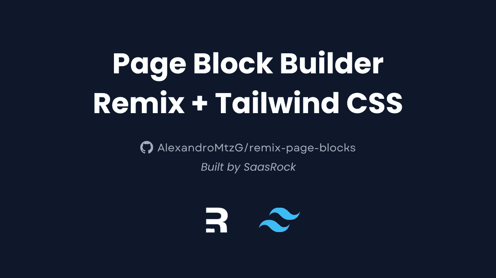
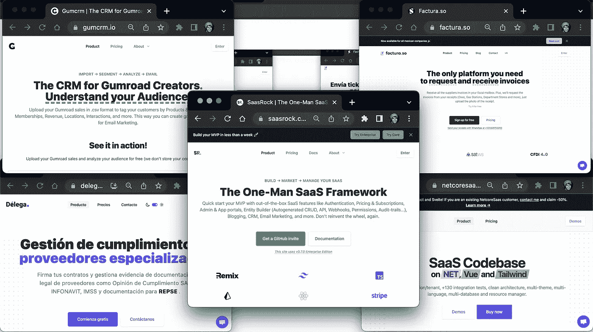
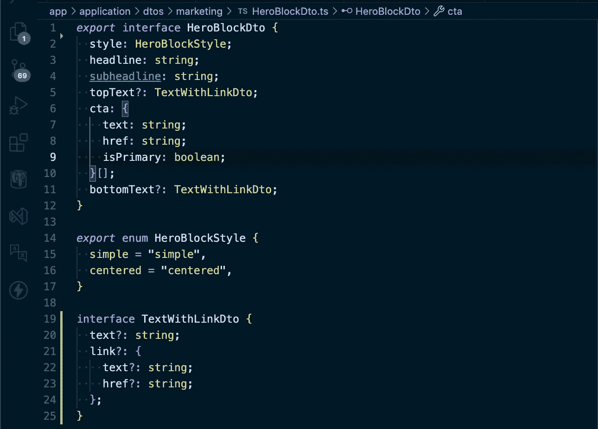
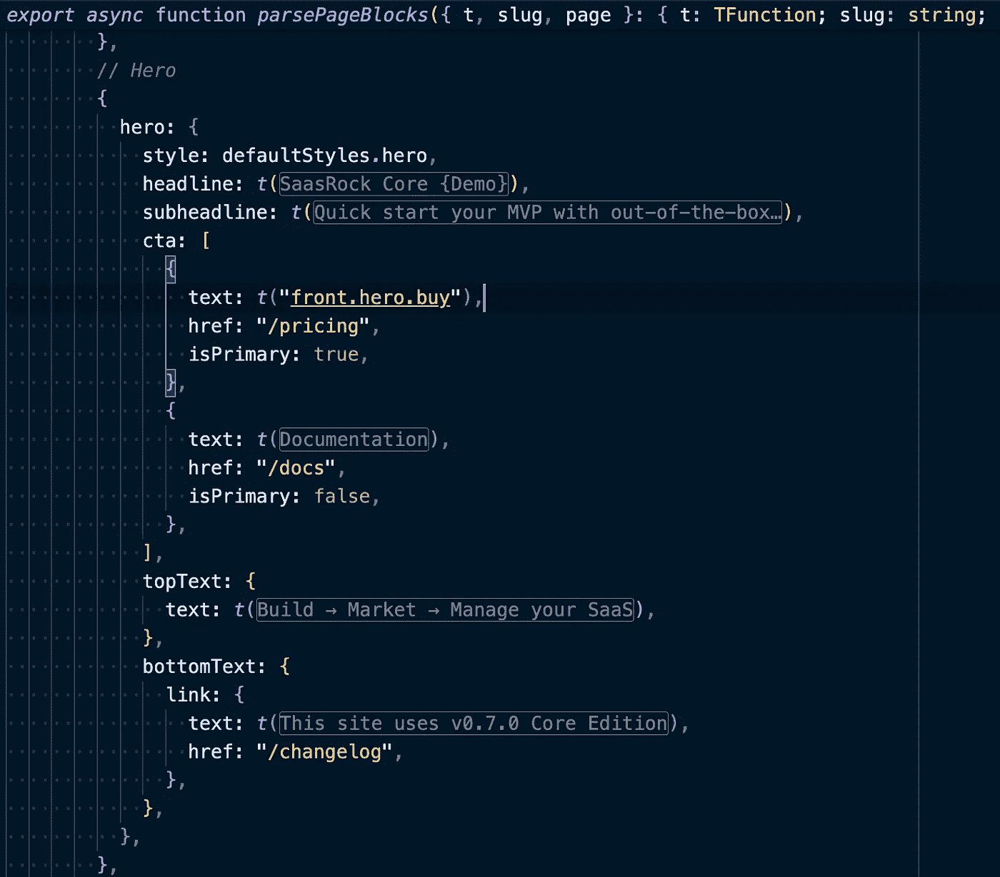
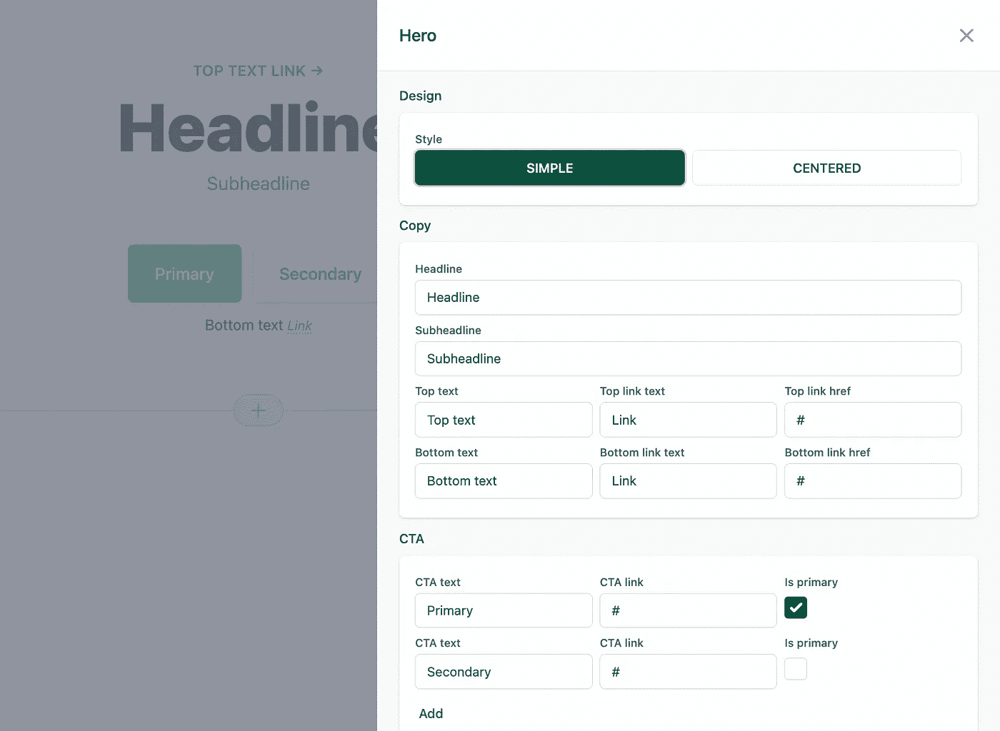

# 带有 Remix 和 Tailwind CSS 的开源页面块生成器

> 原文：<https://javascript.plainenglish.io/building-a-page-block-builder-with-remix-and-tailwind-css-f9044a09cfa8?source=collection_archive---------3----------------------->

代码:[https://github.com/AlexandroMtzG/remix-page-blocks](https://github.com/AlexandroMtzG/remix-page-blocks)
演示:[https://remix-page-blocks . vercel . app](https://remix-page-blocks.vercel.app/)

# 语境

我已经做了 3 年的 SaaS 建设者，自从我学会了顺风 CSS，我的设计迭代已经成为一种乐趣。

但是 [Remix](https://remix.run/) 完全改变了我的游戏，作为一个专注于 SSR 的框架加上提供[全栈组件](https://www.youtube.com/watch?v=RszUDp_yiLI)，它允许我更快地迭代 SaaS 开发。

# 页面块

我已经设计过几次同样的英雄积木了:

*   [萨斯罗克](https://saasrock.com/?ref=medium&utm_content=page-builder)
*   [Factura.so](https://factura.so/?ref=medium&utm_content=page-builder) (用 saasrock 制造)
*   [Gumcrm.io](https://gumcrm.io/?ref=medium&utm_content=page-builder) (内置 saasrock)
*   [NetcoreSaas](https://netcoresaas.com/?ref=medium&utm_content=page-builder)
*   [SaasFrontends](https://saasfrontends.com/)
*   [Delega.com.mx](https://delega.com.mx/?ref=medium&utm_content=page-builder)(内置 netcoresaas)

Same Hero Block

它们都有相同的结构:

*   头条新闻
*   副标题
*   CTA 按钮(主要或次要)
*   可选的顶部文本/链接
*   可选的底部文本/链接

你可以理解这是如何变得令人厌倦的，即使在每次 SaaS 应用程序开发之间有几个月的时间，所以对我来说，开始将最常见的组件抽象成页面生成器是有意义的。

HeroBlockDto

# 开发者体验

我总是首先关注伟大的 DX，所以这种方法让你通过代码设计登陆页面块，一旦它进入生产，它会让你通过在数据库中保持变化来改变你的块(用 [Prisma](https://www.prisma.io/) )。

这是英雄街区的样子:

Hero Block by Code

这是 Hero 块编辑器的样子:

Hero Block Editor

# 开放源码

我决定将这个位开源，以帮助其他 Remix 开发者更快地迭代，或者至少为他们提供一个简单的页面生成器，[给它一颗星](https://github.com/AlexandroMtzG/remix-page-blocks)。我可以看到有人建立一个完整的网站建设者与这个项目为基础。如果你想看看我的其他开源项目，可以看看我的 [GitHub](https://github.com/AlexandroMtzG) 简介。

# 萨斯罗克

如果你喜欢我所做的，看看我的商业 SaaS 样板， [SaasRock](https://saasrock.com/?ref=medium&utm_content=page-builder) ，或者在这里看看我是如何使用这个页面块生成器的:

感谢阅读😃。

*更多内容看* [***说白了就是 io***](https://plainenglish.io/) *。报名参加我们的* [***免费周报***](http://newsletter.plainenglish.io/) *。关注我们上*[***Twitter***](https://twitter.com/inPlainEngHQ)，[***LinkedIn***](https://www.linkedin.com/company/inplainenglish/)***，***[***YouTube***](https://www.youtube.com/channel/UCtipWUghju290NWcn8jhyAw)***，*** *和* [***不和*** 【T57 *对成长黑客感兴趣？检查出*](https://discord.gg/GtDtUAvyhW) [***电路***](https://circuit.ooo/) ***。***