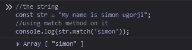
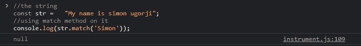
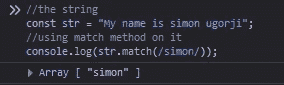
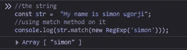
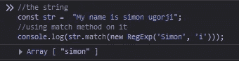
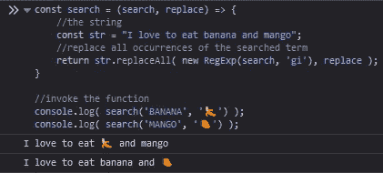
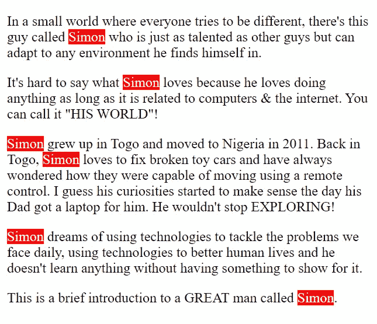

# 如何用 JavaScript 构建一个简单的 HTML 荧光笔

> 原文：<https://javascript.plainenglish.io/building-a-simple-html-highlighter-with-javascript-8703b7836147?source=collection_archive---------6----------------------->

Image by Estée Janssens on Unsplash

在我今天的文章中，我将向您展示如何在字符串中搜索子字符串，以及如何通过搜索字符串的一个或多个匹配项，然后用 HTML 标记替换它来构建一个简单的荧光笔。

我将按如下方式分解流程:

*   使用 match()方法
*   构造正则表达式
*   执行区分大小写的搜索
*   执行不区分大小写的搜索

# 使用 match()方法

`match()`方法将字符串与正则表达式进行匹配，然后返回匹配的`array`，如果没有找到匹配的，则返回`null`。

如果您提供一个字符串作为搜索值，它将被转换成一个正则表达式。

这里有一个使用这种方法的快速示例。

我有一个字符串，我想在其中搜索我名字的出现。以下是我将如何使用`match()`方法来实现这一点。

这是结果

使用上面的方法，您将对字符串执行区分大小写的搜索。如果我们想搜索“西蒙”(大写)，这将是结果。

无效！因为我们执行了区分大小写的搜索，但没有找到匹配项。

我们也可以传入自定义正则表达式，而不是传入字符串作为搜索值。

> *请注意，使用正则表达式时，不必将它们作为字符串提供。这是因为 JavaScript 引擎本身就能识别正则表达式。*

这是结果

# 构造正则表达式

让我们做一些不同的事情。这一次，我将使用搜索词构造一个正则表达式，并将其作为参数传递给 match()方法。

为了构造一个正则表达式，我们需要使用 RegExp 构造函数，并传入字符串作为第一个参数，任何修饰符作为第二个参数。

这是结果

# 区分大小写且不区分大小写的搜索

在不提供`i`修饰符的情况下，正则表达式执行区分大小写的搜索。所以这意味着使用修饰符`i`将使搜索不区分大小写。

所以我搜索了“Simon”(大写)，它只返回了我需要的结果。

# 让我们构建一个小函数

为了确保您了解如何在字符串中搜索子字符串，我将构建一个接受两个参数的函数。

*   第一个参数是搜索词
*   第二个参数是替换

该函数将执行不区分大小写的搜索，并使用 replace all()方法替换所有出现的搜索项。

在使用 **replaceAll()** 方法时，我们需要向*正则表达式构造函数*函数`g`添加另一个修饰符，这意味着正则表达式在找到搜索词的第一个匹配项时不会停止，而是会继续找出其他匹配项，直到到达字符串的末尾。

这是结果

# 最终功能

了解了基础知识之后，我们现在可以构建一个函数，在网页中搜索某个单词，如果找到，就高亮显示该单词。

所以我有一个测试网页

这是当我调用该函数来突出显示“Simon”时，网页看起来的样子。

# 最后的想法

以下是我今天文章的摘录。

*   您可以向 match()方法传递一个正则表达式，并根据您想要实现的结果提供任何修饰符。
*   如果您希望查找搜索词的多次出现，请使用`g`修饰符。
*   如果您希望执行不区分大小写的搜索，请使用`i`修饰符。
*   使用`replaceAll()`方法时，必须使用`g`正则表达式修饰符

如果你想制作一个更大的 HTML 荧光笔，这里有一些你需要的提示。

*   您需要转义特殊字符
*   你需要检查换行

你今天已经到了我文章的结尾。

谢谢你。

*更多内容看* [***说白了。报名参加我们的***](https://plainenglish.io/) **[***免费周报***](http://newsletter.plainenglish.io/) *。关注我们* [***推特***](https://twitter.com/inPlainEngHQ) *和*[***LinkedIn***](https://www.linkedin.com/company/inplainenglish/)*。查看我们的* [***社区不和谐***](https://discord.gg/GtDtUAvyhW) *加入我们的* [***人才集体***](https://inplainenglish.pallet.com/talent/welcome) *。***