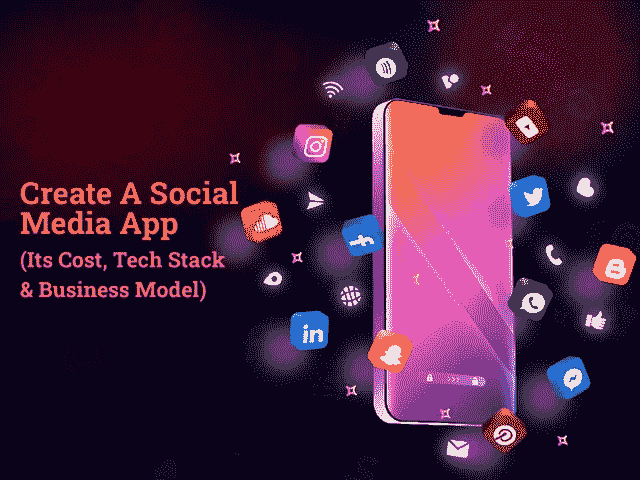
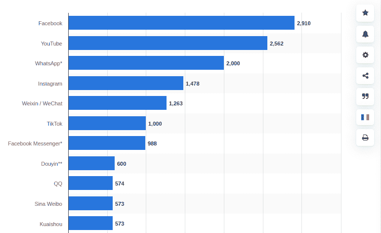
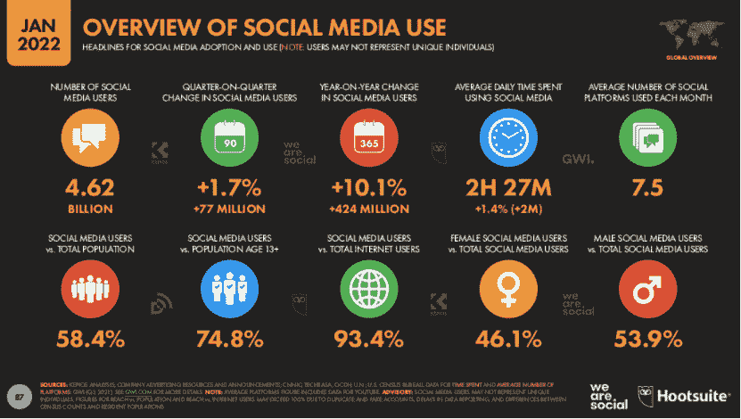

# 2022 年打造一款社交媒体应用:你要花多少钱？

> 原文：<https://javascript.plainenglish.io/building-a-social-media-app-in-2022-how-much-does-it-cost-you-e33ee18753b4?source=collection_archive---------12----------------------->

## 2022 年创建一个社交媒体 App 需要多少钱？

Building a Social Media App in 2022: How Much Does It Cost You?

近年来，脸书、Instagram、Tumbler、YouTube 和 Twitter 等社交媒体应用的巨大成功极大地影响了投资者开发社交媒体应用。

事实上，创建一个社交媒体应用程序已经成为初创公司和商业爱好者最有潜力的机会之一。但困扰他们投资社交媒体应用的一个问题是，“创建一个像脸书或 Instagram 这样的社交媒体应用需要多少成本？”。如果你也在追逐这个问题，那么这里有一个完整的指南，可以帮助你创建一个社交媒体应用程序，以及它需要多少钱。

在疫情之后，人们开始在社交媒体应用上花费更多时间，毫无疑问，这些平台变得更加上瘾。世界形势的变化强烈表明社交媒体应用的炒作越来越多。因此，考虑在 2022 年建立一个社交平台将是创业公司值得做的决定。

如果你仍然想知道为什么在 2022 年开发一个社交媒体应用程序，那么这里有一些关键的亮点，可以帮助你进行深入的指导。

**博客重点:**

*   *2022 年，初创公司为何瞄准社交媒体应用？
    -了解社交媒体应用的市场前景*
*   *你需要了解哪些类型的社交媒体应用趋势？*
*   人们对新的社交媒体应用有什么期望？
*   *如何为 2022 年的创业公司打造一款社交媒体 App？
    -创建社交媒体应用的必备功能
    -社交媒体应用的高级功能*
*   *如何构建社交媒体应用:应用开发的技术堆栈和团队*
*   *2022 年创建一个社交媒体 App 需要多少钱？*
*   *结论:开发一个社交媒体应用程序，不要犯任何错误*

> 为了更好地理解，让我们深入了解这些要点的细节:

## **2022 年创业公司为什么瞄准社交媒体 app？**

不可否认的是，社交媒体应用已经成为创业公司的热门话题。近年来，社交媒体应用改变了人们相互交流的方式。人们花大量时间在 Instagram 或脸书上浏览新闻。更不用说，其他社交应用程序也同样有趣，并激励创业公司开发类似的东西。这些应用程序越来越受欢迎背后的秘密是访问应用程序的自由和灵活性。此外，这些应用程序提供了一个潜在的平台，用户可以在这里分享他们的想法，梦想和成就。事实上，社交网络应用程序正在将用户与整个世界联系起来，并与志同道合的人交流思想。

> 你不必相信我们的话。以下统计数据有助于你理解为什么市场会瞄准社交媒体应用:

*   根据调查，全球 57.6%的人口使用社交媒体，平均每天花费 [2 小时 27 分钟](https://www.smartinsights.com/social-media-marketing/social-media-strategy/new-global-social-media-research/)。
*   根据调查，[脸书和 YouTube](https://www.statista.com/statistics/272014/global-social-networks-ranked-by-number-of-users/) 将在 2022 年 1 月成为全球最受欢迎的社交网络。

*   根据这些报告， [93.4%的互联网用户](https://www.smartinsights.com/social-media-marketing/social-media-strategy/new-global-social-media-research/)正在使用社交媒体应用。

[Image Source](https://www.smartinsights.com/social-media-marketing/social-media-strategy/new-global-social-media-research/)

*   根据该报告，2019 年全球社交网络平台市场的估值为 1929.50 亿美元，预计 CAGR 将增长 25.38%。此外，预计到 2026 年，市场规模将达到[9396.79 亿美元。](https://www.globenewswire.com/news-release/2021/08/27/2287644/28124/en/Global-Social-Networking-Platforms-Market-2021-to-2026-Featuring-Facebook-Pinterest-and-Twitter-Among-Others.html#:~:text=The%20global%20social%20networking%20platforms,increasing%20at%20an%20exponential%20rate.)

当然，这些统计数据代表了社交媒体行业的进步图景。这些应用吸引用户注意力的方式，毫无疑问，社交媒体应用正在占据中心舞台。但是在你直接进入雇佣一个 [**移动应用程序开发公司**](https://www.xicom.ae/services/mobile-app-development/) 的过程之前，有必要进行市场调查。确定它给用户带来了什么价值，开发一个像 Instagram 或脸书这样的社交媒体应用需要多少成本。鉴于市场上已经存在如此多的社交媒体应用，有必要关注一下“人们对你的应用到底有什么期待？”

但在你进入应用程序开发过程之前，确保你知道你需要开发什么类型的应用程序，以及你将如何接近目标受众。

# **你需要了解哪些类型的社交媒体应用趋势？**

如果你最终决定创建一个移动应用，那么一个紧迫的问题将是如何在竞争激烈的市场中占有一席之地。虽然有各种各样的社交媒体应用程序在引领这个领域，但创造你的品牌形象是初创公司面临的最大挑战之一。不过不用担心，你需要的只是了解你的业务需求，挑好 app 类型。

> 考虑你的目标受众、用户需求、合适的功能和竞争对手来选择你的应用类型。以下是各种类型的社交媒体应用:

*   **脸书或 LinkedIn 等社交网络应用**

创建这种类型的应用程序的简单概念是连接人们，LinkedIn 因建立专业网络而闻名全球。要创建这种类型的社交媒体应用程序，你需要实现允许用户分享想法、上传视频和照片的功能。

*   【Instagram、Snap-chat 或 YouTube 等媒体共享网络

媒体共享网络应用程序为那些想要创建和共享视频内容或想要开设视频频道的用户提供了巨大的可能性。像 Snapchat 或 Instagram 这样的应用程序已经成为这些功能的引领者。你可以 [**雇佣一个移动开发者**](https://www.xicom.ae/services/mobile-app-developers/) 来创建这种类型的应用。这种类型的应用程序提供了各种编辑功能和过滤器，以使该应用程序更有效地工作。所以了解这些本地用户的喜欢和不喜欢，就可以相应的定制界面。

*   **在线点评应用，如 Tripadvisor、Yelp 或 Foursquare**

这类社交媒体应用最能提供各种产品和服务的知识。评论分享网站确实提高了服务质量，因为组织必须努力维护他们在这些平台上的评级和评论。

*   **像 Quora 这样的论坛**

Quora 类型的问答网站允许用户提交任何问题，论坛将为用户提供专家答案。论坛在查找所需信息方面发挥了重要作用。因此，用户有机会开始讨论，提出问题，并从专家那里获得答案。

无论你选择创建哪种类型的社交媒体应用，每个领域都已经被行业巨头所拥有。所以你们中的许多人都想知道如何获得人气，是否值得建立一个应用程序。在你做出任何决定之前，你需要了解市场需求。嗯，事实是，社交媒体行业仍然为初创公司保留着空间，他们需要的只是认识到用户的需求。

## **人们对新的社交媒体应用有什么期待？**

当你决定创建一个社交媒体应用程序时，成功的关键是进行深入的市场调查。寻找其他社交媒体应用尚未覆盖的领域。此外，突出显示您的应用程序可以解决的用户任务列表。为了让你的应用程序运行良好，你需要设定目标，从用户的角度考虑应用程序的结构。

> **现在，问题是用户对你的应用有什么期待？**

*   既然我们在谈论社交网络应用，人们首先寻求的是你的应用程序的无障碍通信功能。
*   其次，社交媒体应用程序现在越来越受欢迎，因为它提供了编辑图像的最终机会。
*   第三，使用方便是一个非常重要的考虑因素。在这里，大多数人都会犯严重的错误。为了增加超越他人的优势，企业会考虑实现大量的特性和功能，让你的应用变得复杂。

那么，你会给这款应用添加什么样的特性和功能呢？这将决定你的应用程序的成功，但同时也会影响应用程序开发预算。

# **如何在 2022 年为你的创业公司创建一个社交媒体 App？**

你想在 2022 年创建一个社交媒体应用吗？如果是，那么请记住，不同的社交媒体应用程序是为不同的目的开发的。但是，仍然有一些基本的特性和功能，你需要寻找。因此，让我们直接进入帮助您从基本应用程序版本开始的必备功能列表。

> **创建脸书或 Instagram 等社交媒体应用的必备功能**

*   **用户注册:**为了提供对应用程序的访问，允许用户使用电子邮件 ID 和密码或电话号码注册应用程序。为了让一个社交媒体应用更加人性化，你可以 [**雇佣一个手机应用开发者**](https://www.xicom.ae/services/mobile-app-developers/) 来增加“忘记密码”的功能。为了让它工作，应用程序开发者可以使用脸书或谷歌 SDK。
*   **用户资料:**根据社交应用类型，您可以灵活地创建个人资料，包括添加个人资料图片、编辑姓名、联系方式等。此信息允许其他用户通过联系人“连接”选项查看您的个人资料。一个有思想的个人资料可以让客户订阅，但是你需要相应地考虑用户体验和页面布局。
*   **搜索:**要找到朋友或博主关注，用户需要一个舒适的搜索选项。此外，允许用户使用标签、用户名或位置搜索个人资料。
*   **Newsfeed:** 这是你肯定希望在你的应用中加入的功能之一。有了这些功能，用户将不断更新新的信息，激发他们重新打开应用程序并不断使用它。
*   **消息传递:**为了满足用户的通信需求，允许他们发送直接或个人消息。
*   **上传内容并分享:**提供上传照片或视频等内容的能力，并允许用户在自己的页面或群组中分享这些内容。要将此功能提升到一个新的水平，您可以添加该功能来编辑照片和视频，并在上传到网络之前提供过滤器。
*   **标记用户:**通过给你的内容添加标签，与他人分享变得更加容易。它还可以根据位置、兴趣或姓名快速显示与人的信息。
*   **评论和反馈:**为内容添加评论或点击喜欢按钮等功能将帮助您使您的社交媒体应用程序更具互动性和趣味性。有了这个功能，用户可以分享他们的意见和想法。
*   **联系人管理:**要与您的朋友保持联系或邀请其他人加入您的社交网络帐户，添加两个选项很重要:“添加朋友”和“邀请新用户”。

这些是你需要整合到社交媒体应用中的几个基本功能。然而，市场上已经有太多的社交媒体应用程序具有相同的功能。那么，你如何让你的应用在竞争激烈的市场中脱颖而出呢？这就是你需要考虑为你的应用添加高级功能的地方…

> **社交媒体应用的高级功能**

*   **流媒体直播:**流媒体直播功能在脸书或 Instagram 等社交媒体应用中非常受欢迎。它允许用户直接与他们的追随者实时交流并分享经验。通过聘请一家 [**app 开发公司**](https://www.xicom.ae/services/mobile-app-development/) ，也可以考虑增加这个功能。事实上，当你需要进行问答环节或想要分享产品评论时，这个功能最有效。这有助于你直接与观众沟通。
*   地理定位:这个功能将允许用户在图片上标记位置，或者能够找到附近的其他人。该功能最适合商业页面，允许用户找到附近的位置，或者允许品牌根据基于位置的受众推广服务。
*   **短命内容:**像脸书或者 Instagram 一样，你也可以考虑加入短命内容的功能。它允许用户上传 24 小时后消失的照片或视频。这项功能的简单概念是上传短期内容，以增加用户每天花在社交媒体应用上的时间。
*   照片滤镜:【Snapchat 或 Instagram 等社交媒体应用因其极具吸引力的照片滤镜而在全球范围内广受欢迎。无论是基于场合、基于位置还是基于美颜，类似 Snapchat 的社交媒体应用每天都提供新的过滤器，让用户与应用保持互动。

将这些功能添加到你的应用程序中肯定会对你的预算产生很大影响，但会使你的应用程序与现有应用程序相比极具竞争力。但问题是创建一个社交媒体应用程序需要哪些主要的技术……让我们来寻找这个问题的答案……

## **如何构建社交媒体应用:应用开发的技术堆栈和团队**

你是否受到脸书或 Instagram 等社交媒体应用功能的影响？它的界面能保证令人满意的用户体验吗？想创建一个像脸书或 Instagram 一样的社交媒体应用吗？如果是，那么你需要雇佣一个专业团队，其中可能包括 iOS 应用程序开发人员、Android 应用程序开发人员、业务分析师、项目经理、UI/UX 设计师和应用程序测试人员。

除了外包应用开发团队，你还需要各种工具和技术来 [**创建一个社交媒体应用**](https://www.xicom.ae/services/mobile-app-development/) 。以下是开发社交媒体应用程序所需的主要技术列表:

*   *iOS/ Android 应用开发:Swift/ Object C/ Kotlin/ Java*
*   *跨平台 App 开发:Flutter/ React Native*
*   *iOS/Android 应用联网:Alamofire / OkHttp 3*
*   *后端开发:Node.js*
*   *框架:快递 4*
*   *数据库:MySQL*
*   *聊天:Socket.io*
*   *注册:亚马逊 SES，亚马逊 SNS*
*   *API: Swagger*
*   *推送通知:FCM*
*   地理定位:谷歌地图
*   *存储:亚马逊 S3*
*   *邮件:弹性邮件*
*   *搜索:弹性搜索*

这些是构建社交媒体应用程序所需的少数主要技术栈，但复杂的应用程序结构可能需要额外的技术。也就是说，你们中的许多人想知道它花费了你多少钱，需要多长时间来启动你的应用程序？

## **2022 年创建一个社交媒体 App 需要多少钱？**

开发一个社交媒体应用的成本实际上根据你的业务需求而不同。不同的社交媒体应用程序采用不同的方法开发，因此，没有一款应用程序的后端和前端开发工作量相同。

通常，应用程序的成本取决于各种因素，如应用程序的复杂性、特性和功能、应用程序类型、UI/UX 设计等。最终成本和应用程序开发时间取决于您选择为您的项目雇佣的应用程序开发团队。然而，一个主要影响应用程序开发成本的部分是特性和功能的选择。更复杂的功能将花费更长的应用程序开发时间，并导致昂贵的成本。因此，在开发社交媒体应用时，你需要带来独特的概念和有助于你在市场中引领潮流的功能。

如果要估算应用程序开发成本，那么大约需要 20，000 美元到 25，000 美元以上，应用程序开发可能需要 4 个月到 9 个月以上。最终的成本和时间估计将取决于您的业务需求及其复杂性。

因此，在您做出任何决定之前，您可以与专家预约免费咨询时段，并亲自讨论您的业务需求。

## **结论:开发一个社交媒体应用程序，不要犯任何错误**

随着这篇博客的结束，可以说社交媒体应用比以往任何时候都更加蓬勃发展。尽管被脸书、Instagram 或 Snapchat 等领先应用所主导，但如果你的应用有独特的功能，它仍然可以在市场上蓬勃发展。你所需要的是采用最好的应用程序开发方法，并融入独特的功能，以获得成功。而最简单最理想的方式就是聘请一家 [**手机 app 开发公司**](https://www.xicom.ae/services/mobile-app-development/) 将你独特的 app 创意带入市场。

既然现在你知道如何从头开始制作一个应用程序，那么是时候将你出色的社交媒体应用程序创意以成功的数字产品的形式推向市场了。这就是专业应用程序开发团队将帮助您在应用程序开发项目中融入最佳技术和方法的地方。为功能添加更多规格，帮助您成为社交媒体应用行业的潮流引领者。

因此，如果您正在寻找专家为您的企业创建一个 MVP 解决方案或一个成熟的社交媒体应用程序，那么您可以 [**联系我们**](https://www.xicom.ae/contact/) 或提出对可靠解决方案和真实评估的疑问。

=======================================

*更多内容看* [*说白了。报名参加我们的*](https://plainenglish.io/) [*免费每周简讯*](http://newsletter.plainenglish.io/) *。关注我们的*[*Twitter*](https://twitter.com/inPlainEngHQ)*和*[*LinkedIn*](https://www.linkedin.com/company/inplainenglish/)*。加入我们的* [*社区不和谐*](https://discord.gg/GtDtUAvyhW) *。*