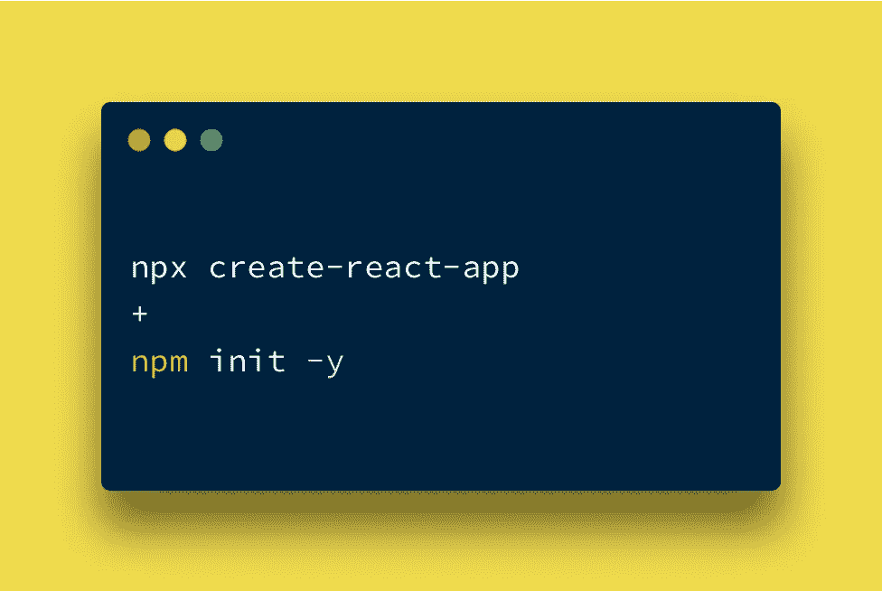
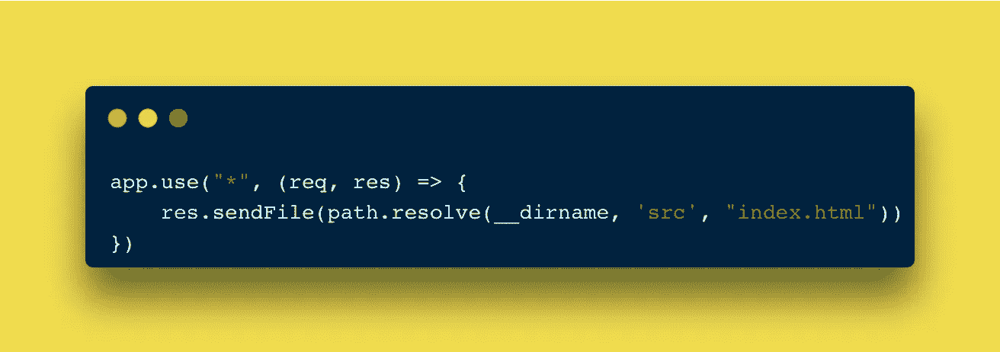

# 如何用 React 和 Node.js 构建 SPA

> 原文：<https://javascript.plainenglish.io/building-a-spa-with-react-and-node-cef18dccef17?source=collection_archive---------3----------------------->

## 为 React 项目运行一个节点服务器后端——用户界面和服务器之间不再有冲突

React 无疑是一个非常棒的 UI 库，它让很多前端开发人员的生活变得更加轻松。但是尽管有很多好东西——hooks 是我个人最喜欢的——很多人担心的事情之一是 SEO。

在我继续之前，我只想说，我绝不是想把 React 扔到公共汽车下面，但是说实话，SEO 确实是一个值得关注的问题。对吗？

Next.js 的出现有很多原因，但解决 SEO 问题是一个重要原因。使用 Next.js，我们可以将我们的前端移到服务器上，并在用户请求时将其作为渲染页面发送。另一方面，使用 React，是客户端(浏览器)完成所有繁重的工作，并将生成的 HTML 注入到一个类似空白模板的 HTML 文档中。如果页面有大量图形或动画相关的内容，这可能是一个缓慢的过程。

# 另一种方式？

现在，我是一个有反应的人。对 Angular 有经验，对 Next.js 有一点了解(我知道它是基于 React 的)，我仍然会选择 React。不，我也不想使用任何模板引擎，如 EJS 或车把。我仍然要使用 React 构建我的 UI，但是让我的 Node/Express 服务器为所有与 API 无关的路由提供一个 HTML 文件。

这与在节点应用程序中处理错误或不存在的路由非常相似，我们添加一个通配符路由来返回一些 error.html 页面；类似这样的-

All requests to non-API related routes will be forwarded to index.html

# MERN·斯塔克！集合！

我假设在将来的某个时候，或者从一开始，您将需要某种管理数据的方法，到时候您会选择 MongoDB。*没有压力。*玩笑归玩笑，真实的对话……你可能已经在一个节点或 React(或两者)项目上工作过很多次，但让我们一步一步来……

## 目录结构

通常，当使用`npx create-react-app`创建 React 应用程序时，git 存储库会自动初始化。这是我们不需要的东西，因为我们的项目将(本质上)分为`client`和`server`代码，每个代码都在自己的文件夹中，这两个代码将存在于单个根文件夹中——这也将在 git repo 之外。

1.  `react-node-project`是我们的根文件夹，也是我们的单一 git repo。
2.  `client`文件夹包含了我们所有与 React 相关的代码。假设除了删除 git repo 之外，您没有接触过它，那么这里有所有常见的东西— `index.js`、`App.js`等等。
3.  `server`文件夹中有我们所有的服务器相关代码——所有的`routes`、`controllers`、`tests`和其他所有东西。你也可以看到一个`webpack.config.js`，那是因为这是我实际的项目目录，我使用 webpack 作为捆绑器。你也会需要它的。
4.  如果您决定在您的节点服务器中使用环境变量，您将需要一个`.env`文件，它将与`package.json`、`package-lock.json`和`node_modules`一起位于项目的根目录下。

完全有可能把你所有的东西都放在根目录的`server`文件夹中，而只有一个`client`文件夹，但是你不同意吗，这样看起来更干净，更容易维护？

## 它实际上将如何工作？

还记得几分钟前我们看到的为错误路线的 error.html 发球的例子吗？这正是我们要做的。相反，这一次，它将在每个与服务器无关的路线上为我们的 React 应用程序提供快速服务。想想看，如果`/home`不是已知的 express，它应该返回一个错误页面，但相反，我们的主页在`/home`路线上提供服务。如果路线是`/api/home`，那么 express 可能会返回一些数据或执行一些操作。

A valid express route (on top) and the route that will handle requests to all non-existing routes (bottom)

为了让我们的 UI 在栏中有正确的 URL，我们将为此使用`react-router`和`react-router-dom`。这样，尽管它仍然是一个水疗中心，我们会觉得我们实际上是在移动。需要记住的一点是，这只有在我们构建 React 应用程序(使用`npm run build`)时才有效——因为路线需要编译代码。

## `package.json`中的最终检查

假设您遵循相同或相似的目录结构，并且已经将一个简单的 react 应用程序(在客户端文件夹中)和 node/express 应用程序(在服务器文件夹中)放在一起，那么是时候调整我们的 package.json 文件了——大部分只是与服务器相关的。

Package.json 非常有用，因为我们可以创建简单甚至复杂的脚本，并自动执行重复的任务。比方说，现在你的 package.json (server)中的脚本部分是这样的——一个使用`nodemon`启动开发服务器的`dev`脚本。

我们将添加一些脚本来处理-

1.  构建我们的服务器代码
2.  将构建文件夹从客户机移动到 dist 文件夹(我们的服务器代码的最终输出文件夹)
3.  创建一个类似生产的本地环境。

*   `build-server` —使用 webpack 构建服务器代码。
*   `build-client` —为了构建客户端代码，我们需要首先将`cd`放入那个文件夹，然后运行`npm run build`，这样我们就可以使用`react-scripts`。
*   `build` —同时运行`build-server`和`build-client`。
*   `pre-deploy` —将`build`文件夹从`client`移至`dist`文件夹。
*   `local` —首先运行`pre-deploy`，然后使用以`main`开头的`dist`文件夹中的任意`.js`文件启动节点服务器。

在启动脚本之前，我们必须做的最后一个更改是在 React 项目的`package.json`中添加一个代理。这将使我们不必为每个 api 调用编写“`http://localhost:4000`”。相反，我们将能够只通过`/api/home`而逃脱。添加代理的另一大好处是，如果你决定将你的应用程序部署到 Heroku，你所要做的就是将代理值改为 Heroku 的 URL。你就一切就绪了。

## 关键时刻到了

终于！是时候运行我们的脚本来构建和运行我们的应用程序了。我们只需要`npm run build && npm run local`。您还可以创建另一个脚本来同时运行这两个脚本。而且，如果我们没有犯愚蠢的错误，我们的应用程序应该在端口 4000 上启动和运行(或者您自己的，如果您使用任何其他端口)。

> 注意:请记住…您总是需要在预部署之前进行构建。而且，如果您决定执行 npm run local，您将需要更改' *' get 请求的路径，以指向 **dist/build 中的 index.html。**

感谢您的阅读。

我希望这篇文章对你有用。

请在评论中告诉我你使用哪个框架/库来构建前端和后端项目。

结束。

*更多内容请看*[***plain English . io***](https://plainenglish.io/)*。报名参加我们的* [***免费周报***](http://newsletter.plainenglish.io/) *。关注我们关于*[***Twitter***](https://twitter.com/inPlainEngHQ)*和*[***LinkedIn***](https://www.linkedin.com/company/inplainenglish/)*。加入我们的* [***社区不和谐***](https://discord.gg/GtDtUAvyhW) *。*