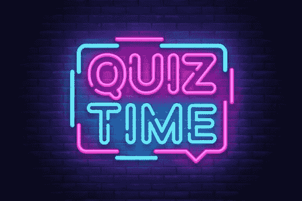
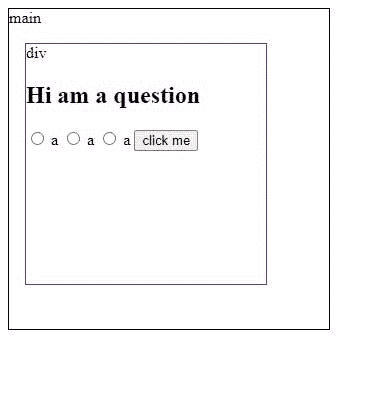
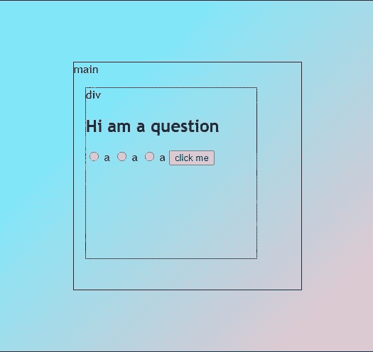
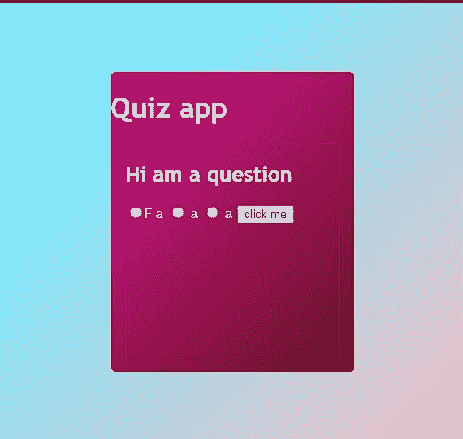
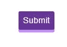
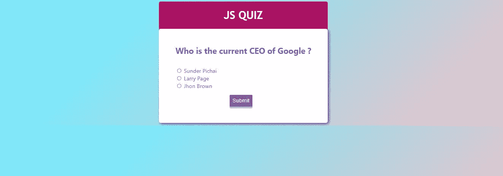

# 如何在短短 10 分钟内构建一个超酷的测验应用程序

> 原文：<https://javascript.plainenglish.io/building-a-super-cool-quiz-app-in-just-10-mins-2caac41ea016?source=collection_archive---------7----------------------->



# 介绍

处理输入是 web 开发中带来动态性的最重要的主题之一。如果我输入什么，说`a`，然后说`the font color may change`，或者如果我输入`b`，说`a popup will be shown`。

在这篇文章中，我将讨论如何使用 HTML radio 输入，这些输入通常用于调查表格、在线测验或选择用户偏好。此外，我将讨论如何在你的项目中添加渐变和动画。因此，我将展示如何使用 HTML、CSS 和 JavaScript 构建一个超级酷的测验应用程序。

# 构建结构

由于我们正在构建一个测验应用程序，我们需要一个问题的`<h1>`和一组三个答案的单选输入，我们还需要一个提交答案的按钮，我们将把所有这些元素放在一个`<div>`和一个`<main>`中的`<div>`。

```
<main id="quiz-app">
      <h1 id="quiz-title">JS QUIZ</h1>
      <div class="quiz-container" id="quiz">
        <h2 id="question"></h2>
        <li>
          <input type="radio" id="a" name="answer" class="answer" value="a" />
          <label for="a" id="a+"></label>
        </li>
        <li>
          <input type="radio" id="b" name="answer" class="answer" value="b" />
          <label for="b" id="b+"></label>
        </li>
        <li>
          <input type="radio" id="c" name="answer" class="answer" value="c" />
          <label for="c" id="c+"></label>
        </li>
        <button id="submit" value="Submit">Submit</button>
      </div>
    </main>
```

让我简单点。假设有一个`main`框，里面有一个`div`框，里面有我们的测验元素。



# 添加样式

既然我们已经完成了结构，现在让我们添加 CSS。

# 身体

```
body {
  display: flex;
  justify-content: center;
  align-items: center;
  background-color: #eec0c6;
background-image: linear-gradient(315deg, #eec0c6 0%, #7ee8fa 74%); font-family: 'Trebuchet MS', 'Lucida Sans Unicode', 'Lucida Grande',
    'Lucida Sans', Arial, sans-serif;
}
```

在这里，前三行将确保我们所有的元素都在中心，然后,`background-color`会给我们一个美丽的颜色，而`liner-gradient`会给我们一个从`left`到`right`旋转`315`度的线性颜色流，从颜色 a 到 b。



# 主要的

现在让我们设计我们的主盒。

```
main {
background-color: #6b0f1a;
background-image: linear-gradient(315deg, #6b0f1a 0%, #b91372 74%); border-radius: 5px;
  color: white;
}
```



# 测验容器

```
.quiz-container {
  list-style: none;
  box-shadow: 3px 3px 10px rgba(0, 0, 0, 0.5);
  border-radius: 5px;
  padding: 3rem;
  background-color: white;
  color: blueviolet;
  font-family: 'Segoe UI', Tahoma, Geneva, Verdana, sans-serif;
}
```

这将使我们的测验容器看起来很棒。

# 通过添加动画来设置按钮的样式

对于按钮，我们将使用一些 CSS 类，如`:active` & `:hover`。同样，我们将添加`transform` & `translateY`属性来添加一个点击动画。

```
button#submit {
  padding: 0.5rem;
  border: none;
  border-radius: 3px;
  background-color: rebeccapurple;
  color: white;
  font-size: 1rem;
  margin: 1rem 0 0 40%;
  box-shadow: 0 5px rgb(195, 141, 246);
}button#submit:hover {
  background-color: blueviolet;
}button#submit:active {
  background-color: blueviolet;
  box-shadow: 0 5px rgb(188, 155, 219);
  transform: translateY(4px);
}
```

看懂这里的动画。`:active`将确保当我们单击按钮时，它将在 y 轴上移动按钮 4px，之后，按钮将返回到它自己的位置。此外，我们使用`:hover`,这意味着当我们将光标放在按钮上时，它会改变它的背景颜色，并且框阴影会给我们一个 5 px 的底部边框。



# 添加最后润色

现在，让我们通过添加一些填充和边距来修改测验标题和问题元素。

```
#question {
  margin: 0 0 2rem 0;
}h1 {
  text-align: center;
  z-index: -1;
}
```



# 添加 JavaScript 并构建测验

我将这一部分分为 3 个子部分，即创建测验数据、获取 HTML 输入和定义后续步骤的函数。

# 1.创建测验数据

```
/*quiz data */
const quizData = [
  {
    question: 'Who is the current CEO of Google ?',
    a: 'Sunder Pichai',
    b: 'Larry Page ',
    c: 'Jhon Brown',
    correct: 'a',
  },
  {
    question: 'Who is the current CEO of Amazon ?',
    a: 'Jeff Bezos',
    b: 'Warren Buffet ',
    c: 'Andy Jassy',
    correct: 'c',
  },
  {
    question: 'Who is the current CEO of Tesla ?',
    a: 'Jeffry Black',
    b: 'Elon Musk ',
    c: 'Jhon Brown',
    correct: 'b',
  },
  {
    question: 'Who is the current CEO of Microsoft ?',
    a: 'Satya Nadella ',
    b: 'Tom Klington',
    c: 'Jhon Brown',
    correct: 'a',
  },
  {
    question: 'Which of the company is owned by Mark Zkerburg ?',
    a: 'Neuralink ',
    b: 'Meta Platforms Inc ',
    c: 'Metaverse LLC ',
    correct: 'b',
  },
];
```

这里，我使用一个数组对象来存储测验数据，我们有一个问题、三个选项和`correct`选项，这是验证用户给出的答案所需要的。

# 2.抓取 HTML 元素

带来动态性意味着通过 JavaScript 与 HTML 元素进行交流。因此，首先，我们需要获取 HTML 测验元素，以便我们可以动态地向它们添加值。让我为你简化一下:假设我们有 100 个问题，如果我们添加硬编码，然后使用 HTML，我们必须手工创建 100 个测验元素。但是通过使用 JavaScript，我们可以运行一个循环，只用几行代码就可以创建数百个测验元素。

```
/*Grabing all the elements */
const question = document.getElementById('question');
const a = document.getElementById('a+');
const b = document.getElementById('b+');
const c = document.getElementById('c+');
const btn = document.getElementById('submit');
const all_answer = document.querySelectorAll('.answer');
```

# 3.定义测验逻辑

```
let index = 0;
let score = 0;
//get the getSelected answer
function getSelected() {
  let ans = undefined; all_answer.forEach((el) => {
    if (el.checked) {
      ans = el.id;
    }
  });
  return ans;
}
//disselect all answer
function deselectans() {
  all_answer.forEach((el) => {
    el.checked = false;
  });
}
//load the quiz data
function getquiz() {
  deselectans();
  question.innerText = quizData[index].question;
  a.innerText = quizData[index].a;
  b.innerText = quizData[index].b;
  c.innerText = quizData[index].c;
}
//move forward the quiz
function startquiz() {
  btn.addEventListener('click', () => {
    let ans = getSelected();
    if (ans) {
      if (ans == quizData[index].correct) {
        score++;
      }
    }
    index++;
    if (index < quizData.length) {
      getquiz();
    } else {
      alert('score :' + score);
      location.reload();
    }
  });
}
getquiz();
startquiz();
```

所以我们现在做的很简单。首先，我们定义了两个变量——都是计数器。前者用于将测验向前推进，或者简单地说，当且仅当用户按下提交按钮时，它才会增加。并且只有当用户输入与`correct`匹配的答案时，`score`才会增加。`getselected()`函数将返回用户选择的选项`id`，如选项 a 的`a`或选项 c 的`c`。`deselectans()`将取消选择每个答案。这很重要，因为假设当用户回答第一个问题的`a`时，他们回答下一个问题的`b`，在这种情况下，我们的`getselcted()`函数会对返回哪个选项 id 感到困惑。而`getquiz()`定义为动态添加问题。

# 结论

我希望我的文章能为你的知识中心增加一些价值。如果你喜欢这篇文章，请随时发表你的反应，并与你的朋友和同行分享。

此外，如果您有任何疑问，请发表评论或通过 Twitter 或 LinkedIn 直接联系我。我很乐意帮助你。敬请期待下一期，编码快乐！

# 连接

[推特](https://twitter.com/kumarkalyan_)

[领英](https://www.linkedin.com/in/kumar009/)

*更多内容请看*[***plain English . io***](https://plainenglish.io/)*。报名参加我们的* [***免费周报***](http://newsletter.plainenglish.io/) *。关注我们关于*[***Twitter***](https://twitter.com/inPlainEngHQ)*和*[***LinkedIn***](https://www.linkedin.com/company/inplainenglish/)*。加入我们的* [***社区不和谐***](https://discord.gg/GtDtUAvyhW) *。*