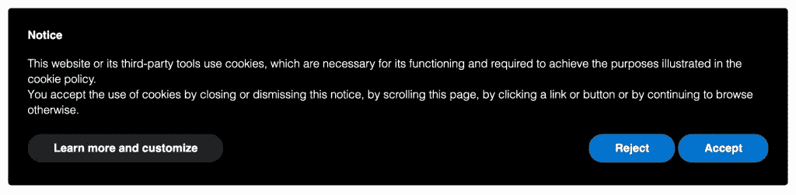
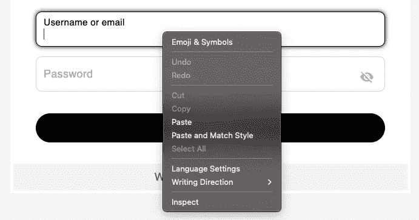
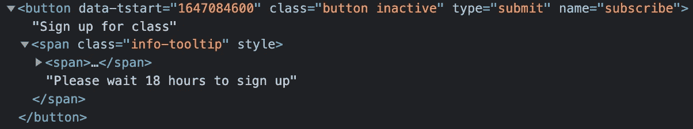
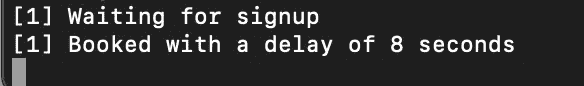

# 如何使用 Node.js & Puppeteer 构建一个机器人来报名体育课

> 原文：<https://javascript.plainenglish.io/building-an-automated-bot-to-sign-up-for-gym-classes-with-node-puppeteer-b812ea4a859b?source=collection_archive---------6----------------------->

使用 Express 和 Puppeteer 构建节点应用程序和自动化繁琐任务的初学者指南。

这篇文章展示了 Puppeteer 的能力，并指导如何在节点应用程序中快速实现它。这是基于我前几天在当地健身房报名时遇到的一个问题。TL；博士，[这是 Github 上的模板](https://github.com/samihamed/class-bot)。

我们将使用 [Node.js](https://nodejs.org/en/) 、 [Express](https://www.npmjs.com/package/express) 、 [Nodemon](https://www.npmjs.com/package/nodemon) 和[木偶师](https://www.npmjs.com/package/puppeteer)构建一个简单的脚本，自动报名 24 小时前的体育课；就在注册解锁的那一刻。这将保证我们在有限的参与者名单中占有一席之地…并且相对于其他人有一点不公平的优势。本指南要求在您的机器上有效安装[节点](https://nodejs.org/en/)和 [NPM](https://www.npmjs.com/) 。

**问题陈述:**自从新冠肺炎去了健身房，我最喜欢的课程的名额就减少到了有限的人数。我健身房的网络应用程序允许会员提前 24 小时报名上课。有些课程是如此受人喜爱；注册解锁后仅仅几秒钟，他们就已经满员了。

注册信息隐藏在登录墙后面，然后列在一个巨大的表格里。不幸的是，我们无法提取 API 调用和身份验证令牌，并且每个单独的类都没有特定的 URL。这就是为什么我们会通过[木偶师](https://pptr.dev/)假装是一个普通的 Chrome 用户。

**什么是木偶师？**木偶师是一个节点库，它提供了一个高级 API 来控制 Chrome 或通过 [DevTools 协议](https://chromedevtools.github.io/devtools-protocol/)的 Chrome。默认情况下，木偶师运行无头的，但是可以配置为运行全(无头)铬或铬。


Photo by [Trollinho](https://unsplash.com/@trollinho?utm_source=medium&utm_medium=referral) on [Unsplash](https://unsplash.com?utm_source=medium&utm_medium=referral)

# 步骤 1:设置一个节点应用程序，安装所需的依赖项，并创建运行应用程序所需的所有文件。

让我们首先打开我们的**终端**并输入以下命令。这将为我们的应用程序`class-bot`创建一个目录，并直接导航到其中

```
mkdir class-bot && cd $_
```

接下来，我们初始化项目来创建一个`package.json`文件。NPM 会问我们一些问题。我们可以回答这些问题，或者只需按几次“回车”键...

```
npm init
```

一个`package.json`刚刚出现在我们的应用目录中。接下来，我们安装前面提到的所有依赖项。这可能需要一点时间。回到您的**终端**并运行:

```
npm i express puppeteer nodemon
```

安装完所有依赖项后，我们的`package.json`文件应该如下所示:

```
{
  "name": "class-bot",
  "version": "1.0.0",
  "description": "",
  "main": "index.js",
  "scripts": {
    "test": "echo \"Error: no test specified\" && exit 1"
  },
  "author": "",
  "license": "ISC",
  "dependencies": {
    "express": "^4.17.3",
    "nodemon": "^2.0.15",
    "puppeteer": "^13.5.1"
  }
}
```

我们的应用程序需要一个 Javascript 文件作为它的主入口——你可以在你的`package.json`文件的第五行或者上面的代码块中看到它被引用为`index.js`。

在主入口文件中，我们将编写脚本的其余部分。返回到**终端**并键入以下命令来创建它:

```
touch index.js
```

创建主入口文件后，我们需要向`package.json`添加一行代码，以添加一个命令，告诉 node 运行脚本并注意代码更改——这将使我们不必在做出更改时刷新并重启应用程序。

转到您的`package.json`文件，将下面一行添加到`scripts`对象中:

```
"start": "nodemon index"
```

将这一行添加到脚本后，我们可以开始构建服务器，同时 nodemon 监视文件中的更改。

接下来，我们回到我们的**终端**并运行下面的代码行:

```
npm run start
```

Nodemon 现在正在运行并观察`index.js`文件。

# 2.填充服务器文件，为木偶脚本创建一个主目录

接下来，让我们进入我们的`index.js`文件，并在我们的代码编辑器中打开它——此时文件应该是空的。我们将添加以下几行来创建服务器:

```
const express = require('express')
const puppeteer = require('puppeteer')const app = express()
const port = 3000app.get('/', (req, res) => {
    res.send('Hello World!')
})

app.listen(port, () => {
    return console.log(`Express is listening at [http://localhost:${port}`](http://localhost:${port}`))
})
```

太好了！此时，我们的应用程序正在运行，并自动观察`index.js`的变化。在您的浏览器中，您已经可以导航到`http://localhost:3000`并看到一条`Hello World!`欢迎消息。检查您的**终端**以查看应用程序运行。

# 3.将木偶脚本添加到服务器文件中

为了开始使用木偶师，我们将在我们的`index.js`文件的底部添加以下几行:

```
// the URL we would like to visit with Puppeteer
const STUDIO_URL = ***'gym_url_goes_here'***const initialisePuppeteer = async () => {
    const browser = await puppeteer.launch({
      headless: false
    })

    const page = await browser.newPage()

    await page.viewport({
      width: 1920,
      height: 1080
    }) await page.goto(STUDIO_URL)
}
```

添加上述功能将不会激活木偶师。为此，我们需要将代码块**上方的下面一行添加到我们的`index.js`文件的**`**app.listen**`**-方法**中:

```
...app.listen(port, () => {
    // Start the Puppeteer script whenever the app launches or changes are detected
 **initialisePuppeteer()** return console.log(`Express is listening at [http://localhost:${port}`](http://localhost:${port}`))
})...
```

现在保存文件。如果我们检查终端和 Nodemon 仍在运行，那么我们的应用程序应该自动初始化木偶脚本，并打开我们之前定义的 URL。

厉害！我们现在已经成功地建立并发布了一个服务器，定义了一个`STUDIO_URL`，并让木偶师在 Chromium 中打开了我们健身房的网站。

# 4.定义所需的方法，让木偶师导航 web 应用程序

当木偶师打开健身房的网络应用程序时，我们首先看到的是一个 cookie 横幅覆盖图。让我们想想如何让木偶师自动点击**接受**按钮。



Example of a cookie banner.

在我们的 Chromium 浏览器中，让我们右键单击**接受**按钮来`inspect`浏览器的 DevTools 中的 html 元素。对我来说是这样的:

```
<a class="cookie-accept-blue" data-cookie-accept="save" id="cookie-accept">Accept</a>
```

从你的角度看，事情可能会有所不同。让我们探索一些让木偶师选择并点击元素的方法。上面的`<a>`元素有三个属性:

*   `class="cookie-accept-blue"`
*   `data-cookie-accept="save"`
*   `id="cookie-accept"`

或者，我们可以右键单击元素，导航到`Copy`并选择`Copy selector`。剪贴板中的粘贴结果如下所示:

```
#CookieBox > div > div > div > div.cookie-box > div > div > div > p:nth-child(5) > a
```

Puppeteer 提供了选择和点击 HTML 元素的简单方法。根据上面的属性，四种可能的方法如下所示:

```
await page.click('a[class='cookie-accept-blue]')await page.click('a[data-cookie-accept="save"]')await page.click('a[id="cookie-accept"]')await page.click('#CookieBox > div > div > div > div.cookie-box > div > div > div > p:nth-child(5) > a')
```

让我们使用 CSS id 选择器`await page.click('a[id="cookie-accept"]')`选择第三个选项，并将其添加到我们的`initialisePuppeteer`函数体中:

```
...
    await page.viewport({
      width: 1920,
      height: 1080
    }) await page.goto(STUDIO_URL) **await page.click('a[id="cookie-accept"]')**
}
```

我有点担心这里的比赛情况。如果 cookie 横幅和按钮元素没有及时加载会怎样？如果不能及时找到选择器，我们的应用程序可能会崩溃。让我们探索另一种等待选择器加载的木偶操纵方法:

```
await page.**waitForSelector**('a[id="cookie-accept"]')
```

这个方法将让 Puppeteer 空闲，直到 DOM 中出现一个带有已定义选择器的元素。让我们将这个方法**添加到**方法`click`之上。

```
...
    await page.viewport({
      width: 1920,
      height: 1080
    }) await page.goto(STUDIO_URL) **await page.waitForSelector('a[id="cookie-accept"]')** await page.click('a[id="cookie-accept"]')
}
```

让我们观察(或者重启——记住:`npm run start`运行脚本)应用程序在我们的终端中重新加载并打开 Chromium。添加了上述方法后，Puppeteer 应该会自动打开网站，等待 cookie button 元素出现，然后单击它。

# 5.自动填写用户名和密码输入以登录 web 应用程序

我们成功启动了 web 应用程序，并关闭了 cookie 横幅。让我们操作所需的登录元素，然后登录。获取您的登录凭证，并将其保存到您的应用程序中。请注意:我绝不会建议将这样的凭证直接存储在应用程序中。相反，您应该使用环境变量或从配置文件中动态加载这些数据。

```
...
    await page.viewport({
      width: 1920,
      height: 1080
    }) await page.goto(STUDIO_URL) await page.waitForSelector('a[id="cookie-accept"t]')
    await page.click('a[id="cookie-accept"]') **const USERNAME = 'your_email_address'
    const PASSWORD = 'your_password'** }
```

和以前一样，现在让我们找到并检查用户名**和密码**输入的选择器:****



在我的例子中，选择器是这样的:`id="inputEmail"`和`id="inputPassword"`用于两个元素。

为了键入输入元素，Puppeteer 提供了以下方法:

```
await page.type('input[id="inputEmail"]', USERNAME)
await page.type('input[id="inputPassword"]', PASSWORD)
```

让我们将它们添加到函数体中:

```
...
    await page.viewport({
      width: 1920,
      height: 1080
    }) await page.goto(STUDIO_URL) await page.waitForSelector('a[id="cookie-accept"]')
    await page.click('a[id="cookie-accept"]') const CREDENTIALS_EMAIL = 'your_email_address'
    const CREDENTIALS_PASSWORD = 'your_password'
 **await page.type('input[id="inputEmail"]', USERNAME)
    await page.type('input[id="inputPassword"]', PASSWORD)**
}
```

观看脚本运行，观察其中的神奇之处。木偶师正在用您的登录凭证填充输入元素！

# 6.签到

对于这一步，我们有多种方法可以告诉木偶师基于各种选择器或键盘事件激活登录事件:

1.  `await page.click('button[type="submit"]')`找到并选择提交按钮并*点击*它。
2.  `await page.keyboard.press('Enter')`模拟键盘事件(请注意:这并不适用于所有的 web 表单)
3.  `await page.select('input[id="inputPassword"]').press('Enter')`模拟选择密码输入域并触发*输入*事件。

为了简单起见，我们将使用选项#1，并在函数体中添加以下内容:

```
...
    await page.viewport({
      width: 1920,
      height: 1080
    }) await page.goto(STUDIO_URL) await page.waitForSelector('a[id="cookie-accept"]')
    await page.click('a[id="cookie-accept"]') const CREDENTIALS_EMAIL = 'your_email_address'
    const CREDENTIALS_PASSWORD = 'your_password'
    await page.type('input[id="inputEmail"]', USERNAME)
    await page.type('input[id="inputPassword"]', PASSWORD)
**await page.click('button[type="submit"]')** }
```

保存文件，瞧！看完我们的脚本运行后，我们登录了。

# 7.实现一个定时器来等待我们的类解锁

我们几乎得到了它。现在，我们所需要的就是让我们的机器人等待，直到我们想要的类的注册被解锁。请记住:注册按钮在上课前 24 小时是禁用的。

幸运的是，一些元素检查告诉我们激活是基于 UNIX 时间戳的；即自 1970 年 1 月 1 日以来经过的秒数。



The HTML element tells us a lot about the inner workings of the app

查看上面屏幕截图中按钮元素的属性。我们将使用`data-tstart`属性的值在 UNIX time 中设置一个计时器，并使用相同的属性作为惟一的选择器来稍后单击。

这是我用一个`while`循环拼凑的一个快速计时器:

```
// Specify the time at which the button is supposed to be enabled
// The value '1647084600' equals Saturday, March 12th, 2022 at 12:30:00 GMT+0100
// Mind your timezones!
**const UNLOCK_TIME_IN_UNIX = 1647084600**// Define the current time to compare with UNLOCK_TIME_IN_UNIX later
**const time = Math.round(Date.now() / 1000)**// While the current time is before the moment of unlocking, the loop keeps running
**while (time < UNLOCK_TIME_IN_UNIX) {
    time = Math.round(Date.now() / 1000)** // This log will be fired 1000 times per second unless we add a delay
    **console.log('Waiting for registration')** // That's why we add a little 1000ms (1 second) delay
    **await delay(1000)** **if (time > UNLOCK_TIME_IN_UNIX) {
      console.log('Lets go!')
      break
    }
}**// This optional function provides the time delay promise
**function delay(time) {
  return new Promise(function(resolve) { 
      setTimeout(resolve, time)
  })
}**
```

将`while`循环添加到我们的函数体之后，我们只需要多一个逻辑。不幸的是，健身房的网页不会在计时器到达时自动启用注册按钮。这就是为什么我们需要等待 while 循环中断；然后我们重新加载页面，最后，我们选择并单击注册按钮。

# 8.重新加载页面并注册一门课程

Puppeteer 还提供了完全重新加载页面的方法。我们将使用以下方法在`while`循环中断后立即刷新:

```
await page.evaluate(() => {
    location.reload()
})
```

页面重新加载后，我们需要等待注册按钮重新出现，因此我们实现了一个我们已经知道的方法:

```
await page.waitForSelector('button[data-tstart="1647084600"]')
```

添加这一行后，我们可以确保木偶师等待按钮再次出现。让我们添加最后一行来注册该类:

```
await page.click('button[data-tstart="1647111600"]')
```

保存后，我们可以让应用程序再次运行。该应用程序现在应该会自动登录我们，并等到预期的时间。然后，它会立即重新加载页面，并在页面出现时点击注册按钮。



A screenshot from a live test for which I added some additional logging.

上面的截图是我的高分。就在 UNIX 时间戳被点击 8 秒钟后，我报名参加了我最喜欢的瑜伽课程。它可能会快得多，但受到网页刷新速度的限制。

# 9.享受锻炼

离我们上课还有 24 小时。

# 摘要

我希望你喜欢这个与木偶师的小冒险，并对如何用这个强大的工具构建一个简单的应用程序有所了解。当然，有很多事情我们可以做得更优雅。然而，这是一个有趣的为期一天的练习，它自动化了一个乏味的过程，解决了一个真正的日常问题，同时学习了几个木偶师的方法。

接下来，我可能会在 [Heroku](https://www.heroku.com/) 上部署应用程序，并找出一种方法来激活应用程序，即使我无法访问我的终端。

让我在评论中知道你想用木偶师自动化哪些任务。

*更多内容尽在* [***说白了. io***](https://plainenglish.io/) *。报名参加我们的* [***免费周报***](http://newsletter.plainenglish.io/) *。关注我们关于* [***推特***](https://twitter.com/inPlainEngHQ) *和*[***LinkedIn***](https://www.linkedin.com/company/inplainenglish/)*。加入我们的* [***社区***](https://discord.gg/GtDtUAvyhW) *。*