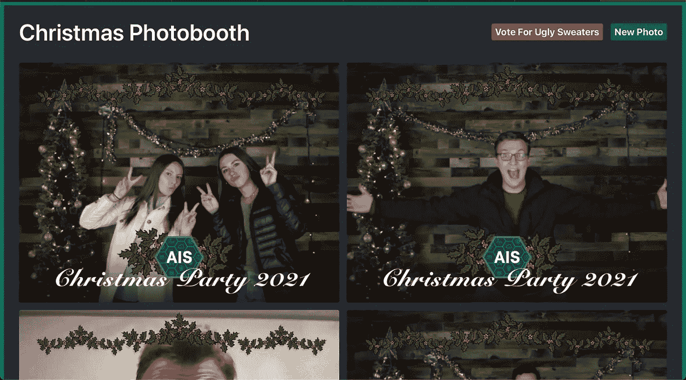

# 用混音制作一个难看的毛衣照片亭

> 原文：<https://javascript.plainenglish.io/building-an-ugly-sweater-photo-booth-with-remix-2386cb6e5f84?source=collection_archive---------17----------------------->

## 和其他很酷的东西


*本文原载于* [*诺亚约翰逊开发*](https://blog.noahjohnson.dev/ugly-sweater-remix)

最近，我在犹他州的一次 Remix 会议上谈到了我在 Remix 开源后不久做的一个项目。这里(https://www.youtube.com/watch？v=Ax9iVzTTpSM)是该演示的链接，还有一段来自 Kent C. Dodds 的关于混合形式的力量的内容。

Remix 是一个出色的框架，可以用来构建杀手级的 web 应用程序。它最近推出了 1.0 版本，现在是开源的。我有机会和 Kent C. Dodds 更深入地讨论这个框架，他现在在 Remix 团队工作。在遵循了他的精彩教程(你可以在这里找到)之后，当创建 photo booth 应用程序的机会出现时，我想投入到自己的应用程序中。

作为信息系统学生学校组织的一部分，我们正在计划一次年终社交活动。社交活动中的一项活动是丑陋毛衣比赛。为了处理决定获胜者的后勤工作，以及能够使用新的网络框架的额外好处，我自愿创建了一个网站。

最终的网站有一个界面，可以拍照，输入联系信息以接收你的照片，允许参加比赛，并为你最喜欢的丑毛衣投票。此外，主页将显示人们允许在独立于竞赛的网站上显示的所有照片。



## 基本功能

正如我之前提到的，为了构建这个功能，我从 Remix 开始。这种经历太棒了。关于 Remix 还有很多要说的，我很快就会写出来，但本质上，它是一个直观的框架，可以帮助你创建伟大的应用程序或网站。

网络摄像头功能刚刚使用了 react-webcam 软件包。这是我将来会花更多时间在这个项目上更多关注的一个领域。活动当天，我们发现我们可以使用一台漂亮的专业相机。我能够让那台相机作为网络摄像头工作，但没有完全的质量是可能的。


接下来，让我们看看我在项目中实现的一些很酷的工具。其中一些是 Tailwind CSS、Cloudinary、SendGrid、Prisma 和 Fly.io。

## 顺风 CSS

Tailwind 是一个“实用优先的 CSS 框架”，可以很容易地与 Remix 集成。与顺风合作是一次很棒的经历。我记得不久前使用它，并没有看到对它的相当大的需求，但当我回来时，我不认为自己会很快使用任何其他 CSS 工具。

关于 Tailwind 最好的部分之一是它帮助你建立你的 CSS 知识。每个实用程序类都直观地与您将要从头开始编写的 CSS 联系在一起，因此您会觉得您仍然在理解 CSS，但是快速编写要容易得多。这个主题是建立在网络基础之上，同时使其更容易理解和实现，这与使用 Remix 的感觉是一致的。

## 云雾缭绕

Cloudinary 是一个管理、优化和交付数字内容的平台。这在这个项目中非常有用。我使用的第一个 Cloudinary 是 upload API。这使得将图像放入平台变得容易，然后可以通过电子邮件和其他页面发送。

为了创建边界，Cloudinary 允许只通过更改 URL 进行转换。这太棒了，因为我们在活动前切换了几次边界。下面的代码块展示了一个示例，说明如何只获取基本 URL 并添加转换来获得您想要的输出。

```
<div className="grid gird-cols-1 md:grid-cols-2 gap-4 px-8">
  {data.images.map((image) => (
    <div className="relative w-full h-full">
      
    </div>
  ))}
</div>
```

## 发送网格

我做的项目的最后一个改进是电子邮件功能。SendGrid 有一个很棒的 API，可以轻松发送电子邮件。我在几分钟内设置并验证了我的电子邮件域，并能够在 Remix 中实现一个刚刚传入图像 ID 的服务器功能。从那里，它只是传递了 Cloudinary 的图像和一条消息，让他们为丑陋毛衣大赛投票。


## 普里斯马和苍蝇

另外两个对这个项目有帮助的工具是 Prisma 和 fly . io。Prisma 是一个与 Remix 配合使用的 ORM。全面的第一方 TypeScript 支持有助于创建数据库模式，然后能够轻松地与您的数据交互。

Fly.io 是一个很棒的托管平台，它有一个易于使用的 CLI 工具。他们在边缘主机上做了一些很棒的工作，很适合混音。Remix 团队有一个很好的部署指南，作为我上面提到的 Kent C. Dodds 的教程的一部分。

## 最后的想法

在几天的空闲时间里，我非常开心地完成了这个项目。关于混音，我有几个要点。首先是混音很有趣。我在使用它的时候非常开心，至少对于这个简单的应用程序来说，我从来没有感觉到我在和框架战斗，而是它让我可以快速而轻松地做我想做的事情。

第二，Remix 帮助你构建伟大的应用。就像我之前说的，这个框架对你很有用，而且非常直观。我喜欢 Remix 使用的惯例，因为它很有意义。有很多细节我可以(也将会)在未来深入探讨。请务必查看混音文档，并留意我计划撰写的更多文章。

最后一点，Remix 帮助你成为更好的开发者。令我吃惊的是，当我搞清楚这个第一个项目时，我对 MDN web 文档的钻研和对 Remix 文档的阅读一样多。Remix 感觉更像一个 web 框架，而不仅仅是一个 React 框架。我很高兴看到 Remix 走向何方，以及我和其他开发者用它构建了什么。

*更多内容请看*[***plain English . io***](http://plainenglish.io/)*。报名参加我们的* [***免费周报***](http://newsletter.plainenglish.io/) *。在我们的* [***社区***](https://discord.gg/GtDtUAvyhW) *获得独家获得写作机会和建议。*