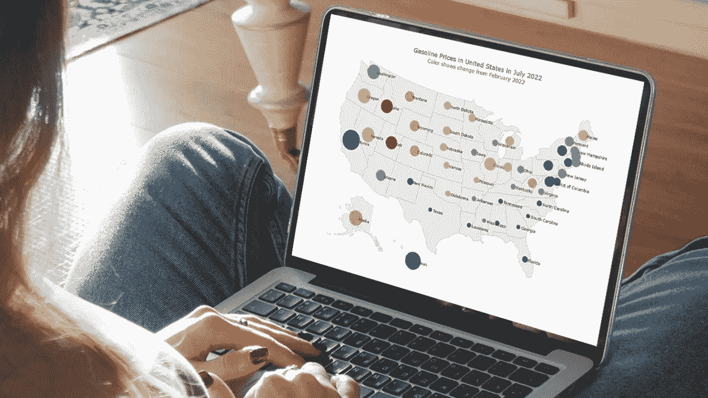
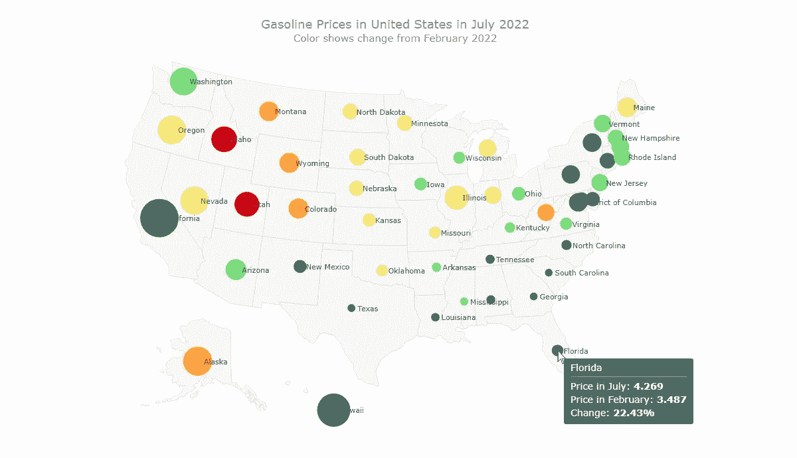
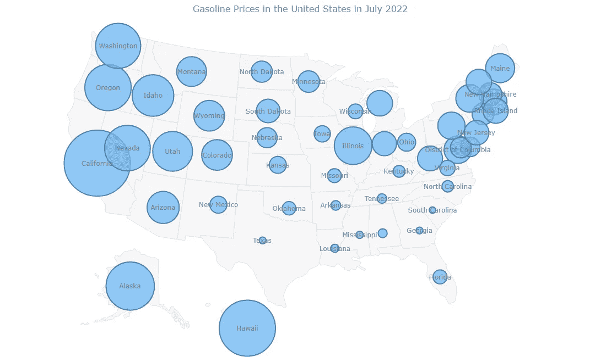
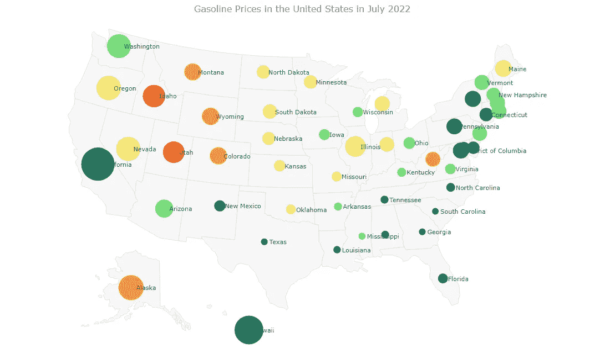
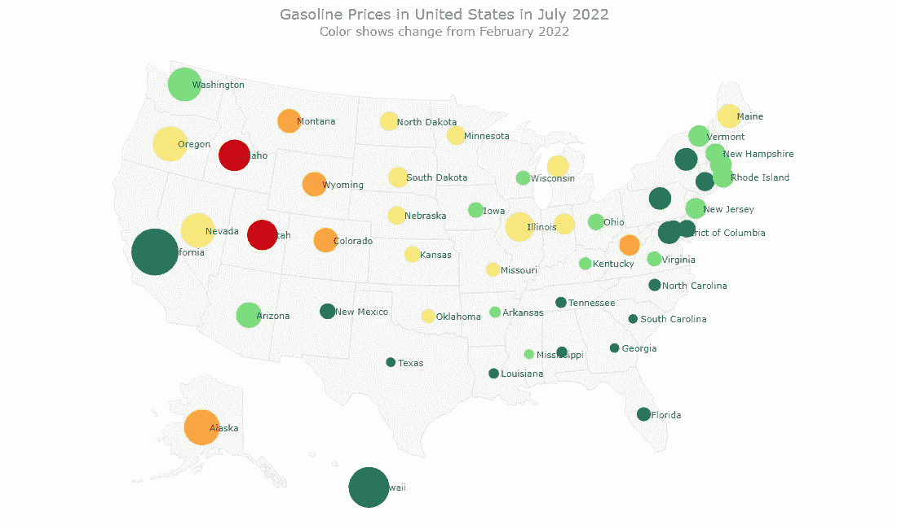

# 用 JavaScript 构建气泡图

> 原文：<https://javascript.plainenglish.io/building-bubble-maps-in-javascript-65be27c044f7?source=collection_archive---------9----------------------->

## 气泡图是气泡图和地理图的结合。仔细看看这个地图&学习如何用 JS 构建气泡图。



地图是将数据置于地理环境中的一种很好的方式。而且它们并不难创造！我渴望通过帮助你在 JavaScript 的帮助下创建一个[气泡图](https://www.anychart.com/chartopedia/chart-type/bubble-map/)，这是最流行的数据图[之一。](https://www.anychart.com/chartopedia/usage-type/chart-to-show-location/)

气泡图是一张[气泡图](https://www.anychart.com/chartopedia/chart-type/bubble-chart/)和一张地理图的组合。它使用不同大小(有时是不同颜色)的圆圈来表示与位置或区域相关的数值。

在本教程中，我将可视化全美汽油价格的数据。今年夏天，在俄罗斯-乌克兰冲突爆发后，价格飙升至创纪录高位。第一个基本气泡图将按州显示 7 月份的天然气价格。最后一份报告将增加自 2 月 23 日以来的变化幅度，2 月 23 日是俄罗斯对乌克兰发动攻击的前一天。

跟着做，你将学会用 JS 轻松地创建漂亮的交互式地图，没有任何问题！

# 最终 JS 气泡图预览

查看本教程中基于 JavaScript 的气泡贴图的最终结果:



# 4 步基本 JavaScript 气泡图

从头开始创建交互式 JS 气泡图可能会令人望而生畏和乏味。但是我会告诉你如何轻松有趣地完成它。

一般来说，构建基本气泡图有四个基本步骤，就像任何其他图表一样:准备网页、添加 JavaScript 文件、加载数据和编写一些图表代码。就这么办吧！

## 1.准备网页

重要的事情先来。我创建了一个空白网页。然后我添加一个块级 HTML 元素(`div`)作为气泡图的占位符；我还给它一个唯一的 id ( `container`)并设置一些样式。

下面是我的 HTML 页面现在的样子:

```
<html>
  <head>
    <title>JavaScript Bubble Map</title>
    <style type="text/css">      
      html, body, #container { 
        width: 100%; height: 100%; margin: 0; padding: 0; 
      } 
    </style>
  </head>
  <body>
    <div id="container"></div>
  </body>
</html>
```

我希望可视化显示在整个屏幕上。所以我将占位符 div 元素的宽度和高度设置为 100%。如果你认为适合你的情况，可以随意改变。

## 2.添加 JavaScript 文件

第二，所有用于制作气泡图的 JS 文件都必须添加到网页中。这是通过将包装在`script`标签中的相应链接添加到`head`部分来完成的。

为了快速简单，我将使用名为 [AnyChart](https://www.anychart.com) 的 JavaScript 图表库，确切地说是 [AnyMap](https://www.anychart.com/products/anymap/) 解决方案。因此，我包含了构建气泡图所需的两个模块，“core”和“geo maps”，以及美国的地理数据文件。

然后，我通过将`script`标签添加到`body`部分，为将来的 JS 映射代码本身准备一个位置(基本上，这个标签可以放在页面上的任何地方)。

查看我的 HTML 页面现在的样子:

```
<html>
  <head>
    <title>JavaScript Bubble Map</title>
    <script src="https://cdn.anychart.com/releases/8.11.0/js/anychart-core.min.js"></script>
    <script src="https://cdn.anychart.com/releases/8.11.0/js/anychart-map.min.js"></script>
    <script src="https://cdn.anychart.com/releases/8.11.0/geodata/countries/united_states_of_america/united_states_of_america.js"></script>
    <style type="text/css">      
      html, body, #container { 
        width: 100%; height: 100%; margin: 0; padding: 0; 
      } 
    </style>
  </head>
  <body>  
    <div id="container"></div>
    <script>
      // The place for the JavaScript bubble mapping code.
    </script>
  </body>
</html>
```

## 3.加载数据

第三，我加我的数据。

有多种数据格式[可以使用。我决定使用 JSON，并创建了一个数据文件，其中包含美国各州普通汽油的](https://docs.anychart.com/Working_with_Data)[价格](https://gasprices.aaa.com/state-gas-price-averages/)，你可以在这里看一下[。](https://gist.githubusercontent.com/shacheeswadia/eead370d79e0f20df5148b79b6887393/raw/fba29e3dcf1806cab770e845546a136a924cf1d5/dataBubbleMap2.json)

我还需要两个 JS 文件来使用这些数据。一个是[数据适配器](https://docs.anychart.com/Working_with_Data/Data_Adapter)，用于加载 JSON 数据文件本身。另一个是 [Proj4js](https://docs.anychart.com/Maps/Map_Projections#using_proj4.js) ，用于转换坐标以绘制各个地理状态上的气泡。我在`head`部分将它们和其他脚本一起引用。

```
<script src="https://cdn.anychart.com/releases/8.11.0/js/anychart-data-adapter.min.js"></script>
<script src="https://cdnjs.cloudflare.com/ajax/libs/proj4js/2.3.15/proj4.js"></script>4\. Write some charting code
```

然后，我使用 anychart.data.loadJsonFile()函数加载 JSON 文件，放在之前放在 body 部分的脚本标记中。

```
anychart.data.loadJsonFile( 'https://gist.githubusercontent.com/shacheeswadia/eead370d79e0f20df5148b79b6887393/raw/fba29e3dcf1806cab770e845546a136a924cf1d5/dataBubbleMap2.json', function (data) {})The fourth step is for populating the script tag in the body section of the web page with the code to visualize the JS-based bubble map. Actually, just a few quick lines will be enough!
```

## 4.写一些图表代码

第四步是用代码填充网页的`body`部分的`script`标签，以可视化基于 JS 的气泡图。实际上，只要几行简短的台词就够了！

所有的代码都将被打包到`anychart.onDocumentReady()`函数中，以便在执行任何其他操作之前，页面被完全加载。

首先，我在其中加载数据，如第三步所示。然后，我使用内置函数创建一个地图图表实例，并添加美国的地理数据。

```
<script>

  anychart.onDocumentReady(function() {

    // load the data
    anychart.data.loadJsonFile( 'https://gist.githubusercontent.com/shacheeswadia/eead370d79e0f20df5148b79b6887393/raw/fba29e3dcf1806cab770e845546a136a924cf1d5/dataBubbleMap2.json',
    function (data) {

      // create a map chart
      let map = anychart.map();

      // add the u.s. geodata
      map.geoData("anychart.maps.united_states_of_america");

    });

  });
</script>
```

因为我想用气泡表示天然气价格，所以我创建了一个气泡序列，并将这些值映射为整个地图上气泡的大小:

```
let series = map.bubble(
  anychart.data.set(data).mapAs({
    size: "Petrol"
  })
);
```

标题对于更好的易读性很重要。所以我启用系列标签来显示州名并添加标题。

```
// enable the series labels
series
  .labels()
  .enabled(true);

// set the map's title
map.title("Gasoline Prices in the United States in July 2022");
```

最后，我引用 HTML 块级元素作为地图的容器，并绘制结果可视化。

```
// set the container id
map.container("container");

// initiate the map drawing
map.draw();
```

这就对了。一个可爱的交互式泡泡地图就是这样用 JavaScript 创建的！你可以清楚地了解 2022 年 7 月美国哪些州的汽油价格最高。



我在[游乐场](https://playground.anychart.com/9266aZgG/)在线代码编辑器中保存了这个基本 JS 泡泡图的代码，这样你就可以仔细查看它，添加你自己的数据，等等。我也把它放在下面。

但是请不要离开，请继续阅读，因为我还有更多东西要给你看！

```
<html>
  <head>
    <title>JavaScript Bubble Map</title>
    <script src="https://cdn.anychart.com/releases/8.11.0/js/anychart-core.min.js"></script>
    <script src="https://cdn.anychart.com/releases/8.11.0/js/anychart-map.min.js"></script>
    <script src="https://cdn.anychart.com/releases/8.11.0/geodata/countries/united_states_of_america/united_states_of_america.js"></script>
    <script src="https://cdn.anychart.com/releases/8.11.0/js/anychart-data-adapter.min.js"></script>
    <script src="https://cdnjs.cloudflare.com/ajax/libs/proj4js/2.3.15/proj4.js"></script>
    <style type="text/css">      
      html, body, #container { 
        width: 100%; height: 100%; margin: 0; padding: 0; 
      } 
    </style>
  </head>
  <body>  
    <div id="container"></div>
    <script>
      anychart.onDocumentReady(function () {
        anychart.data.loadJsonFile(
          "https://gist.githubusercontent.com/shacheeswadia/eead370d79e0f20df5148b79b6887393/raw/fba29e3dcf1806cab770e845546a136a924cf1d5/dataBubbleMap2.json",
          function (data) {

            // create a map chart
            let map = anychart.map();

            // add the u.s. geodata
            map.geoData("anychart.maps.united_states_of_america");

            // create a bubble series
            let series = map.bubble(
              anychart.data.set(data).mapAs({
                size: "Petrol"
              })
            );

            // enable the series labels
            series
              .labels()
              .enabled(true);

            // set the map's title
            map.title("Gasoline Prices in the United States in July 2022");

            // set the container id
            map.container("container");

            // initiate the map drawing
            map.draw();

          }
        );
      });
    </script>
  </body>
</html>
```

# 自定义 JS 气泡图

自定义 JavaScript 气泡图有无数种可能性。现在，我将解释和演示其中的一些。首先，我将为气泡涂上颜色，以反映 2022 年 2 月至 7 月期间每个州的天然气价格上涨了多少。然后，我将增强标签位置、工具提示、悬停状态下的颜色和地图标题。

## 1.使用颜色来显示更改

在气泡图中，像气泡图一样，您可以使用颜色来可视化数据中的额外维度。我想借此机会说明各州二月和七月的汽油价格差异。数据文件有这两个值:“汽油”用于上面的基本气泡图，而“PetrolFeb”用于二月，取自互联网档案库。因此，在做任何事情之前，我遍历每个数据点并找出差异。根据这个值，我计算了上升的百分比，并将小数位数限制在两位。

```
data.forEach(function (d) {
  let diff = d.Petrol - d.PetrolFeb;
  d.percentRise = ((diff * 100) / d.PetrolFeb).toFixed(2);
});
```

现在我将根据这个百分比给泡泡上色。为此，我需要一个规模，将接受的价值，并返回相应的颜色。AnyChart 提供了色阶选项，但是为了使本教程更有教育意义，我想在这里向您展示如何使用另一个库来结合主库提供一些功能。我决定使用开源 JavaScript 图表库 [D3.js](https://d3js.org/) 演示线性色标的创建。

首先，我在 HTML 页面的`head`部分包含了 D3.js 脚本。

```
<script src="https://d3js.org/d3.v7.min.js"></script>
```

其次，我创建了一个 D3 分位数标度，它接受一系列值并返回颜色。我保持该域接受从 20 到 50 的值，因为百分比上升值落在这些数字之间，并在该范围内添加五个颜色值。

```
let fillColor = d3
  .scaleQuantile()
  .domain([20, 50])
  .range(["#1b8366", "#77dd79", "#f7e975", "#fea43e", "#cf0011"]);
```

最后，我使用刚刚创建的 D3.js 标尺，基于百分比增量值设置每个数据点的填充值。

```
data.forEach(function (d) {
  let diff = d.Petrol - d.PetrolFeb;
  d.percentRise = ((diff * 100) / d.PetrolFeb).toFixed(2);
  d.fill = fillColor(d.percentRise);
});
```

如果这听起来有点复杂，不要担心。我只是想向你展示在选择丰富的地方定制的力量。

## 2.改进标签放置

默认情况下，标签放置在气泡的中心。我想把它们移到一边一点。同时，我还将定制标签的字体大小和颜色，以获得更好的可读性和美观性。

```
series
  .labels()
  .enabled(true)
  .anchor("left-center")
  .position("right")
  .fontColor("#353535")
  .fontSize(11)
  .offsetX(5);
```



看一眼这张交互式气泡图(可在[游乐场](https://playground.anychart.com/VTFesAw7)上获得)，很容易注意到，与美国其他地区相比，加州的汽油价格在 2 月份是最高的，但涨幅不大，而犹他州和爱达荷州的涨幅最大。

## 3.增强工具提示

默认的工具提示显示纬度和经度，这在这种情况下是没有用的。在工具提示中显示更多有意义的信息总是一个好主意。这很容易实现。

我选择在工具提示中显示以下内容:州名、七月和二月的汽油价格以及变化百分比。为了更好的展示，我使用 HTML。

```
series
  .tooltip()
  .useHtml(true)
  .format("<h6 style='font-size:14px; font-weight:400; margin: 0.2rem 0;'>Price in July: <b>{%Petrol}</b></h6><h6 style='font-size:14px; font-weight:400; margin: 0.2rem 0;'>Price in February: <b>{%PetrolFeb}</b></h6><h6 style='font-size:14px; font-weight:400; margin: 0.2rem 0;'>Change: <b>{%percentRise}%</b></h6>");
```

## 4.改变悬浮状态下的气泡颜色

因为我已经增强了工具提示，当鼠标悬停在气泡上时会显示出来，所以我还想调整悬停状态下气泡的颜色。例如，让我把它变成一个更深的阴影，不管它的底色是什么。

```
series
  .hovered()
  .fill(function (d) {
    return anychart.color.darken(d.sourceColor, 0.2);
  })
  .stroke(0);
```

## 5.自定义标题

最后，我让标题更好地解释了气泡图所代表的内容。我只是为标题启用了 HTML，并为标题添加了更多的信息和格式。

```
map
  .title()
  .enabled(true)
  .useHtml(true)
  .text(
    '<span style = "color: #7c868e; font-size:18px;">Gasoline Prices in the United States in July 2022</span>' +
      '<br/><span style="font-size: 15px;">Color shows change from February 2022</span>'
  );
```

就这样，一张绝对好看又有信息量的泡泡图就做好了！看看这个:



这个交互式的 JavaScript 泡泡地图可以在[游乐场](https://playground.anychart.com/SpCcz2KJ/)上找到，这里非常欢迎你继续玩它的代码。

# 结论

现在你知道如何使用 JavaScript (HTML5)制作气泡图了！下一步，看[文档](https://docs.anychart.com/Maps/Proportional_Symbol_Map)，继续练习。可视化非常有助于理解数据。有了强大的 JavaScript 库，当您知道自己在做什么时，创建图表和地图会非常容易。

如果您对想要学习的下一种数据可视化有任何问题或建议，请告诉我。在那之前，不要让高昂的油价让你沮丧——尝试泡泡地图或任何其他视觉效果，因为这样做不需要燃料！

非常感谢 Shachee Swadia 提供了这个令人惊叹的泡泡地图教程！

***一定不要错过我们博客上的其他*** [***JavaScript 制图教程***](https://www.anychart.com/blog/category/javascript-chart-tutorials/) ***！***

***有没有想出一个不那么惊艳的客座博文？*** [***让我们知道***](https://www.anychart.com/support/) ***，我们将很高兴讨论您的建议！***

*原载于 2022 年 11 月 16 日*[***www.anychart.com***](https://www.anychart.com/blog/2022/11/16/bubble-maps-js/)*。*

*更多内容看* [***说白了就是***](https://plainenglish.io/) *。报名参加我们的* [***免费周报***](http://newsletter.plainenglish.io/) *。关注我们关于* [***推特***](https://twitter.com/inPlainEngHQ) ，[***LinkedIn***](https://www.linkedin.com/company/inplainenglish/)*，*[***YouTube***](https://www.youtube.com/channel/UCtipWUghju290NWcn8jhyAw)*，以及* [***不和*** 对增长黑客感兴趣？检查](https://discord.gg/GtDtUAvyhW) [***电路***](https://circuit.ooo/) *。*