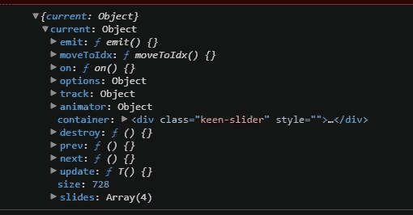

# 如何建立感觉良好的旋转木马

> 原文：<https://javascript.plainenglish.io/building-native-feeling-carousels-in-react-with-keen-slider-a46cc58b88ad?source=collection_archive---------9----------------------->

## 在 React 中以较小的开销创建响应性和性能良好的传送带。


Easily create sliders, carousels and [**much more**](https://keen-slider.io/examples)

> 我们可能都在某个时候被分配了实现一个轮播的任务。

无论这是一个循环的卡片列表还是一个产品的图片，旋转木马都是一个非常常见的 UI 组件，也是一个将大量内容打包到一个小空间的好方法。另一方面，制造它们通常并不那么好。

# 认识 Keen-slider

创建一个旋转木马有上百种方法，通常最困难的部分是选择一个合适的库来使用。

本教程主要关注 [**Keen-slider** 包](https://www.npmjs.com/package/keen-slider)，它提供了一种简单的方法来为现代网络构建一个类似本地的旋转木马。

Keen-slider 与其他 headless-UI 包(越来越受欢迎)相似，这意味着该库并不决定组件的外观，而是处理复杂的逻辑——非常适合希望跳过困难部分的前端开发人员。我们需要做的就是设置它，修改一些参数，并设计我们的 carousel UI，我们应该有一个全功能的组件了！

如果你正在寻找一个基本的 carousel 组件，你可以非常快速地使用 [Keen-slider](https://keen-slider.io/) 开始运行。此外，如果您希望更彻底地浏览文档，您会发现一个丰富而深刻的 API，它应该允许实现绝大多数的 carousel 行为。

*在本文中，我将交替使用“旋转木马”和“滑块”这两个词，但它们的意思是一样的。*

# “你好，世界”旋转木马


现在我们对 Keen-slider 的“为什么”有了更多的了解，让我们来看看“如何”。

就其设计本质而言，Keen-slider 是**框架不可知的**——这意味着我们可以将它用于普通的 JS、Typescript、Vue、React 等。

要开始在 React 中使用这个库，我们需要通过运行`npm i keen-slider.`将它下载到本地

Keen-slider 为 React 实现导出了一个特殊的钩子，称为(不出所料)`useKeenSlider`。这是我们与图书馆互动的主要方式。

如果你看一下[文档](https://keen-slider.io/docs)，你会发现 useKeenSlider 返回一个包含 2 个条目的数组。

```
const [sliderRef, sliderInstance] = useKeenSlider<HTMLDivElement>();// <HTMLDivElement> only necessary for Typescript, which you should // be using if you dont want to break prod!
```

第一个用作滑块的包含元素的**的引用。这是 Keen-slider 的**魔法**部分，也是让一个无聊的静态 Div 变成一个平滑的旋转木马的基本原因！**

第二项包含关于 slider 实例的整体信息。



A console.log() of the sliderInstance

在这里，您不仅可以找到关于 carousel 的静态信息(比如它包含的元素数量)，还可以找到可以调用的不同方法。例如，`prev`和`next`方法将在可能的地方移动转盘。

您还会看到 useKeenSlider 有几个参数，最著名的是`options`参数。在这里，您可以完全改变转盘的行为，使其按照您希望的方式运行——例如循环转盘或改变其移动的轴(水平/垂直)。这些选项提供了 Keen-slider 的很多灵活性，所以我真的建议你[在文档中阅读一下。](https://keen-slider.io/docs#options)

正如我前面提到的，Keen-slider 库有很大的深度，但是要得到一个“Hello World”示例，只需要很少的代码。


The MVP of a Hello World carousel component

上面的代码沙箱[可以在这里找到](https://codesandbox.io/s/keen-slider-hello-world-31ojtl?file=/src/App.tsx)——请去体验一下，不仅是代码，还有旋转木马的使用感受。很顺利，对吧？

## Keen-slider 转盘结构

欢迎从 CodeSandbox 回来。

因此，我们可以用大约 18 行代码创建一个真正基本的 carousel 组件。这很好，但是他们实际上在做什么呢？

大致结构如下；

> 1.导入和创建功能组件
> 
> 2.实例化 useKeenSlider 钩子，例如/

```
const [sliderRef, sliderInstance] = useKeenSlider<HTMLDivElement>({  // Options and event hooks defined here
});
```

这包括更改任何选项或事件挂钩(稍后将详细介绍这些选项和事件挂钩)

> 3.为转盘创建一个容器元素，并将`sliderRef`附加到其上
> 
> 4.添加元素作为容器元素的子元素，例如/

```
<div ref={sliderRef}>
  <SliderElement/>
  <SliderElement/>
  <SliderElement/>
</div>
```

> 5.造型。

不添加任何 CSS，轮播**就不行。**需要添加某些属性，例如使容器和各个幻灯片相对定位。我花了一点时间来解决这个问题，因为我认为它开箱就能工作。
谢天谢地，有一个非常简单的变通方法，就是从库本身导入 CSS，并将类应用到容器和子容器。

```
import “keen-slider/keen-slider.min.css”;
```

**默认导出类名**

*keen-slider* :添加至转盘容器

*keen-slider__slide* :添加到单个儿童

如果你觉得这种方法很麻烦，你可以自己复制 CSS 属性并创建你自己的选择器/样式表/顺风预设。

# 跟踪和使用转盘状态

至此(如果我没有做错的话)，您已经对基本的 carousel 在代码方面有了一个相对不错的理解。

如果您只是想要一个漂亮的 UI 小部件，只显示元素，不需要任何进一步的功能，那么您可能就此打住。

但是如果你像我一样，你可能想知道如何从转盘中获取信息来工作。目前，这有点像一个黑匣子，你无法获得任何信息。我们可能想要显示元素的索引，或者甚至构建我们自己的导航系统。
你可能还记得当我们查看`useKeenSlider`钩子时，数组中的第二个参数返回了关于 slider 实例的信息。这是谜题的一部分，但这仅仅给了我们关于整个**滑块的信息，而不是关于**单个滑块的信息。为了获得这些信息，我们需要查看**事件挂钩**。****

## 事件挂钩

事件挂钩是暴露给我们的函数，在滑块生命周期的不同部分被调用。有几个这样的钩子，它们在不同的时间被调用。医生对什么和如何做有很好的指导


Slider Event Hooks

为了指定在每个生命周期方法中会发生什么，我们定义了钩子被实例化时的行为，例如，如果我们想在每次新幻灯片改变时记录它的信息/

```
const [sliderRef, sliderInstance] = useKeenSlider<HTMLDivElement>({        slideChanged(newSlide){
  console.log(newSlide)
}
});
```

## 本地保存转盘状态

现在我们知道了事件钩子做了什么，我们可以使用`slideChanged`和`created`钩子来保存第一个和随后当前活动的幻灯片到带有使用状态的本地状态。

```
const [localSlide, setLocalSlide] = useState<KeenSliderInstance>();const [sliderRef] = useKeenSlider<HTMLDivElement>({
  created(slider: KeenSliderInstance) {
    setLocalSlide({ ...slider });
  },
  slideChanged(slider: KeenSliderInstance) {
  setLocalSlide({ ...slider });
  }
});
```

每当创建一个新的 slider 实例时，我们将初始幻灯片保存到 state 中，当幻灯片发生变化时，我们将新幻灯片保存到 state 中。

既然我们在 state 中存储了特定的信息，我们可以用它来做很多事情，比如显示当前转盘位置的索引。


Updated Hello World carousel code

[此处更新了 CodeSandbox！](https://codesandbox.io/s/keen-slider-local-state-7f0lvf?file=/src/App.tsx)

正如你在上面看到的，这并不是滑块状态最令人兴奋的用法，但是它应该会让你对**事件挂钩**和本地状态的灵活性和强大功能有所了解。

# 摘要

感谢您加入我的 Keen-slider 短暂停留之旅。事实上，我们刚刚开始触及这个不可思议的多功能库的表面，但是我希望我已经让您对创建旋转木马有多容易以及您可以用它们做多少事情有了基本的了解。

如果你喜欢这篇文章或者觉得它有用，那么欢迎关注。或者，你可以在 Medium [*这里*](https://jamesmbrightman.medium.com/membership) *支持我或者给我买一杯* [*咖啡*](https://ko-fi.com/jamesbrightman) *！非常感谢所有的支持。*

*更多内容请看*[***plain English . io***](https://plainenglish.io/)*。报名参加我们的* [***免费周报***](http://newsletter.plainenglish.io/) *。关注我们关于*[***Twitter***](https://twitter.com/inPlainEngHQ)[***LinkedIn***](https://www.linkedin.com/company/inplainenglish/)*[***YouTube***](https://www.youtube.com/channel/UCtipWUghju290NWcn8jhyAw)***，以及****[***不和***](https://discord.gg/GtDtUAvyhW) *对成长黑客感兴趣？检查* [***电路***](https://circuit.ooo/) ***。*****