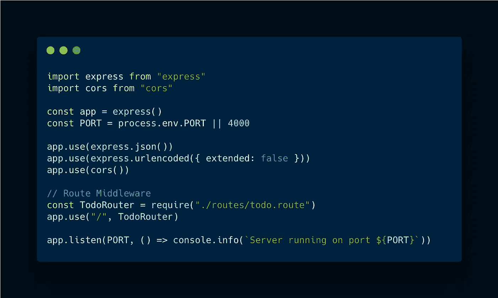

# 如何用 Node.js、Express 和 PostgreSQL 构建 REST API

> 原文：<https://javascript.plainenglish.io/building-rest-api-with-node-express-and-postgresql-28d8cfe30d?source=collection_archive---------0----------------------->

## 使用 Node.js、Express 和 PostgreSQL 数据库(带 TS)为 todo 应用程序构建 REST APIs 的简单分步指南。

这是很长一段时间以来，我第一次切换到关系数据库，比如我们将在这里使用的 PostgreSQL，以将其用于我的任何 API 或项目。自从我开始使用 MongoDB 以来，我从未真正回顾过使用关系数据库，直到现在。

# 飞行前检查😅

在我们写任何代码之前，有几件事我想问你，关于我们将要做的这个迷你项目。

1.  你熟悉 TypeScript 吗，也就是说，你现在正在使用它，或者过去曾经使用过它？
2.  您是否已经在您的机器上安装了 PostgreSQL，并且有一个正在运行的数据库实例，为工作做好了准备？
3.  你熟悉 SQL 数据库吗？

如果你对所有问题的回答都是肯定的，或者甚至是两个问题，或者，也许你已经开始着手做了，但是你对所有三个问题的回答都是否定的，没关系，让我们开始吧🚀。

# 我们的目标是什么？

想法是——制作一个简单的 todo 应用程序，让用户创建、编辑、删除和查看他们的任务。为了实现所有这些功能，我们的应用程序将通过 REST APIs 与后端进行通信。后端将是一个 Node.js/Express 应用程序，与 PostgreSQL 数据库。

现在我们已经了解了我们正在构建什么，让我们开始吧，一步一步来。一如既往，本文的最终代码将在我的 GitHub 上提供。

 [## GitHub-the-dev designer/pern-todo-app:我的文章在 Medium 上的支持库。环👇

### 此时您不能执行该操作。您已使用另一个标签页或窗口登录。您已在另一个选项卡中注销，或者…

github.com](https://github.com/the-devdesigner/pern-todo-app.git) 

# 目录结构

The directory structure for the project

正如我之前提到的，这个应用程序的 UI 不是本文的一部分，但是你在上面看到的`client`文件夹是我如何将服务器端和客户端代码分开的。

# 初始化一切

*   就在每个节点项目开始的时候，运行`npm init -y`生成 package.json 文件，
*   一旦完成，我们就可以获得所有需要的依赖项。因为我们在这里使用了 TypeScript，所以我们还需要所有依赖项的`@types`。

Installing dependencies with npm

*   继续在`package.json`中添加下面的脚本，让我们的生活变得简单一点。

npm scripts, mainly just for development

*   运行`tsc --init`初始化并生成一个`tsconfig.json`文件。我把我的保持成这样，但是你总是能以你想要的方式定制它。

tsconfig.json

# 引入 Postgres🐘

在构建这些 API 时，确保 Postgres 的本地实例保持运行。还记得我们把`pg`作为依赖项安装的吗？是时候用了。我们将创建一个名为`pool`的新对象——您可以随意称呼它——并提供本地数据库的详细信息和要使用的表。

database.ts — Creating a pool object to connect local postgres instance with Node/Express server

需要记住的一点是，这个`pool`对象将只能使用一个已存在的数据库，这里我们称之为`perntodo`，不像 mongoose 和 MongoDB，它可以被动态创建。如果您还没有创建您的数据库和表格，这些将是我们在整个项目中需要的查询—

List of queries that will be needed to build this API

# 回到 Express

我们需要一个运行的服务器，对吗？现在你当然知道该怎么做了，导入所有与 express 和 cors 相关的东西，创建并使用 express 和 cors 中间件，并通过监听你选择的一些`PORT`来启动服务器——我总是选择`4000`作为服务器。你会看到`ToDoRouter`被进口和使用；我们一会儿就会讲到那个部分。

server.ts file with all express app setup

## 每个操作的路线

如果您还记得，我们需要实现 GET、POST、PUT 和 DELETE 方法，为此我们需要以下路径—

Routes / API endpoints with their corresponding controller functions

## 每条路线的控制器

当用户向任何一个路由发送 HTTP 请求时，它将使用相应的控制器函数来执行该操作。现在，为了访问我们的 Postgres DB，我们最终使用了`pool`对象。最终，我们将运行我们之前列出的查询来获得/做我们想要的。我们执行查询的方式是使用`.query()`方法— `pool.query("query goes here", [variables go here as array])`

Controllers for each operation

1.  查询`onGetAllTodos` — `SELECT * FROM todos`
2.  查询`onCreateNewTodo` — `INSERT INTO todos (description) VALUES($1) RETURNING *`
3.  查询`onGetTodoById` — `SELECT * FROM todos WHERE _id = $1", [id]`
4.  查询`onUpdateTodoById` — `UPDATE todos SET description = $1 WHERE _id = $2", [desc, id]`
5.  查询`onDeleteTodoById` — `DELETE FROM todos WHERE _id = $1", [id]`

# 斗牛中的最后一剑🤞

一旦我们有了`controllers`，每个控制器都附加了一个特定的`route`，并且路径被导入并在`server.ts`文件中使用，我们就可以开始使用这个 API 了。为了测试这些端点，你可以使用 Postman，或者像我一样，使用一个`.rest`文件。

# 包扎

就这样，我们有了可以由前端使用的 API 端点——由 Node、Express 和 PostgreSQL DB 构成。至此，我们完成了服务器构建——包括整个 PERN 堆栈，只是还没有反应过来。

感谢阅读。我希望你觉得它有用，简单易懂，而且有趣。如果有，一定要看看我的其他文章，我在这些文章中讨论了 React、Node.js 和 TypeScript 等主题。

干杯！✌️

*更多内容请看*[***plain English . io***](https://plainenglish.io/)*。报名参加我们的* [***免费周报***](http://newsletter.plainenglish.io/) *。关注我们关于*[***Twitter***](https://twitter.com/inPlainEngHQ)*和*[***LinkedIn***](https://www.linkedin.com/company/inplainenglish/)*。加入我们的* [***社区不和谐***](https://discord.gg/GtDtUAvyhW) *。*