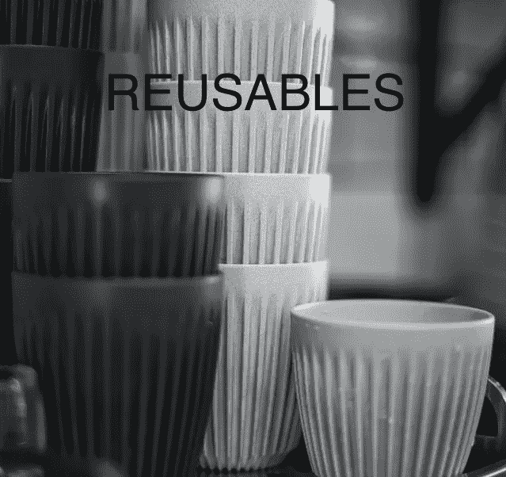

# 用 Vue.js 构建可重用组件

> 原文：<https://javascript.plainenglish.io/building-reusable-component-with-vue-part-1-tab-component-df04e1b92a09?source=collection_archive---------8----------------------->

## 第 1 部分:选项卡组件



Original Photo by [ABDULLA M](https://unsplash.com/@abdullam?utm_source=unsplash&utm_medium=referral&utm_content=creditCopyText) on [Unsplash](https://unsplash.com/s/photos/reusable?utm_source=unsplash&utm_medium=referral&utm_content=creditCopyText). Photo re-edited.

有时候当我在做一个项目时，我总是面临着构建一个复杂的可重用组件的任务。我知道有些人可能会说，为什么你不安装一些像物质界面或脉轮界面，但我必须说，这并不总是工作。尤其是当你的设计师为你准备了一份特别的礼物时😩。当你从这样一个库中需要的只是一个像 **TAB 这样的组件时，这真的没有必要。**

在本文中，我将教你如何用 Vue.js 构建一个可重用的**标签**组件。

# 现在，我们开始吧🚀

## 先决条件

1.  你需要对 Vue 有一个基本的了解。如果没有，请找到可以指导你的资源，然后回到这里。
2.  确保您已经配置了一个 Vue 3 项目，并准备好添加本文中的内容。哦对了，这个教程代码示例也是用**类型脚本**和**组合 API** 写的。别担心，这里没什么可怕的😊

谈够了，让我们开始工作吧，🕺

首先，让我们看看下面的文件结构来创建一些东西。

```
└── src
    ├── components
    │   └── tabs
    │         ├── Tabs.vue
    │         └── Tab.vue  
    ├── App.vue
```

*   在 src 文件夹中，创建一个**组件**文件夹。
*   在 components 文件夹中，创建一个**选项卡**文件夹。另外，在`tabs folder`中创建 **Tabs.vue** 和**tabs . vue**文件。

好的，我们一次处理一个文件。

# Tabs.vue

让我们首先将下面的代码添加到我们的`**Tabs.vue**`文件中

`**ref**:`接受一个值并返回一个被动的可变的引用对象。

在这里，裁判从道具中拿走了`initialTab`。

`**watch**:`用于查看特定的数据源，并在单独的回调函数中应用副作用。

在这种情况下，我们观察`selectedTab`的变化，然后**发出**这些变化。注意，我们还定义了组件可以发送给其父组件的事件。

```
emits: [‘change’]
```

`**provide:**` 用于将数据从父组件传递到其子组件。点击阅读更多关于此[的信息](https://v3.vuejs.org/guide/component-provide-inject.html#provide-inject)

所以我们将`groupName`道具和`selectedTab`传递给子组件。

接下来，添加以下基于 HTML 的模板代码

这里没什么特别的。但最终，我们希望组件以这种方式呈现:

```
<Tabs>
  <Tab />
  <Tab />
</Tabs>
```

本文的重点不是样式，而是功能。但我会给你提供 CSS 代码。请随意更新您自己的内容。

# Tab.vue

让我们将下面的内容添加到我们的`**Tab.vue**`文件中

`**inject:**` 用于获取`provide`钩子从父组件传递过来的数据。

所以我们从`Tabs.vue`组件获取`groupName`和`selectedTab`数据。

因为我们将使用单选按钮来确定当前选择的值，所以我们已经通过了`value`和`label`道具来帮助处理这个问题。

接下来，将它添加到文件中

这段代码包含了处理我们的`Tab.vue`组件的结构。我们有**单选输入字段**，它包含用于处理变更效果的`value`、`name`和`v-model`。我们还有处理选项卡标题的**标签字段**。

现在，让我们给它添加一些样式。就像我之前说的，随时更新你的风格

# App.vue

将以下代码复制并粘贴到`App.vue`文件中。这里没什么可做的。只是导入我们的组件，传递必要的道具。

## 耶皮耶皮！！！😇

最后，一切到此为止。在您的终端上，运行这个命令:`npm run serve`。如果您很好地遵循了代码，您的最终结果应该是这样的。


On your browser, open [http://localhost:8080/](http://localhost:8080/) to view

我相信这个教程是有帮助的。请给它尽可能多的掌声，并为任何贡献留下评论。

在本教程的第二部分再见，我将教你如何构建一个可重用的**手风琴**组件。第二部分点击 [**此处**](https://samador9.medium.com/building-reusable-component-with-vue-part-2-accordion-component-12b65d858900) 。

谢谢你🤗。

*更多内容请看*[***plain English . io***](http://plainenglish.io/)*。报名参加我们的* [***免费周报***](http://newsletter.plainenglish.io/) *。在我们的* [***社区***](https://discord.gg/GtDtUAvyhW) *获得独家获得写作机会和建议。*