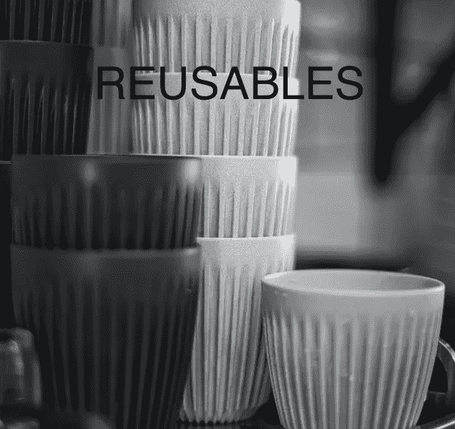
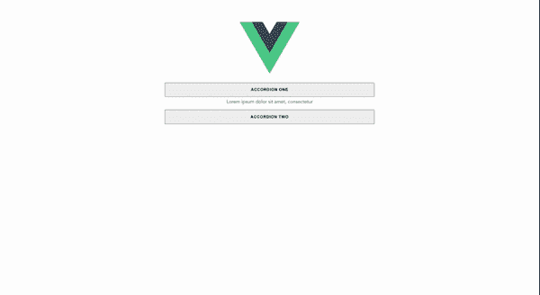

# 用 Vue.js 构建可重用组件

> 原文：<https://javascript.plainenglish.io/building-reusable-component-with-vue-part-2-accordion-component-12b65d858900?source=collection_archive---------7----------------------->

## 第 2 部分:手风琴组件



Original Photo by [ABDULLA M](https://unsplash.com/@abdullam?utm_source=unsplash&utm_medium=referral&utm_content=creditCopyText) on [Unsplash](https://unsplash.com/s/photos/reusable?utm_source=unsplash&utm_medium=referral&utm_content=creditCopyText). Photo re-edited.

嘿！欢迎来到本教程的第 2 部分，在这里我们用 Vue 构建可重用的组件。在本教程的第 1 部分，我们学习了如何构建一个**标签**组件。点击 [**此处**](https://samador9.medium.com/building-reusable-component-with-vue-part-1-tab-component-df04e1b92a09) 阅读，如果你错过了。

在本教程中，我们将学习如何用 Vue 构建一个可重用的 **accordion** 组件。

# 我们开始吧💪

## 在本文结束时，我们将实现什么

1.  构建一个可重复使用的 accordion，允许同时打开多个和单个项目。
2.  接受默认项目打开的可折叠组件。

## 先决条件

1.  需要对 [**Vue**](https://vuejs.org/) 有一个基本的了解。如果没有，请找到可以指导你的资源，然后回到这里🙈。
2.  我们将在本教程中使用 vue3，所以请确保您已经配置了它。我们的代码也会用**类型脚本**和**组合 API** 编写。好了，别担心，这里没什么可怕的😉。

***接下来……***

在您的`src`文件夹中创建一个**组件**文件夹。现在在你的`components`文件夹中，创建一个 **accordions** 文件夹，里面有 **Accordion.vue** 和 **AccordionItem.vue** 文件。

如果您遵循了上述步骤，您的文件夹结构应该如下所示:

```
└── src
    ├── components
    │   └── accordions
    │         ├── Accordion.vue
    │         └── AccordionItem.vue  
    ├── App.vue
```

# **手风琴**

我们会一步一步来。首先，将下面的代码复制并粘贴到 Accordion.vue 文件中。

`**initializeState**:`根据`allowMultiple`是否作为 accordion 上的道具传递，该函数返回一个数组或一个字符串。

为了知道哪个手风琴项被打开或关闭，我们有`expandedIndex` 和`_index`。

`**Computed**`是一个强大的钩子，它允许我们**对我们的数据**进行转换或执行计算，然后轻松地重用结果。

这里，我们还根据从`_index`值得到的变化为`expandedIndex`设置了一个新值。

为了将值从父组件传递到子组件，我们使用了`[**provide**](https://v3.vuejs.org/guide/component-provide-inject.html#provide-inject)`钩子。

所以我们把`allowMultiple`、`indices`、`expandedIndex`传递给子组件。

最后，我们希望组件以这种方式呈现

```
<Accordion>
   <AccordionItem>
   <AccordionItem>
</Accordion>or<Accordion *allowMultiple*>
   <AccordionItem>
   <AccordionItem>
</Accordion>
```

# AccordionItem.vue

教程的难点就在这里。但我会确保简化事情。请慢慢跟进。💪

接下来，将以下内容添加到 AccordionItem.vue 文件中。

这里没什么东西。我们只是导入了必要的钩子，声明了需要的道具。

接下来，我们需要一个生成随机 Id 的实用函数。这是引用每个折叠项所必需的。

我们循环遍历大小，并使用`Math.random()`方法随机生成一个数字。使用`Math.floor()`方法，我们能够将数字四舍五入到最接近的整数。

`charAt:`该方法返回指定索引(位置)的`dictionary`字符。

在这里，我们声明我们的变量并用`**inject**` 钩子从父组件(`**Accordion.vue**`)获得所有的数据

接下来，让我们编写一个函数来监视项目何时展开。

好吧，让我解释一下我们这里有什么。

`**toggleContent**`:此功能切换一个项目打开或关闭。它监听项目按钮上的点击事件(*您很快就会看到我们在哪里通过了这个*)。

`**watchExpand**`:该功能用于给`expandedIndex`分配一个新值。

让我们来看看`watchExpand`功能中的条件

1.  如果`allowMultiple`为假而`isExpanded`为真(即一个项目是打开的)，则使该项目的`id`为`expandedIndex`。这将自动清除`expandedIndex`的先前值，这意味着它关闭所有其他项目并打开当前项目。
2.  现在如果`allowMultiple`为真，又有两件事要考虑了。允许多项意味着我们需要一个数组来添加或删除尽可能多的项

*   `isExpanded`为真，将该项目的`id`与其余的`indices`相加。也就是说，与其他已打开的项目一起打开该项目
*   并且`isExpanded`为假，则从`indices`列表中移除该项目的`id`。这意味着从其余打开的项目中移除该项目。

最后，当组件是`**mounted**`和`**updated**`时，我们运行`watchExpand`函数

哦耶，这还没有结束😩。我们需要关注`expandedIndex`的变化。

`**getExpandCondition**`:此函数返回一个布尔值。如果`expandedIndex`是数组，检查该项的`id`是否包含在内，如果`expandedIndex`是字符串，检查该项的`id`和`expandedIndex`是否相同。

`**watch**`:这个钩子对数据变化做出反应。这里，它检查`expandedIndex`中的变化并更新`isExpanded`。这也是一个控制器，为项目的打开和关闭提供条件(*检查* `***watchExpand***` *功能，再次查看条件*)。

现在，我们差不多完成了😉。将以下内容添加到 AccordionItem.vue

这里的代码显示了`***AccordionItem***` ***的结构。***`**accordionItem_content**`是存放子项的区域。我们有用于切换内容区域的`**button**`(`**accordionItem_content**`)。

好了，让我们添加下面的代码样式。你可以根据自己的需要随意改变风格。

# App.vue

将以下代码复制并粘贴到`App.vue`文件中。这里没什么可做的。只是导入我们的组件，传递必要的道具。

# 终于！！！💃

如果你能走到这最后一步，我为你鼓掌。在您的终端上，运行这个命令:`npm run serve`。如果您很好地遵循了代码，您的最终结果应该是这样的。



On your browser, open [http://localhost:8080/](http://localhost:8080/) to view

感谢您阅读这篇文章🤗。相信对你有所帮助。请给它尽可能多的掌声，并为任何贡献留下评论。

如果你错过了本教程的第一部分，点击 [**这里**](https://samador9.medium.com/building-reusable-component-with-vue-part-1-tab-component-df04e1b92a09) 阅读。

本教程的完整代码可以在 [**这里**](https://github.com/sadewole/Reusable-Vue-Components-) 找到。

*更多内容看* [***说白了。报名参加我们的***](http://plainenglish.io/) **[***免费周报***](http://newsletter.plainenglish.io/) *。在我们的* [***社区不和谐***](https://discord.gg/GtDtUAvyhW) *获得独家获取写作机会和建议。***