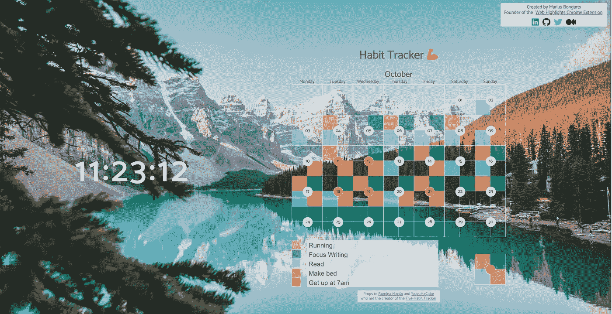
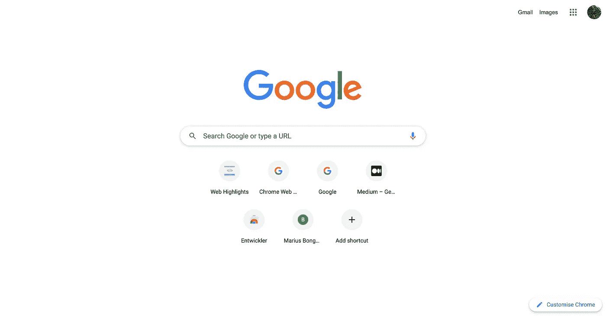
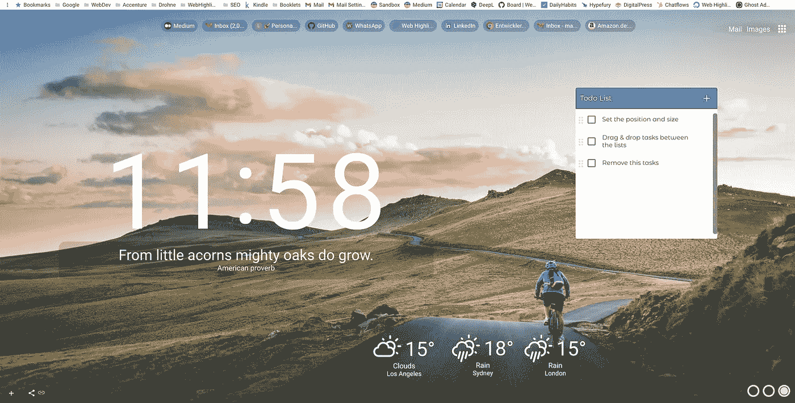
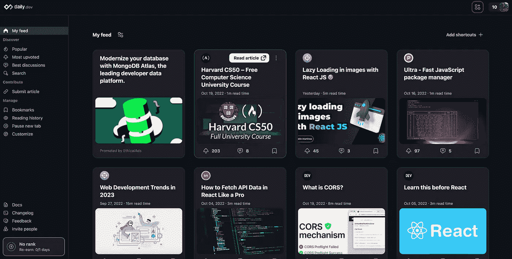
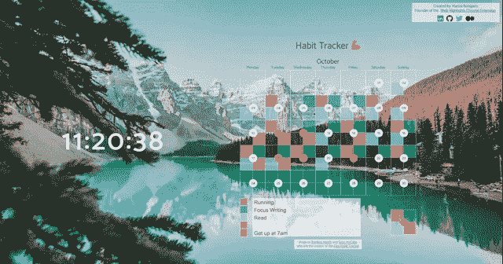
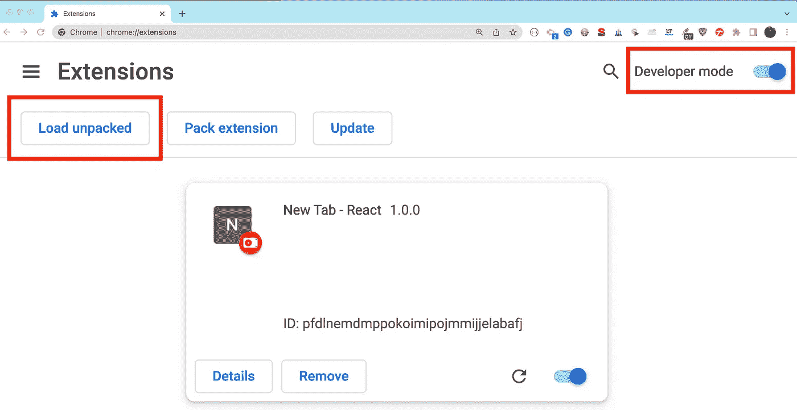
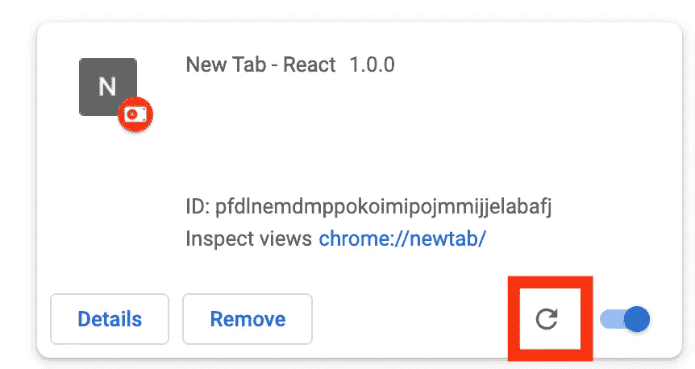
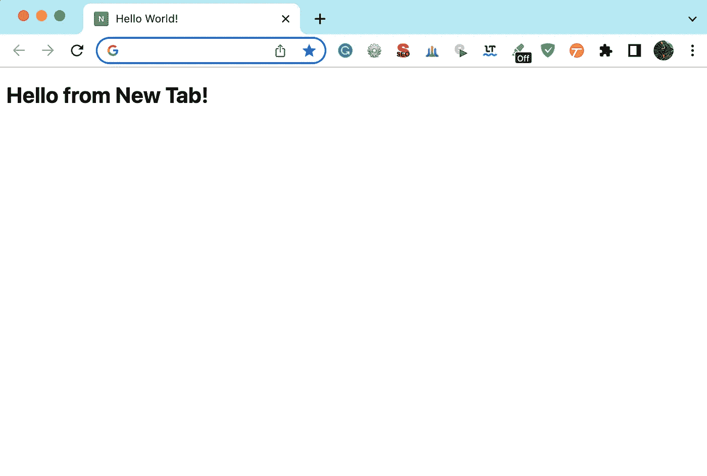

# 构建您自己的新标签 Chrome 扩展

> 原文：<https://javascript.plainenglish.io/building-your-own-new-tab-chrome-extension-fa4adfd733c5?source=collection_archive---------7----------------------->

## 如何用普通的 HTML、CSS、JavaScript 和 Web 组件构建一个漂亮的新标签 Chrome 扩展

Our own New Tab Chrome Extension — [Demo](https://mariusbongarts.github.io/new-tab-chrome-extension/)

有许多很棒的浏览器扩展来配置你的新标签浏览器页面。它们中的许多都很棒，因为它们允许我们在新的标签窗口中拥有一个可定制的主页。

如果你不知道我在说什么——像 [Infinity 新标签](https://chrome.google.com/webstore/detail/infinity-new-tab/dbfmnekepjoapopniengjbcpnbljalfg)、 [Homey](https://chrome.google.com/webstore/detail/homey-productive-and-cozy/lllnjdmfnfjifcfpppjmcnanpokikcpl) 和 [daily.dev](https://chrome.google.com/webstore/detail/dailydev-the-homepage-dev/jlmpjdjjbgclbocgajdjefcidcncaied) 这样的浏览器扩展允许我们让一个空的浏览器标签看起来更好。

所以，不要这样:

Default Chrome New Tab

我们可以得到这样的结果:

[New Tab Studio](https://new-tab.studio/): widgets in a new tab

或者，这个:

[daily.dev](https://chrome.google.com/webstore/detail/dailydev-the-homepage-dev/jlmpjdjjbgclbocgajdjefcidcncaied) | The Homepage Developers Deserve

通常，该选项卡是可定制的，并允许您按照自己最喜欢的方式进行设计。

然而，所有这些扩展最终都会达到极限。然而，作为一名开发人员的美妙之处在于，你可以构建自己的东西。因此，我将向您展示如何使用普通 HTML 和 JavaScript 构建您自己的完全可定制的新标签 Chrome 扩展。

下面是它的样子:

Our personal New Tab Dashboard

你可以在这里找到页面的[演示。这里是 GitHub 库。](https://mariusbongarts.github.io/new-tab-chrome-extension/)

 [## 网络亮点- PDF 和网络荧光笔

### 最佳网络荧光笔。就像你在书上做的那样，在任何网页或 PDF 上高亮显示，并做笔记。组织…

web-highlights.com](https://web-highlights.com/) 

# 开始— Chrome 扩展设置

让我们开始设置我们的 Chrome 扩展。首先，我们需要创建一个`manifest.json`文件。清单是我们的扩展的入口点，它定义了元数据，比如名称和版本，以及其他功能。

## 创建 manifest.json

让我们创建一个`manifest.json`并添加一些元数据:

前三个值`name`、`version`和`manifest_version`足以创建我们的第一个 chrome 扩展。

## 安装延伸部分

打开你的 Chrome 浏览器，导航到 **chrome://extensions** 。

点击**开发者模式**旁边的拨动开关启用开发者模式。点击**加载解压**按钮，用我们的`manifest.json`选择目录。

Load your Chrome Extension

恭喜你！你刚刚创建了一个 Chrome 扩展！

## 设置新标签页

太好了，我们创建了自己的 Chrome 扩展。尽管如此，目前，它没有做任何事情。让我们的扩展在用户打开新标签时显示一个简单的 HTML 文件。

我们可以通过向我们的`manifest.json`添加一个`chrome_url_overrides`属性来做到这一点。在这里，您可以决定每当用户打开一个新选项卡时将使用哪个 html 文件。

因此让我们创建一个示例`index.html`文件:

并传给我们的`manifest.json`:

请注意，我们还设置了`storage`权限，以便能够从我们的页面访问存储，并在本地存储内容。

现在，让我们重新加载我们的扩展:

Reload Chrome Extension

最后，当在 chrome 中打开一个新标签页时，我们可以看到我们自己的新标签页:

Our own New-Tab page

# 定制我们的页面

一旦我们做好了准备，我们就可以尽情发挥我们的创意了。你可以按照你想要的方式设计你的网站。

我们新的选项卡扩展包含两个内容:

*   每秒更新一次的**时钟**
*   一个**习惯追踪器**，它可以让你用可定制的颜色来衡量你选择的五个习惯

这两个组件都是用普通的 HTML、CSS 和 JavaScript 构建的。尽管如此，我还是将两者都包装到它们自己的 Web 组件中，以便更好地封装它们。这也将使我们的参赛作品`[index.html](https://github.com/MariusBongarts/new-tab-chrome-extension/blob/main/index.html)`看起来更整洁、更有条理:

Entry [index.html](https://github.com/MariusBongarts/new-tab-chrome-extension/blob/main/index.html)

我们通过从 */src/** 文件夹加载脚本来注册定制元素`<my-clock>`和`<five-habit-tracker>`。两者都包含我们实际内容的影子根。如果您对 Web 组件不熟悉，我强烈推荐您先阅读我的 Web 组件初学者系列之一:

*   [完整的 Web 组件指南:定制元素](/will-web-components-replace-frontend-frameworks-535891d779ba)(第 1 部分)
*   [用 Web 组件构建自己的博客组合(第 1 部分)](https://medium.com/@mariusbongarts11/showcase-your-medium-articles-with-web-components-part-1-basics-d2c6618e9482)

## 时钟组件

让我们看看我们的时钟 Web 组件。这个组件很简单，看起来像这样:

my-clock.js

在构造函数中，我们首先调用我们的超类`HTMLElement`，然后将一个开放的 Shadow-DOM 附加到我们的组件上，使我们的样式封装在网站的其他部分。

然后，在我们的`connectedCallback()`生命周期方法中，我们向我们的`shadowRoot`添加一些 HTML。这里只有一个`div`元素和一些样式。然后，我们设置一个间隔，每秒钟更新它的内容为一个`localeTimeString`。

## 习惯跟踪器组件

对于本文，我不想花太多时间开发我自己的新奇工具来显示在新标签页中。所以，我做了我经常做的事情——我去 CodePen 搜索很棒的东西。

当我发现罗米娜·马丁**的这款超棒的五种习惯跟踪器时，我并没有失望:**

**Codepen by by [**Romina Martín**](https://twitter.com/rominamartinlib)**

**我喜欢它。所以，我复制了它，并把所有东西都包装在它自己的 Web 组件中。您可以在这里找到定制元素代码[的完整源代码。](https://github.com/MariusBongarts/new-tab-chrome-extension/blob/main/src/five-habit-tracker/main.js)**

**我做了一些设计调整，使它在背景图片前看起来更好。此外，我需要让它在影子 DOM 中工作，但仅此而已。**

**习惯跟踪器开箱即用，并将其状态保存到本地存储中(这就是为什么我们需要在我们的`manifest.json`文件中存储许可)。谢谢你这么棒的工具 Romina Martín！**

# **背景图像**

**对于一个新的标签扩展，有一样东西是不可缺少的——惊人的背景图片。所以，我在 Pexels 上找到了 Jaime Reimer 的这张照片。**

**为了让它看起来更好并覆盖整个页面，我在我们的`index.css`文件中添加了一些 CSS:**

**值得注意的是，我还在`body`中添加了一些黑色阴影层，以在页面上的背景图像和文本之间提供更好的对比。**

# **最后的想法**

**创建自己的 Chrome 扩展比许多人想象的要容易得多。在 Chrome 中为新标签窗口创建一个页面也同样简单。一旦非常简单的设置完成，我们就可以用 HMTL、CSS 和 Javascript 构建一个普通的网站。**

**能够设计你自己的新标签 Chrome 页面会很有趣，因为你可以尽情发挥你的创造力。**

**我希望你喜欢阅读这篇文章。我总是乐于回答问题，并乐于接受批评。随时欢迎联系我！通过**[**LinkedIn**](https://www.linkedin.com/in/marius-bongarts-6b3638171/)**，**关注我**[**Twitter**](https://twitter.com/MariusBongarts)或 [**订阅**](https://medium.com/subscribe/@mariusbongarts) 通过电子邮件获取我的故事。******

****[**这里是无限制访问**](https://medium.com/@mariusbongarts/membership) 媒体上每一个内容的链接。如果你注册使用这个链接，我会赚一小笔钱，不需要你额外付费。****

**** [## 通过我的推荐链接加入 Medium-Marius bong arts

### 作为一个媒体会员，你的会员费的一部分会给你阅读的作家，你可以完全接触到每一个故事…

medium.com](https://medium.com/@mariusbongarts/membership)**** 

## ****关于作者****

****我是埃森哲软件工程分析师宋。我们一直在寻找最好的开发人员，所以如果你有兴趣加入我们，请随时联系我们！****

****最驱动我的是我想创造一些对他人有帮助和改变生活的东西的冲动🙌比如你是否厌倦了浏览自己的历史来寻找前几天看到的信息？我的 [**网站重点介绍 Chrome 扩展**](https://chrome.google.com/webstore/detail/web-highlights-%20-bookmark/hldjnlbobkdkghfidgoecgmklcemanhm) 覆盖了你，并将通过以结构化和高效的方式组织你的研究来提高你的生产力。就像你在书和文章上做的那样，突出显示任何网页或 PDF 上的文本。你的精彩片段会直接同步到 web-highlights.com 的网络应用上，你可以在任何地方找到它们。****

## ****进一步阅读****

**** [## 建立一个文本网络荧光笔作为 Chrome 扩展

### 学习用 Web 组件构建 Chrome 扩展。我一直很喜欢网络荧光笔，当选择…

web-highlights.com](https://web-highlights.com/blog/build-a-text-web-highlighter-as-a-chrome-extension/)  [## 如何构建一个 Chrome 扩展

### 按照这个分步指南创建一个 Chrome 扩展。我记得当我创建第一个 Chrome 扩展时。我…

web-highlights.com](https://web-highlights.com/blog/how-to-build-a-chrome-extension/)  [## 使用 Web 荧光笔 Chrome 扩展进行高效研究

### 就像你在书上做的那样，在任何网页或 PDF 上高亮显示，并做笔记。用标签组织并查找您的研究…

web-highlights.com](https://web-highlights.com/blog/efficient-research-with-web-highlights/) 

*更多内容请看*[***plain English . io***](https://plainenglish.io/)*。报名参加我们的* [***免费周报***](http://newsletter.plainenglish.io/) *。关注我们关于*[***Twitter***](https://twitter.com/inPlainEngHQ)[***LinkedIn***](https://www.linkedin.com/company/inplainenglish/)*[***YouTube***](https://www.youtube.com/channel/UCtipWUghju290NWcn8jhyAw)*[***不和***](https://discord.gg/GtDtUAvyhW) *。对增长黑客感兴趣？检查* [***电路***](https://circuit.ooo/) *。*******