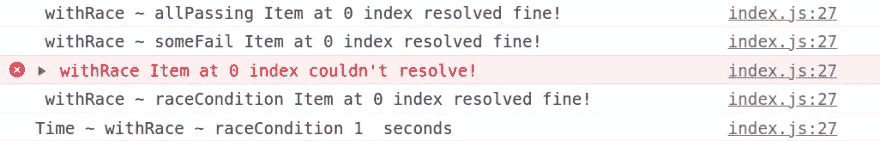

# JavaScript 中 Promise 对象的内置方法

> 原文：<https://javascript.plainenglish.io/built-in-methods-of-the-promise-object-in-javascript-e6066580d3f4?source=collection_archive---------21----------------------->

## 的。全部，。全部解决。任何还有。比赛方法解释


如果你已经做了一段时间的 JavaScript 开发人员，你一定遇到过承诺。如果没有，这里有一个快速介绍:

> *一个承诺是一个价值的代理，这个价值在承诺产生时不一定是已知的。— MDN*

我处理承诺已经有一段时间了，我认为它们是用 JavaScript 表示异步操作的一种很好的方式。尽管它们很棒，但仍然有很多我们大多数人甚至不知道的内置功能(包括我自己，直到一周前)。

通过今天这个帖子，我想解释一下 Promise 对象的四个有趣的内置特性。

在我们开始之前，这里是我在演示中使用的工具

```
// configs for the createPromiseArrayFromConfig function
const allItemsWillResolve = [
  { settleAfterSeconds: 1, shouldReject: false },
  { settleAfterSeconds: 1, shouldReject: false },
];
const someItemsReject = [
  { settleAfterSeconds: 1, shouldReject: false },
  { settleAfterSeconds: 1, shouldReject: true },
  { settleAfterSeconds: 1, shouldReject: false },
];
const allItemsReject = [
  { settleAfterSeconds: 1, shouldReject: true },
  { settleAfterSeconds: 1, shouldReject: true }
];
const itemsWillResolveAtDifferentTime = [
  { settleAfterSeconds: 1, shouldReject: false },
  { settleAfterSeconds: 2, shouldReject: false },
];

// creates an array of promises from the provided config
function createPromiseArrayFromConfig(arrayOfConfigs) {
  // map over the array config objects and return a new Promise for each item as per the config
  return arrayOfConfigs.map(
    ({ settleAfterSeconds, shouldReject }, index) =>
      new Promise((resolve, reject) => {
        // wait "settleAfterSeconds" seconds before settling the promise
        setTimeout(() => {
          if (shouldReject) {
            reject(`Item at ${index} index couldn't resolve! `);
          } else {
            resolve(`Item at ${index} index resolved fine!`);
          }
        }, settleAfterSeconds * 1000);
      })
  );
```

正如您从实用程序中可以猜到的，我们将使用每一个`Promise`方法运行这四个场景，并观察每一个方法的行为。

# Promise.all()

`Promise.all`接受一个可迭代的承诺作为输入，然后返回一个承诺，这个承诺将被解析为输入承诺的结果数组。

但是，即使输入数组中有一个承诺被拒绝，返回的承诺也会被拒绝。拒绝消息/错误将是第一个被拒绝的项目。

让我们通过代码来看看它的行为。

```
// returns an array of result, if every promise resolves otherwise throws an error from the first rejected item
async function withAll() {
  const allPassing = await Promise.all(
    createPromiseArrayFromConfig(allItemsWillResolve)
  );
  console.log(" withAll ~ allPassing", allPassing);
  try {
    const someFail = await Promise.all(
      createPromiseArrayFromConfig(someItemsReject)
    );
    console.log(" withAll ~ someFail", someFail);
  } catch (err) {
    console.log(" withAll ~ err", err);
  }
  try {
    const allFail = await Promise.all(createPromiseArrayFromConfig(allItemsReject));
    console.log(" withAll ~ allFail", allFail);
  } catch (error) {
    console.error(" withAll", error);
  }
  const before = Date.now();
  const raceCondition = await Promise.all(
createPromiseArrayFromConfig(itemsWillResolveAtDifferentTime)
  );
  const later = Date.now();
  console.log(" withAll ~ raceCondition", raceCondition);
  console.log(
    "Time ~ withAll ~ raceCondition",
    Math.round((later - before) / 1000),
    " seconds"
  );
}
```


正如我们在上图中看到的，

1.  `allItemsWillResolve`配置解析为两个字符串消息的数组。
2.  第二次拒绝承诺时`someItemsReject`配置失败，因为这是第一次失败。
3.  `allItemsReject`配置在第一个承诺拒绝时失败，因为这是第一个失败的。
4.  `itemsWillResolveAtDifferentTime`，需要两秒钟解决。这是因为所有的项目同时开始解析，并且`Promise.all`与数组中最长的承诺花费几乎相同的时间来解析。

> *这里需要注意的一点是，在一些像“codesandbox”这样的环境中，你可能会看到 3 秒的输出，*(发生在我身上)*。这可能是由于应用程序中运行的其他东西，使* `*setTimeout*` *没有机会在 2 秒后运行。我建议在新的选项卡中打开输出，看看输出是否正确。*

使用`Promise.all`的一个好地方是映射一个数组来进行**相关的**异步操作，然后用`Promise.all`调用包装返回的承诺数组。

这里有一个`Promise.all`的潜在用例，考虑一个用户“希望从我们的平台压缩他们的所有图像，他们不想要部分数据，即要么全部完成，要么将其视为失败。”

这里的操作**相互依赖**，也就是说，我们只关心是否所有的操作/承诺都解决了，因为即使 zip 中缺少了其中一个，“我们的操作也是不完整的”。因此，最好使用单个`Promise.all`调用来完成，如果任何操作失败，就向用户显示错误。

# Promise.allSettled()

`Promise.allSettled`将一个可重复的承诺作为输入，并返回一个承诺，在所有给定的承诺被解决或拒绝后，该承诺将被解决，并带有一个对象数组，每个对象使用`value`或`reason`描述每个承诺的结果。

让我们通过代码来看看它的行为。

```
// method returns a promise that resolves after all of the given promises
// have either fulfilled or rejected, with an array of objects that each describes the outcome of each promise.
async function withAllSettled() {
  const allPassing = await Promise.allSettled(
    createPromiseArrayFromConfig(allItemsWillResolve)
  );
  console.log(" withAllSettled ~ allPassing", allPassing);
  try {
    const someFail = await Promise.allSettled(
      createPromiseArrayFromConfig(someItemsReject)
    );
    console.log(" withAllSettled ~ someFail", someFail);
  } catch (error) {
    console.error("withAllSettled", error);
  }
  try {
    const allFail = await Promise.allSettled(
      createPromiseArrayFromConfig(allItemsReject)
    );
    console.log(" withAllSettled ~ allFail", allFail);
  } catch (error) {
    console.error(" withAllSettled", error);
  }
  const before = Date.now();
  const raceCondition = await Promise.allSettled(
createPromiseArrayFromConfig(itemsWillResolveAtDifferentTime)
  );
  const later = Date.now();
  console.log(" withAllSettled ~ raceCondition", raceCondition);
  console.log(
    "Time ~ withAllSettled ~ raceCondition",
    Math.round((later - before) / 1000),
    " seconds"
  );
}
```


正如我们在上图中看到的，

1.  `allItemsWillResolve`配置解析为两个对象的数组，每个对象都有一个`status`和一个`value`。
2.  这次`someItemsReject` config 没有拒绝，相反，它返回一个由 3 个对象组成的数组，其中第二个对象的`status`为“拒绝的”,而`reason`为`error message`。值得注意的是，第二项缺少名为`value`的键。
3.  `allItemsReject`配置返回两个项目，其中`status`为“拒绝”。
4.  `itemsWillResolveAtDifferentTime`需要两秒钟来解决，因为它像`Promise.all`一样工作。

对于`Promise.allSettled`，一个很好的用例是向我们的用户*(来自上面的*`*Promise.all*`*)*，一个对话框，通过查看返回的数据并显示它们各自的消息，其中的所有文件都不能被压缩。与上一个相比，这是一个更好的用户体验，在上一个中，我们只显示了我们发现的第一个错误。

# Promise.any()

`Promise.any`将一个承诺数组作为输入，并返回一个承诺，一旦**数组中的一个**承诺实现，这个承诺就解决，并返回实现的承诺的值。

> *Promise.any 仅适用于节点版本 15 及以上*

让我们通过代码来看看它的行为。

```
// method returns a promise that resolves after all of the given promises
// have either fulfilled or rejected, with an array of objects that each describes the outcome of each promise.
async function withAllSettled() {
  const allPassing = await Promise.allSettled(
    createPromiseArrayFromConfig(allItemsWillResolve)
  );
  console.log(" withAllSettled ~ allPassing", allPassing);
  try {
    const someFail = await Promise.allSettled(
      createPromiseArrayFromConfig(someItemsReject)
    );
    console.log(" withAllSettled ~ someFail", someFail);
  } catch (error) {
    console.error("withAllSettled", error);
  }
  try {
    const allFail = await Promise.allSettled(
      createPromiseArrayFromConfig(allItemsReject)
    );
    console.log(" withAllSettled ~ allFail", allFail);
  } catch (error) {
    console.error(" withAllSettled", error);
  }
  const before = Date.now();
  const raceCondition = await Promise.allSettled(
createPromiseArrayFromConfig(itemsWillResolveAtDifferentTime)
  );
  const later = Date.now();
  console.log(" withAllSettled ~ raceCondition", raceCondition);
  console.log(
    "Time ~ withAllSettled ~ raceCondition",
    Math.round((later - before) / 1000),
    " seconds"
  );
}
```

正如我们在上图中看到的，

1.  `allItemsWillResolve`配置解析为第一项的承诺。
2.  `someItemsReject`配置解析为第一项的承诺。
3.  由于所有的承诺都被拒绝，`allItemsReject`配置返回一个[聚合错误](https://developer.mozilla.org/en-US/docs/Web/JavaScript/Reference/Global_Objects/AggregateError)。
4.  `itemsWillResolveAtDifferentTime`需要一秒钟来解决，因为在我们提供的两个承诺中，第一个仅需要一秒钟来解决。

`Promise.any`的一个很好的用例是从多个来源请求相同的资源，并显示收到的第一个。想象一下，如果您要将我们的客户连接到第一个支持助理，最好的方法是请求连接到所有人，并选择响应最快的一个。

# 承诺.比赛

`Promise.race`将一个承诺数组作为输入，并返回一个承诺，只要数组中的一个承诺满足或拒绝，该承诺就会满足或拒绝，并返回该承诺的值或原因。

让我们通过代码来看看它的行为。

```
// returns a promise that fulfills or rejects
// as soon as one of the promises in an iterable fulfills or rejects
// If the iterable passed is empty, the promise returned will be forever pending.
async function withRace() {
  const allPassing = await Promise.race(
    createPromiseArrayFromConfig(allItemsWillResolve)
  );
  console.log(" withRace ~ allPassing", allPassing);
  try {
    const someFail = await Promise.race(
      createPromiseArrayFromConfig(someItemsReject)
    );
    console.log(" withRace ~ someFail", someFail);
  } catch (error) {
    console.error(" withRace", error);
  }
  try {
    const allFail = await Promise.race(
      createPromiseArrayFromConfig(allItemsReject)
    );
    console.log(" withRace ~ allFail", allFail);
  } catch (error) {
    console.error(" withRace", error);
  }
  const before = Date.now();
  const raceCondition = await Promise.race(
    createPromiseArrayFromConfig(itemsWillResolveAtDifferentTime)
  );
  const later = Date.now();
  console.log(" withRace ~ raceCondition", raceCondition);
  console.log(
    "Time ~ withRace ~ raceCondition",
    Math.round((later - before) / 1000),
    " seconds"
  );
}
```



正如我们在上图中看到的，

1.  `allItemsWillResolve`配置解析为第一项的承诺。
2.  `someItemsReject`配置解析为第一个项目的承诺。
3.  配置返回第一个承诺被拒绝的错误。
4.  `itemsWillResolveAtDifferentTime`需要一秒钟来解决，因为在我们提供的两个承诺中，第一个只需要一秒钟来解决。

一些重要的观点

1.  如果传递的 iterable 为空，则返回的承诺将永远挂起。
2.  如果 iterable 包含一个或多个非承诺值和/或一个已经确定的承诺，那么 Promise.race 将解析到 iterable 中找到的第一个值。

> *此外，与返回第一个履行值的* `*Promise.any()*` *不同，该方法返回第一个结算(履行或拒绝)值。*

`Promise.race`的一个很好的用例是为操作设置一个截止计时器，这样如果给定的操作没有在 x 秒内完成，我们就会抛出一个错误。

# 视频教程和示例

你也可以观看 Youtube 视频[来看看实际的例子](https://www.youtube.com/watch?v=1Mc4cFuJ224)

Youtube video

你也可以在这里使用代码沙箱[进行派生和游戏。](https://codesandbox.io/s/promises-by-anshuman-4v17s)

我希望这篇文章对你有帮助。如果您有任何反馈或问题，请随时在下面的评论中提出。我很想听听他们的想法并为之努力。

更多此类帖子请关注我 [@sun_anshuman](https://twitter.com/sun_anshuman) 。

# 使用的资源

在为这篇文章做研究时，我跟踪了 [MDN 文档](https://developer.mozilla.org/en-US/docs/Web/JavaScript/Reference/Global_Objects/Promise)。

*原载于 2022 年 1 月 10 日*[*https://theanshuman . dev*](https://theanshuman.dev/articles/built-in-methods-of-promise-object-in-javascript-the-all-allsettled-any-and-race-explained-27p4)*。*

*更多内容看* [***说白了。报名参加我们的***](http://plainenglish.io/) **[***免费周报***](http://newsletter.plainenglish.io/) *。在我们的* [***社区不和谐***](https://discord.gg/GtDtUAvyhW) *获得独家获取写作机会和建议。***