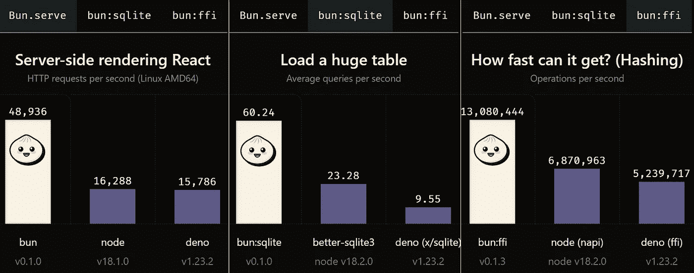
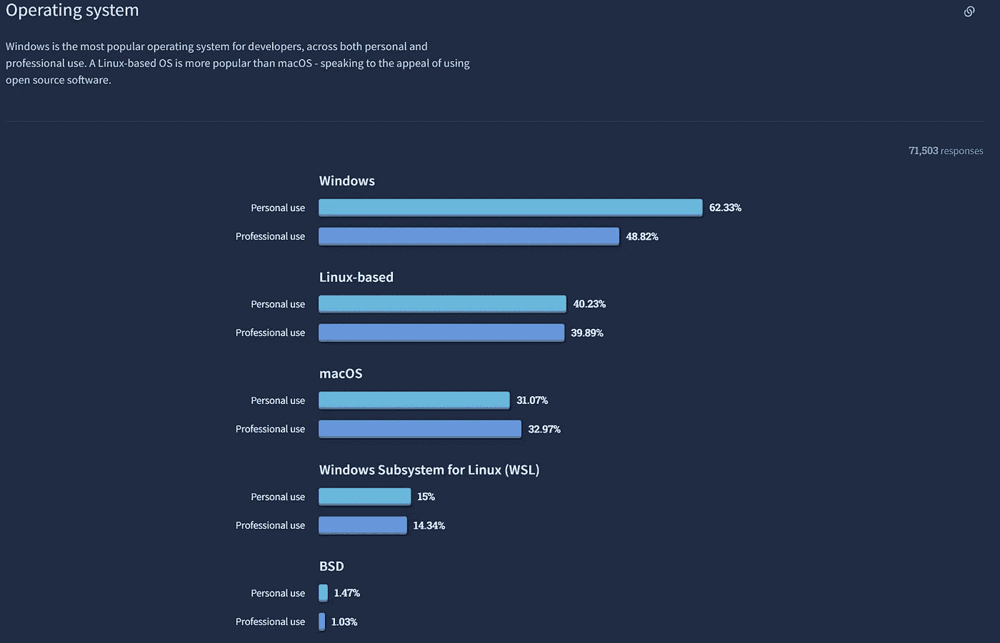
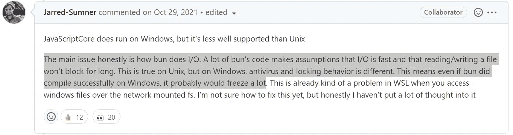

# 小圆面包:热食

> 原文：<https://javascript.plainenglish.io/bun-a-hot-take-9a92673805a7?source=collection_archive---------1----------------------->

Credit: [Bun.sh](https://bun.sh/)

正如[去年](https://qr.ae/pvMnFm)预测的那样，围绕定制 JavaScript 运行时的创建出现了一种趋势。起初，它只是浏览器。然后是纳尔瓦尔。然后是 Node.js 和 Vert.x 等鲜为人知的运行时。今天，世界上有 Cloudflare Workers、Deno，以及现在的 [Bun.sh](https://bun.sh) 。

Bun 是一个新的 JavaScript 运行时，有望比现有的运行时更快。当前的性能指标评测在提供 web 内容、与 SQLite 交互和支持外部函数接口(FFI)方面进行了令人印象深刻的比较。

Bun Benchmarks

Node.js、Deno、Cloudflare Workers、Chrome、Edge、Opera 和 the Brave Browser 都基于谷歌 [V8 JavaScript 引擎](https://v8.dev/)。这些运行时利用 [V8 隔离](https://v8docs.nodesource.com/node-0.8/d5/dda/classv8_1_1_isolate.html)，这是 V8 JavaScript 引擎的一个未修改的实例。引擎本身解释 JavaScript 代码，但是功能仅限于 ECMAScript 规范。开发人员熟悉的大多数功能实际上都是附加到 V8 隔离上的独立库的一部分。浏览器增加了 Web APIs，提供了类似 [console.log](https://developer.mozilla.org/en-US/docs/Web/API/console) 的熟悉功能。Node.js 添加了 [libuv](https://libuv.org/) ，它提供了对文件系统(fs)的访问。Deno 使用 Rusty V8 和 Tokio，而 Cloudflare 添加了自己的缓存库。

## 每个人都喜欢快速软件

像其他 JavaScript 运行时一样，Bun 添加了自己的 API。与其他运行时不同，它是基于 [JavaScriptCore](https://developer.apple.com/documentation/javascriptcore) 而不是 V8 构建的。众所周知，JavaScriptCore 的启动速度比 V8 稍快，这减少了延迟(无服务器环境中的一个关键因素)。它也是用 Zig 编写的，这是一种带有手动内存管理的低级语言。通过手动处理内存，作者可以更好地控制性能。Bun 团队已经花了很多时间使用这些工具来优化运行时。

## 给每个人的东西…差不多。

Bun 的一个特别有趣的特性是支持节点模块(常见的 JS/CJS)和 es 模块(imports/ESM)。通过支持这两种方法，Bun 开发人员可以使用现有库的大型生态系统，而不用考虑他们喜欢的开发方法。Node.js 也支持这两种方法，但不是同时支持。Deno 只支持 ESM。在这方面，Bun 通过消除痛苦的选择推进了 JavaScript 社区。

> **更新:** Deno 现在支持 npm 模块。

Bun 也支持现成的打字稿和 JSX。它包含一个本地测试运行器(类似于 Jest)。它支持环境文件概念(加载。env 文件转换成环境变量)。它有一个 npm 的替代品，根据 Bun 网站的说法，它的运行速度“快 20 倍”。有很多特色，但是很多都是固执己见。

就我个人而言，我不喜欢玩笑式的测试。我不用 JSX。我不反对打字稿，但这不是我日常工作的一部分。Bun 看起来像是为与服务器端 React 一起工作而定制的，但我并没有真正发现自己在这样做。不管你是否同意我的观点，Bun 是固执己见的，我证明了那些观点并不被普遍接受。

## 迷失的观众

Bun 有一个非常明显的缺失。它不支持 Windows。

与一些假设相反，Windows 在个人和专业用途上仍然占据主导市场份额。

多年来，macOS 和 Linux 已经获得了市场份额，但是排除一个主要的操作系统就消除了市场的一个巨大部分。JavaScript 的主要吸引力之一是它的跨平台性。

Bun 是新的，Windows 上支持 JavaScriptCore，所以也许 Bun 会在某个时候支持 Windows。然而；很明显，Bun 团队有自己的工作要做。

让 Bun 在 Windows 上工作是有可能的，但是它能兑现它在 Windows 上做出的承诺吗？Bun 依赖于快速 I/O，这是操作系统的一个功能。如果在 Windows 上不能实现同样的 I/O 提升，那么 Bun 可能无法兑现它做出的承诺。

## Bun 与 Node/Deno

Bun 号称是 Node 或者 Deno 的降代，其实不然。

缺乏对 Windows 的支持使这一替代方案无法运行，但还有其他因素。Node 和 Deno 都可以生成可执行文件(参见 [JavaScript 可执行文件](https://medium.com/swlh/javascript-executables-5644ead7016d))。Deno 是可嵌入的。这些差异不会影响每个人，但会影响很多人。

从这个作者的角度来看，Bun 更适合像 Cloudflare Workers 这样的运行时。Workers 是一个封闭的服务器端生态系统，是为特定用途设计的。Bun 可以用来构建一个更快的服务器端 JS worker 环境，其中的用例仅限于 web 开发或 API。

Bun 也可以作为开发人员的构建工具。对大多数开发工作流挑战的本机支持使它非常适合 Bun 支持的操作系统。

## 我应该用面包吗？

Bun 是新的，有一些很酷的功能。为此付出的巨大努力令人钦佩。这是 JavaScript 生态系统继续加速发展的又一个例子。仅仅因为这个原因，我会用面包做实验。在某些用例中，它将是最佳选择。然而；要确定 Bun 是否能够广泛支持许多 JavaScript 开发人员对运行时的期望，还有很多障碍。

如果您正在构建自己的无服务器/工作环境，或者如果您经常使用 React，Bun 可能是一个非常好的选择。

当决定 Bun 是否适合你时，你可能要考虑项目的长期可行性。这种范围的开源项目需要资源、时间，最终需要资金。Node.js 在市场上有着稳固的立足点和可靠的支持，这需要大约十年的时间来建立。Deno 已经在两轮融资中筹集了 2600 万美元，并在许多原始节点开发者(包括 Ryan Dahl)的指导下运营。这些人在长达十年的旅程中学到了很多东西。Cloudflare 的市值为 168 亿美元。很高兴看到 Bun 被 JavaScript 生态系统所接受，但是这个项目能够获得足够的支持，在一个拥挤的市场中作为一个开源项目保持可行性吗？是不是太小众了？不够小众？时间会证明一切，但 Bun 绝对值得关注。

## 结论

我对 Bun 的工程努力印象深刻。然而；我看到它沿着 Node.js 走过的路，利用了许多可能很快就失宠的早期观点。

这是一个非常年轻的项目，所以与其他项目相比，这本身就是一项成就。就我个人而言，我会用 Bun 进行实验，并留意适合我的开发的场景，但是在这些问题得到回答之前，我不打算用它构建任何实质性的东西。

**更新:2022 年 8 月**

Bun 刚刚宣布了一家名为 Oven 的新公司，获得了 700 万美元的新资金。它得到了通常的嫌疑人的支持，包括像吉列尔莫·劳赫这样的人……他也支持德诺。我指出这一点是因为天使投资和风险投资似乎都在跳入 JavaScript 运行时领域。许多风险投资者会投资一个行业内的几个(有时是所有)竞争对手，以增加其中一个做大的机会。

也就是说，资金肯定有助于加快 Bun 的发展步伐。然而；正如尼古拉斯·c·扎卡斯[指出的](https://twitter.com/slicknet/status/1562916330113605633)，Bun 还没有做任何新的或创新的事情，而 Deno 做了。

*更多内容请看*[***plain English . io***](https://plainenglish.io/)*。报名参加我们的* [***免费周报***](http://newsletter.plainenglish.io/) *。关注我们关于* [***推特***](https://twitter.com/inPlainEngHQ)[***领英***](https://www.linkedin.com/company/inplainenglish/)**和* [***不和***](https://discord.gg/GtDtUAvyhW) ***。****