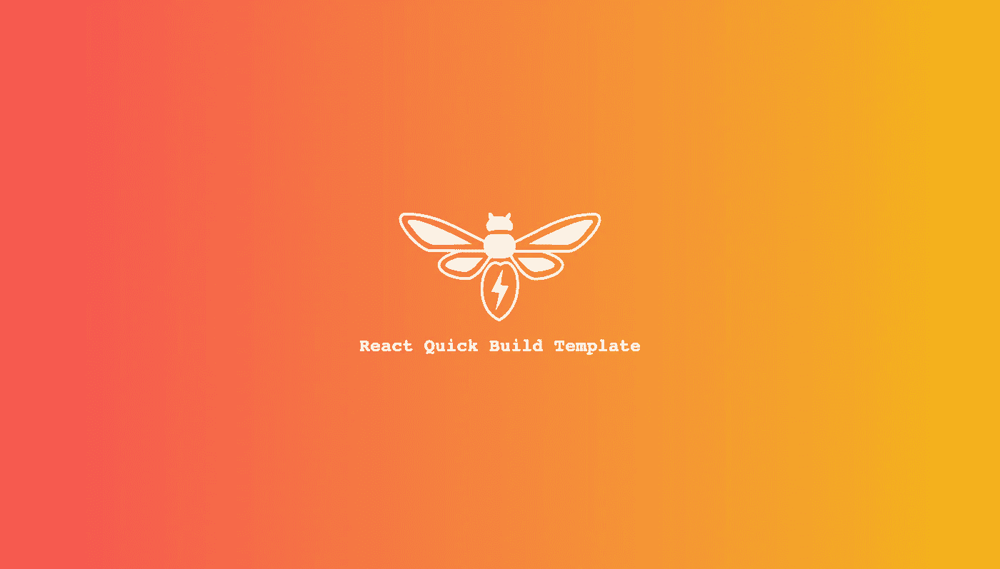
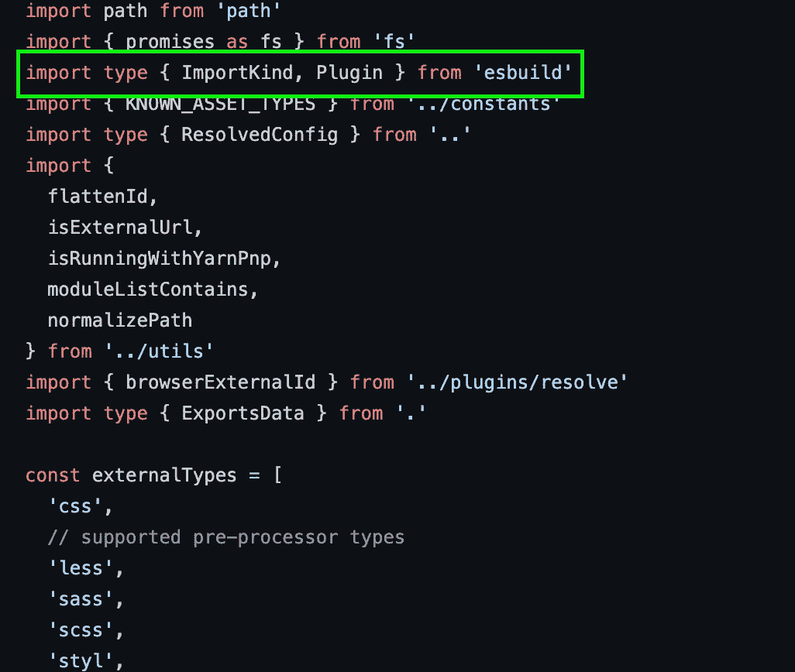
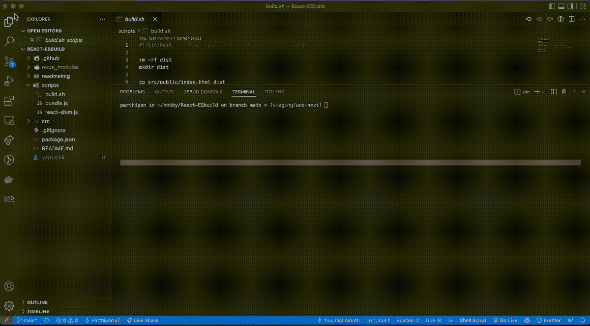

# 将 React 应用与 esbuild 和 Bash 脚本捆绑在一起

> 原文：<https://javascript.plainenglish.io/bundle-react-apps-with-esbuild-and-bash-script-d11877ae1985?source=collection_archive---------9----------------------->



A Custom Build Setup for React Apps with esbuild and Bash

在这篇简短而实用的文章中，让我们快速了解一下构建 React 应用程序的另一种方法，使用一个更高效、更现代的构建工具，该工具依赖于 ES 模块，名为 [esbuild](https://esbuild.github.io/) 和一个手工编码的定制 bash 脚本。

# 背景和意图:

本文中提出的想法和步骤来自于我最近做的一些研究，这些研究旨在找出 webpack 构建工具的一些替代方法，这将加快构建时间。

在穿越那个兔子洞的时候，我探索了一个叫做 [Vite](https://vitejs.dev/) 的工具。在简要查看该工具的开源代码库时，我注意到该工具使用了一种巧妙的技术作为特定限制的变通方法。

## 局限性:

因此，高度简化的限制描述如下:

浏览器对它们可以同时执行的并行网络请求的最大数量有限制。

在一个相当大的项目中，这些模块可以达到数百个的规模。由于浏览器的并行网络调用执行，这将减慢开发模式下的应用程序重新加载时间，并且随着模块数量超过浏览器允许的并行调用阈值，情况会变得更糟。

## 解决方案是:

Vite 工具使用另一个名为 esvuild 的工具在内部处理这个场景。它的方式是捆绑所有相关的模块(例如，来自同一个库)，然后输出一个组合的模块，而不是多个模块，这样就减少了开发过程中构建系统产生的模块数量。



Source code of Vite, illustrating the use of esBuild within the tool

## 意图:

因此，上述发现引发了《修补匠在我》的思考。我想为什么不尝试使用 esBuild 工具和一些定制的 bash 脚本来构建一个基本的构建系统呢？

这更像是一个有趣的实验，以了解构建一个构建和捆绑系统背后的真正原因。因此，这里给出的解决方案是一个非常原始的解决方案，虽然它可能适用于小规模项目，但我不建议将其用于任何生产系统。

如果你也是一个好奇的人，并且在弄清楚某些东西是如何工作的之前不能停止思考，那么把这篇文章当作一个书呆子伙伴，分享他在一个慵懒的周日晚上，在几个小时内完成的东西，试图了解一个工具的工作机制。仅此而已。

也就是说，来吧，让我们戴上我们的 maker 帽子，开始创建一个工作构建系统来捆绑和发布 React 应用程序。

# 应用代码:

嗯，要从源代码构建 react 应用程序，显然首先需要一个应用程序源代码:)。因此，让我们快速创建一个简单的演示应用程序，类似于`create-react-app` scaffolder 附带的程序。

**app.js:**

```
// src/app/app.jsimport style from "../styles/app.module.css";
import CustomLogo from '../assets/img/logo.svg';

export default function () {
  return (
    <div className={style.appContainer}>
      <CustomLogo/>
      <h1>React Quick Build Template</h1>
    </div>
  );
}
```

**index.js:**

```
// src/app/index.jsimport * as ReactDOM from 'react-dom';
import App  from "./app";

const appRootElement = document.getElementById('app-root');
const root = ReactDOM.createRoot(appRootElement);

root.render(<App/>);
```

正如我们所看到的，我们保持了应用程序代码的最小化和简单，这样我们就可以有足够的空间来关注我们想要的主题，即构建系统。

让我们添加一些基本的风格，这样演示看起来就不会乏味了:

**应用程序模块 css:**

```
/* src/styles/app.module.css */body {
  background: rgb(246, 82, 82);
  background: linear-gradient(
    90deg,
    rgba(246, 82, 82, 1) 0%,
    rgba(244, 183, 22, 1) 100%
  );
  color: #fefefe;
  font-family: monospace;
}

.appContainer {
  display: flex;
  flex-direction: column;
  align-items: center;
  justify-content: center;
  height: 100vh;
}
```

另外，请注意我们在`app.js`文件中使用的是 SVG 图像。我们将需要适当的加载器来处理这个和`CSS module file`,同时创建构建。让我们在下一步看看。

# Package.json 文件:

所以我们有我们的应用程序代码，但是我们没有诸如 React 和 React-DOM 这样的依赖关系。像往常一样，让我们从这个项目的根开始启动一个 npm 或 yarn 项目:

```
yarn init -y
```

执行上面的命令会在项目的根目录下创建`package.json`文件。让我们修改它，使它看起来像下面这样:

```
// package.json{
  "name": "esbuild_demo",
  "version": "1.0.0",
  "description": "",
  "main": "index.js",
  "scripts": {
    "build": "chmod +X ./scripts/build.sh && ./scripts/build.sh"
  },
  "keywords": [],
  "author": "",
  "license": "ISC",
  "devDependencies": {
    "@svgr/core": "^6.2.1",
    "css-tree": "^2.1.0",
    "esbuild": "^0.14.36",
    "esbuild-css-modules-plugin": "^2.2.15",
    "esbuild-plugin-svgr": "^1.0.1"
  },
  "dependencies": {
    "react": "^18.0.0",
    "react-dom": "^18.0.0"
  }
}
```

请注意，我们有一个运行 shell 脚本的 build 命令，该脚本将在下一步中创建。此外，还有一些开发依赖项，用于以下目的:

1.  `esbuild`:基于 ES 模块的工具，我们将使用它来构建、缩小和捆绑我们的应用。
2.  `@svgr/core`和`esbuild-plugin-svgr`:esbuild-plugin-svgr 插件使我们能够使用 SVG 图像作为 React 组件，并使它们能够被正确构建。这个插件依赖于 svgr 核心库。
3.  `css-tree`和`esbuild-css-modules-plugin`:插件使我们能够在应用程序中正确地使用和构建 CSS 模块。它对 css 树库有一个内部依赖。

您可能已经注意到，esBuild 工具有一个丰富的插件系统。如果你有兴趣使用一个或者自己写一个[这个文档](https://esbuild.github.io/plugins/)可能是一个起点。

在这一步结束时，不要忘记运行`yarn`或`npm i`来安装依赖项。

# 构建脚本:

如果您已经使用基于 UNIX 的操作系统有一段时间了，那么很有可能您已经对使用`Bash`脚本可以做的事情有所了解。

它既简单又强大。此外，如果您熟悉一般的语法和命令，在几分钟内编写一个像样的脚本会更容易。因此，用 bash 编写构建脚本是我个人的选择。您可以随意用您选择的任何其他脚本语言替换它，但是请记住在 package.json 文件中相应地更新构建脚本。

**build.sh :**

```
#!/bin/bash*#* scripts/build.shrm -rf dist
mkdir dist

cp src/public/index.html dist

esbuild=$(
  node scripts/bundle.js \
    2>&1
)

jsfile=$(echo $esbuild | tr '\n' '\r' | sed -r "s/^.*(app-.*js).*$/\1/")

sed -i -r "s/<\/body>/<script src=\".\/$jsfile\"><\/script><\/body>/" dist/index.html

rm dist/index.html-r

echo "Build completed"
```

请注意，这个脚本不做太多的错误处理。正如我上面提到的，这是一个概念验证，快速旋转。但是，如果你感兴趣并且有足够的带宽，这可能是一个可以改进的地方。

该脚本只执行以下操作:

1.  删除已经存在的目录，这样我们每次都会创建一个干净的构建。
2.  创建`dist`目录。
3.  将基本 HTML 模板复制到创建的目录中。
4.  基于一个包配置文件运行 esbuild 命令，我们将在下一节中看到。
5.  使用流编辑器以`app-<hash>.js`的格式获取带有附加哈希值的 js 包文件名
6.  我们再次使用流编辑器读取复制到`dist`文件夹中的 HTML 文件，并用构建工具生成的文件替换`script`标签的`src`属性的值。

# 捆绑包配置:

正如您在构建脚本中注意到的那样，捆绑是由一个名为`bundle.js`的文件处理的。让我们快速看一下它包含的内容:

**bundle.js :**

```
#!/usr/bin/env node// scripts/bundle.jsconst cssModulesPlugin = require("esbuild-css-modules-plugin");
const svgrPlugin = require('esbuild-plugin-svgr');

require("esbuild")
  .build({
    logLevel: "info",
    entryPoints: ["src/app/index.js"],
    inject:["scripts/react-shim.js"],
    treeShaking: true,
    bundle: true,
    outfile: "dist/app.js",
    plugins: [svgrPlugin(), cssModulesPlugin()],
    loader: {
        ".js": "jsx",
    },
    minify: true,
    target: "es2015",
    entryNames: "[name]-[hash]",
    color: true,
  })
  .catch(() => process.exit(1))
  .then(() => {});
```

这个包配置可以作为 bash shell 中的节点脚本运行，这正是我们正在做的。

包配置基本上是不言自明的，类似于您过去可能使用过的其他构建工具配置。

这里值得一提的一件有趣的事情是`inject`属性。它加载一个`react-shim.js`文件。让我们在下一节看看这意味着什么。

# React 垫片注射:

您可能已经注意到，我们没有在任何应用程序代码中导入 React。如果你使用最新版本的`create-react-app` scaffolder，你可能会对此习以为常。

`create-react-app`通过 webpack 设置实现了这种便利。我们在这里用 esBuild 注入来模拟同样的情况。

**react-shim.js:**

```
// scripts/react-shim.jsimport * as React from 'react'
export { React }
```

# 我们的定制构建设置正在运行:

既然我们已经完成了工作，让我们来测试一下。从项目的根开始，让我们运行`yarn build`或`npm run build`:

输出的 gif:



Our Custom Build System in Action

# 局限性和进一步改进:

我们的定制构建设置更多的是概念验证，缺乏某些细节，导致一些限制:

1.  我们还没有设置任何开发服务器。这可能是当前设置中需要探索和改进的地方。
2.  该脚本假设构建命令是从项目根目录运行的，我们可以给它增加一些灵活性并去掉这个假设。
3.  构建脚本可以被改进以优雅地处理错误。
4.  这种设置对于基于`Jest`的单元测试的代码库来说效果不好，因为 Jest 还不支持 es 模块。

# 结论:

因此，我们有了自己的构建设置，这很有效，通过设置过程，我们已经了解了相当多的内部信息，这在解决下一个棘手的部署问题时可能会派上用场，也可能不会派上用场；)

如果你想亲自尝试这个设置，请随意克隆这个 [Github 库](https://github.com/Parthipan-Natkunam/React-ESbuild)。

感谢你的时间，我希望你能把这些新发现的知识用在好的地方。让我们在下一篇文章中赶上。

干杯。:)

*更多内容尽在* [***说白了. io***](https://plainenglish.io/) *。报名参加我们的* [***免费周报***](http://newsletter.plainenglish.io/) *。关注我们关于* [***推特***](https://twitter.com/inPlainEngHQ) *和*[***LinkedIn***](https://www.linkedin.com/company/inplainenglish/)*。查看我们的* [***社区不和谐***](https://discord.gg/GtDtUAvyhW) *加入我们的* [***人才集体***](https://inplainenglish.pallet.com/talent/welcome) *。*