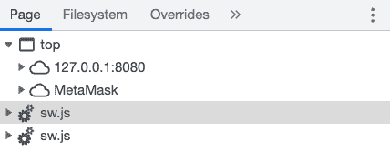
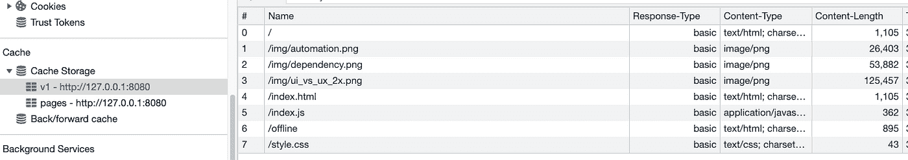
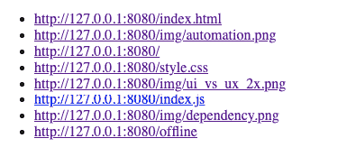

# 在“离线模式”下缓存网站资产

> 原文：<https://javascript.plainenglish.io/cache-website-assets-in-offline-mode-fb843c58feef?source=collection_archive---------1----------------------->

## 使用 JavaScript 服务工作者

如果你正在开发一个普通的网络应用程序，那么“离线模式”可能是一个额外的好处，或者如果你正在开发一个[渐进式网络应用程序](https://developer.mozilla.org/en-US/docs/Web/Progressive_web_apps)，那么它可能是一个必需的特性。离线模式的最基本版本是静态资产的缓存和离线时访问它们的方法。

在这篇文章中，我们将编写一个服务人员，并为一个 JS 应用程序构建一个离线模式，这里有一个[实时演示](https://www.tinycode.dev/service-worker/)。

credit: [https://unsplash.com/@daveherring](https://unsplash.com/@daveherring)

# 服务人员

一个[服务工作者](https://developer.mozilla.org/en-US/docs/Web/API/Service_Worker_API/Using_Service_Workers)是一个 Javascript 进程，作为你的应用程序的中间件，处理从你的网页到互联网的传出和传入请求。

它类似于 [Web Worker](https://alexzitowolf.medium.com/javascript-web-workers-15fe903a5774) ，因为它运行在浏览器中一个独立的非阻塞线程上，不访问 DOM。与 Web Worker 不同，它有一组特定的自定义方法和属性，允许它处理和缓存来自应用程序的所有网络请求。如果你想深入了解服务人员的特征，我建议你阅读 [MDN 规范](https://developer.mozilla.org/en-US/docs/Web/API/Service_Worker_API/Using_Service_Workers)。

拦截和缓存来自给定网页的网络请求的能力使服务人员成为实现离线模式的完美工具！

# 启动服务人员

我们启动服务人员的方式如下。我们需要将这一行添加到主脚本(`index.js`)中。

这一行将运行服务工作者脚本，并启动在您的浏览器中运行的软件。

显然这是行不通的，因为我们实际上还没有编写 web worker 脚本，当我们调用`serviceWorker.register()`时，它将由浏览器运行。

让我们从下面的代码开始，插入到另一个名为`sw.js`的文件中:

服务工作器代码将简单地读取浏览器发送的每个请求，并在将其传递回浏览器之前将其记录到控制台。

> 请注意，我们确实需要克隆请求，而不是将相同的响应对象发送回浏览器。

# 贮藏

创建离线模式的下一步是实现一些文件缓存。因此，我们将在下面创建一个名为`cacheAndRespond`的方法，在自定义缓存中缓存浏览器发出的每个请求。

服务人员有自己的内置缓存，存储在长期内存中，还有一个 API 来制定响应，并将它们发送回您正在运行的应用程序。您可以使用 [Cache.add()](https://developer.mozilla.org/en-US/docs/Web/API/Cache/add') 或 [Cache.delete()](https://developer.mozilla.org/en-US/docs/Web/API/Cache/delete) 在缓存中添加和删除记录。

> 服务工作器缓存有 50MB，大约是 localStorage 和 sessionStorage 最大容量的 10 倍。

现在，当页面第一次加载时，服务人员将处理来自 web 页面的所有请求，并在处理它们时将它们插入到自定义缓存中。如果你使用 chrome 开发者工具检查缓存，你会看到用户访问网页时加载的所有缓存资产。这是因为服务人员在浏览器触发请求时拦截了每一个请求，对其进行处理，然后将其发送回用户。

> 注意:静态资产的缓存也由浏览器处理，但不是以这种微调和可定制的方式。例如，默认浏览器缓存不能创建离线模式。

# 离线页面

最后一步是创建一个充当“离线模式”的页面，反映服务人员已经缓存在他们的浏览器中的所有资产(换句话说，就是那些可以离线使用的资产)。下面是该页面的外观:

要实现这一点，我们只需要一个简单的名为`offline.html`的 html 页面，用这样的代码获取缓存，然后将结果作为链接列表打印出来。

我创建了一个[演示站点](https://www.tinycode.dev/service-worker/)，它实现了如上所述的基本缓存，以及一个离线页面，它允许您查看存储在缓存中的所有资产，即使您无法访问互联网。打开页面，用你的浏览器开发工具检查它，看看我们上面写的所有脚本是如何一起工作的。

# 去月球

除了离线存储之外，这种技术还能给你带来很多好处，并且是简洁的 web 开发领域中的一位后起之秀推荐的工具之一， [Chris Ferdinandi](https://gomakethings.com/the-amazing-power-of-service-workers/) 。以下是一些最佳使用案例:

1.  提供应用程序的脱机版本。如果用户过去访问过您的站点或在那里保存过数据，您可以允许他们继续使用您的站点和缓存的内容
2.  高速缓存。如果你想让你的网站更快，缓存可能是实现这一目标的最佳方式之一。
3.  模仿 API 响应。对于一个轻量级的模拟 API，您可以使用一个服务工作者来映射一些 HTTP 路由("/api/items ")和浏览器接收到的响应。这比为了测试而竖起服务器要快得多。

## 编码快乐！

~亚历克斯

**来源:**

1.  https://developer.mozilla.org/en-US/docs/Web/API/Cache
2.  [https://developer . Mozilla . org/en-US/docs/Web/API/Service _ Worker _ API/Using _ Service _ Workers](https://developer.mozilla.org/en-US/docs/Web/API/Service_Worker_API/Using_Service_Workers)
3.  [https://gomake things . com/the-amazing-power-of-service-workers/](https://gomakethings.com/the-amazing-power-of-service-workers/)
4.  [https://gomake things . com/saving-recent-viewed-pages-offline-with-service-workers-and-vanilla-js/](https://gomakethings.com/saving-recently-viewed-pages-offline-with-service-workers-and-vanilla-js/)
5.  [https://developer . chrome . com/docs/work box/service-worker-overview/](https://developer.chrome.com/docs/workbox/service-worker-overview/)

*更多内容看* [***说白了。报名参加我们的***](https://plainenglish.io/) **[***免费周报***](http://newsletter.plainenglish.io/) *。关注我们关于*[***Twitter***](https://twitter.com/inPlainEngHQ)，[***LinkedIn***](https://www.linkedin.com/company/inplainenglish/)*，*[***YouTube***](https://www.youtube.com/channel/UCtipWUghju290NWcn8jhyAw)*，以及* [***不和***](https://discord.gg/GtDtUAvyhW) *。对增长黑客感兴趣？检查出* [***电路***](https://circuit.ooo/) *。***