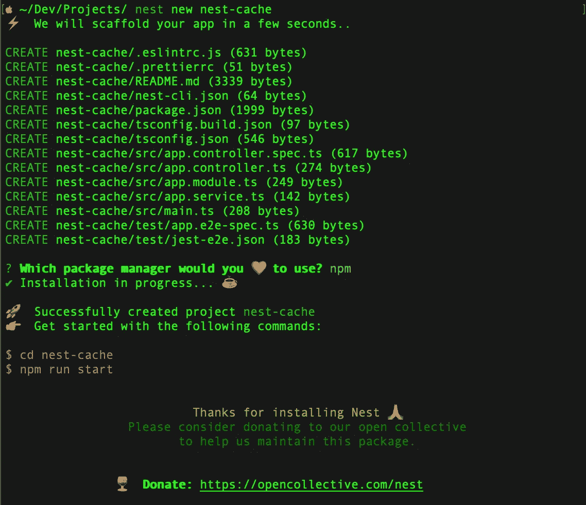
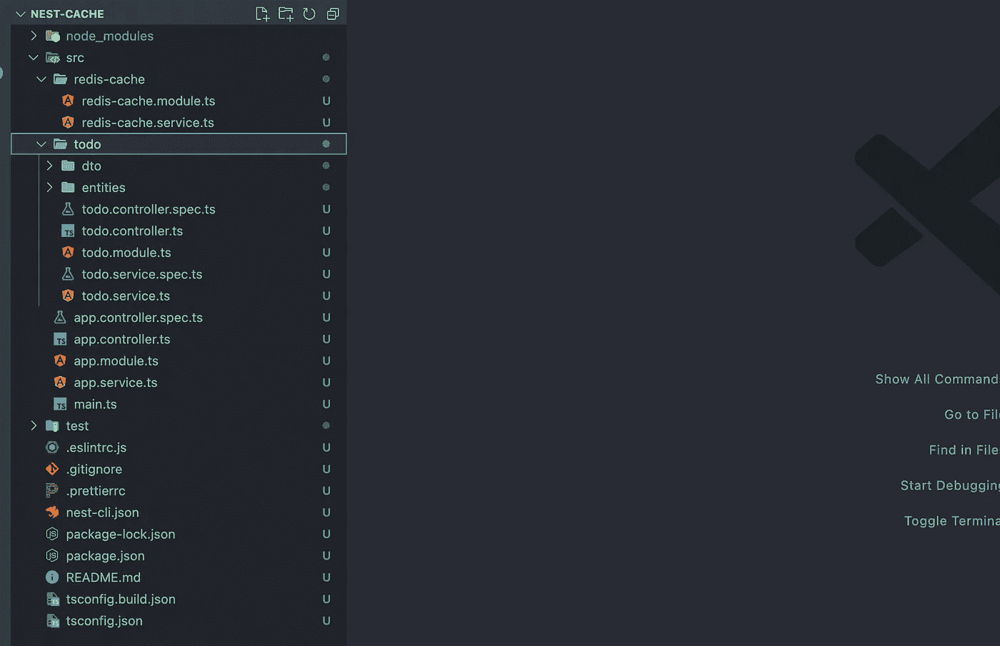

# 如何使用 Redis 在 NestJS 中高效实现缓存

> 原文：<https://javascript.plainenglish.io/caching-efficiently-in-nestjs-using-redis-b3fa0c70384a?source=collection_archive---------4----------------------->


特别是，缓存有助于提高应用程序的性能，极大地增强其有效性。

在本文中，我们将看看如何使用 Redis 为 NestJS 项目提供缓存功能。我们将讨论 Redis，什么是缓存，以及实现过程。

# 什么是缓存？

缓存是计算中重复数据的临时、经常被访问的存储库。为了减少延迟，数据存储在一个容易找到的地方。

# 和 Redis…

作为一个数据库缓存，Redis 是一个开源的内存数据结构存储。它支持各种数据结构，包括列表、集合、带有范围查询的排序集合、散列等等。

通过降低生成内容所需的工作量，缓存可以显著提高应用程序的速度和可伸缩性。在运行我们的服务器应用程序的不同服务器之间分发 Redis 缓存很简单。

介绍到此结束…让我们深入研究使用 Redis 的 NestJS 缓存吧！:)

## 设置 NestJS 应用程序

让我们创建一个简单的 NestJs 应用程序。

```
$ npm i -g @nestjs/cli
$ nest new nest-cache
```



现在我们的应用程序已经创建好了，让我们添加一个 Todo 模块！

```
$ nest g resource todo
```

此时，将添加一个 todo 控制器、服务、dto 和实体。但是谁在乎呢？那不是本文的重点！😊

## 这就是你一直在等待的，缓存！

在本文中，我们将使用缓存管理器。向 bryandonovan 喊出这个令人敬畏的包！

> *Cache-Manager 是 nodejs 的一个缓存模块，允许在缓存、分层缓存和一致的接口中轻松包装功能。— Bryandonovan*

要安装缓存管理器，请运行:

```
$ npm install cache-manager cache-manager-redis-store
```

作为奖励，我们将添加 ConfigModule 来从文件中提取`.env`常量。

```
$ npm install @nestjs/config
```

我将添加一个新模块`redis-cache`，它将处理所有 redis-abstracted 操作(这不是强制性的，只是偏好)。

用`redis-cache.service.ts`和`redis-cache.module.ts`在源文件夹中新建一个文件夹`redis-cache`。

此时，您应该有一个类似如下的文件结构:



将下面这段代码添加到您的`todo.module.ts`中，并将`Redis-cache`模块注入`todo.service.ts`

差不多就是这样，是的，你做到了，我们最喜欢的缓存大师:)！

启动应用程序。

```
$ npm start
```

完整的源代码可在[这里](https://github.com/airscholar/nest-cache)获得。

感谢您的阅读🙏🏻。

如果你想了解 NestJS、DynamoDB 和 Serverless，[查看这篇文章](https://medium.com/@airscholar/nestjs-application-with-dynamodb-and-serverless-framework-on-aws-a-step-by-step-guide-c4a3413f731d)。

*更多内容请看*[***plain English . io***](https://plainenglish.io/)*。*

*报名参加我们的* [***免费每周简讯***](http://newsletter.plainenglish.io/) *。关注我们关于* [***推特***](https://twitter.com/inPlainEngHQ)[***LinkedIn***](https://www.linkedin.com/company/inplainenglish/)*[***YouTube***](https://www.youtube.com/channel/UCtipWUghju290NWcn8jhyAw)*[***不和***](https://discord.gg/GtDtUAvyhW) ***。*****

*****对缩放您的软件启动感兴趣*** *？检查* [***电路***](https://circuit.ooo?utm=publication-post-cta) *。***