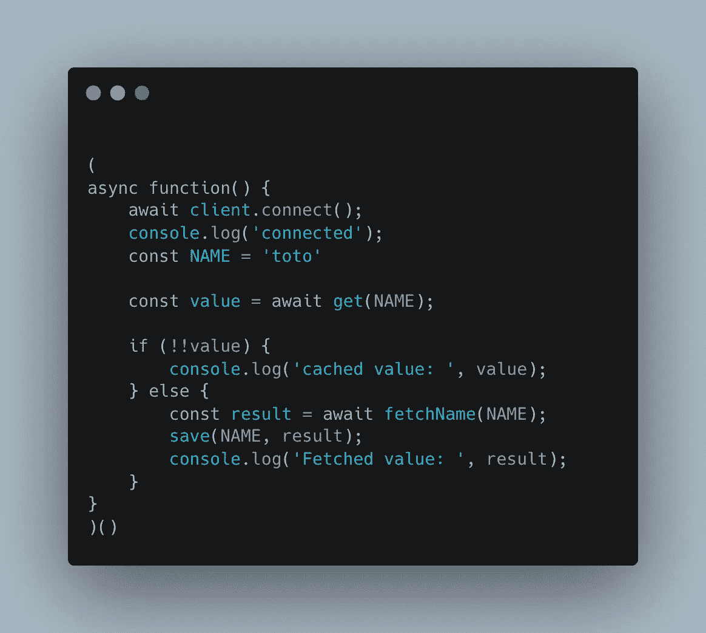

# 用 Redis 和 Node.js 缓存

> 原文：<https://javascript.plainenglish.io/caching-with-redis-and-node-js-ad053a7cb26e?source=collection_archive---------3----------------------->

## 如何将 Node.js 后端连接到 Redis 并缓存数据

Redis 是临时存储数据的好方法，可以避免重复昂贵的操作或查询。

Redis 使用一个键和值的系统，允许我们基于给定的键恢复结果。每个键都必须是唯一的，并且属于字符串类型。

Redis 中的每个条目还可以有一个以秒为单位定义的 TTL(或生存时间)。一旦 TTL 达到 0，该条目将被完全删除，并且不再可访问。

在本文中，我们将使用 agify.io open API 根据姓名预测某人的年龄。这是本文的一个很好的例子，因为键是名称，值是结果！

## 设置我们的环境

在开始之前，让我们设置好我们需要的一切。从 Redis 开始！

对于每个操作系统，设置 Redis 有很大的不同。在本文中，我不打算解释如何启动和运行 Redis。你可以跟随[他们自己的文档](https://redis.io/docs/getting-started/)来看看怎么做。

一旦 Redis 准备就绪，我们将快速建立一个 NodeJS 环境。

在新文件夹中，运行`npm init -y`，然后运行`npm install -S axios redis`

Axios 将用于 API 调用，因为它使用简单。

Redis 是我们用来访问 Redis 服务器并与之通信的库。

 [## 雷迪斯

### 现代化的高性能 Redis 客户端。最新版本:4.5.0，最后发布时间:10 天前。开始使用 redis 在您的…

www.npmjs.com](https://www.npmjs.com/package/redis) 

## 连接到我们的 Redis 服务器

首先，让我们连接到 Redis 实例。默认情况下，Redis 将在端口 6379 和`localhost`主机上运行。这些也是 Redis 包使用的默认值。

在您的 JS 文件中，让我们从初始化我们的客户机并连接到它开始:

> 通过运行这段代码，如果在 Redis 端一切正常，您应该能够在控制台中看到`connected`。

## 从 API 获取数据

在深入研究 Redis 之前，我们将快速创建一个从 API 获取数据的函数。

网址将会是`https://api.agify.io/?name={name}`。

> 不要忘记要求 axios 能够使用它！

## 将结果保存在 Redis 中，避免重新获取

既然我们能够获取数据，我们将确保只获取一次数据，并将其保存到 Redis，以避免为相同的名称多次调用 API。

首先，我们将检查 Redis 值是否存在。为此，我们将创建以下函数:

这个函数将允许我们返回结果，并且知道这个值是否存在。

我们还将创建另一个函数，允许我们将新获取的值保存到 Redis 中:

既然我们已经拥有了所需的一切，让我们一起使用一切:

现在，如果您第一次执行整个操作，您应该会看到获取的值。然而，如果您第二次运行您的代码，您会看到现在，值被缓存！

## 设置 TTL

既然我们能够保存到 Redis 中，我们将希望设置一个 TTL，以防将来 API 结果发生变化。我们不想错过它！

让我们稍微编辑一下我们的保存函数:

现在，这个新函数允许我们为条目设置到期时间。这意味着它将在 10000 秒后到期。

## 通过命令行访问条目

您可能希望通过命令行访问您的条目，以检查一切是否正常。为此，您可能需要使用两个命令:

*   获取
*   TTL

第一个将返回值，而第二个将返回到期前的剩余时间！

这就是如何设置 NodeJS 来连接 Redis 的方法！

我希望这篇文章对你有帮助！如果你做到了，不要犹豫留下掌声或关注！

 [## React 设计模式:分屏布局和可迭代子元素

### 你知道孩子可以是一个数组吗？

levelup.gitconnected.com](https://levelup.gitconnected.com/react-design-pattern-split-screen-layout-and-iterable-children-9de6896c5b42)  [## 在 Mac 上为 Python 设置 OpenCV

### 一种对 M1 和英特尔都有效的特殊方法！

remy-villulles.medium.com](https://remy-villulles.medium.com/setup-opencv-for-python-on-mac-aeb898c28adf)  [## 使用 Console.log 进行调试并不容易

### 让我们看看如何改进我们调试 web 应用程序的方式！

javascript.plainenglish.io](/using-console-log-for-debugging-is-not-the-easy-way-92aca00ee2f1)  [## 用 Node.js 压缩文件夹

### 如何用 Node.js 将文件夹和文件压缩成 ZIP

javascript.plainenglish.io](/zip-a-folder-with-node-js-5cd940c5c4fe) 

*更多内容看* [***说白了。报名参加我们的***](https://plainenglish.io/) **[***免费周报***](http://newsletter.plainenglish.io/) *。关注我们关于* [***推特***](https://twitter.com/inPlainEngHQ)[***LinkedIn***](https://www.linkedin.com/company/inplainenglish/)*[***YouTube***](https://www.youtube.com/channel/UCtipWUghju290NWcn8jhyAw)*[***不和***](https://discord.gg/GtDtUAvyhW) *。对增长黑客感兴趣？检查* [***电路***](https://circuit.ooo/) *。*****