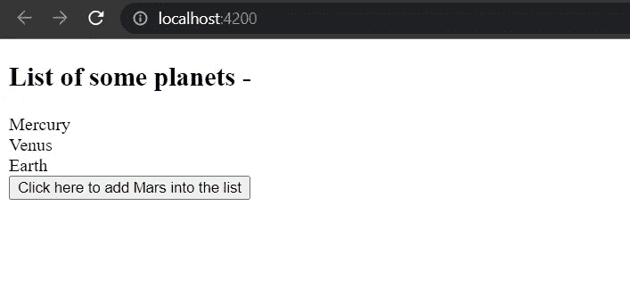
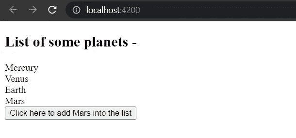
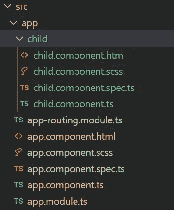
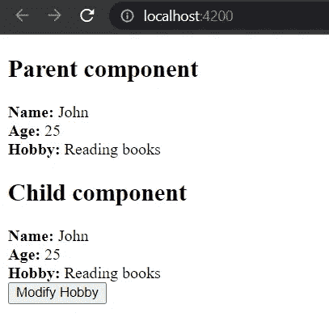
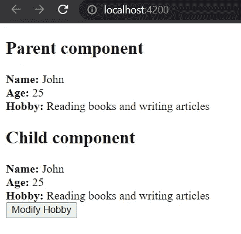

# 按值调用和按角度引用调用

> 原文：<https://javascript.plainenglish.io/call-by-value-and-call-by-reference-in-angular-59980f005e3e?source=collection_archive---------2----------------------->

## 用实际例子理解这些概念。


Photo by [Magnet.me](https://unsplash.com/@magnetme?utm_source=medium&utm_medium=referral) on [Unsplash](https://unsplash.com?utm_source=medium&utm_medium=referral)

在本文中，我们将快速理解 JavaScript 中的流行概念**通过值调用**和**通过引用调用**。然后，我们将通过做一个练习，在角度框架中理解这个概念。

首先，让我们了解一下原始数据类型和非原始数据类型的区别。根据 [GeeksforGeeks](https://www.geeksforgeeks.org/primitive-and-non-primitive-data-types-in-javascript/) -

**原始数据类型**—JavaScript 语言提供的预定义数据类型称为原始数据类型。以下是 JavaScript 提供的基本数据类型——布尔、数字、字符串、符号、BigInt、null 和 undefined。

**非原始数据类型—** 源自 JavaScript 语言的原始数据类型的数据类型被称为非原始数据类型。它也称为派生数据类型或引用数据类型。非原始数据类型的例子有数组和对象。

现在，让我们快速浏览一下 JavaScript 中通过值调用和通过引用调用的概念。

## **通过 JavaScript 中的值调用**

在函数调用期间，如果原始数据类型作为参数传递，则传递原始值的副本，该副本不引用原始值的内存位置。让我们用一个例子来理解这一点——

```
let numOne = 5;function modify(arg) {
    arg = arg + 10
}modify(numOne);console.log(numOne);
```

输出:

```
5
```

这里，我们可以看到变量`numOne`在作为参数传递给函数`modify`时没有被修改。

## **在 JavaScript 中通过引用调用**

在函数调用过程中，如果将非原始数据类型作为参数传递，则传递对该变量的引用。函数内部参数的任何修改都会反映在函数外部的变量中。

```
let arr = [0,1,2,3];function modify(arg) {
    arg[0] = 500;
}modify(arr);console.log(arr);
```

输出:

```
[500,1,2,3]
```

现在，是时候用 Angular 中的一个例子来理解这个概念了。

首先，我们将通过值来理解**调用。为此，我们需要创建一个角度项目。我们将转到***app . component . ts***文件，并将编写以下内容-**

当我们运行这个应用程序时，我们将在控制台中看到以下输出。

```
I am a primitive data.
```

因此，我们可以得出结论，即使原始数据类型的参数在方法内部被修改，原始属性(即`primitiveData`)也不会被修改。

现在，让我们通过引用来理解**调用。为此，我们将在***app . component . ts***和***app.component.html***文件中编写以下代码。**

运行应用程序后，我们将在浏览器中看到以下内容—



点击按钮后，“火星”将被添加到列表中。



在代码中，`modifyNonPrimativeData`方法通过将一个元素推入数组来修改其参数`arg`，这反映在原始属性`nonPrimitiveData`中。

现在，让我们理解当使用`@Input()` decorator 将来自父组件的对象/数组传递给子组件时，如果我们在子组件中修改该对象/数组，会发生什么。为此，我们的角度项目结构如下—



我们将在 ***app.component.ts*** 和***app.component.html***文件中编写以下代码，这是我们的父组件。

子组件将包含以下代码—

运行应用程序后，我们将在浏览器中看到以下内容—



点击`Modify Hobby`按钮，我们会看到`**Hobby**`在子组件和父组件中都发生了变化。这是因为我们将非原始数据的引用传递给了子组件。



但是，如果我们将原始数据从父组件传递到子组件，并且如果我们在子组件中修改该数据，那么它将只在子组件中得到反映，而不会在父组件中得到反映。这是因为我们将原始数据的副本传递给了子组件。

## 参考

1.  JavaScript 中的原始和非原始数据类型(GeeksforGeeks)

[](https://www.geeksforgeeks.org/primitive-and-non-primitive-data-types-in-javascript/) [## JavaScript 中的原始和非原始数据类型

### 极客的计算机科学门户。它包含写得很好，很好的思想和很好的解释计算机科学和…

www.geeksforgeeks.org](https://www.geeksforgeeks.org/primitive-and-non-primitive-data-types-in-javascript/) 

*更多内容请看*[***plain English . io***](https://plainenglish.io/)*。报名参加我们的* [***免费周报***](http://newsletter.plainenglish.io/) *。关注我们关于**[***推特***](https://twitter.com/inPlainEngHQ) *和*[***LinkedIn***](https://www.linkedin.com/company/inplainenglish/)*。加入我们的* [***社区***](https://discord.gg/GtDtUAvyhW) *。**